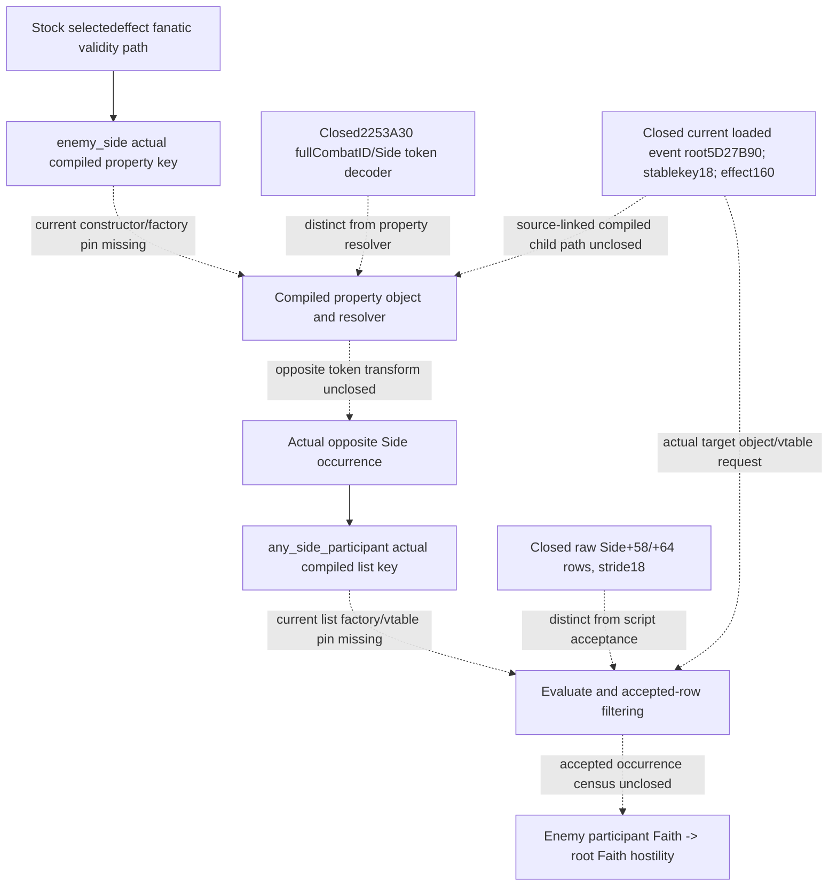

# CK3 1.20.0.3 compiled enemy-side and participant-list registration frontier

October 6 / ISO 2026-W41. This source-only package records the remaining direct entry after the [current kind11 descriptor and token decoder](phase-kind11-descriptor-construction-12003.md). Frozen CK3 1.20.0.3 / Steam25652598 / EXE SHA-256 `94B55397ABB687A3DCD436805A5D885E6BE90FA6C693FEB44A9E3BBEEADE02A6` is reused. External packet: `Z:/ck3_mod_rewrite_process_assets/g2-background-round6-20261006/phase-compiled-enemy-list-registration/`. No new executable byte, live memory, process, SDK or pipe was read. Tests, builds, provider changes and metadata query implementation are0.

The real consumer remains the selected `knight_qualify_for_accolade` effect's fanatic random-list validity condition: `event_rows[12].effect_ast.steps[1].branches[11].validity`. The [enemy participant/Faith topic](phase-enemy-participant-faith-conditional-12003.md) fixes its authored path and directional hostility, enemy participant Faith→root Faith. This package does not move that condition into event admission or chance evaluation.

## Bounded cached result

The inspected cache contains no current `enemy_side` key→factory/object→resolver or `any_side_participant` key→list factory/vtable→Evaluate/filter record. The negative covers precise `.2` migration top-level phase/effect/scope metadata and scripts, the event-window scope mapping, tracked phase manifests and legacy list ABI, current phase-event source manifests, and the current chance/warmonger owners' evidence. It does not establish that either key is absent from the image or initialized registration tables.

The cached startup window `[8000,A000)` had already been checked for the exact target name lengths10 and20. Its sole candidate is `is_bastard` at449DCE0. `TARGET-NAME-OPERANDS-RESULT.json` is reused unchanged; the initially considered repeat was withdrawn before any image read. Neither that initializer family nor adjacent CRT/type constructors were extended. No further CombatSide RTTI, kind11 callback, boxing, Faith, Boolean or schedule body was read.

Three retained analogues describe a discovery method, without supplying a target pointer:

| Cached analogue | Actual evidence | Remaining target input |
| --- | --- | --- |
| Legacy `send_interface_toast` | literal4439F90→constructor reference5C3831→`CEffectEntry` construction | Both target keys and current constructors |
| Legacy `random_side_knight` | compiled list-effect vtable41DE5C0 and materializer19DD670 | Participant key/factory/vtable; this is a different list |
| Legacy `any_side_participant` | Evaluate19DE0D0 only | Exact current registration, vtable and callback; no version offset is inferred |

The legacy metadata comes from `combat_phase_event_trace_v1_abi.json` and its native topic. Current berserker chance work uses authored AST and cached `.3` operand comparisons; it provides no additional compiled target index or registration trace. `CACHED-SOURCE-INVENTORY.json` pins the reused documents/Git blobs, and `CACHED-LOCATOR-RESULT.json` preserves the bounded negative.

## Exact next entry

One actual current record per key is sufficient: the literal or registered key spelling and namespace; its constructor/reference RVA; the factory or created object; and its emitted vtable plus actual resolver or Evaluate/filter slot. The exact NUL literals are `enemy_side`11B and `any_side_participant`21B. Their current RVAs are **unlocated**. Once a real current constructor/reference is supplied, `SOURCE-PLAN.json` permits only that linked literal, constructor, object/factory and demanded callback extent, with prior `.pdata` reused. There is no speculative neighborhood or whole-image search in this packet.

An existing compiled-object capture can supply an alternative direct pin. The closed current phase source already identifies the loaded event root **module+5D27B90→database+50 event-pointer array/count+5C**, the event stable key at**+18**, and its compiled effect at**+160**. A source-linked capture must match the actual stable key `knight_qualify_for_accolade`, then identify the selected fanatic validity child and the two target objects/vtables. Inventory row12 alone is insufficient to name a loaded object. The effect's child path, either target object's class and virtual slot are unclosed; this request deliberately supplies **no invented child offsets**. It is a locator request for another authorized source/capture path, not a local runtime operation or a completed read-only leaf. `CURRENT-ENTRY-REQUEST.json` records both forms of the missing input.

Kind11 descriptor IDs29A0/2EAC, named variable key5D4BD6C (`combat_side`), root validation/decoding and raw H58 participant rows remain distinct sources. None names these compiled target factories or establishes accepted list rows, opposite-side scope behavior or a predicate truth value. Missing entries remain explicit; they are not converted into empty lists, false predicates or a new metadata-only query.

Readiness remains **research**. Neither requested key→factory→callback chain is source-closed, and no static-ready or live capability gain is claimed. Actual new native cost is **0B /0 reads**. The next bounded static capture depends on the exact current target registration/object pin above. Root owns shared Oct6/W41 reports, integration and publication; `OCT6-W41-FIELDS.json` provides the fields, including this unchanged readiness and remaining source dependency.

The first receipt-sealing script stopped before source hashing because system Python lacks the `tzdata` package. `FAILED-SEAL-ATTEMPTS.json` preserves that harness failure. Using the task's explicit UTC+08:00 timezone allowed only the unexecuted receipt assembly to complete at **2026-10-06T12:06:07.389079+08:00**; no source capture or test was repeated.
