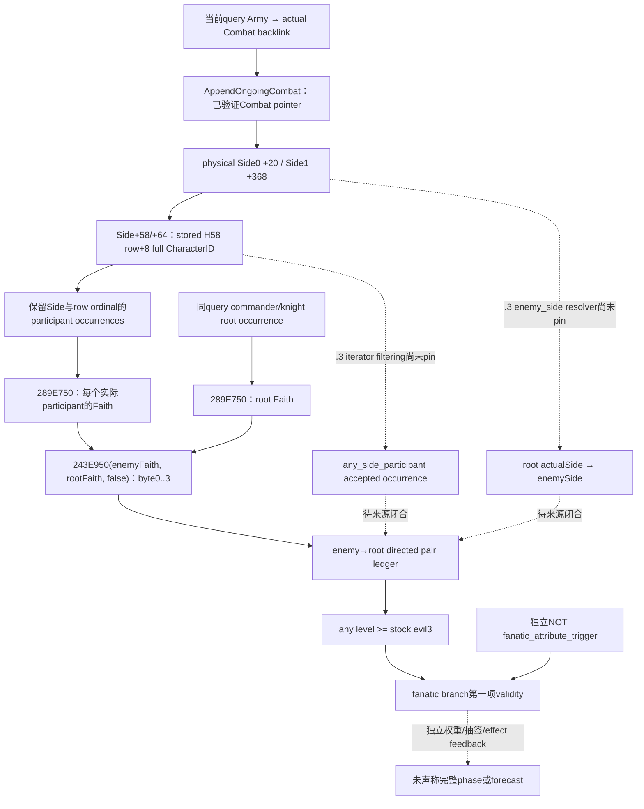
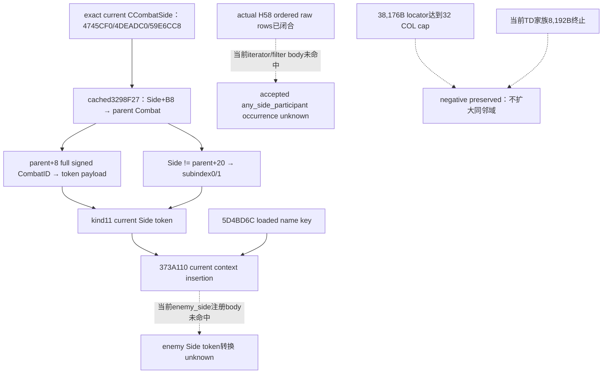

# CK3 1.20.0.3：phase 敌方参与者与方向性 Faith 条件输入

2026-10-06，独立 source-only包。冻结 CK3 1.20.0.3 Crozier / Steam build25652598 / EXE SHA-256 `94B55397ABB687A3DCD436805A5D885E6BE90FA6C693FEB44A9E3BBEEADE02A6`，沿用封存来源，没有新增EXE字节读取、扫描或全图哈希。工作树基线 `127366a30363b7280366e3f0cdd6cc992ad1bd71`；Root已把此前五个Rite wire资格采用为 `baab4588` 并推送 `359e4e7878a25297c0cb9c9c8b3ddd093dbea1ba`。本包不重读已闭合Boolean/getter函数、不修改provider、策略或整体readiness，没有测试、编译或本机游戏连接。

## 真正缺输入的 consumer

当前 [stock AST](../../ck3_autonomous_player/src/xar_autoplayer/simulation/data/ck3_1_20_0_3_stock_combat_phase_events.json) 的 `event_rows[12].effect_ast.steps[1].branches[11]` 是 `knight_qualify_for_accolade` 已选效果的 `fanatic` random-list分支，其validity为：

```text
enemy_side.any_participant_faith_hostility_at_least_evil
AND NOT root.accolade_attribute_triggers.fanatic
```

它影响是否可以选择 fanatic unlock及其消息请求，属于已选事件内部效果分支；不属于phase事件admission、整体chance或native事件选择。branch自身还有独立MAA count权重，另有root attribute trigger、liege及effects feedback；本包只提供第一项Faith条件的来源计划。`CACHED-CONSUMER.json` 从已封存当前AST抽出唯一匹配分支，未执行它。

封存 `.3` stock `common/combat_phase_events/00_knight_phase_events.txt` 文件SHA为 `6307140E6F0543D9C44CACF40771710032A050279B82B0074A86DF7B68E3CADF`，该event当前span1430–1890，direct effect source unchanged，均复用 [SOURCE-CLOSURE.json](Z:/ck3_mod_rewrite_process_assets/g2-resume-20261004/battle-phase-events-12003/stock/SOURCE-CLOSURE.json)。scope条件实际是 enemy_side内的any_side_participant，接着该participant的Faith作为receiver/source，root的Faith作为target。stock evil等级为3；不能把方向改成root→enemy、取双向最大值、使用玩家Faith或把角色adopted Rite直接交给Rite hostility getter。Faith getter内部自行使用其main Rite是该getter语义，不能由caller手工选择main Rite替代Faith对象。

## 复用的来源与未闭合边

| 边 | 当前可复用来源 / 真实边界 |
| --- | --- |
| 当前phase root与named Side | [当前phase原生树](combat-phase-events-12003.md)：`3298EE0`建立Character root与kind11 named CombatSide；actual loaded name `5D4BD6C` 尚未实读 |
| 实际Side参与者账本 | existing [battle Side reader](../../ck3_autonomous_player/native_bridge/src/ck3_12002_battle.cpp:343) 从Side `+58` data、`+64` count按stride24读取row `+8` full CharacterID；保留row index，不由查询Army owners重建 |
| `.3` H58原生写入 | [264EA10专题](battle-selected-owner-h58-append-12003.md)：已封存381 code bytes，stored first-match/get-or-append，保留完整owner key与旧顺序。实际loss处理可append新owner，因此当前requested Army owners不保证覆盖实际H58账本 |
| 同查询实际Combat接点 | existing [AppendOngoingCombat](../../ck3_autonomous_player/native_bridge/src/ck3_12002_combat.cpp:1208)：从已解析Army combat backlink resolve实际Combat，读取phase并在返回前回读generation；现V2已经发布ongoing_combats |
| participant/root Faith | [当前Faith identity](religion-native-ai-faith-identity-12003.md) 已闭合 `Character.GetFaith 289E750`；`.3 Character+B4`是RiteID，不是旧版FaithID，不复制旧版偏移含义 |
| 方向性最终等级 | [当前Faith关系来源](religion-governance-opinion-native-ai-12003.md)：`243E950(enemyFaith,rootFaith,false)`返回byte0..3，4为invalid；保留原方向与合法0，不在本包重算关系或重读函数 |
| `.3` any_side_participant的接受/跳过规则 | **本包未闭合**。旧 [phase专题](combat-phase-events.md:1086) 的 `19DE0D0` 是1.19.0.6证据，不能重新标为 `.3`。真实H58账本证明raw来源，不单独证明该iterator在 `.3` 对invalid/dead/retained rows的处理 |
| `.3` enemy_side scope解析 | **本包未闭合**。物理Side bases `Combat+20/+368` 和root所在actualSide可复用当前读取链；仍需将script enemy_side resolver与对侧source对应。不得仅凭战争攻守标签当phaseSide identity |
| precontact participant mirror | 旧版request-order first-seen owner镜像有历史证据；`.3` 当前contact/join participant构造边没有在本包重新闭合，**本计划先做ongoing实际账本，不推断未来Side** |



图中的实线记录当前已有来源与可以提供的raw输入；虚线保持未闭合的native scope/filter语义。`264EA10`是mutating writer证据，只复用其已捕获语义，不调用它。旧scope:owner absent→fanatic attribute false的1.19.0.6 specialization也不移植成 `.3` 常量；第二项保持独立输入。

## 最小只读施工与同查询合同

可实施接点是existing V2 `ongoing_combats` 内新增optional `phase_enemy_participant_faith_v1`，独立DTO/helper/serializer/strictnormalizer/source adapter。先收集实际Combat/Sides的raw账本与角色Faith，闭合上述两条scope边后才将其标为该stock operand的ready来源。不用等待whole V3广告；也不因这个optional叶子缺失修改whole V2 base gate。旧wire缺叶子保持兼容None。

| 最小输入组 | 字段与消费目的 |
| --- | --- |
| Query/Combat来源 | 继承同一response snapshot/native revision，actual full CombatID、actual ProvinceID、source kind `ongoing_actual_h58`；实际Combat pointer只留在native callback内 |
| 完整raw side census | side_index、stored row_index、participant full CharacterID、独立resolve status/reason、resolved full FaithID；raw顺序和重复均保留，不以FaithID去重替代occurrence |
| 精确root occurrence | role、public ArmyID、internal CArmyID、可空source RegimentID、full CharacterID、actual CombatID及native side membership；同Character跨Army/role仍分别保留provenance |
| directed pair rows | root occurrence、enemy side、participant row_index/full CharacterID、source enemy FaithID、target root FaithID、level raw byte、`offset=false`、独立status/reason；可复用相同Faith pair数值，但不删除其occurrence ledger |
| scope/source资格 | iterator/resolver source pin、raw census complete、accepted occurrence及skip分类、对应consumer field是否available；read failure/4 sentinel不能转换成false，合法0等级保留 |

在 `AppendOngoingCombat` 已resolve的actualCombat附近复制账本；query内所有army commander/knight行完成后，仍在同一callback内按原request occurrences接入root Faith与directional pairs。source helper复用已有Character/Faith内部getters及identity copier，不调用player-only religion query、独立MCP、script evaluator或phase fire。root Army当前actualCombat/Side必须与该capsule一致；precontact显式缺actualCombat时返回独立not-applicable，而不是构造CombatID或把Army owners镜像标为current实际Side。

在exact iterator来源闭合后，合法空accepted enemy集合使any为false；有可用来源的raw0/1/2不满足evil3，raw3满足。实际未解析、读取失败及过滤语义未闭合分别留在对应source status，不声称完整branch probability。第一次必要fixture应让两个根使用不同Faith，包含非对称enemy→root为3而反向为2、相同Faith多个participant、retained H58 owner不在current Army request中、合法空、ref0及raw4，使用实际collector/literal serializer接生产normalizer/source adapter。该fixture只是后续验收计划，本轮未创建或运行。

## 最小必要新 source read 计划

本轮新native byte成本 **0 B**，EXE reads0、全图hash/scan0。`RESEARCH-PLAN.json` 固定下次唯一新静态目标：先查已有exact `.3` registration/RTTI cache中的 `any_side_participant` 与 `enemy_side` 入口；命中后仅保存该iterator Evaluate与该scope resolver的 `.pdata` body、所需vtable/注册direct operands，不扩展到phase schedule、Boolean或Faith getter。当前 `.3` 的这两个RVA没有可靠缓存，明确记为unknown；不从旧RVA或文本名字猜出地址。若cache不含locator，先提交最小registration locator请求，不做整EXE或 `.rdata`扫描。

该新read须回答两个具体问题：iterator是否按H58 stored order、stride24、row+8读取，以及它对unresolved/dead/retained rows如何处理；enemy_side在当前kind11 Side token如何得到对侧。只要这两边闭合，existing `AppendOngoingCombat` +已闭合getters即可写上述小observer，无需重做宗教关系逆向。完整precontact镜像另需 `.3` contact/join builder来源，留作下一独立dependency；当前包不把它追加成宽研究。

首次actual-frame资格最终需要获准机器/窗口提供同一次actualCombat query：played Robert29829原普通战役snapshot/native revision、root occurrence及actualSide、两侧H58 raw/accepted rows、每个resolved participant/root Faith fullID、enemy→root getterraw/status。此请求在 [FRAME-DATA-REQUEST.json](Z:/ck3_mod_rewrite_process_assets/g2-background-round6-20261006/phase-enemy-participant-faith/FRAME-DATA-REQUEST.json) 封存；本机用户禁止CK3连接，当前没有采集、prepare或stage。

## 交付与readiness

外置包：[phase-enemy-participant-faith](Z:/ck3_mod_rewrite_process_assets/g2-background-round6-20261006/phase-enemy-participant-faith/)，含 `CACHED-CONSUMER.json`、`NATIVE-TREE.md`、`RESEARCH-PLAN.json`、`MINIMUM-SAME-QUERY-CONTRACT.json`、`FRAME-DATA-REQUEST.json`、Root delivery与Oct6/W41字段。source AST唯一匹配已提取，Git whitespace检查一次；没有测试或native编译，禁止把文档检查称为新能力资格。

当前完成 **research / bounded source plan**：确定唯一真正consumer、方向、实际census接点和最小observer合同。没有新provider或readiness提升；两条 `.3` scope语义待窄静态pin，实际游戏帧、完整phase选取与feedback仍独立未完成。日报/周报由Root据外置字段统一合并；本子线只提交该新topic。

## 后续有界定位：当前 receiver 已闭合，两个注册入口未命中

Root随后授权只定位exact `.3` `any_side_participant`接受规则与kind11 `enemy_side` resolver。复用现有3298EE0 cache后，**当前Side token receiver的body已闭合**：`3298F27..3298F6B`从 `Side+B8`取parent Combat，读取 `parent+8`完整signed32 CombatID并sign-extend到token payload；kind word为11，subindex word是 `Side != parent+20`。该token经 `373A110`插入当前context，name key仍来自 `5D4BD6C`。实际physical Side0/1因此以CombatID与subindex0/1区分，不能用战争攻守标签替代。此68B slice从原886B缓存拆出，新EXE code读取0B；它证明source token构造，不证明 `enemy_side` 的转换body或实际loaded name字符串。

唯一第一轮locator使用旧 `.2` `4745CF0`作为**发现邻域**，没有继承旧ABI：读取当前 `[4745000,474D000)` 32768B，最多32个actual COL direct pointers及其TypeDescriptor。达到32 follow预算后停止，实际新增38176B/62 reads，未命中iterator/resolver。原negative结果保留，未扩大该邻域或重复follow。只检查已捕获字节后得到一个具体候选pointer；第二步仅follow该actual COL与TypeDescriptor，共184B/2 reads，确认当前 **vtable `4745CF0` → COL `4DEADC0` → TD `59E6CC8`，name `.?AVCCombatSide@@`**。

以这个已验证当前TD为新锚点，最后只读 `[59E6C00,59E8C00)` 8192B/1 read的实际CombatSide类型族；其中是CombatSide、CombatRegiment与ResultData，仍没有目标iterator/resolver类型。该次negative也保留，并到预算停止。不能从邻域未命中推断这些目标全图不存在。**本增量新增EXE data总46552B/65 reads，new code0B、whole image/section scan0、全图hash0、测试/build/provider改动/游戏操作均0**；原EXE SHA与PE map沿用封存值，逐新读取的offset、bytes、SHA与bin保留。



最小observer合同新增已闭合source字段：native root Side token的 `scope_kind=11`、`side_subindex=0|1`、full CombatID原始32位及native sign-extended payload，和actualSide→parentCombat来源；它们来自同query实际Side，不来自player religion或另一个查询。raw H58 census与已闭合Faith getter的collector仍可按前节小接点施工，但两个未闭合的script scope边不能因receiver身份正确而自动取得accepted-occurrence资格，整体readiness不变。

这次具体缺口是**当前compiled script-list/scope注册族的入口**，而不是CCombatSide C++对象RTTI。下一定位需 exact `.3` `any_side_participant`注册record的factory/vtable/Evaluate pointer、kind11 `enemy_side` property的resolver pointer及对应 `.pdata`边界；若另一个已封存注册cache命中，只读两个body与direct receiver/skip operands。不能继续按旧19DE0D0或当前对象TD邻域扩大搜索。本轮没有证明实际 `5D4BD6C` name只能由live取得；它的loaded name仍是单独source/frame请求，不因缺名重新研究schedule。

增量包：[phase-enemy-scope-nodes](Z:/ck3_mod_rewrite_process_assets/g2-background-round6-20261006/phase-enemy-scope-nodes/)，`locator01/LOCATOR-RESULT.json`、`locator02/DIRECT-COL-RESULT.json`与 `locator03/TYPE-FAMILY-RESULT.json`保留尝试、actual cost与negative；`RECEIVER-SOURCE.json`、`NATIVE-TREE.md`、`MINIMUM-CONTRACT-DELTA.json`、`NEXT-REGISTRATION-REQUEST.json`及Oct6/W41字段供Root汇总。当前是**部分完成的research增量**：receiver/class identity闭合；请求的两个script节点未闭合，原因是该具体有界注册定位未命中。没有新能力GREEN或live资格。

后续 [current script-scope registration专题](phase-script-scope-registration-12003.md) 已找到当前 `3795A80` registry root `54F2AF0`、实际 descriptor writer `3796120` 和 kind11最小92-byte来源请求；有界 startup命中 **当前99C0 initializer →449DC88 exact `combat_side` bytes→5D4BD6C**，因此前述loaded-name producer未知现已被静态来源关闭，实际initialized key/frame round-trip仍未采集。此增量没有关闭 `enemy_side` compiled property或 `any_side_participant` iterator/filter，不把type descriptor验证当成它们的回调。新source cost与完整树在新专题独立记录；此前negative和当时边界保留。
