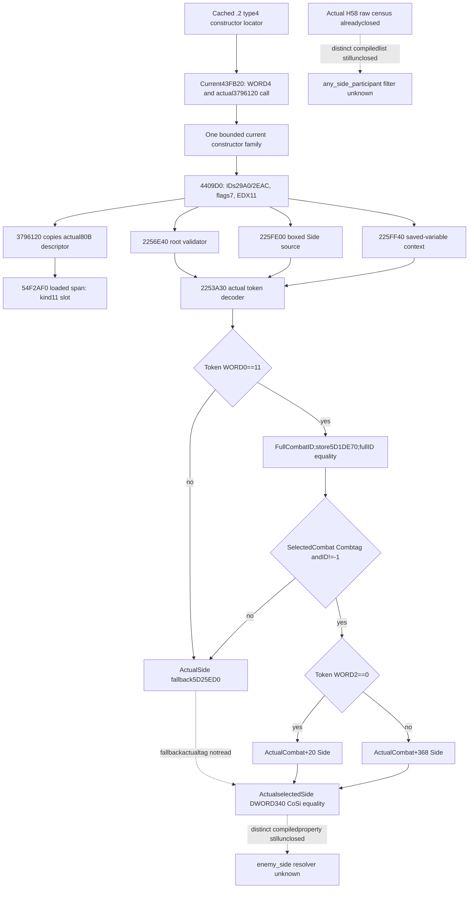

# CK3 1.20.0.3 kind-11 descriptor construction and token decoder

October 6 / ISO 2026-W41. This source-only continuation closes a real current descriptor constructor and its demanded callbacks, following the [current registry sources](phase-script-scope-registration-12003.md). Frozen CK3 1.20.0.3 Crozier / Steam 25652598 / EXE SHA-256 `94B55397ABB687A3DCD436805A5D885E6BE90FA6C693FEB44A9E3BBEEADE02A6` is reused. No game, process inspection, SDK, pipe, callback invocation, test, build, provider or shared report change occurred. External packet: `Z:/ck3_mod_rewrite_process_assets/g2-background-round6-20261006/phase-descriptor-construction/`.

## Actual construction chain

The cached current registry getter `3795A80` dispatches its allocator's actual vtable `4938578+20` to **`9B4F80`**. This is a 15-byte leaf with no `.pdata` entry: it writes `data=allocator+8`, stores capacity128 through its R8 argument and returns. For this getter's actual arguments the inline data is **`54F2B10`**, capacity is at `54F2AF8`, and the signed count remains at `54F2AFC`. The allocator does not populate descriptors. The current kind11 inline slot is therefore `54F2B10+11*50 =54F2E80`; its 80 static image bytes are zero. That is initial image state, not current loaded state.

The actual writer `3796120` calls `3796E50`. Its needed same-function fragments are **`[3796E50,3796E6F)` 31B**, **`[3796E6F,3796E90)` 33B**, **`[3796FA0,3797002)` 98B** and **`[3797002,3797018)` 22B**. When the existing count does not reach the requested index, sufficient capacity selects the captured `3796FA0` path. It creates intervening 80-byte slots with **DWORD IDs `4FC/4FC`, flags byte0 and eight null callback pointers**, then stores count=`index+1`. The return is `data+index*50`. The allocation path for insufficient capacity is undemanded and uncaptured. The actual static fallback descriptor at `54F5310` has the same default IDs/null callbacks. Thus `count>11` alone establishes that a slot can be copied; it does not establish its registered identity or a predicate result.

The writer's other direct callee **`3797170 [3797170,37973F8)`**, 648B, inserts a DWORD key and WORD value into its map. Captured existing-key paths overwrite the row's WORD value from the supplied value pointer and report insertionfalse; new-key paths report insertiontrue. Rehash helpers are named but unexpanded. This map is not the compiled enemy property/list registry and supplies no predicate outcome.

The bounded constructor locator is a retained `.2` migration mapping: `event-window/scope-mapping.json` uniquely maps legacy type4 registration `3FD5E0` to `.2` `43FB20`. A new **current** 189-byte body at **`43FB20..43FBDD`** independently proves WORD4, a stack descriptor and a direct call to current `3796120`. That positive current chain anchors one following 4096-byte constructor window, `[43FBE0,440BE0)`. Its actual writer calls register kinds5..11. No current address was inferred by adding an old-version offset or a presumed constructor size.

The target **`4409D0 [4409D0,440A8D)`**, 189B, explicitly supplies **EDX11** and calls **`3796120` at `440A80`**. The `.pdata` extent is retained; its body is extracted from the already read window, with no image reread. Its complete incoming 80-byte descriptor is:

| Offset | Source value |
| --- | --- |
| `+0/+4` | DWORD type identifier `29A0` / alias identifier `2EAC` |
| `+8` | flags byte7 |
| `+10` | callback `2256E40` |
| `+18` | callback `225FE00` |
| `+20/+28` | callbacks `227D590` / `227D540`, not expanded |
| `+30/+38` | both callbacks `225FF40` |
| `+40/+48` | null pointers |

The stable strings for the descriptor's two numeric identifiers have not been read. The separately closed reserved variable name `combat_side` at `449DC88→5D4BD6C` is a different identifier namespace and is not substituted for these numeric IDs. The type4 constructor's current static callback pins are also reusable, including `+10→22565B0`, but this package does not call WORD4 CharacterScriptContext or assume Rule43's actual root kind. Its real kind selection must follow the existing `9F9E20/372DF30/372E020` source before another callback body is demanded.

## Complete demanded callback sources

**`2256E40 [2256E40,2256E5B)`**, 27B, passes its real token to **`2253A30`**, then returns exact equality of the returned Side's DWORD `+340` with **`436F5369` (`CoSi`)**. This is descriptor root-token validation, not `enemy_side` conversion or the fanatic stock condition.

**`2253A30 [2253A30,2253AA3)`** is a complete 115-byte leaf without `.pdata`. A first32-byte capture and one nonoverlapping96-byte continuation preserve the whole body and13 padding bytes. Its actual source does the following:

1. A token WORD0 other than11 selects the Side fallback QWORD at **`module+5D25ED0`**.
2. Kind11 reads the full DWORD CombatID at token`+8`. Its low24 bits index the current Combat store QWORD **`module+5D1DE70`**, slots`+20`, unsigned capacity`+2C`, stride16, row object QWORD`+8`. A nonnull object is accepted only when its full DWORD`+8` equals the original full ID. Lookup failure selects the Combat fallback QWORD **`module+5D1DE18`**.
3. The selected Combat must have DWORD`+C ==436F6D62` (`Comb`) and full DWORD`+8 !=FFFFFFFF`. Otherwise the Side fallback is returned.
4. Token WORD`+2 ==0` selects **Combat`+20`**; **any nonzero WORD** selects **Combat`+368`**. This is the actual source condition, not a new `subindex<=1` restriction. The cached native phase token constructor emits0/1, but the decoder's broader condition is retained.

The Side fallback's current `+340` tag was not read. Therefore the descriptor validator's fallback outcome is not replaced with a supplied false. The complete token decoder identifies its selected pointer source; the separate callback reads its actual tag.

**`225FF40 [225FF40,225FF69)`**, 41B, calls the same decoder and checks the same `CoSi` tag. Matching tag tail-calls **`1D67200(Side+8)`**; a mismatching tag returns null. This is the descriptor's saved-variable context path. `1D67200` is an explicit unexpanded entry, not a new phase dependency. It is not invoked by a future metadata copier.

**`225FE00 [225FE00,225FF33)`**, 307B, also calls the decoder. It wraps that selected Side pointer into a typed boxed value, using its own TLS type counter and variant helpers. This capture identifies the demanded callback role; those helpers, context boxing and diagnostics are not expanded. Box presence is not root validity or a stock predicate result. A read-only metadata collector copies fields and mirrors needed token resolution; it does not call this boxing path, the initializer, the writer or a script evaluator.

## Minimal metadata leaf and remaining consumer edges

`READONLY-METADATA-LEAF-RECIPE.json` prepares one optional same-query source capsule beneath existing V2 ongoing-Combat inputs: actual WORDkind11; independently copied loaded span count; descriptor DWORD IDs/flags; eight nullable module-relative callback research pins; and separate status/reason for descriptor copy, registration identity and stable-name resolution. A default-filled slot with IDs4FC/null callbacks remains copied metadata with unresolved registration identity; it is never a fabricated false predicate. Legacy absent optional data remains None. Whole V2 base readiness, MC and V3 advertisement remain unchanged.

The previously prepared **92-byte loaded root/descriptor request** remains the bounded actual source request: root data8/count4 plus kind11 descriptor80. It is not executed locally. Static expected callbacks and the actual current descriptor are separate fields. Any future actual capture must carry that machine's fresh snapshot/native revision and module base; it does not reuse a prior game frame.

Current source closes **kind11 constructor → descriptor callbacks → real full-CombatID/Side token decode**. The [enemy participant/Faith consumer](phase-enemy-participant-faith-conditional-12003.md) still needs its distinct compiled **`enemy_side` key→factory/object→resolver** and **`any_side_participant` key→scripted-list factory/vtable→Evaluate/filter**. A native type decoder does not prove which opposite token the property creates, accepted H58 rows, Faith condition truth, event selection or feedback. `NEXT-COMPILED-KEY-FACTORY-REQUEST.json` preserves only those two next registration entries; these completed callback bodies must not be reread.

The generic CRT branch is preserved: cached PE entry `4224260→42240EC` identifies the initialization list `[43DBBC0,441EC88)` and complete iterator `424E1CC`. Only its first1024B/128 pointers and three actual constructors were inspected; they were graphics/mutex sources, so that branch stopped. It did not lead to the successful scope constructor family, which came from the independent cached registration analogue. No full initializer table or startup-code scan occurred.

Actual new image cost is **9,094 B /142 reads**: **6,470 code +1,440 `.pdata` +160 static data +1,024 initializer pointers**, all unique byte coverage. A first extractor attempt at9B4F80 stopped before body capture because the leaf has no `.pdata`; its metadata is retained and reused for the corrected32B leaf capture. The unrelated1010 constructor is a recorded incomplete32B prefix and is not claimed closed. Source plan, all hashes/bytes/extents, failed attempt, constructor positive, decoder and typed leaf/next-entry recipes are external. Readiness is **research / source-closed current kind11 descriptor and token decoder**; tests/builds/provider changes/new live qualification remain0. Parent owns Oct6/W41 reports and publication.
