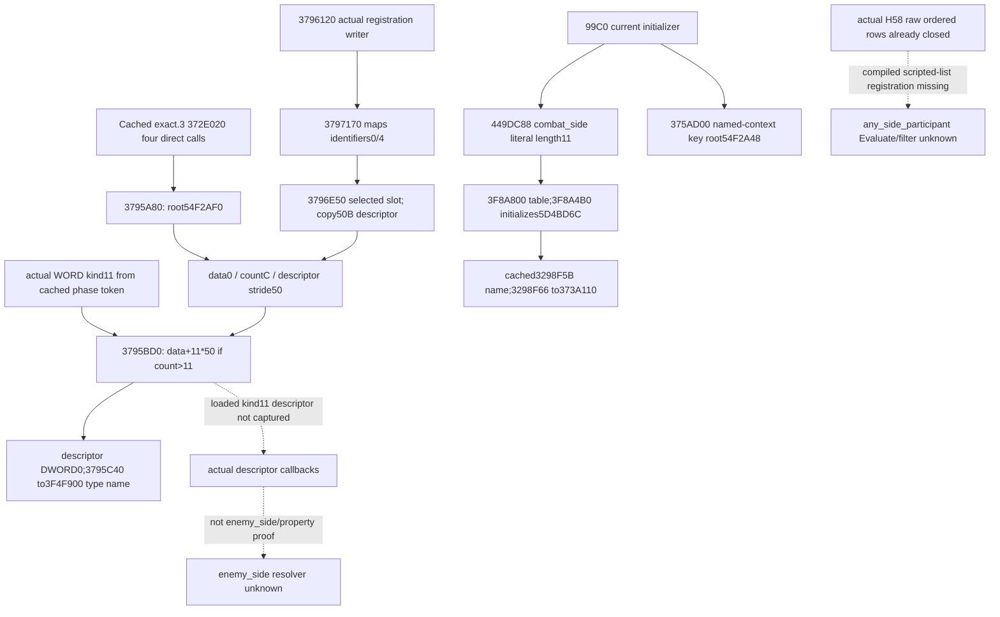

# CK3 1.20.0.3 phase script-scope registration sources

October 6 / ISO 2026-W41. This source-only continuation supplies concrete current scope-registry and name-initializer entries for the [enemy participant/Faith frontier](phase-enemy-participant-faith-conditional-12003.md). CK3 1.20.0.3 Crozier / Steam 25652598 / frozen EXE SHA-256 `94B55397ABB687A3DCD436805A5D885E6BE90FA6C693FEB44A9E3BBEEADE02A6`. The previous two CombatSide object-family negative locators are retained and were not expanded. No process inspection, game operation, SDK, pipe, test, build, provider, strategy or CMake change occurred.

## Positive current registration entries

The retained `.2` `370EB10` bytes give `3795A80` as a discovery locator. Independently, the **already captured exact `.3`** `372E020` calls that same current pointer at `372E099`, `372E0AB`, `372E101` and `372E10B`. The source is `person-tail/list-predicate-2530dd0-source/capture-0372E020-body/region-0372E020.asm`; these bodies were reused without rereading the image. Thus the new getter capture follows a current direct pointer, rather than assigning a legacy RVA to the current build.

| Current entry | Source-defined behavior and limit |
| --- | --- |
| `3795A80 [3795A80,3795B2B)`, 171 B | Returns the **inline registry root `module+54F2AF0`**. The root is a span with data QWORD `+0`, capacity DWORD `+8`, signed count DWORD `+C`. Its lazy-initialization shell also registers cleanup; the observer can copy the already loaded root without calling this function. |
| `3795BD0 [3795BD0,3795C09)`, 57 B | Takes a WORD kind, checks `count > kind`, returns `data + kind*50`; otherwise returns fallback descriptor `module+54F5310`. It does not resolve `enemy_side`. |
| `3795C40 [3795C40,3795C82)`, 66 B | Selects the same descriptor and resolves its signed DWORD `+0` type identifier through current direct target `3F4F900`. Its descriptor fallback remains explicit. |
| `3796120 [3796120,379622E)`, 270 B | Actual **descriptor registration writer**. It supplies descriptor DWORD identifiers `+0` and `+4` to map insertion `3797170`; the saved WORD initially supplied in DX is passed to those insertions. It subsequently reads the selected saved WORD, calls `3796E50` on the registry span, and copies all five 16-byte blocks of the incoming `R8` descriptor into that selected slot. RCX is retained for the return value. The two map/span helpers were not expanded, so no collision or replacement rule is invented. |

The last three complete extents are extracted from one bounded current registry-family window `[3795B30,3796B30)`, whose `.pdata` records identify the named bodies. This window also contains type diagnostics and unrelated primitive helpers; they are not new phase semantics. The descriptor callbacks observed in the reused `372E020` shell are **`+10` root-token validation and `+28` token diagnostic formatting**. Cached `.2` saved-variable dispatch uses `+30`. None is called an `enemy_side` property callback or a participant iterator.

The actual static root bytes at `54F2AF0` contain zero data/count. Its allocator object pointer at `+10` points to `54F2B08`, with vptr `4938578`. The one direct vtable follow is preserved. An initially empty image span proves that runtime initialization populates this storage; it does **not** prove that the registration descriptors or their startup callers cannot be recovered statically. The specific kind-11 descriptor and the two requested compiled-script callbacks remain uncaptured.

This same current registry closure directly fills the previously unclosed `372E020` getter/source-root edge in the [Rule43 real admission topic](battle-person-rule43-real-admission-12003.md). It does not supply the actual selected root descriptor's `+10` validation target, its operands or outcome. Rule43 root validation and the complete predicate therefore remain independent; this source never turns them into an assumed true result.

## Exact `combat_side` name initializer

Legacy `8AC0` was used only to choose a single `[8000,A000)` current startup-constant window. In those current bytes the already-pinned global `5D4BD6C` has two actual RIP operands at **`99F5` and `9A06`**, inside current initializer **`99C0..9A19`**. That initializer constructs a view of **RVA `449DC88`, length 11**. A necessary 12-byte direct read proves `combat_side\0`, SHA-256 `39feb8a5baf52574b26865f77e0152fe78e2a9c9ddd944fdb6903b89e639c673`. It calls variable-identifier table getter `3F8A800`, then initializer/intern target `3F8A4B0` with the actual output slot `5D4BD6C`.

It then calls **`375AD00 [375AD00,375AD65)`**, a complete 101-byte getter returning the distinct named-context key span **`module+54F2A48`**, and tail-calls `B02D10` with the key slot. Only the latter's first 62-byte `.pdata` fragment was needed to classify its span/capacity shell; its branch to `B02DC8` was not followed and its complete append behavior is not asserted. Likewise the captured 102-byte `373A110` fragment has an uncaptured continuation `373A234`; it remains the already proven current context-insertion entry, not a newly closed full logical function.

This closes the **static producer and exact expected bytes** for the current phase named Side key. It does not read the current initialized numeric key or perform a runtime round-trip. The `3F8A800` variable-name ID namespace and the `3F4F900` descriptor type-name ID namespace are distinct; their DWORD identifiers must not be compared as if they were the same table.

The already captured startup window was also inspected for name constructors declaring exactly 10 or 20 bytes, the two requested target lengths. There was one candidate: actual `9C6B` → `449DCE0`, 11-byte direct string `is_bastard\0`. No target name was found in this bounded family. This negative is preserved and is not an executable-wide absence claim.

## Implementable descriptor query and next source frontier

The smallest read-only query seam is now concrete: in the same existing V2 callback, copy the inline span at `module+54F2AF0`; retain the actual `count`, and for kind 11 copy exactly `data+370` through `+3BF` (80 bytes) only when `count>11`. A missing span/short count has an independent unavailable status; do not copy the fallback descriptor as if it described CombatSide. Publish only typed source metadata and provenance, not a supplied predicate result. The callback pointers can be preserved as module-relative **source research pins**, without invoking them. The first copied descriptor's DWORD0 can later be resolved through the already named type-name helper; a captured integer ID alone is not a stable string proof.

`KIND11-DESCRIPTOR-READ-REQUEST.json` specifies a bounded capture on an **independently authorized machine**: root data8/count4 plus only kind-11 descriptor80, maximum **92 bytes**. An optional independent 4-byte read of `module+5D4BD6C` records the actual initialized phase key. This request does not authorize or perform local game access, does not depend on old frame identity, and does not dump all type descriptors. Query snapshot/native revision and the actual module base bind the request. This root/descriptor source metadata can be implemented without a script evaluator, registration writer, initializer or whole V3 advertisement.

The immediate static continuation is also precise: use actual current **`3796120` registration callsites** to find the kind-11 descriptor construction, or use the 92-byte descriptor receipt to pin only its demanded callback bodies. The **compiled** `enemy_side` property registration and `any_side_participant` list factory/vtable/Evaluate are a separate remaining frontier; they cannot be replaced by descriptor validation, `combat_side` name identity, H58 census or a guessed opposite subindex. `NEXT-CONSTRUCTOR-REQUEST.json` records this distinction and asks for one current target key→factory/compiled object→callback chain, not another CombatSide RTTI neighborhood.

Readiness is **research / current registry and name-producer source closure**. No accepted participant set, enemy conversion, fanatic condition result, current-frame capability or complete phase forecast is delivered. New image I/O is **13,627 bytes / 74 actual reads**, comprising 12,724 code bytes and 903 metadata/data bytes; receipts separately record unique byte coverage and duplicate binary-search metadata. Full-image/section scans and whole-EXE hashes are zero. The external packet `Z:/ck3_mod_rewrite_process_assets/g2-background-round6-20261006/phase-script-registration/` contains source plan, all actual extents and hashes, bounded target negative, tree, minimal query contract, next requests and Oct6/W41 report fields. Parent owns daily/weekly integration and publication.

The later [kind11 construction/decoder source](phase-kind11-descriptor-construction-12003.md) now closes actualcurrent constructor `4409D0→3796120` and callbacks `2256E40/225FE00/225FF40→2253A30`. It also closes the lazy allocator's128-slot inline storage and default-slot IDs4FC/null callbacks. The earlier specific-descriptor construction gap is thus superseded by exact static source; actual loaded descriptor identity/frame and the two separate compiled enemy property/participant list edges remain unobserved. It does not substitute descriptor validation for either predicate.
