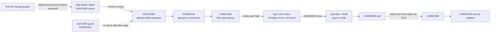

# Phase 2 wrapper/consumer edge observer (2026-09-03)

## Purpose

The previous bounded live retained one exact D7-selected task but recorded no
hit at the internal completion-state read `0x3B9DEA7`. That result could not
distinguish a wrapper that was never scheduled again from a later wrapper
invocation that took another branch. This package adds the smallest distinct
read-only observation needed to make that distinction. It did not start CK3
and does not change public ABI or readiness.

## Exact seams

The new default-OFF option
`XAR_CK3_ENABLE_PHASE2_WRAPPER_CONSUMER_EDGE_OBSERVER_V1` composes four
already bounded identities:

- the D7 producer publishes the exact callback-slot-2 RVA `0x88B480` and
  retains its task pointer with release/acquire ordering;
- wrapper entry remains `0x3B9E030` and now separately counts entries seen
  after that selected pointer becomes nonzero;
- consumer function entry is exactly `0x3B9DD50`, with 16-byte prologue
  anchor `4055565741544155415641574883EC60` and continuation `0x3B9DD60`;
- consumer return addresses classify only exact wrapper call instructions
  `0x3B9E10B` and `0x3B9E175`; every other direct caller is counted separately.

At consumer entry, `RCX` is the consumer context and `EDX` is its item count.
The hook replays all seven nonvolatile pushes plus `sub rsp,0x60` before
continuing. The existing internal `0x3B9DEA7` correlation remains the only
claim that the consumer actually presented the retained task; an entry-edge
hit alone does not make that claim.

## Typed interpretation

The combined heartbeat object is
`phase2_wrapper_consumer_edge_observer_v1`:

1. selected count zero means the producer identity was not observed;
2. selected nonzero plus `wrapper_post_publish_entry_count=0` means the
   wrapper was not scheduled again in the bounded window;
3. wrapper post-publish nonzero plus both post-publish edge counts zero means
   the wrapper entered but took another branch before either consumer call;
4. a post-publish consumer edge with `consumer_identity_match_count=0` means
   a consumer ran, but did not present the selected task at `0x3B9DEA7`;
5. identity match nonzero is the only positive selected-task consumer result.

All counters are diagnostic. The observer never changes task state, callback
lifetime, queue contents, scheduler flow, public capability fields, or loader
readiness.

## Static acceptance and remaining live gate

The focused native fixture executes the generated detour, checks its argument
capture and exact prologue replay, covers both wrapper call edges and the
other-caller bucket, verifies zero-selected versus post-publish counting, and
tests recoverable rollback/uninstall. The existing wrapper-entry fixture also
covers its new post-publish counter.

The source contract, ABI, and heartbeat JSON schema are frozen under
`ck3_autonomous_player/native_bridge/research/`. A default Release build must
contain none of the private heartbeat token; an option-enabled Release build
must contain it and pass both native fixtures plus Python normal and optimized
contract tests. After those static gates, one exact-source manifest and one
serialized bounded CK3 live are still required. Until that live evidence
exists, native readiness remains **RED**.

## Observer-only live attempt

The one authorized native-observer-only attempt used PID `37300` and bound the
private bridge without taking screenshots or issuing OCR, UI, keyboard,
gameplay, legal-consent, commerce, or payment input. Heartbeats 2 through 5
reported the observer installed with `failure_flags=0`; all producer, wrapper,
consumer-edge, other-caller, and retained-identity counters remained zero.

Those zeroes are not a producer or capability result. CK3 exited with code 1
after about 13.5 seconds, before the producer-selection boundary, with
`C0000005` at `ck3+0x1DABD89`, the previously observed particle2 startup fault.
The bounded window therefore closed as
`startup-crash-before-producer-selection`: a startup/harness RED with Phase 2
capability still indeterminate. There was no restart. Physical cleanup was
GREEN (CK3/injector inventory, job, watchdog, process tree, and control files
empty), although the session cleanup contract correctly remained RED because
the process exited early and the final capability connection was unavailable.

The typed closure is
`_runtime/phase2-wrapper-edge-observer-only-live-20260903-024500-artifacts/observer-only-live-closure.json`
(SHA-256
`9A89777E50E7C8B9C301DB82C368C7E862C280311EBBD897947E57A238AFFE03`).
The runner report SHA-256 is
`0DD38240D3AC5B134F2EAC627ADA95AD4D4B66175D8A282BE7510C99C283B509`,
the heartbeat stream SHA-256 is
`A8400B538979F14AD6BCE2AF9DA102960B7253BAE020F7776898329AA814DD07`,
and the minidump SHA-256 is
`F527EFD131556920E71C0869D5343994EBC5BC8FD1FBDAA2B432794B029CCE03`.

The next static candidate combines this default-OFF observer with only the four
already live-proven startup guards (particle2 producer, particle2 consumer,
DX11 first-draw, and localization-current-root). That candidate is merely a
reusable base known to advance to the later startup fault; it does not by
itself make another live attempt ready.

## Five-guard observer-only live

The follow-up exact freeze added the caller-local widget flag-call guard to the
four-guard base. Its local commit is
`eb85ffd1b800d14da34e66b5e8f25a2bce9ec67a` (tree
`1070c65d1f1ff6366a2c9794b2112e43376c86ff`); the private DLL SHA-256 is
`967E60B6FCB17191B2890F3CD281F940E3AD5C13AB294C8B4A8C6C53264777D3`.
Seven focused native fixtures and both normal/optimized Python contracts were
GREEN before the single authorized live.

PID `31720` bound successfully. All five guards were installed with zero
failure flags. Their live counts were particle2 producer `8` (mask `0xFF`),
particle2 consumer `1` (missing mask `0xFF`), DX11 first draw `1`, localization
native miss `5`, and widget caller-local suppression `0`. The consumer-edge
observer was also installed with zero failure flags. Before D7 selection it
recorded 190 consumer entries, all from exact wrapper call edge `0x3B9E175`;
`0x3B9E10B` and other callers remained zero.

The process nevertheless exited after 13.557 seconds with access-violation
code `0xC0000005`, before any producer-selected task was observed. No crash
bundle or Windows Error Reporting record captured an RVA. Consequently, the
typed result is
`startup-crash-before-producer-selection-with-preselection-consumer-edge`, not
`producer_selected_task_not_observed`: the edge is now live-confirmed for
pre-selection traffic, while selected-task wrapper/consumer behavior remains
indeterminate. No second launch occurred, and the observer-only run issued no
screenshot, OCR, UI, keyboard, gameplay, legal, commerce, or payment input.

The cleanup contract was RED because the process exited unexpectedly and the
final bridge connection was gone, while physical cleanup was proven: process
tree, job, CK3/injector inventory, watchdog, and control files were empty. The
typed closure is
`_runtime/phase2-wrapper-five-guards-observer-live-20260903-030500-artifacts/observer-only-live-closure.json`
(SHA-256
`FCD6FEB3E3AE78C79281E73DC0052E19882FAA43C4C6DDFEBFE4FB2F47F5E3D9`).

## Read-only second-chance crash capture

The five-guard attempt exposed a harness gap: CK3 returned access-violation
code `0xC0000005`, but neither its private crash directory nor Windows Error
Reporting produced a bundle. `ProcDump` and `cdb`/WinDbg are not installed.
The older Phase 2 debug capture writes software breakpoints, so it is not used
for this fault-location pass.

The selected minimum is the in-tree `phase2_exception_capture_v1` observer. It
uses `DebugActiveProcess`, disables debugger-exit process killing, writes no
target memory, installs no breakpoint, and returns every real exception as
`DBG_EXCEPTION_NOT_HANDLED`. On the second-chance terminal it records the
exception code/address/RVA and access address, thread ID, x64 control/integer
registers, a 64-qword raw stack snapshot, and the process exit code. A synthetic
access-violation fixture live-confirmed this capture path without CK3.

`tools/run_phase2_exception_capture_v1.py` is preflight-only by default. Its
explicit `--execute` mode waits for the exact runner start artifact, obtains
the bound PID, and starts only the observer; it never launches CK3 and has no
UI, legal, commerce, or gameplay input path. A new CK3 capture still requires
an exact-source manifest, fresh paths, the CK3 serial gate, and one-attempt/no-
restart authorization. No sixth guard follows until that capture supplies the
actual exception RVA and state.

### First crash-capture live: harness scheduling RED

The first authorized five-guard plus observer capture attempt launched CK3
exactly once as PID `57972`. It reproduced the same pre-selection evidence:
all five guards and the consumer-edge observer installed without failure,
producer selection remained zero, and all 190 consumer entries came from
`0x3B9E175`. CK3 exited after 14.214 seconds with `0xC0000005`; physical
cleanup was GREEN and no screenshot, OCR, UI, keyboard, gameplay, legal, or
payment input was issued.

The exception RVA is still unknown because the capture coordinator armed at
19:22:16Z with a 45-second pre-PID window, while the runner published the
exact native-session PID artifact only at 19:23:24Z after completing its full
preflight. The coordinator therefore timed out before CK3 existed and never
attached. This is `crash-capture-harness-scheduling-red`, not a Phase 2
capability result, and the attempt was not restarted. The typed closure is
`_runtime/phase2-wrapper-five-guards-exception-live-20260903-033000-artifacts/second-chance-capture-live-closure.json`
(SHA-256
`0A3CF7607EA96E9D682F448A54587AC8D37168F61ECF02524CE538CC74CBF008`).
The runner report SHA-256 is
`86A8B1E1BCEFC4E595FAC90AB9BA4C0C798132CC96BF5FB3BB5DC8E033FBF600`.

The corrected coordinator contract now obtains the PID only from the exact
start-artifact handshake and requires a pre-PID wait of at least 300 seconds,
covering the runner's complete source/archive/open_kaishek/bootstrap/native
preflight. A short window fails no-launch preflight. This fix requires a new
exact freeze and separate authorization before another CK3 launch.

The corrected no-launch freeze is now prepared at local commit
`079f3999e398e29a54b201320c8935c79b493b27` (tree
`e9abb4bb1c2c7816b3e7633e1d3bc2bd0c888ffc`). Its exact source ZIP SHA-256
is `5FFBC005BF15DC5C3BDCAC2423F989EAC39F41FFEADDB0AB59972F69E21EB52A`.
Normal and optimized coordinator tests are 5/5 GREEN, and normal and optimized
source-contract tests are 3/3 GREEN. The aggregate preflight is
`READY_TO_RUN`, with the reserved attempt and artifacts paths absent and all
CK3, injector, and capture process inventories zero. It remains stopped before
launch pending a distinct CK3 serial-gate authorization.

### Corrected second-chance capture live

The corrected exact-handshake attempt launched CK3 once as PID `56332` and
attached the read-only capture as PID `45152`. CK3 raised second-chance
`C0000005` on thread `19816` at VA `0x7FF6915D7345`, exact RVA
`0x3B67345`, reading address `0x8`. The image base was
`0x7FF68DA70000`; `RIP` equalled the exception address, `RSP` was
`0xBA797FF840`, `RBP` was `0xBA797FF8E9`, and both `RCX` and `RBX` were
zero. The artifact preserves all x64 integer/control registers and a complete
512-byte/64-qword raw stack. Image-relative stack values include
`0x390A9F2`, `0x390A283`, `0x3B9CFD2`, `0x3B9E72F`, `0x3B9D050`, and
`0x3B9D0AA`.

All five startup guards and the Phase 2 edge observer installed with zero
failure flags. The guard counts were `8 / 1 / 1 / 5 / 0`; producer selection
remained zero, and all 190 consumer entries again came from `0x3B9E175`.
Selected-after-publish, wrapper-post-publish, identity-match,
`0x3B9E10B`, and other-caller counts remained zero. Thus the result is
`startup-crash-before-producer-selection-with-exact-second-chance-capture`;
the crash address is closed, but Phase 2 capability remains indeterminate.

The observer wrote no target memory or breakpoint and returned the exception
as `DBG_EXCEPTION_NOT_HANDLED`. The run issued zero screenshot, OCR, UI,
keyboard, gameplay, legal, or payment inputs and was not restarted. Physical
cleanup is GREEN (CK3/injector/capture inventory zero, process tree gone, job
empty); the existing session cleanup contract is RED on the four expected
unexpected-exit checks. The full exception artifact SHA-256 is
`592D20086AF2A8C96E164BEFD02C56EA64CE96D8010A2BA3EB7EE227C6665BAF`;
runner report SHA-256 is
`72BB2E8C648D11587C4E1437C2A4D663670FFF34F65C4CEE3B51A7789D175B5C`.
The typed closure is
`_runtime/phase2-wrapper-five-guards-exception-handshake-live-20260903-034500-artifacts/corrected-second-chance-capture-live-closure.json`
(SHA-256
`29E1E96230235F97754AB97AB57E04EB21040268C247006F5550E013490634E6`).

### Static alignment and desktop fallback

The captured fault is byte-for-byte the same exact-build seam already closed
by G2's sixth caller-local guard: the same EXE SHA, `0x3B67345`, null
`RCX/RBX`, read address `0x8`, and return `0x390A9F2`. G2's one sixth-guard
live has already proved that this guard crosses the fault and reaches the
distinct successor `0x3BE33A9`, where `RCX=RBX=0x206E65704F534656`
(`VFSOpen ` as a string-derived invalid pointer value). Repeating a same-shape Phase 2 sixth-
guard live would add no new fact. That G2 result can be reused as shared-engine
startup evidence, but it does not prove Phase 2 loader selection or readiness;
the different successor still requires static ownership analysis, not a
guessed seventh guard.

The existing default-desktop relay is a valid fallback for the earlier legal-
capture environment problem: it launches the exact seed runner through
`CreateProcessW` with `STARTUPINFO.lpDesktop=WinSta0\\Default`, is no-launch
by default, and leaves the runner's legal/commerce policy unchanged. An
equivalent manual invocation from an already interactive
`xenoa / WinSta0\\Default` PowerShell is also available. Neither path changes
the injected native bridge. The later history comparison below reclassifies
the normal desktop as the least-confounded environment A/B for the startup
chain, in addition to its original legal-capture purpose. No desktop launch
was performed for this conclusion.

### `0x3BE33A9` VFS object provenance and guard attribution

[research / exact-build static] The G2 sixth-guard minidump closes the
immediate data source more narrowly than the original `VFSOpen ` register
label. At the exception, the owning map-loader object is
`0x000002ADD36100A0`. Its small string at `+0x18` is empty, while its next
string at `+0x38` is `/default.map`. `0x20753E0` reads the empty `+0x18`
string, allocates a 0x68-byte asynchronous operation object, and passes that
empty path to constructor `0x3B55A40`.

The constructor calls the VFS factory at `0x3B610E0`. The factory's failure
branch builds the literal `VFSOpen Error: `, appends the requested path and
` not found`, and returns it through `0x3B61D80` as variant tag `1`.
`0x3B56830` moves that tagged value into operation storage `+0x38`; the dump
shows tag `1` at operation `+0x58`, payload pointer
`0x000002ADD3142910`, and exact payload bytes
`VFSOpen Error:  not found`. Poll method `0x3B55D50` does not test that tag:
at `0x3B55D74..0x3B55D83` it loads `rax=[operation+0x38]`, then
`rcx=[rax]`, so `RCX=0x206E65704F534656` is simply the little-endian first
eight bytes of that legitimate error string. The direct call at `0x3B55D86`
then reaches `0x3BE3360`; `cmp byte ptr [rcx+8],0` at `0x3BE33A9` faults on
the string-derived non-pointer.

The evidence ledger is:

| Evidence | What it proves | What it does not prove |
| --- | --- | --- |
| Sixth-live dump `F08D7EC24540D70005CB2D222D8EC4F8A4B65F2A5EACA8A47544E0CCC4DC8908` | Exact empty map-root input, `/default.map`, tag `1`, full error payload, caller and callee chain | Which earlier subsystem left the named map root empty |
| `0x3B610E0 -> 0x3B61D80 -> 0x3B56830` static chain | `VFSOpen ` is an intentional error-string prefix, not arbitrary heap poison or a valid VFS object tag | Whether the engine normally prevents an error variant from reaching this poll method by an earlier state transition |
| Sixth guard at `0x390A9E2` | It skips only `0x3B67330` when the caller-local `RBX` container is null; the skipped callee consumes/clears that container and has no write to the map object or named-path registry | A broad scheduler-timing effect, although there is no direct object/data-flow edge |
| Historical PID `26828`, report `1A6D4FD930F9C4BC4B7AB14D02A769666933F3A833884329865CC2D958BB46F1` | Same exact CK3 executable reached 1,838 producer passes and selected `0x88B480` once with all four then-existing startup guards disabled; its debug log enumerated `map_data/geographical_regions` successfully | That the later five/six-guard build would behave identically on the current execution desktop |
| Current no-containment observer-only PID `37300` | The current sandbox execution already reproduced the earlier `0x1DABD89` startup failure with containment disabled, so the initial regression predates and cannot be caused by the five/six-guard chain | Which environmental input makes the sandbox startup diverge |
| Byte-identical `runtime.py` SHA-256 `DAB7E7100A2B7BCBC6B9B21DA6C8582CF9FAD33D54995C659C5E72F9B9D8F2A7` | Historical and current runners construct the same `-gdpr-compliant -userdir=...` command and use the CK3 `binaries` directory as CWD | Equivalence of the interactive `WinSta0\\Default` and `CodexSandboxDesktop-*` execution environments |

The defensible attribution is therefore **not a seventh missing null guard**
and not a proven side effect of the sixth guard. The immediate VFS failure is
an empty named map-root input followed by an error-variant/poll-state contract
mismatch. The full history comparison favors an execution-environment
initialization divergence: the known producer-selected run used the normal
interactive desktop, whereas current guard-free and guarded attempts run on a
Codex sandbox desktop. The command, CWD, EXE, lifecycle code, save/rules and
product projection do not supply a narrower differing input. This remains an
evidence-based direction, not proof that desktop identity alone initializes
the map root.

The minimum restoration direction is to recover the native initialization
that makes named path id `0x583` resolve to the map root (normally producing
`map_data/default.map`) before `0x20753E0`. It is not justified to hard-code
`map_data`, reinterpret tag `1` as a VFS object, or skip `0x3BE3360`/the poll.
The least confounded future live is the already frozen no-containment build on
`WinSta0\\Default`; only if that still leaves id `0x583` empty should a
read-only observer capture the id resolver at `0x3B96C70`, constructor input
at `0x3B55A40`, and tag/state transition at `0x3B56830`/`0x3B55D50`.
No restoration patch or CK3 launch was performed for this static conclusion.
