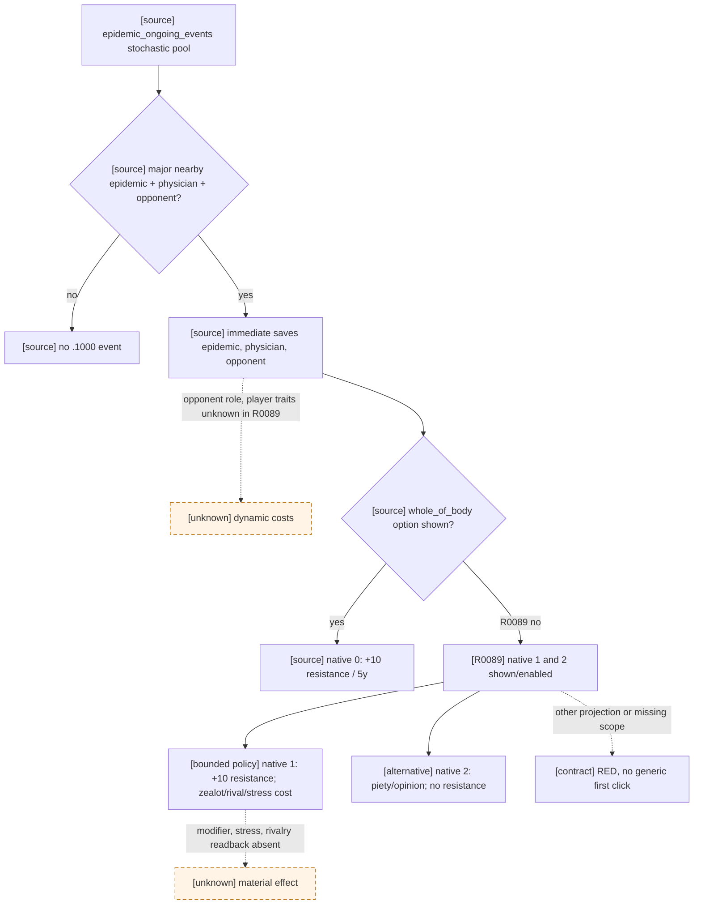

# `physician_epidemic_events.1000`: superstitious physician during epidemic

## Exact-build native tree

CK3 `1.19.0.6`, EXE SHA-256
`2D00FF3101EF70B566F2FCBAE292F09263199C80E9DC8F139B82D7D96F83DB86`.
`game/events/dlc/ce1/physician_epidemic_events.txt` SHA-256
`51ADEEA52F9A93406156ABAFA6608B0425003F63098F0CB033A5CB515C90F493`,
lines 8-171. `game/common/on_action/ce1_on_actions.txt` SHA-256
`96B42FA1A542836171A2A608B7155A8A80D30B0D8F8D9742EBE8AFF231B85E16`,
line 35, places this event at weight 100 inside `epidemic_ongoing_events`;
the same pool has `chance_of_no_event=95`. This is a natural stochastic
caller, not a forced development fixture. The event has a five-year cooldown;
its trigger requires a nearby major epidemic, an available superstitious
court physician and an available anti-superstitious vassal or courtier/guest.
Its immediate block picks a nearby epidemic, saves the physician and selects
an opposing courtier (preferentially a qualifying vassal). The exact role
chosen for R0089's courtier is not exposed by the current event-window frame.

The authored three options have different effects:

- Native 0 requires `whole_of_body`; it adds five years of
  `ce1_non_heretical_solution` (`epidemic_resistance +10`). R0089 did not
  materialize this option; that is **not** an independently observed
  `has_trait=false` value.
- Native 1 adds five years of `ce1_unorthodox_epidemic_treatment` (character
  `epidemic_resistance +10`, `zealot_opinion -10`), advances rivalry between
  the opposing courtier and physician, and has trait-dependent player stress.
- Native 2 gives the opposing courtier `relieved_opinion +20` toward ROOT,
  gives ROOT medium piety and has a different trait-dependent stress table;
  it supplies no epidemic-resistance modifier.

The modifier values are from `game/common/modifiers/06_ce1_modifiers.txt`
lines 891-900, SHA-256
`63FEB33C8C5BF825E3D186E841D07235C98D6AED27C47375E495EA832255C52B`.
All three options use `ai_chance.base=100`, then different native zeal,
compassion and rationality modifiers. The R0089 window lacks these native AI
inputs, player trait/stress branches and complete effect previews; this
tree is source-grounded but not an AI-equivalence claim.

## R0089 evidence, checkpoint and minimal consumer

The frozen raw report/driver manifest is
`Z:\ck3_mod_rewrite_process_assets\g2-first-1066-r0089-physician1000-red-20260922\evidence-manifest.json`
(SHA-256 `79661336F22CEEA10A21FA41B84654BA86087EF44492CD1FFABE64ABD4E3C9FC`).
At driver `command_history[408]`, native revision 20, date_raw 53350560,
instance 21 / calculated event ID 5581000 / ROOT 36403, the exact saved scopes
are `epidemic` and `epidemic_scope` (opaque epidemic identities), physician
50397184 and zealous_courtier 33594572. Snapshot authored option count is 3,
while the current window renders only enabled native `[1,2]`; both effect
indicator lists are empty and explicitly incomplete. Formal turn 18 took
`active_event_degraded_minimal_choice`, authored 2/native 1, not a source-bound
semantic decision. The next paused frame removed instance 21; it did **not**
independently prove the modifier, stress or relationship effects. The h411
post-choice save SHA-256 `9D900730334514F7655B666B00D2CBD2CB87620B0B168DF5AA5E9BA7B7DDA5B7`
is physically paired with its driver but must not be called a formal GREEN
checkpoint merely from that fact.

For the exact R0089 four-scope/two-rendered-option projection, native 1 is a
bounded epidemic-survival choice: it grants source-defined character resistance
without spending resources or starting another event chain, at the recorded
five-year opinion and possible stress/rivalry costs. It happens to match the
old generic action, which makes h411 **not demonstrably polluted by this
choice alone**; it does not retroactively validate the old generic decision or
the physical effect. A new contract must match ROOT, all four scope names and
types, the distinct non-player physician/opponent identities, authored count
3, rendered native `[1,2]` and selected native 1. Any other shape must stop.
Read-only source-index/MCP knowledge should expose this contract and its
source provenance, without advertising a production-live capability. The
next formal replay must provide semantic selection, one typed action,
independent paused material readback where available, next-turn consumption
and checkpoint compatibility. R0089 remains a product RED until then.

The new shared registry consumes the frozen R0089 query offline as
`recommended`, authored 2/native 1, `failed_checks=[]`; the ordinary formal
planner offline returns `active_event_registry_choice` and typed
`select-event-option-2`, rather than the original generic phase. This is
not a new live submission. The exact-build read-only source index contains
the event definition at line 8 and the sole lexical on-action candidate at
line 35; it does not prove a particular runtime RNG draw. No native ABI,
public MCP protocol, capability advertisement or open_kaishek interface
changed, though the existing shared knowledge/source queries now expose one
additional exact-build event key.
