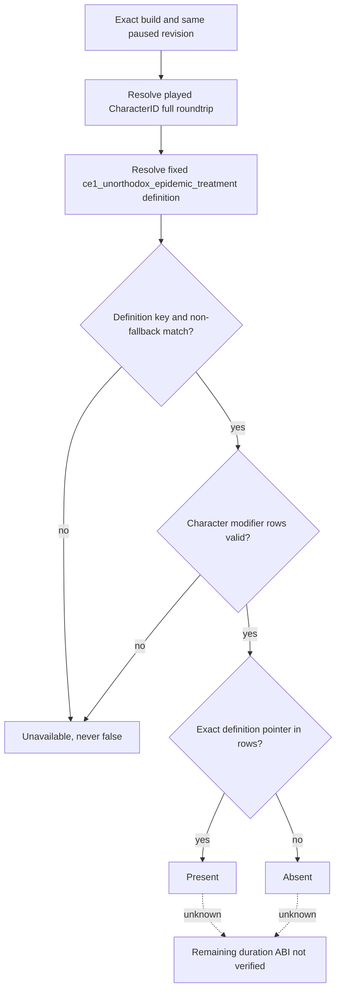

# R0089 physician treatment modifier: fixed-key readback

Status: exact-build source/ABI reviewed; fixed-key private read-only implementation is static-ready, while live independent material readback remains pending. This is an observation dependency of natural `physician_epidemic_events.1000`, not a new event action or a G2-M2 closure.

CK3 is frozen to 1.19.0.6, `ck3.exe` SHA-256 `2D00FF3101EF70B566F2FCBAE292F09263199C80E9DC8F139B82D7D96F83DB86`. Vanilla `game/events/dlc/ce1/physician_epidemic_events.txt:89-132` (SHA-256 `51ADEEA52F9A93406156ABAFA6608B0425003F63098F0CB033A5CB515C90F493`) makes option `.b` apply `ce1_unorthodox_epidemic_treatment` to ROOT for five years; `game/common/modifiers/06_ce1_modifiers.txt:891-900` (SHA-256 `63FEB33C8C5BF825E3D186E841D07235C98D6AED27C47375E495EA832255C52B`) defines +10 epidemic resistance and -10 zealot opinion. The five-year duration is **script-defined, not measured**.

The 1.19.0.6 compiled `has_character_modifier` path is already reviewed in `combat-phase-events.md:1632-1652` and implemented for a different fixed key in `native_bridge/src/combat_v3.cpp:943-980,1458-1473`: modifier database getter RVA `0x88F370`, stable-key hash `0x3B8B000`, definition lookup `0xA41F10`, fallback slot `0x570C968`, stable definition key at `+0x18`; played CCharacter full-ID roundtrip at `+0x18`, modifier extension at `+0x1A8`, rows `+0x188/+0x194` with stride `0x48` and first member the definition pointer. A null extension means absent; malformed rows or unresolved/wrong-key definition mean unavailable, **not** absent. The row expiration field is not yet source-verified, so the minimum query returns presence only and `remaining_days = unavailable`.

R0089 h411 is a physically paired **post-generic-choice** checkpoint; prior h387 is the unpolluted baseline. The old native observations establish old event instance disappearance, not this named modifier. A future private query must compare a real same-build h387 baseline and h411 outcome in separate, sole-owner cold sessions, or at minimum read h411 presence while recording that baseline absence is untested. Do not pair their driver/save bytes, claim a measured duration, or advertise a public MCP capability from an offline fixture.
