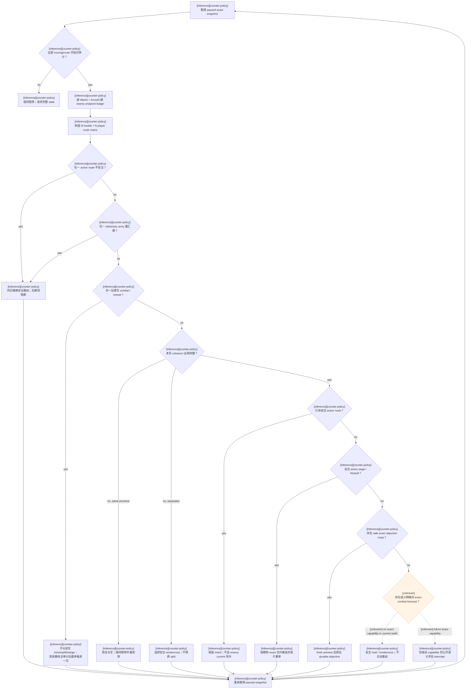
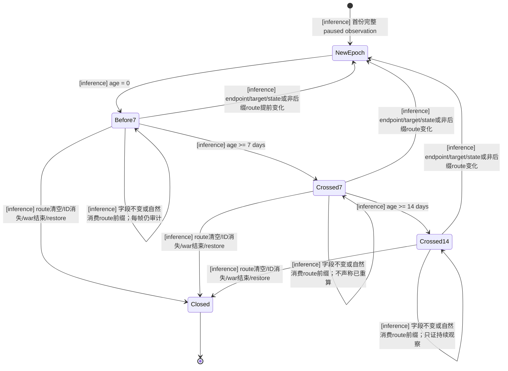
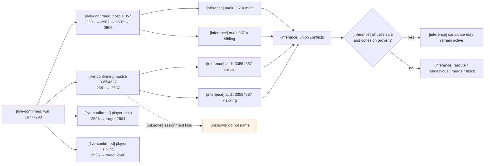
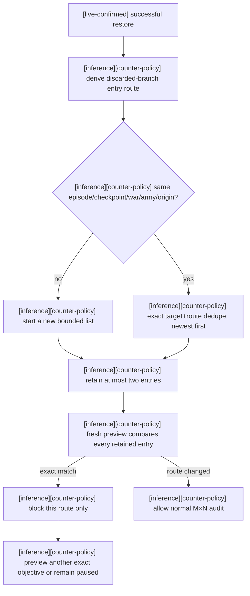

# 玩家陆军反制策略（Counter-policy）

## 目的与证据语言

- [inference][counter-policy] 本文把 [army-controller.md](army-controller.md) 中已经冻结的原版陆军 AI
  事实转换成我方 planner 的保守决策树；它描述“我方应如何行动”，不是对 CK3 原生 controller 的又一次
  反编译，也不把我方规则冒充成原生行为。
- [static-confirmed] 本文引用的原生阈值只绑定 CK3 `1.19.0.6` 与 EXE SHA-256
  `2D00FF3101EF70B566F2FCBAE292F09263199C80E9DC8F139B82D7D96F83DB86`；其原始证据和升级边界以
  [README.md](README.md) 与 [army-controller.md](army-controller.md) 为准。
- [live-confirmed] 文中的战争 `16777290`、敌军 `357` / `33554657` 和游戏日期 `53175984` 来自
  2026-08-24 的 exact-build paused 快照；编写本文没有读取新进程、推进游戏时间或执行 CK3 命令。
- [inference][counter-policy] 本文所有 planner 选择、失败关闭、观察窗口、合军建议和测试预期都标为
  `inference`；即使它们引用 `static-confirmed` 常量，也不因此升级为原生 static fact。
- [unknown] 原生 exact stance、assignment kind、最终评分账本、事件驱动 invalidation 表与完整 power / combat
  prediction 输入仍未闭合；任何需要这些语义的策略分支必须保持不可达。

## 可消费输入与禁止推断

| 证据 | 输入或边界 | Counter-policy 用法 |
|---|---|---|
| [inference][counter-policy] | paused snapshot 的 `date_raw`、`war_id`、`player_side`、`player_is_primary_war_leader` | 划分恢复分支、战争分支与观察纪元；不按 `date_raw % 7/14` 猜原生 timer 相位。 |
| [inference][counter-policy] | 每支军队的 full-generation `army_id`、`current_province_id`、`move_target_province_id`、`route_province_ids` | 以 `(war_id, army_id)` 独立建账，规范化 current、first hop 与 endpoint。 |
| [inference][counter-policy] | `army_state` / `army_state_code`、`in_combat`、`retreating` | 只采用公开状态值触发等待、路线重审和纪元重置，不反推内部 controller 分支。 |
| [inference][counter-policy] | exact `war_objective_province_ids`、occupation、fort、garrison 与 active siege 子域 | 识别我方 durable objective 和已有围城；能力缺失时不以 null 冒充零或“无目标”。 |
| [inference][counter-policy] | 已有 paused-to-paused `war_progress_before/after` 历史 | 复原连续 endpoint 观察；成功 restore、战争结束或 ArmyID generation 改变时截断。 |
| [static-confirmed] | 原版目标 power 曲线的输入是质量化 `OurPower` / `EnemyPower` | UI / snapshot `soldiers` 不是这两个量的 exact 替代品。 |
| [inference][counter-policy] | `soldiers` | 最多作为显示或诊断信息；不得据它选择原生 stronger/weaker、lopsided、0.5 倍猎物分支或 combat 阈值。 |
| [unknown] | `CAISubunitStack+0x48`、assignment enum、local-objective helper、跨 owner shared coordinator | 不读取、不命名、不从 endpoint 倒推 support / intercept / defend / siege。 |

- [inference][counter-policy] 对 moving 军队，正整数 target、完整正整数 route、规范化后的最后一跳等于 target
  才构成可审计 observation；缺字段、route 为空或 endpoint/target 不一致时保持暂停。
- [inference][counter-policy] stationary 军队可以把 current province 作为明确的 `hold` 位置，但不能伪造一条空
  route 的 endpoint assignment。
- [unknown] 当前 schema 没有语义明确的 exact combat prediction ratio；所以本文的主动接战分支在当前版本
  必须失败关闭。

## 敌方 stance 与 objective 风险包络

- [live-confirmed] 战争 `16777290` 中玩家位于 attacker side，因此敌对一侧位于 defender side。
- [static-confirmed] 原版 defender 的默认候选包括 `defender_offensive`、`defender_defensive` 和
  `defender_desperate`；选择还依赖质量化相对 power、desperate 条件、`can_be_picked` 与 `ai_will_do`。
- [unknown] 当前稳定 snapshot 不能闭合敌军采用了哪一个 stance，也不能闭合同分、hard-coded 特例或最终
  path-cost 账本。
- [static-confirmed] 三个 defender stance 的首个 objective block 都把 wargoal 设为 `500`，并把位于
  wargoal 或 primary-defender area 的可见敌军候选设为 `250`。
- [static-confirmed] `defender_offensive` / `defender_defensive` 还给任意可见敌军 `200`；
  `defender_desperate` 没有该通用项，因此不能把“任意敌军一定被追”当成三 stance 的共同规则。
- [inference][counter-policy] 我方只采用上述 stance **并集风险包络**：战争目标区域和其中的玩家军属于高汇聚
  风险，区域外玩家军仍可能成为目标；不为敌军生成一个伪造的 exact stance 标签或数字总分。
- [inference][counter-policy] 我方自身使用词典序优先级而不是复刻原生 score ledger：先保证观察和生存，再
  保证全军路线与 cohesion，然后保留安全既有意图，最后才在围城、exact objective 与接战候选之间选择。

## 主决策树

### 词典序细则

1. [inference][counter-policy] **Evidence gate**：任何 moving 状态、target 或 route 子域不完整时，禁止
   life-advance、split、merge 与主动接战；先恢复 paused exact observation。
2. [inference][counter-policy] **Global emergency**：先处理 unsafe active route，再处理受汇聚威胁的
   stationary `regular/sieging` 军队；一支安全军队不能替另一支危险军队放行时间。
3. [inference][counter-policy] **Combat / retreat**：不向该军发送 CK3 不可接受或语义未知的新命令；其他军队
   仍需全局审计，之后才允许一个 bounded paused-to-paused slice。
4. [inference][counter-policy] **Cohesion**：多个玩家 stack 必须各自拥有 durable goal、全敌交叉安全和明确
   reunion；证明不全时优先恢复合军或 rendezvous。
5. [inference][counter-policy] **Current intent**：已接受且仍安全的玩家路线优先保留；敌军只改变 current 而
   target/endpoint 未变，不足以让玩家每日反向改令。
6. [inference][counter-policy] **Siege**：我方 exact siege / Assault 沿各自已冻结的进度与威胁合约处理；敌军
   sieging 只作为 soft anchor，不能当作 immobile lock。
7. [inference][counter-policy] **Objective**：safe exact wargoal / target-title objective 优先于追逐移动敌军；
   fort / garrison rank 只能在所有路线均通过安全矩阵后用于排序。
8. [inference][counter-policy] **Contact**：没有 exact combat forecast 时不主动前往敌军所在省；安全 hold、
   rendezvous 或另一个 exact objective 优先。

## Enemy endpoint epoch：7 / 14 日是 milestone，不是锁

- [static-confirmed] 普通原生 target evaluation 周期为 `7` 日；一边质量化 power 不超过另一边 `0.33` 时，
  lopsided 周期为 `14` 日。
- [static-confirmed] 原版当前 target 有 `+100`，比当前 target 更远的新候选有 `-100`；这形成黏性，但不
  排除事件驱动的提前 invalidation。
- [unknown] timer 的当前相位、jitter、逐字段映射和即时 invalidation 事件表没有闭合；snapshot 兵数也不能
  判定 lopsided。
- [inference][counter-policy] 每个敌军 epoch 保存：`war_id`、full-generation `army_id`、current、first hop、
  endpoint、target、完整 route、combat/retreat state、`epoch_started_date` 与 `last_seen_date`。
- [inference][counter-policy] target / endpoint / combat-retreat state 变化，或 remaining route 发生非自然后缀
  改道时关闭旧 epoch；自然行军只消费旧 remaining route 的前缀，且 current 前进到最后一个已消费 hop 时，
  仍属于同一 intent epoch。route 清空、ArmyID 消失、战争结束或成功 restore 也关闭旧 epoch；下一个
  observation 从 age `0` 开始。
- [inference][counter-policy] age `<7`、`7..13`、`>=14` 只表示观察已跨过哪些已证 cadence 窗；跨线本身既
  不强制我方改令，也不证明敌军已经或尚未重算。
- [inference][counter-policy] 无 exact native power 时同时维护 7 日与 14 日两个 milestone，不选择一个伪造
  的 `normal/lopsided` 标签。

- [inference][counter-policy] 任一玩家或相关敌军存在 tactical route、或我方 Assault active 时，观察用
  life-advance 应为一日 paused-to-paused；其余推进也不得无观察地跨过下一个 7 / 14 日 milestone。
- [inference][counter-policy] 上述一日采样用于重新获得 running 帧不会提供的完整 route，不表示原生 AI 每日
  重算 target。
- [inference][counter-policy] planner 自己的 move-deferred `7/14/30` backoff、same-province stale contact
  计数和原生 target cadence 是三个不同机制，不得共用语义标签。

## M hostile × N player route matrix

- [live-confirmed] 同一 current province 的敌军可以有不同 endpoint：战争 `16777290` 中 `357` 和
  `33554657` 都从 `2581` 出发，但 endpoint 分别为 `2596` 与 `2587`。
- [inference][counter-policy] 因此每一个玩家 route candidate 必须分别与每一个非 retreating hostile 的
  current、target、first hop、完整 route 和 endpoint 审计，不能把敌军合并成一个视觉 blob。
- [inference][counter-policy] 单格至少检查 enemy current on route、enemy target on route、shared next hop、
  future route intersection 和 opposite directed edge；任何一格 unsafe 都否决该玩家候选路线。
- [inference][counter-policy] 不使用“每个敌军只会追一支玩家军”的 matching 假设；两支敌军可以分别压迫两半，
  也可以共同汇聚同一 stack。
- [unknown] endpoint 不公开 objective kind；`33554657 → 2587` 不能被命名为 support、intercept、defend 或
  staging。

- [inference][counter-policy] 非 exact-objective 的敌军所在省也必须经过接战能力闸；不能用“允许 enemy at
  destination”绕过 route matrix。
- [inference][counter-policy] 每支玩家军最终都要有 `escape/reunion`、`safe siege`、`exact objective` 或
  `explicit safe hold` 之一；另一支军有安全 active route 不足以替一个无目标或受威胁 stack 放行时间。

## Cohesion、Split 与 Merge

- [static-confirmed] 原版 AI 每 `14` 日评估 split/merge；低于 preferred stack size 的 `0.75` 尝试 merge，
  高于 `1.1` 尝试 split，并以最强对手约 `1.5` 倍等质量化 power 目标计算 stack size。
- [unknown] 当前稳定 snapshot 没有原生 preferred stack size、质量化 power 或 exact combat prediction，不能
  直接移植这些数字。
- [static-confirmed] 原版敌军目标 power multiplier 在目标约为本 stack power 的 `0.5` 时达到 `1`；接近或
  超过本 stack power 时降到 `0`。
- [inference][counter-policy] 把一支接近敌 stack power 的玩家军拆成两半，可能把一个低吸引目标变成两个理想
  猎物；multi-stack 敌军又可以给两半不同 endpoint，所以默认禁止自动 split。
- [static-confirmed] `CHASE_MIN_SIZE=500` 会阻止原版费力追逐更小 stack，但 wargoal、路径、相邻 combat 和
  其它 objective 仍独立存在。
- [inference][counter-policy] “拆到 500 以下”不是安全证明，也不能绕过 cohesion gate。

### 保持已拆状态的最小证明

1. [inference][counter-policy] 两半各自有 exact、durable 且不是仅为风筝敌军 current 的目标。
2. [inference][counter-policy] 两半的完整 route 分别通过全部 hostile 的 M × N audit。
3. [inference][counter-policy] 存在语义明确的 exact combat forecast，且每一个可能接触 pair 都满足我方公开的
   安全条件；`soldiers` 不能代替。
4. [inference][counter-policy] 有不穿越 hostile current / route / endpoint 的明确 rendezvous province 与
   重聚路线。
5. [inference][counter-policy] 任一证明 unavailable 时，若两军同省则优先 merge；若已分开则不得再 split，先
   建立 rendezvous。

- [inference][counter-policy] 已闭环的 generation-bound split / merge primitive 应保留为显式恢复能力；当前
  planner 不应因为缺少自动 split 门槛而删除底层能力。
- [inference][counter-policy] Merge 用于恢复拆分时，原本需要保留的主军应为 destination；只有 exact literal
  当前被广告、两军同省且非 combat/retreat 时才提交。
- [inference][counter-policy] `merge_submitted` 不是完成；至少要重新观察 destination ID / owner / province
  保留、source 消失和玩家可控 ID 集合精确减少 source。完整边界见
  [ck3-native-merge-contract.md](../ck3-native-merge-contract.md)。
- [inference][counter-policy] Merge 后不假定 destination 继承哪条活动 route；保持暂停，取得新 snapshot，
  再用当前 origin/date fresh preview 后才允许推进。

## Siege、Combat 与 Retreat 行为包络

- [static-confirmed] 原版已在目标省 sieging 的 unit 有 `+500`，继续本 stack 的 ongoing siege 有 `+80`，
  会开始新 siege 有 `+70`；打断有 occupation 价值的 ongoing siege 有基础 `-100` 惩罚。
- [static-confirmed] 没有 siege weapons 时，只有预计至少还需 `30` 日才结束，相关 AI subunit stack 才允许
  放弃 siege。
- [static-confirmed] 解围候选有 `+190`，开始 combat 有 `+80`；接近胜利时 easy battle、跨 stack 救援和
  battle multiplier 仍可能压过 siege 黏性。
- [inference][counter-policy] 因此敌军 `sieging` 只构成 soft anchor：可用于规划行动窗口，但每次 target/route、
  combat/retreat、求援或战争分变化后必须重新审计，不能假定其固定 30 日。
- [inference][counter-policy] 我方 active siege / Assault 继续使用 exact SiegeID、进度、garrison、eligible
  besieging strength 与一日/七日后置条件；不把原版 AI 的 score 常量混入我方 siege parser。

| 证据 | 原版边界 | Counter-policy 允许的结论 |
|---|---|---|
| [static-confirmed] | 普通 combat prediction ratio `>=0.5`；desperate `>=0.4` | [inference] 敌军可能接受的接战区间；当前无 exact ratio，不能据兵数主动接战。 |
| [static-confirmed] | prediction `<0.66` 请求增援，达到 `0.75` 停止继续请求 | [inference] 单支敌军的暂时优势不能排除另一 stack 加入；不实现伪造的 help 状态。 |
| [static-confirmed] | 当前 unit stack 被敌方 out-powered 达 `ASK_FOR_HELP_OTHER_STACK_TROOPS_RATIO=1.5` 门槛时尝试请求附近友军；不把该 define 猜成确定分子/分母公式 | [inference] M × N 审计不能只看准备接触的一个敌军。 |
| [static-confirmed] | siege progress `>=0.6` 时，打断 siege 救援门槛更保守为 `1.7` | [inference] 高进度围城可能更黏，但不是 immobile lock。 |
| [static-confirmed] | prediction `<0.45` 且另处至少有本军 25% strength，或两省内有更好地形时满足 retreat 条件 | [inference] 只在公开 `retreating` 变真后按 retreat 处理，不预测目的地。 |
| [static-confirmed] | stand-and-fight 最长 30 日，放弃后 45 日 cooldown | [inference] 只作敌方行为上界背景；当前不实现内部 controller 状态机。 |

- [unknown] combat 开始后的 exact controller 调度、撤退命令构造和目的地评分仍未闭合；Mermaid 主树中的
  future exact forecast 分支不得由这些阈值自行解锁。

## 战争 `16777290` 的初始 paused 决策 / 日期 `53175984`

- [live-confirmed] 两支玩家可控军仍同在省 `2596`；主军有 target `2604`，拆出的 sibling 有 target `2600`。
- [live-confirmed] 敌军 `357` 位于 `2581`，route 为 `[2587,2597,2596]`，endpoint 是玩家旧位置 `2596`。
- [live-confirmed] 敌军 `33554657` 位于 `2581`，route 为 `[2587]`，endpoint 为 `2587`。
- [live-confirmed] 两敌 endpoint 已分化；`2587` 同时是 `357` 的 first hop 和 `33554657` 的 endpoint hazard。
- [unknown] 当前资料没有给出两个玩家 route 的全部 hop、每半对两敌的 exact combat forecast、两 endpoint 是否
  都是 durable objective，也没有 `33554657` 的 assignment kind。
- [inference][counter-policy] “两条路线暂未发现几何冲突”不等于“两个半栈独立安全”；当前不满足保持 split 的
  最小证明。
- [inference][counter-policy] 建议在这个 paused frame 把 sibling merge 回原主军，原主军作为 destination；若
  exact merge literal 不可用或原生 validator 拒绝，则保持暂停并改走 rendezvous，不推进时间。
- [inference][counter-policy] Merge 后先验证 source 消失与 destination 保留，再把 route 当作需要重新观察；
  不假定继续前往 `2604` 或继承 sibling 的 `2600` intent。
- [inference][counter-policy] 下一步只在 fresh preview 通过全部 hostile matrix 后离开 `2596`；避免穿过
  `2587`，并由 exact objective 状态决定 `2604`、`2600` 或其它候选，不能仅凭 endpoint 拍板。
- [inference][counter-policy] `357` 的 current-target `+100` 黏性可能让其暂时继续前往旧位置 `2596`，但这是
  可利用的观察窗口，不是 7 日安全承诺；任何提前 target/route 变化都立即重开 epoch。

### 执行结果 / 日期 `53176104`

- [live-confirmed] planner 选择 `merge-armies-83886341-with-16777558`；暂停快照证明 sibling 消失且原主军
  保留，日期未在合军事务内推进。
- [live-confirmed] Merge barrier 拒绝合军前 preview；合军后 fresh preview 与 observed remaining route 均为
  `[2595,2603,2604]`，随后所有推进均使用 speed 1 的一日 paused-to-paused 切片。
- [live-confirmed] 第五个切片后主军抵达 `2595`，remaining route 自然消费为 `[2603,2604]`；这是 P02
  的同一 intent epoch，不因 route 前缀被正常消费而重开。
- [live-confirmed] 同一切片后 `357` 的 endpoint 从 `2596` 改为 `2595`，新 route 为
  `[2587,2599,2598,2595]`；旧 endpoint epoch 当帧关闭，新 epoch 从 `53176104` 开始。
- [inference][counter-policy] 玩家 `[2603,2604]` 与当前两敌 remaining route 暂无几何交叉，但 `357`
  endpoint 等于玩家 current，且没有双方 ETA/exact combat forecast；因此仍只允许一日推进并在每帧重审。
- [unknown] target 变化的确切内部触发未知；实现只消费已发布的新 target/route，不把它命名为即时追踪或
  定时器触发。
- [live-confirmed] 到日期 `53176248`，玩家自然抵达 `2603`、remaining route 只剩 `[2604]`；`357` 同帧
  再把 endpoint 改成 `2603`，并发布一条不与玩家 `[2604]` 相交的长 remaining route。counter-policy
  关闭 `2595` epoch、建立 `2603` epoch，但不追敌 current，也不由两次相关观察推断内部触发器。
- [live-confirmed] 日期 `53176344`，`357` 又把 endpoint 改为玩家 destination `2604`。暂停态重新预览全部
  exact 目标后，每条 native route 都因边内 effective origin 而先经过 `2604`，因此都与敌 route/target
  冲突；planner 返回 `native_war_no_safe_exact_route`、`selected_step=None`，没有用 advance 逃逸。
- [inference][counter-policy] 这个 live 分支验证 P03/P07/P08 的组合门：敌 endpoint 提前变化立即关闭旧
  epoch；所有候选做完整 M × N 审计；没有 exact combat forecast 时，共享终点不能作为主动接战例外。

### 连续恢复的有界失败入口记忆

- [live-confirmed] 从同一 checkpoint origin `2598` 已观察到两条最终进入无安全出口并执行 restore 的入口：
  `target=2585, route=[2599,2587,2585]` 与
  `target=2568, route=[2599,2587,2581,2568]`。
- [live-confirmed] 第二次 restore 后，旧的单条 `native_rollback_war_failure` 只保留较新的 `2568` 入口；若只
  消费这个字段，planner 会重新选择已经封口的 `2585` 分支。
- [inference][counter-policy] 失败入口记忆严格限制为同 episode、checkpoint、war、army 和 restored origin 下
  最新两条；按 target + route 逐项相同才阻断，fresh route 变化立即放行，第三条更旧记录淘汰。这是两次连续
  restore 的最小闭环，不扩展成通用学习或永久目标黑名单。
- [inference][counter-policy] factual command history 仍在 restore anchor 截断；失败入口属于 advisory，不能
  复活已回滚分支中的 score、siege completion、cooldown 或 move intent。

## 定向测试矩阵

| ID | 证据 | Fixture | 预期 Counter-policy | 禁止的推断或动作 |
|---|---|---|---|---|
| P01 | [inference][counter-policy] | 两敌同 current、endpoint 分别为 `2596` / `2587` | 建两份 ledger，M × N 独立审计，保留 `2587` hazard | 合并成一个 blob；命名第二军 assignment |
| P02 | [inference][counter-policy] | 敌 current 每日变化，target/endpoint/route intent 不变 | 保持仍安全的玩家 route，仅逐日重审 | 追着 enemy current 每日反向改令 |
| P03 | [inference][counter-policy] | endpoint 在第 3 日提前变化 | 当帧关闭旧 epoch、重审所有路线 | 把 7 日当作不可提前 invalidation 的锁 |
| P04 | [inference][counter-policy] | endpoint 连续跨过第 7 与第 14 日不变 | 只记录两个 milestone，继续按实测字段决策 | 宣称已经重算、必将改令或仍锁定 |
| P05 | [inference][counter-policy] | snapshot `soldiers` 比例小于等于 `0.33` | 仍同时维护 7 / 14 milestone | 由 UI 兵数判 lopsided 或 stance |
| P06 | [inference][counter-policy] | moving 但 target/route 缺失，或 route endpoint != target | 保持暂停；不 advance / split / merge | 用 partial route 猜目的地 |
| P07 | [inference][counter-policy] | 2 玩家军 × 2 敌军，只有第四格路线冲突 | 否决对应候选；每一格都必须执行 | 只审计 strongest 或只匹配一敌一军 |
| P08 | [inference][counter-policy] | 非 objective destination 有敌军，exact combat forecast 缺失 | 拒绝主动接战路线，选择 objective/hold/rendezvous | `allow_enemy_at_destination` 绕过安全门 |
| P09 | [inference][counter-policy] | 玩家 `1700 soldiers`、敌军 `800/2400`，无 exact power | 不因 `2400` 最大而追其 current；走 safe exact objective 或 hold | 把 soldiers 最大目标当成安全目标 |
| P10 | [inference][counter-policy] | 已拆两军同省，任一 half-stack 安全证明 unavailable | 选择 original-main <- sibling Merge recovery；本 turn 不推进 | 再 split 或让两半直接出发 |
| P11 | [inference][counter-policy] | Merge ACK 后 source 消失、destination 保留 | 关闭旧双军 intent，取得新 snapshot 和 fresh preview | 复用 merge 前任一 route |
| P12 | [inference][counter-policy] | 两半都有 durable goal、全 M × N exact-safe、reunion 完整 | 可以保持已拆状态；仍不自动新增 split | 仅凭路线无交叉就证明 cohesion |
| P13 | [inference][counter-policy] | 敌军 sieging，随后 target/route 或 combat state 改变 | soft-anchor epoch 立即失效并重审 | 假定围城军固定 30 日 |
| P14 | [inference][counter-policy] | 任一玩家军 combat / retreat，另一军有安全 route | 不向前者 move/split/merge；全局审计后最多推进一日 | 用另一军安全路线放行长时间 |
| P15 | [inference][counter-policy] | restore、战争结束、enemy ArmyID generation 改变 | 截断 ledger/history；新分支 age 从 0 开始 | 跨时间线复用 endpoint 黏性 |
| P16 | [inference][counter-policy] | `war=16777290,date=53175984` 的双玩家/双敌快照 | 推荐 paused Merge recovery，随后 fresh preview；`2587` 保持 hazard | 追 `2581`、穿 `2587`、命名 `33554657`、直接 advance |
| P17 | [inference][counter-policy] | 同一 checkpoint origin 连续两次 restore，入口分别为 `2585` / `2568` | 最新两条 advisory 都参与 exact route 比较；第三旧淘汰 | 单条覆盖后重演较早失败；把 target 永久拉黑 |

## 实现与验证边界

- [inference][counter-policy] 第一实现阶段应先增加纯 Python endpoint ledger、词典序选择和上述 fixture，不新增
  native memory 字段，也不修改 CK3。
- [inference][counter-policy] 现有 route normalization、全军 stationary threat、exact objective preview、
  SiegeID / Assault 生命周期和 restore-history 隔离应作为复用基础，而不是另建平行协议。
- [inference][counter-policy] 只有公开且语义冻结的 exact combat forecast capability 出现后，P08/P09/P12 的
  contact 分支才可从 fail-closed 升级；新增能力前不得为测试伪造 unknown native 语义。
- [unknown] 原生 stance identity、power aggregation、combat/retreat controller 与 assignment kind 的未来研究
  不属于 counter-policy 实现的前置条件；策略可以在这些字段永久 unknown 的情况下按本文安全运行。
