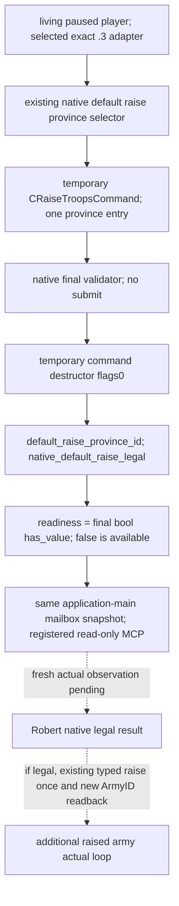

# 普通玩家默认集结的原生最终合法性（CK3 1.20.0.3）

2026-10-03，exact CK3 1.20.0.3 / Steam25652598；EXE SHA-256 `94B55397ABB687A3DCD436805A5D885E6BE90FA6C693FEB44A9E3BBEEADE02A6`。本增量只证明 `static-ready`，实机观察与追加动员均为0。

Robert29829当前已经拥有围城军 CUnit83886367。现有军 `maximum-current` 是缺员，不能当作未集结reserve；原版AI在已拥有部队时仍有追加征召分支。原生研究输入冻结于 [补员与再集结输入树](Z:/ck3_mod_rewrite_process_assets/g2-resume-20261003/army-reinforcement-raise/native-replenishment/NATIVE-TREE.md) 与 [研究方案](Z:/ck3_mod_rewrite_process_assets/g2-resume-20261003/army-reinforcement-raise/research-plan.json)。AI的need-more、reserve比例与实际retry时机尚未完整闭合，不因这些未知分支解散当前围城军。

现有 `ck3_raise_troops_default` 原生命令本身已经用最终validator，并在执行后通过新旧可控 ArmyID 的集合差观察新增军队。本增量去掉我方公开step中 `and not controllable` 的额外门槛，继续保留战争feature、原生最终validator和原有新ArmyID独立后置；无需解散已有Army。

新增 `ck3_query_player_default_raise_v1` 只读当前暂停帧的在世玩家。它复用 `ck3_12002_prewar_muster.cpp` 的临时命令读取路径，但新的actor-only入口不要求另一个defender、没有prewar语义、没有提交回调。选中 `.3` adapter借用其现有军事binding与WorldAccess；`.2` binding由原有已冻结的 exact `.3` ABI迁移链选择，不新增许可开关，也不重验旧全矩阵。

新query只返回当前默认地点与最终合法性，不冒充完整集结兵力、时间、供给或全部reserve。persistent CRegiment的未集结人数与owner全roster是另一路原生研究；MAA-only列表不能补造全levy数据。

验证一次覆盖：4个生产reader→serializer案例（已有军时native false/true、默认地点缺失、非暂停），`/O2 /W4 /WX` GREEN；一个真实registered MCP Client案例，`python -B -O` / 22项显式检查 GREEN。该MCP案例串起 production service→driver→primitive→protocol state→normalizer，保留原生false与true，已有CUnit83886367保持不变，fixture新增83886368仅被记为离线后置。fixture省份2610也不是实机默认集结地结论。

首次focused native attempt01缺5个隔离runtime链接边界，记harness RED并保留；attempt02显式提供不可调用的abort边界后，真实reader与serializer GREEN。这不是mailbox实机验收。full bridge/adapter集成编译与Robert当前paused query由Root执行。

可核验路径：[交付包](Z:/ck3_mod_rewrite_process_assets/g2-resume-20261003/army-reinforcement-raise/default-raise-query/ROOT-DELIVERY.json)、[native focused](Z:/ck3_mod_rewrite_process_assets/g2-resume-20261003/army-reinforcement-raise/default-raise-query/focused-native-02/RESULT.json)、[registered MCP focused](Z:/ck3_mod_rewrite_process_assets/g2-resume-20261003/army-reinforcement-raise/default-raise-query/registered-mcp-fixture/focused-mcp-01/RESULT.json)。游戏日、窗口、SDKsession、pipe、真实动作和Git增量均为0；Root负责合入、严格构建、实读及正常commit/push。
