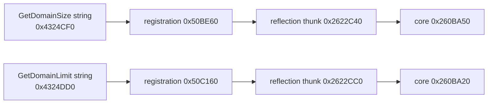

# CK3 1.19.0.6 玩家直辖规模与上限

## 状态与用途

- **[static-ready, live pending]** `campaign-root-context-v1` 现在发布
  `player_domain_size` 与 `player_domain_limit`，`ck3_query_turn_bundle_v1`
  将它们投影为 `realm_state.domain`。
- 两个值来自 CK3 `1.19.0.6` exact-build 的 `Character.GetDomainSize` 与
  `Character.GetDomainLimit` 原生实现；没有从 GUI 文本、存档或头衔数量猜测。
- 这是只读观测包。它不调整 planner 策略，因此本包没有新的原生 AI
  决策树；后续建设或授地策略必须另行完成 economy/domain 原生 AI 专题。
- 本包没有启动 CK3。production-live 状态只会在下一次本来就需要的 paused
  G2 会话中顺带互证，不为两个整数安排独立长跑。

冻结输入仍为 `Crusader Kings III/binaries/ck3.exe`，大小 `95,206,008`
bytes，SHA-256
`2D00FF3101EF70B566F2FCBAE292F09263199C80E9DC8F139B82D7D96F83DB86`。

## Exact-build 调用链

stock GUI 在 HUD 与人物窗口直接显示：

```text
[Character.GetDomainSize]/[Character.GetDomainLimit]
```

静态注册链为：



`0x260BA50(CCharacter*) -> int32` 从 `CCharacter+0x1B8` 的 landed state
取得当前个人头衔 ID span，并对每项调用原生计数谓词；返回通过谓词的总数。
这保留了 CK3 对“哪些头衔计入直辖规模”的当前实现，不在 bridge 中重写规则。

`0x260BA20(CCharacter*) -> int32` 读取 landed state 的当前上限值并执行
`max(value, 1)`。因此 available frame 要求 `domain_size >= 0` 且
`domain_limit >= 1`。

相邻 `GetDomainSizeWithGracePeriod` 的 core 是 `0x260BB00`。它从完整规模中
扣除仍处于 holding grace period 的数量；本次最低 capacity 切片没有发布它，
也不把普通规模误称为实际超限惩罚状态。

## Wire 与失败语义

available campaign-root frame 新增：

```json
{
  "player_domain_size": 6,
  "player_domain_limit": 7,
  "readiness": {"player_domain_ready": true},
  "provenance": {
    "domain_size_rva": "0x260BA50",
    "domain_limit_rva": "0x260BA20"
  }
}
```

两个 native 调用结束后，reader 重新通过完整 generation CharacterID storage
解析玩家对象。调用异常、非法负数/零上限或对象 generation 漂移都会使整帧返回
`player_domain_unavailable`。两个值还参加既有的同一 application-main paused
frame 双采样相等门，不会拼接跨帧结果。

turn bundle 发布的派生值为：

```json
{
  "realm_state": {
    "status": "available",
    "value": {
      "domain": {
        "status": "available",
        "value": {
          "size": 6,
          "limit": 7,
          "available_capacity": 1,
          "over_limit_by": 0
        },
        "unavailable_reason": null
      }
    }
  },
  "readiness": {"realm_domain_ready": true}
}
```

`available_capacity` 与 `over_limit_by` 分别截断到零，避免同一个状态由负数表达。
它们只是 size/limit 的确定性派生，不声称列出了 holdings、建筑、槽位、施工或
grace-period 惩罚状态。

## 聚焦验证

- MSVC Release reader 与 source-contract 两个原生 fixture GREEN；domain getter
  各执行两次，非法结果得到 typed unavailable。
- campaign-root、live-harness 与 turn-bundle 的 Python normal/optimized 聚焦测试
  各 `39/39` GREEN。
- Release DLL 大小 `2,637,824` bytes，SHA-256
  `ACCC5E9003845D41E39CA889DC34034F33DEB085BA9D46CC85FF6DF644CF7ED1`；
  27 个 candidate switch 全部为 OFF。
- 通用逆向工具 `find_xrefs.py` 现在识别任意 Capstone 解码的 x64 RIP-relative
  memory operand，并支持 `--source-rva-start/--source-rva-end` 有界扫描；本次用它
  复现了上述四条 registration/name 引用。

完整 M1 仍缺 health、council、faction 与 partition 观测，以及共享的两场景
paused live 验收。完整和平治理仍缺 holdings/buildings/construction 与相应动作、
策略和后置验证。
