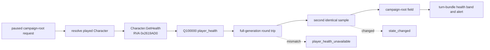

# Player health v1

## Current status

- **[static-confirmed + implementation-confirmed, live pending]** The exact
  CK3 `1.19.0.6` campaign-root reader now publishes the current player's
  signed Q100000 health as `player_health`.
- The field is sampled twice in the existing paused-frame transaction and the
  played Character pointer is generation-validated after each native call.
- `ck3_query_turn_bundle_v1` converts the raw value into a small strategy band
  and publishes `alerts.ruler_health_below_fine`.
- This package is read-only. It does not change health, choose treatment, or
  implement the later health-management policy.

## Frozen build and native chain

| Evidence | Exact value |
|---|---|
| Game version | `1.19.0.6` |
| `ck3.exe` size | `95,206,008` bytes |
| `ck3.exe` SHA-256 | `2D00FF3101EF70B566F2FCBAE292F09263199C80E9DC8F139B82D7D96F83DB86` |
| Reflection name | `Character.GetHealth` at RVA `0x4324C10` |
| Registration range | `0x509CB0..0x509E12` |
| Reflection thunk | `0x2622660..0x2622696` |
| Native evaluator | `0x2619AD0..0x2619B18` |
| Evaluator SHA-256 | `B6E3700766AD592A3E9B2C1F01D8AE9B8DA4774A6F009B5D30A0DA4380A89840` |
| Signature | `int64_t* __fastcall(void* character, int64_t* output)` |

The evaluator writes the signed fixed-point value to the caller's output
slot and returns that same slot. The bridge rejects the sample when the return
pointer differs, the player Character no longer resolves to the same full
generation ID, or the second sample differs from the first.

## Strategy threshold contract

The stock script values in
`game/common/script_values/00_basic_values.txt` define `fine_health=3`,
`poor_health=1`, `dying_health=0`, `death_chance_starts_health=3`, and
`death_chance_dying_health=1.5`. The first planner slice uses only two
decision-relevant cutoffs:

| Raw Q100000 | Band | Alert |
|---:|---|---|
| `<= 150000` | `dying_or_worse` | below fine; at or below the stock named dying-death-chance threshold |
| `150001..299999` | `below_fine` | below fine |
| `>= 300000` | `fine_or_better` | no low-health alert |

The bundle preserves the raw value alongside the band. These bands support a
minimum ruler-risk alert; they do not claim treatment choice, prognosis,
fertility, disease, injury, modifier attribution, or death probability.

## Focused verification and remaining proof

Native fixtures cover successful two-sample reads and typed health failure.
Python contract and turn-bundle fixtures cover available/unavailable shape,
provenance, malformed fixed-point input, all four cutoff boundary cases, and
the low-health alert. The focused native and Python suites are GREEN in normal
and optimized modes.

No CK3 process, recorder, injector, keyboard, mouse, or foreground window was
used for this package. The field remains `live=false` until it is read in the
next already-required bounded G2 paused session together with the other pending
campaign-root extensions; no dedicated long run is required.
