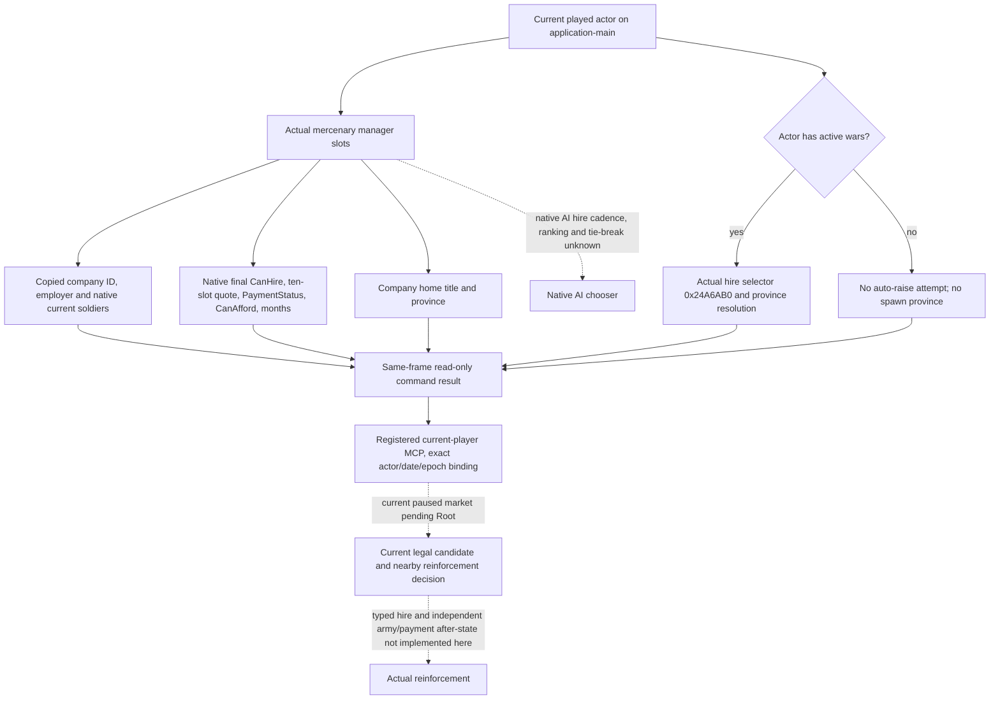
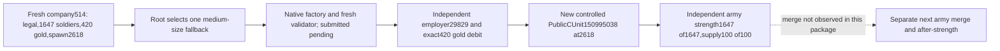

# Current player mercenary reinforcement context, exact 1.20.0.3

The new read-only `ck3_query_player_mercenary_context_v1(expected_revision)` copies the current player's world mercenary candidates, native final hire permission, all ten resource prices, native payment status, current soldiers, employer, company home and the actual native hire auto-raise selector. The immediate gameplay input is Robert 29829's defense of capital 2640. Root's latest saved ordinary-campaign baseline is calendar 4025 / raw date 53240928; this file-only work has advanced zero days and has observed no current mercenary market.

Exact build: CK3 **1.20.0.3**, Steam build **25652598**, executable SHA-256 **94B55397ABB687A3DCD436805A5D885E6BE90FA6C693FEB44A9E3BBEEADE02A6**. Current player / original ordinary campaign / episode `native-29829-2bc2d599f7f9` remains the runtime entrance. The query has no actor or company parameter and submits no hire command.

## Reused native tree and new closed inputs

The existing [war finance and hire tree](ck3-1.20.0.3-war-finance-and-hire.md) is the research starting point. The three new exact-build topics preserve the evidence and callable boundaries:

- [Candidate manager and real current soldiers](ck3-1.20.0.3-mercenary-candidates-native-query.md).
- [Final permission, quote, payment and contract duration](mercenary-final-hire-terms-native-query-12003.md).
- [Company home, actual auto-raise selector and command chain](mercenary-hire-spawn-selection-12003.md).

The company manager is `0x5D1DF08`, fallback `0x5D1DEF8`; live slots are copied on application-main. Generation-bearing company IDs, including legal zero, remain company IDs. They are never army IDs. Null/fallback slots are omitted; hired or unhireable companies remain observable rows. Native current soldiers calls `0x2625720`; the result is a plain signed soldier count, not a Q100000 value or nominal maximum.

For every real candidate, native mode 1 is passed to `CanHire 0x26242D0` and `PaymentStatus 0x2625470`. The independent quote is `0x26253B0`, retaining all ten signed raw Q100000 slots. Generic `CanAfford 0x310E710` is published independently. Payment status 0 means unaffordable, 1 native permitted debt, and 2 fully funded. A native permitted-debt row can have `CanHire=true` and generic `CanAfford=false`; the query retains this actual distinction. It does not invent a cash policy or convert native false permission into a free candidate. Literal temporary native reasons are copied before native string destruction. Contract months use `0x2625580`.

Company home is company `+0x24` title through title-province getter `0x230F900`. The actual active-war hire path uses `0x26247D0 → 0x2625AC0 → 0x24A6AB0(actor)`, then validated province resolution and `0x262606D → 0x2A96EA0`. `0x24A6AB0` chooses an actual usable rally point and falls back to capital only when none exists. The existing default-raise query uses a different selector and cannot stand in for this field. Home and actual hire auto-raise province are separate fields. When actor wars are empty, this query records no auto-raise attempt; it does not call the selector or fabricate a spawn province. A predicted selector result does not prove hire execution or army creation.

## Owner, lifecycle and failure meanings

The named executor `permitted_executor_player_mercenary_context12003` is registered at exact .3 startup and participates in the existing install, executor-presence admission, submit and uninstall lifecycle. It resolves the current played character in the existing query mailbox, builds the real title/province world bindings, copies leaves, and completes using the captured actor/date/epoch frame. No new feature flag or authorization gate is introduced.

Collection availability is independent from row leaf availability. An available empty manager is a real empty market. `current_soldiers=0` is a real observed zero. Native `can_hire=false` is a usable qualification outcome, not a transport failure. Failed home resolution preserves independently readable actual hire province and vice versa. A missing quote, payment or spawn input remains an explicit row failure and cannot be used to decide a concrete hire.

Protocol step: `query-player-mercenary-context-v1`; capability: `game.command.query-player-mercenary-context-v1`; inner schema: `ck3_12003_player_mercenary_context_v1`. The existing bridge revision remains required. Root performs one fresh paused query after the combined v46 build, using a same-frame public snapshot revision. The frozen query recipe is in external `war-mercenary-reinforcement-v45/delivery/MERCENARY-QUERY-CONFIG.json`.

## Evidence and readiness

External package root: `Z:/ck3_mod_rewrite_process_assets/g2-resume-20261003/war-mercenary-reinforcement-v45`.

- Candidate focused attempt 02 is GREEN; the complete genuine 226-byte current-soldier getter ran with declared external dependency stubs. Attempt 01's fixture signed-literal warning is retained.
- Final terms focused-native-01 is GREEN with three scenarios, 45 explicit checks, native reasons freed, and permitted debt preserved.
- Position focused fixture is GREEN with four new cases distinguishing home, actual spawn, peace and partial reads.
- Integration `focused-native-01` executes the actual candidate/context/final-terms/position readers and production wire serializer: one new scenario, 31 explicit checks, `/O2 /DNDEBUG /W4 /WX`, GREEN. Its genuine 2684-byte wire SHA-256 is `b75c067aa914d3d4a802515e8fa57a1b8e99efd31e966c3b6b6e3183c73de4e1`.
- Python `focused-mcp-01` consumes those unchanged wire bytes through the actual registered MCP, service, driver and normalizer: one new case, 16 explicit checks, `-O -B`, GREEN. The endpoint/hello/frame fixture remains synthetic and is not Robert live evidence.
- Four changed executor translation units compile GREEN against frozen `Z:/g47` source `7a0bef46588292d26c74716a39fe02b348d3ee65`. The initial old-g46 bridge C1061 is retained; only bridge and subsequently changed adapter translation units were recompiled against the actual baseline.

Readiness is **static-ready**. There have been zero game/SDK/window calls, zero days, zero hires/payments and zero army-gain credit from this worker package. The actual current market, a production-live query and a complete hire/army after-state loop remain pending Root. Native AI ranking remains an explicit research branch; it does not prevent reading the closed final player qualification inputs. No hire executor or strategy change is included.

## Production-live primitive: v46 current ordinary campaign, consumed 2026-10-04

The sole fresh paused query is external `runtime-preparation/v46/actual-sway-retention-mercenary-gathering-01/013-ck3_query_player_mercenary_context_v1.json`. Mercenary query and checkpoint calls are GREEN. The multi-domain batch is RED because a separate sway query returned RED; this is not a mercenary capability failure. Root reports the actual SDK47704 session normally closed. No query or game action was repeated by the file consumer.

Actual frame: current Robert **29829**, original episode `native-29829-2bc2d599f7f9`, raw date **53240928** / calendar **4025**, native revision **3**, public revision **2**, query sequence **1**, capture epoch **23172**, native hire mode **1**. Collection is available with **559** real company rows; all 559 final terms and native current strength reads are available. There are **33** native `CanHire=true` candidates, all 33 with `CanAfford=true`, payment status **2**, employer **null**, and **36** contract months. Every observed hire auto-raise selector is **2618**, with actor war count **3**. This is a native predicted active-war spawn input, not proof that any company was hired or army created.

Current saved-batch initial/final resources are equal: gold raw **106634828**, prestige raw **279109860**, piety raw **37383750**, all scale **100000**; i.e. gold **1066.34828**, prestige **2791.09860**, piety **373.83750**. The maximum current aggregate force candidate is company **286** with **2531** soldiers, **811** gold (raw `[81100000,0,0,0,0,0,0,0,0,0]`), home **2560**, actual predicted spawn **2618**. Company **289** exposes **2511** soldiers / **735** gold / home **2501**; company **48**, **2491** / **729** / home **4582**. The cheapest and highest aggregate soldiers-per-gold candidate is **297**, **837** soldiers / **202** gold (4.14356 soldiers/gold); middle-sized **514** is **1647** / **420**, and **294** is **1674** / **428**. These are declared factual comparisons, not the native AI winner or battle quality estimates.

All 33 candidates and all ten signed resource slots are retained in external `war-mercenary-reinforcement-v45/actual-v46/ACTUAL-RECEIPT.json`; the concise 33-row table is `CANDIDATE-TABLE.md`. The current query publishes aggregate native soldiers, not per-type regiment composition, damage/toughness, knight or commander quality; no such data is inferred from price or company ID. A hired result and a capital arrival before the deadline have not been observed.

The current checkpoint is saved at history **5509**, raw date **53240928**, **91443885** bytes, SHA-256 **7ded957a3c703ceb5bd5bd3515444c5c04d01de0594da1812a2ba99440fabafb**. The raw query artifact is **1948654** bytes, SHA-256 **0e65416298a95479eb7b81ee7cb64f6eef25b046d6f3e46f4656bb0871c66529**. Source packets and copied production body remain immutable evidence; consumer receipts add no days, hires, payments or army credit.

Readiness has advanced from initial **static-ready** to **production-live primitive** for this current-player mercenary observation. The next concrete dependency is the normal typed hire action plus independent employer/contract, wealth and player-army after-state. Root authorized file-only parallel implementation against frozen `Z:/g49`; it does not credit submitted/queued commands as actual hires. Native AI chooser scoring remains a separate tree branch, and current manager enumeration order is not a winner.

## Production-live loop: normal mercenary hire514, 2026-10-04

The normal hire loop is now observed in Root's original ordinary Robert29829 campaign, episode `native-29829-2bc2d599f7f9`, exact CK3 **1.20.0.3 / Steam25652598 / EXE SHA94B55397ABB687A3DCD436805A5D885E6BE90FA6C693FEB44A9E3BBEEADE02A6**. Root uses v47/g51/source1c/R24, gamePID32372 minimized, not foreground, no input. This is one hire with independent after-state; it does not claim army merging, capital relief, combat success or the complete autonomous war loop.

Fresh prehire observation at raw date **53241096**, calendar **4032**, native3/public2/capture17903 found company **514**: employer null, native `CanHire=true`, `CanAfford=true`, payment status **2**, quote `[42000000,0,0,0,0,0,0,0,0,0]` at scale100000, **1647** current company soldiers, **36 quoted new-hire months**, home title1586/province3664 and actual active-war auto-raise selector **2618**. Observed gold was **106634828/100000 =1066.34828**; before player PublicCUnit IDs were **167772189** and **83886367**. Root selected this one medium-size quantity/cost fallback; it is not the native AI winner or a composition-quality optimum.

Root's sole action batch `runtime-preparation/v47/actual-hire-514-01` is GREEN, SDK **33221** normally closed exit0, zero world days advanced. `004-ck3_hire_mercenary_v1.json` re-read actual company/actor and native terms at Submit; native command validation is observable and true. The action outer status is `submitted_verification_pending`, inner status `submitted`, command sequence1/native snapshot7/public2. Its `after_state_observed=false` remains unchanged: native queue AL is only submission evidence.

Independent `006-ck3_query_player_mercenary_context_v1.json`, native8/public3/capture74125, shows company514 employer **null→29829**, current company soldiers1647 and native `CanHire=false` with the already-hired reason. This observes the actual hire/contract association. Independent final snapshot `008` shows gold **106634828→64634828**, exact delta **−42000000/100000 =−420** gold, after balance **646.34828**; prestige and piety are unchanged. It also shows the sole new controlled player PublicCUnit **150995038**, owner29829, current province **2618**, regular/state1, not fighting or retreating, no move target and an empty route. Its core snapshot soldier field is null and was not replaced by the company's1647.

Root then obtained independent `runtime-preparation/v47/actual-post-hire-strength-plan-projection-01/004-ck3_query_army_strengths.json`, GREEN, SDK **22868** normally closed exit0, query sequence2/native10/public2. For actual PublicCUnit **150995038** the native CArmy reference is **201326610**; these are distinct IDs and only the PublicCUnit ID is supplied to player army commands. The query observes **1647/1647** current/max soldiers, **6** regiments, native AI base power raw **4594400000** at scale100000 (**45944**), supply **100/100**, monthly supply change **+20**, current attrition fraction **0**, and `not_gathering`. Three detailed persistent-regiment records are available (940,352,352); three first-record entries are unavailable. Those partial record leaves do not erase the independent full native current/max1647 aggregate and are not invented as observed unit types or quality.

The hire checkpoint `009-ck3_save_checkpoint.json` is saved at history **5545**, same date **53241096**, **91826468** bytes, SHA-256 **6efa2dfdde7e03530d6aa74fcc35351251533b072e8b58a4c61de7eae1f4fd28**. Sole file consumer sealed the exact pre/post and strength source pins in external `war-mercenary-hire-v46/actual-v47-hire514/ACTUAL-HIRE-514-RECEIPT.json`; it made zero SDK/game/window/Git calls and repeated no fixtures. The raw action ACK was never used as an employer, wallet or army observation.

Readiness is **production-live loop for normal mercenary hire only**: observe fresh terms → choose one company → native Submit → independently verify employer/actual payment/new controlled body/actual army strength. The 36-month field remains a new-hire quote, not actual remaining duration or expiry. No extra default raise, repeated hire, merged1770-force credit, rescue of capital2640, or battle win is claimed here; subsequent merge/movement receipts own their outcomes.

Root subsequently supplied the normal save paired with the independent strength capture: **history5550 / date53241096 / 91826468 bytes**, SHA-256 **cdcd3d5d388a63e5f80570d2cd6875ec19a1fa291f351b783aad2dbcaaa17401**. The hire checkpoint h5545 and this independent-strength checkpoint retain their separate frozen milestone roles. Cumulative saved progress remains4032, resume879 and Oct4+7; this normal hire loop and documentation increment add0 world days.

### 2026-10-05: company siege inventory source closure and same-query construction

For the current Robert29829 / war117440524 / P470 fort6 siege (Root-provided
M=.6105/K0), mercenary company composition can be observed before normal hire.
The already published manager query's same company+30/+3C roster contains
stride4 persistent Regi IDs, storage5D1EB68, not battlefield ArRg IDs. The normal
hire caller2625AC0 reaches2633E30: persistent Regi+118 points to GDbo; native tag
check4744624F at type+38 precedes copying that identical pointer to raised ArRg+18.
This new184B complete function has SHA
`5a578e9457009808e1faa3fcf2e0648243a705c79bc53887f87283bc4de7ac12`.
Read-only construction loads these fields and never calls the mutator.

Reuse canonical type key at GDbo+18 and the signed tier at+2A0 from the sealed
K247F185..192 chain, retaining observed0. Per-company effective current/max counts
follow the sealed2625720 seven-chunk formula and exclude holder knights; holder
from2626430 is distinct from employer+48. Add these values to the same existing
mercenary query row beside its actual normal CanHire/reasons, ten-slot price and
duration. Company inventory tier is separate from actual Province K and cannot
promise current siege gain or arrival. No current company candidate is invented.

Source tree, precise pins, failure branches and construction contract:
`Z:/ck3_mod_rewrite_process_assets/g2-resume-20261005/siege-mercenary-composition-sourcefirst/`.
The minimal samequery implementation is **static-ready**: one new production
reader/actual serializer case passes22 native checks; its unchanged emitted wire
passes21 checks through the registered MCP, existing service/native driver and
projected normalizer. Company0 is legal, observed tiers-1/0/2/nonGDbo-null survive,
holder differs from employer, and native568 equals regimental555 plus13 knights.
These are offline fixture values, not current company candidates. The first compile
harness RED is retained; fixing NOMINMAX and unsigned fixture constants left the
production reader unchanged. No old tests or full DLL were repeated. Root's g72
paused actual market observation remains the next step before normal hire.
This package performs zero game SDK/window/Git operations and adds zero game days.
