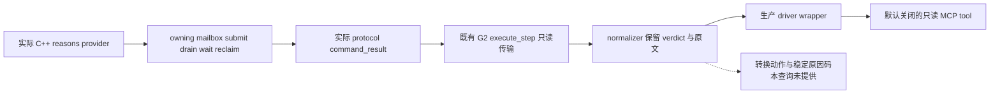

# 宗教转换原生原因文本：Python 只读传输

2026-10-01，CK3 1.20.0.2。宗教域已获项目所有者恢复研究授权；本增量没有使用游戏、进程、pipe、UI 或 Steam，也没有研究战争。

本传输接收 [原生原因 provider](ck3-1.20.0.2-religion-conversion-reasons.md) 与 [实际 owning mailbox 查询](ck3-1.20.0.2-religion-conversion-reasons-query.md) 输出的完整 `command_result`，保留 native paid validator 的布尔结果和当前语言文本。它与 [转换 terms](ck3-1.20.0.2-religion-conversion.md) 是独立查询：不修改旧 terms DTO，也不隐式追加另一轮 native 调用。

## 接口

- Python leaf：[player_religion_conversion_reasons_private_transport.py](../../ck3_autonomous_player/src/xar_autoplayer/bridge/player_religion_conversion_reasons_private_transport.py)。
- 生产 driver 入口：`query_player_religion_conversion_reasons_private_v1(expected_revision, target_rite_id)`。
- MCP 名称：`ck3_query_player_religion_conversion_reasons_v1`，只读；独立开关为 `--private-player-religion-conversion-reasons-query`，默认关闭。Python permission 为 `allow_private_player_religion_conversion_reasons_query`；原生查询仍使用既有 conversion source flag。
- native selector：`query-player-religion-conversion-reasons-v1`；domain 为 `player_religion_conversion_reasons_v1`；backend 为 `ck3-1.20.0.2-native-player-religion-conversion-reasons-v1`。
- 请求目标是 full unsigned 32-bit `target_rite_id`，保留高位 generation，0 是合法身份。played actor 来自 paused snapshot，请求没有任意 `character_id`。
- `expected_revision` 使用公共 snapshot 的 revision。既有 `g2_private_query_transport.py` 向原生发送同一 native revision 的 `expected_revision` / `expected_snapshot_revision` 两个 alias；MCP 不额外暴露第二个 revision 参数。

## 字段语义

DTO 为 `player_religion_conversion_reasons`，schema 为 `ck3_12002_religion_conversion_reasons_v1`。Python normalizer 保留 exact build、采集 epoch、日期、played character、当前 Rite 和目标 Rite 身份，再发布以下原生字段：

| 字段 | 语义 |
| --- | --- |
| `native_paid_validator_passes` | 原生 paid validator 的结果；读取失败为 `null`。不能代替包含入口差异判定的完整 `can_convert`。 |
| `native_blocker_text_available` | 原生 formatter 的文本是否成功读取；成功读取空字符串时仍为 `true`。 |
| `raw_native_text` | 原生当前语言原文，保留 markup、引号、控制字符和原有换行。 |
| `ui_blocker_text` | 原生 UI getter 语义的文本；需要的末尾 LF 已由 C++ producer 处理，Python 不再次添加或裁剪。 |
| `reason_codes_available` | 当前恒为 `false`；没有稳定的 machine-readable reason codes。 |

合法读取可以返回允许且无文本、允许且有文本、拒绝且有文本，或拒绝且无文本。Python 不根据文本是否为空推导 validator 结果，不把本地化句子解析为稳定原因码，也不新增转换动作或 `can_convert` 字段。native 查询本身不可用时，paid verdict 和两份文本保持 `null`；不可用原因保留原生值。

## 验收与边界

8 份 fixture 从 `artifacts/g2-offline-2026-10-01/religion-conversion/reasons-query/attempt-1/Od/wire` 按字节复制，没有补造 protocol metadata。C++ 首轮 `/Od` 与 `/O2` 各 59 checks GREEN，实际经过 providers、mailbox、wait/reclaim 与 protocol serializer；这是离线 fixture，native formatter 在夹具中使用替身，不能称为真实游戏文本实测。

Python 首轮叶层测试 **8/8 GREEN**，耗时 0.75 秒。实际场景为 SSO / heap 原生文本、允许空文本、允许有文本、拒绝空文本、目标 0、目标不可用和 native text 不可用。测试保留 capture epoch 与 snapshot revision 的区别、unsigned target identity、文本及 null，以及实际 request 的 native revision 双 alias。

2026-10-01 17:30:29–17:30:31（Asia/Shanghai），中央 Python owner 释放 source freeze 并登记生产 wrapper / MCP / CLI 后，单独执行新增官方 SDK 验证：**1/1 GREEN，1.56 秒**，没有重跑上述 8 项。它用实际完整 native packet 经过真实 `NativeProtocolState.ingest / wait`、生产 `NativeHeadlessGameplayDriver` wrapper 与官方 `mcp.Client`，验证默认关闭时 tool 不被发现、开启后的 `read_only_hint`、原生拒绝和原始 heap 文本完整传回，并确认 command_result 被消费。官方 SDK 结果在 `sdk-test-receipt.json`。

测试：[test_ck3_12002_player_religion_conversion_reasons_wire.py](../../ck3_autonomous_player/tests/unit/test_ck3_12002_player_religion_conversion_reasons_wire.py)。fixture 位于 `ck3_autonomous_player/tests/fixtures/native_12002/religion_conversion_reasons/`。Python artifact 为 `Z:\ck3_mod_rewrite\artifacts\g2-offline-2026-10-01\python-religion-conversion-reasons-next`，复制回执、source pins、测试日志和交付清单均在那里。

当前 leaf 与生产 Python SDK 接线均为 `static-ready`；真实游戏 formatter 与 paused frame 仍待实机验收。没有真实 paused frame 前，不提升为 live，也不改变 G2 完成数。共享 driver/MCP 的接线由中央 Python owner 负责，本包只提交独立 leaf、fixture、测试与专题，没有修改共享文件。
