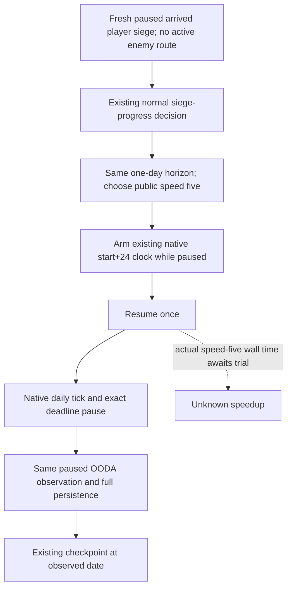

# Player siege speed-five trial with the existing native daily clock

This independent source candidate starts at
`f9820ecead8be1b9597f710bae34c7ab421136c6` in
`D:/gbs-player-siege-speed5-12004`. The current runtime remains Root's frozen
f982 SDK until its next paused checkpoint and serial SDK swap. Exact game
identity is the existing CK3 **1.20.0.4**, Steam **25734779**, EXE SHA-256
`98702F88A547CDE2EAF29A85F93B85F68EE4CF8148336A4F7AFAEB75319DD518`.
This source work performs no executable read/hash, project import, test, build,
SDK or game operation. Root owns the sole FIRST and actual trial.

## Existing native tree and concrete reason

Read the existing [native speed tree](battle-speed-control.md),
[exact-day clock](exact-day-native-clock-12004.md), and
[1.20.0.4 sentinel migration](default-manifest-sentinel-migration-12004.md)
before choosing this trial. Public speeds 1–5 execute the same native daily
movement/contact chain; speed five changes the wall-clock rate and is load
dependent. Python polling alone cannot guarantee an exact high-speed day.
The existing application-main daily sentinel arms a date-only
`mode-terminal-a-0` deadline before resume, then pauses at the same +24 target.
Its parser admits speeds 1–5; no new ABI or native command is needed.

Root's actual normal response
`D:/codex-ck3-background-spill/g2-live-20261010-r85-retry02/r0084-sdkba92-native60-hot03/operator/gameplay-responses/100-r0084-sdkf982-sustained-root03-000014-normal.json`
took **289.741968 seconds** end to end. Its existing fields show ordinary
`native_war_siege_progress`, `life-advance`, `player_siege`, speed **1**, and
raw **53289432 → 53289456**. Generation8 stopped after one daily tick with
`date_deadline`, zero overshoot, observed pause and no abnormal/terminal stop.
These retained facts are extracted in
`D:/codex-ck3-background-spill/life-advance-history-source/ACTUAL-EXISTING-PHASE-FIELDS.json`.
There are no per-phase timing fields. The 289.74s observation does **not** prove
that native waiting dominates persistence or planning and is not a controlled
benchmark. It motivates a small reversible speed trial without making that
attribution or promising a speedup.

## Minimal behavior change

Only `_life_advance_timeline_policy`'s existing `player_siege` return changes
from `(1, "player_siege")` to `(5, "player_siege")`. Existing player route,
combat/retreat, active assault, enemy route and bounded non-tactical branches
keep their previous selection. Siege classification, policy identity,
one-day horizon, readiness and normal OODA decisions remain unchanged.

`_execute_life_advance` already converts `player_siege` into the exact-day
path. With the qualified sentinel capabilities, it selects speed five, arms
the same start+24 deadline while paused, resumes once, accepts an already
paused next-day frame and queries the existing clock. Required generation,
date, tick, pause and zero-overshoot checks remain in that path. Complete
command persistence and checkpoint materialization are unchanged.

The pre-existing fallback for bridges without sentinel capabilities is not
rewritten. Its final +24 check is retained; high-speed sparse-frame success
for such an old bridge is **not** established. The intended current trial is
Root's Native60 bridge with the qualified clock capabilities. No new gate or
fallback policy is added here. Actual speed-five siege timing and behavior
remain unverified until Root's trial.

## One connected FIRST, prepared only

Reuse and update the existing meaningful registered node:

`ck3_autonomous_player/tests/unit/test_foreign_leader_siege_material_service_12004.py::test_normal_foreign_leader_contribution_advances_one_day_observes_and_saves`.

It retains the already qualified Native33 whole
`foreign_leader_own_eligible.json`, the real registered normal planner and
Service, real NativeDriver, independent rich paused siege observation and
isolated checkpoint materialization. The clock transport now reuses
`ClockProvider` from `test_exact_day_native_clock_paused_next_frame.py`; no
old clock test or native producer is replayed. That provider publishes only
the paused next day when armed and advances seven days if resumed unarmed.
The updated node requires speed five, arm-before-resume, exactly one resume,
one tick, zero overshoot, same clock generation, date deadline, the same Siege
ID with independently advanced work, complete persisted action result and a
checkpoint at the observed day. Its endpoint clock/work/save bytes are
synthetic; it proves connected code behavior and grants no production live,
game-day, capture or G2 completion credit. Two pre-existing Driver siege
fixtures receive matching speed-five expectations; Root need not replay them
for this focused FIRST.

Root's exact argv and external Oct10/W41 fields are in
`D:/codex-ck3-background-spill/player-siege-speed5-delivery/`. This lane is
**research/source-authored; FIRST NOTRUN**. Root will decide the actual SDK
swap after saving the current paused session and resolving its latest error.
