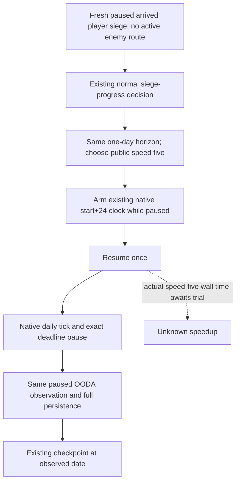

# Player siege speed-five trial with the existing native daily clock

This independent source candidate starts at
`f9820ecead8be1b9597f710bae34c7ab421136c6` in
`D:/gbs-player-siege-speed5-12004`. The current runtime remains Root's frozen
f982 SDK until its next paused checkpoint and serial SDK swap. Exact game
identity is the existing CK3 **1.20.0.4**, Steam **25734779**, EXE SHA-256
`98702F88A547CDE2EAF29A85F93B85F68EE4CF8148336A4F7AFAEB75319DD518`.
This source work performs no executable read/hash, project import, test, build,
SDK or game operation. Root owns the sole FIRST and actual trial.

## Existing native tree and concrete reason

Read the existing [native speed tree](battle-speed-control.md),
[exact-day clock](exact-day-native-clock-12004.md), and
[1.20.0.4 sentinel migration](default-manifest-sentinel-migration-12004.md)
before choosing this trial. Public speeds 1–5 execute the same native daily
movement/contact chain; speed five changes the wall-clock rate and is load
dependent. Python polling alone cannot guarantee an exact high-speed day.
The existing application-main daily sentinel arms a date-only
`mode-terminal-a-0` deadline before resume, then pauses at the same +24 target.
Its parser admits speeds 1–5; no new ABI or native command is needed.

Root's actual normal response
`D:/codex-ck3-background-spill/g2-live-20261010-r85-retry02/r0084-sdkba92-native60-hot03/operator/gameplay-responses/100-r0084-sdkf982-sustained-root03-000014-normal.json`
took **289.741968 seconds** end to end. Its existing fields show ordinary
`native_war_siege_progress`, `life-advance`, `player_siege`, speed **1**, and
raw **53289432 → 53289456**. Generation8 stopped after one daily tick with
`date_deadline`, zero overshoot, observed pause and no abnormal/terminal stop.
These retained facts are extracted in
`D:/codex-ck3-background-spill/life-advance-history-source/ACTUAL-EXISTING-PHASE-FIELDS.json`.
There are no per-phase timing fields. The 289.74s observation does **not** prove
that native waiting dominates persistence or planning and is not a controlled
benchmark. It motivates a small reversible speed trial without making that
attribution or promising a speedup.

## Minimal behavior change

Only `_life_advance_timeline_policy`'s existing `player_siege` return changes
from `(1, "player_siege")` to `(5, "player_siege")`. Existing player route,
combat/retreat, active assault, enemy route and bounded non-tactical branches
keep their previous selection. Siege classification, policy identity,
one-day horizon, readiness and normal OODA decisions remain unchanged.

`_execute_life_advance` already converts `player_siege` into the exact-day
path. With the qualified sentinel capabilities, it selects speed five, arms
the same start+24 deadline while paused, resumes once, accepts an already
paused next-day frame and queries the existing clock. Required generation,
date, tick, pause and zero-overshoot checks remain in that path. Complete
command persistence and checkpoint materialization are unchanged.

The pre-existing fallback for bridges without sentinel capabilities is not
rewritten. Its final +24 check is retained; high-speed sparse-frame success
for such an old bridge is **not** established. The intended current trial is
Root's Native60 bridge with the qualified clock capabilities. No new gate or
fallback policy is added here. Actual speed-five siege timing and behavior
remain unverified until Root's trial.

## One connected FIRST

Reuse and update the existing meaningful registered node:

`ck3_autonomous_player/tests/unit/test_foreign_leader_siege_material_service_12004.py::test_normal_foreign_leader_contribution_advances_one_day_observes_and_saves`.

It retains the already qualified Native33 whole
`foreign_leader_own_eligible.json`, the real registered normal planner and
Service, real NativeDriver, independent rich paused siege observation and
isolated checkpoint materialization. The clock transport now reuses
`ClockProvider` from `test_exact_day_native_clock_paused_next_frame.py`; no
old clock test or native producer is replayed. That provider publishes only
the paused next day when armed and advances seven days if resumed unarmed.
The updated node requires speed five, arm-before-resume, exactly one resume,
one tick, zero overshoot, same clock generation, date deadline, the same Siege
ID with independently advanced work, complete persisted action result and a
checkpoint at the observed day. Its endpoint clock/work/save bytes are
synthetic; it proves connected code behavior and grants no production live,
game-day, capture or G2 completion credit. Two pre-existing Driver siege
fixtures receive matching speed-five expectations; Root need not replay them
for this focused FIRST.

Root's exact argv and external Oct10/W41 fields are in
`D:/codex-ck3-background-spill/player-siege-speed5-delivery/`. Root will decide
the actual SDK swap after saving the current paused session and resolving its
latest error. The frozen author source is commit
`b6a2e12aa988269dfe403889a5b4e2ddfe066a08`; qualification below is a docs-only
child in `D:/gbs-player-siege-speed5-qualified-doc12004`, with no change to that
frozen source or the running SDK.

## Root's sole connected FIRST: GREEN, fixture only

Root executed the updated one connected node once. The authoritative receipt
is
`D:/codex-ck3-background-spill/player-siege-speed5-delivery/ROOT-FIRST01/ROOT-FIRST-RESULT.json`;
the complete 15,648-byte connected output is sibling
`CONNECTED-NORMAL-CLOCK-RESULT.json`. Receipt time is
**2026-10-09 22:37:05.982201 → 22:37:13.517440 UTC**
(Oct10 06:37:05.982201 → 06:37:13.517440 Asia/Shanghai), status **GREEN**,
exit **0**, one connected node, zero producer runs, no old qualification
replay and zero game operations. Its **7.535239s** is harness elapsed time,
not a measured game-day duration or a comparison with the actual 289.74s day.

The real registered normal planner chose `native_war_siege_progress` and
`life-advance`. The real Driver selected `player_siege` at speed **5**, then
issued exactly `set-speed-5`, arm **53288472 → 53288496** at speed5 in
`mode-terminal-a-0`, one `resume-map`, and status query. The provider published
only the next paused day. Armed/stopped generation was **37**; stopped clock
showed **1** daily tick, `date_deadline`, **0** overshoot and observed pause.
Requested and observed horizon were both **1 day**.

The retained Native33 input preserved Siege **318767193**, foreign stored
leadership, eligible own contribution and `matches_current_selection=false`.
The independently published paused frame reported synthetic work **100000**
on the same Siege with no occupation change. The full durable action-result
assertion passed. Real checkpoint materialization reported `saved` at raw
**53288496**, player **29829**, for a synthetic **51-byte** checkpoint file.

This qualifies the connected registered Service/Driver/native-clock protocol
and persistence behavior against the declared fixture. The native clock,
changed work and save bytes remain synthetic. Status is **fixture qualified**,
with **0 actual game days**, no capture or production-live credit. Actual
speed-five siege behavior, per-day wall time and speedup remain unknown until
Root's bounded actual trial. The source owner read each small result once,
retaining `ACTUAL-FIRST-THIN.json` and
`OCT10-W41-FIRST-GREEN-FIELDS.json` in the delivery folder; no new test,
project import, SDK, game or live query was performed in this documentation
step.

## First actual hot04 speed-five day: exact stop, still slow

Root's actual hot04 source5c48 normal003 response is
`D:/codex-ck3-background-spill/g2-live-20261010-r85-retry02/r0084-speed5-native60-hot04/operator/gameplay-responses/110-r0084-sdk5c48-bounded-normal-save01-chunk01-000003-normal.json`.
After Root notified completion, this observer read its 4096-byte header and
then the 325,932-byte response once to extract necessary result fields. The
thin projection is
`D:/codex-ck3-background-spill/player-siege-speed5-delivery/ACTUAL-HOT04-FIRST-LIFE-THIN.json`.
No additional SDK call, live query, Driver-file read, test or game operation
was performed. The prior absence check of an inferred directory was incorrect
and is explicitly invalidated in the external record; this actual result uses
Root's exact full path.

The registered normal turn executed `life-advance` in
`native_war_siege_progress` from **2026-10-09 22:56:14.073806 UTC** to
**23:01:11.185050 UTC**, **297.111244s** end to end. It selected
`player_siege`, public speed **5**, requested one day and observed raw
**53289504 → 53289528**, paused at `map_hud`. Exactly four commands were
reported: set-speed5, arm the start+24 date-only deadline at speed5, one resume
and status query. Armed/stopped generation was **11**; native stop showed one
daily tick, zero intermediate pauses, `date_deadline`, zero overshoot, pause
wrapper called and pause observed, with no terminal or abnormal stop.

This is actual evidence that the existing speed-five exact-day primitive
preserves its +24 paused contract in this normal siege turn. It is not proof
of a faster normal loop, capture or G2 completion. At Root's notification the
new day was **not yet saved**; this observer did not create a SAVE and claims
zero newly saved game days.

Existing per-phase timing fields remain absent. The old speed-one observation
and this speed-five observation used different SDKs and compilation load;
they are not a controlled benchmark. No speedup or engine-wait dominance is
claimed. The remaining roughly five-minute day justifies proposing bounded
reuse of `XAR_CK3_ARMY_TIMING_JSONL` for normal planning, native resume-to-paused
readback and complete persistence timings. That proposal is **not
implemented** here; it adds no profiling platform, polling or game call, and
Root chooses the minimal source work separately after preserving the current
paused session.
