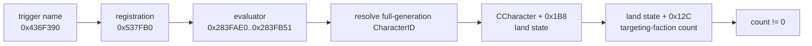

# CK3 1.19.0.6 player targeting-faction alert

## Status and purpose

- **[static-ready, live pending]** `campaign-root-context-v1` publishes
  `player_targeting_faction_count`.
- `ck3_query_turn_bundle_v1` derives a minimum realm alert from the exact
  count: `threatened = targeting_faction_count > 0`.
- This is a read-only observation package. It does not enumerate faction
  identities, types, members, power, discontent, deadlines or available
  responses, and it does not implement a faction policy.
- No GUI window is required. The reader consumes the same paused
  application-main frame and generation-valid played Character used by the
  existing campaign-root query.

The frozen input is `Crusader Kings III/binaries/ck3.exe`, version
`1.19.0.6`, size `95,206,008` bytes, SHA-256
`2D00FF3101EF70B566F2FCBAE292F09263199C80E9DC8F139B82D7D96F83DB86`.

## Exact-build evidence

The stock script trigger is described by the executable as:

```text
has_targeting_faction
Has the scope character a faction targeting him/her?
```

Its frozen chain is:



The evaluator span is `0x72` bytes and has SHA-256
`7A4C1EED3FF52B5573AD7598350DB3270954E38FB0F1CF872080851D4C00ECEE`.
It resolves a Character scope through the exact Character component storage,
reads `CCharacter+0x1B8`, then checks the signed count at
`land_state+0x12C`. If the land-state pointer is null, the stock evaluator
uses the zero-valued fallback at `0x4F66088+0x0C`; the bridge therefore
canonicalizes that exact case to count zero.

## Wire and failure behavior

An available campaign-root frame contains:

```json
{
  "player_targeting_faction_count": 2,
  "readiness": {
    "player_targeting_factions_ready": true
  },
  "provenance": {
    "has_targeting_faction_trigger_rva": "0x283FAE0"
  }
}
```

The count must be a nonnegative int32. After reading it, the reader resolves
the played Character through full-generation storage again. A failed memory
read, negative value or identity drift makes the whole atomic query typed
unavailable with `player_targeting_factions_unavailable`. The count also
participates in the existing two-sample equality gate.

The turn bundle projects:

```json
{
  "realm_state": {
    "value": {
      "faction_alert": {
        "status": "available",
        "value": {
          "targeting_faction_count": 2,
          "threatened": true
        },
        "unavailable_reason": null
      }
    }
  },
  "alerts": {
    "value": {
      "faction_threat": {
        "status": "available",
        "value": true,
        "unavailable_reason": null
      }
    }
  },
  "readiness": {
    "realm_faction_alert_ready": true
  }
}
```

This closes only the minimum “is any faction targeting the player?” alert.
Faction prioritization and response still require identity, type, power,
discontent and deadline observations plus a native-AI decision tree.

## Focused verification

- The MSVC Release reader fixture covers a positive count, the exact null
  land-state zero case, a negative-count typed failure and serialization.
- The source-contract fixture binds the evaluator RVA, offsets and executable
  span hash.
- The focused campaign-root, live-harness and turn-bundle Python suites pass
  in normal and optimized modes.
- Production-live promotion requires one bounded paused query in the next
  shared G2 session. It does not require a dedicated long run.
