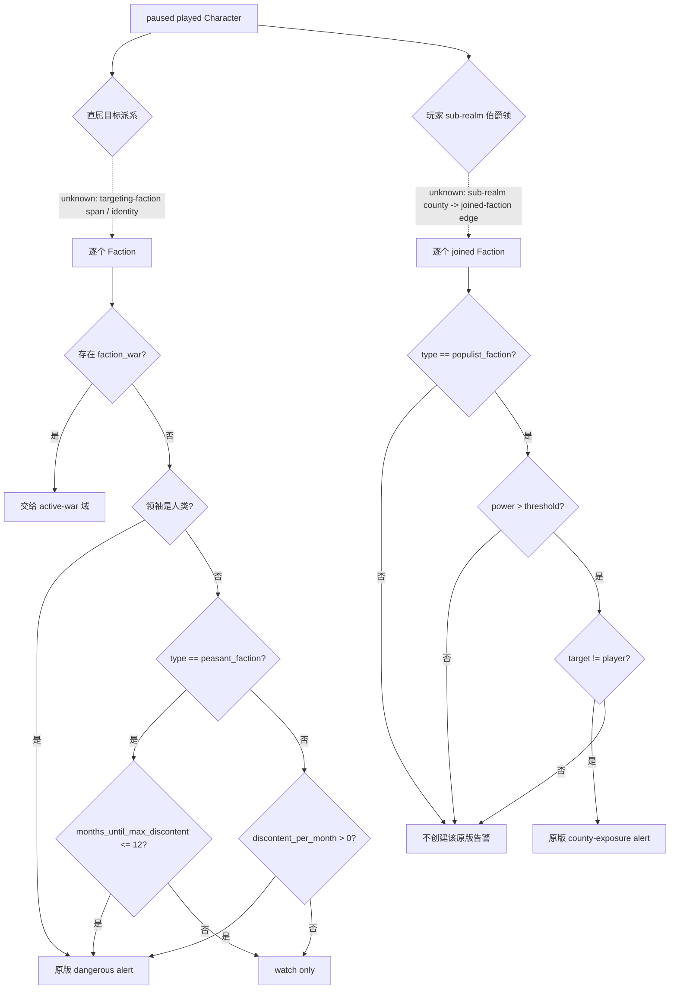

# CK3 1.19.0.6 玩家领地派系告警 v1

## 状态、目标与边界

- **原版决策树：static-confirmed。** 本文冻结 CK3 `1.19.0.6` 中两条会直接影响玩家领地生存的原版重要行动：派系直接针对玩家，以及玩家的伯爵领加入了针对上级领主的危险民粹派系。
- **现有最小计数：production-live primitive。** `campaign-root-context-v1` 已发布 `player_targeting_faction_count`，`ck3_query_turn_bundle_v1` 只把 `count > 0` 投影为布尔 `faction_threat`。这个计数不能说明哪个派系危险，也不能把危险成员交给治理 planner。
- **逐派系只读合同：research。** 本文定义下一项可施工的 `query-player-faction-alerts-v1` 最小输入和 planner 投影；尚未声称 bridge、MCP 或实机就绪。
- 这里只闭合告警和解释输入，不设计安抚、赠礼、逮捕、撤销、修改契约或内战操作。已经爆发的派系战争交给现有战争域。
- 本包不进入通用宗教域。民粹派系即使由信仰差异形成，也只以不透明 `faction_type_key` 和既成派系状态出现；不查询 faith、doctrine、tenet、fervor、改宗或宗教改革。

冻结输入为 `Crusader Kings III/binaries/ck3.exe`，版本 `1.19.0.6`，大小 `95,206,008` bytes，SHA-256
`2D00FF3101EF70B566F2FCBAE292F09263199C80E9DC8F139B82D7D96F83DB86`。

## 原版真正把什么算作危险

### 直接针对玩家的派系

`common/important_actions/00_realm_actions.txt:351-374` 的
`action_dangerous_faction_targeting_me` 遍历 `any_targeting_faction`。只有同时满足下列条件的行才创建告警：

1. `is_dangerous_faction_trigger = yes`；
2. `faction_war` 不存在。

`common/scripted_triggers/00_scripted_triggers.txt:196-211` 把第一项展开为三个并列分支：

- 派系领袖是人类玩家：始终危险；
- 类型严格等于 `peasant_faction`：`months_until_max_discontent <= 12` 时危险；
- 类型不是 `peasant_faction`：`discontent_per_month > 0` 时危险。

因此“有派系针对我”和“有危险派系针对我”不是同一个事实。`populist_faction`、`nomadic_faction`、
`escalated_peasant_faction` 以及 TGP 派系都走“非 `peasant_faction`”分支；不能按中文名称猜分支。

### 玩家作为封臣时的伯爵领暴露

`common/important_actions/00_realm_actions.txt:376-408` 另有
`action_county_in_dangerous_populist_faction`。它逐个检查玩家 `every_sub_realm_title`，并仅在下列条件同时成立时创建告警：

1. 头衔 tier 是 `county`；
2. 该头衔加入的派系类型是 `populist_faction`；
3. `faction_power > faction_power_threshold`，这里是严格大于；
4. 派系目标不是玩家本人。

这条分支证明，只有“针对玩家的派系列表”仍会漏掉真实 realm-survival 风险：玩家作为封臣时，自己的伯爵领可能被卷入针对上级领主的民粹派系。P0 查询必须覆盖这条暴露面，不能拿 `player_targeting_faction_count == 0` 当作领地完全安全。

### 原版树

实线是 exact-build stock script 已闭合的判断；虚线是 bridge 尚未闭合的 native 枚举或字段入口。



`has_targeting_faction` 的现有 exact-build evaluator 已闭合：注册链
`0x436F390 -> 0x537FB0 -> 0x283FAE0..0x283FB51`，最终读取
`CCharacter+0x1B8 -> land_state+0x12C` 的 signed count。函数体 `0x72` bytes，SHA-256
`7A4C1EED3FF52B5573AD7598350DB3270954E38FB0F1CF872080851D4C00ECEE`。它只能作为空集快捷判断和枚举后的计数一致性检查；
`land_state` 内目标派系 data pointer、element stride、完整 identity 与各项 getter 仍未冻结，不能从 `+0x12C` 邻近布局猜出来。

## 不满度、力量与最后通牒的可解释边界

`common/factions/_factions.info` 说明 faction type 的 `power_threshold` 决定不满度何时增长，
`ai_demand_chance` 每月检查一次。`common/defines/00_defines.txt:1079-1095` 固定：

- `DISCONTENT_THRESHOLD = 100`；
- 默认 `power_threshold = 80`；
- 派系在开始能够发送要求后，最迟 `MAX_DEMAND_DELAY_DAYS = 90` 的下一次更新会发送要求；
- 接受要求或输掉战争后有 `MONTHS_IDLE_DEMAND = 12`。

`common/defines/ai/00_ai.txt:1835-1839` 还定义 `DEMAND_EXTRA_THRESHOLD = 20`，其注释说明 AI 会等待力量与 demand total 超过 threshold 加该值。当前证据没有闭合 C++ 如何组合这几个量，故 P0 不输出“AI 将在某天必然发最后通牒”。

对使用 `common_discontent_progress_modifier` 的大多数派系，
`common/script_values/00_faction_values.txt:5,43-53` 与
`common/scripted_modifiers/00_faction_modifiers.txt:798-821` 给出：基础月增量 `+3`；力量低于阈值时再加 `-6`，净值 `-3`；
力量高于阈值时根据超额力量增加额外进度，额外值上限 `+10`。派系之间还会动态降低彼此的力量阈值：其他指定派系存在时 `-5`、超过其阈值时 `-10`、已经开战时 `-20`，总下调有 `-70` 下限
（`00_faction_modifiers.txt:677-796`）。因此 planner 必须读取引擎已经求值的当前 threshold 和月增量，不能硬编码 `80`。

特殊类型也不能套标准增量：

| internal type | 原版力量/不满度特征 | 对玩家的原版目标语义 |
|---|---|---|
| `peasant_faction` | threshold `0`；基础月增量 `2`；dangerous 使用“距满不满 12 个月” | 降低 county control |
| `nomadic_faction` | threshold `0`；月增量 `5` | 建立新的 nomad realms |
| `populist_faction` | 动态 threshold；标准增量并可受边境战争/王朝周期加速 | 从 liege 独立 |
| `escalated_peasant_faction` | threshold `0`；基础月增量 `2` | 从 liege 独立 |
| `independence_faction` | 动态 threshold；超过最低力量后 demand chance 随力量上升，目标正在作战时另加 `100` | 封臣独立 |
| `nation_fracturing_faction` | 与 independence 同类的力量与 demand 逻辑 | 摧毁 liege realm |
| `liberty_faction` | 动态 threshold；外部战争使 demand chance 减 `75` | 降低 crown authority |
| `claimant_faction` | 动态 threshold；claimant、special title 与 imprisonment 会改变有效性/demand | 为 special character 夺取 special title |
| `replace_ceremonial_regent_faction`、`restore_ceremonial_liege_faction`、`ceremonial_claimant_faction`、`imperial_policy_faction` | TGP 自己的 type 定义；除 ceremonial claimant 外，其基础 demand 模式更接近 liberty | 更换摄政/恢复礼制君主/拥立 claimant/改变 imperial policy |

上表只解释既成派系的 consequence class。它不预测某位封臣未来是否创建或加入派系；原版 `ai_create_score` / `ai_join_score` 还会读取 opinion、hooks、alliance、truce、dread、人格与各类型 blocker。最低告警先消费引擎已经形成的派系，避免在 P0 重写整个派系 AI。

## 最小只读查询合同

建议新增独立 capability / MCP tool：`game.command.query-player-faction-alerts-v1` /
`ck3_query_player_faction_alerts_v1`。它与 `campaign-root-context-v1` 在同一个 paused application-main frame 中绑定，但不扩张 campaign-root 的原子读取成本。

### 可直接复用的现有字段

| 现有字段/域 | P0 用法 | 不能替代的内容 |
|---|---|---|
| `snapshot_revision`、`date_raw`、paused/map-ready、`player_character_id` | 和 campaign root、turn bundle 做同帧 identity 绑定 | 不能证明 faction row 内部读取稳定 |
| `player_targeting_faction_count` | 零值快捷路径；非零时与新枚举行数严格相等 | 没有 identity、type、危险度、力量和成员 |
| `direct_landed_vassal_character_ids` | 把新 row 的 character members 标注为当前直属有地封臣 | 非所有 faction member 都必然在这个集合中 |
| `related_character_contexts` | 为已经枚举出的 leader/member ID 补主头衔、capital、liege 链 | 没有 opinion、is_ai、派系 membership 或军力 |
| `primary_title`、partition、domain、income、health、council | 上层 realm-survival planner 的并列风险输入 | 不参与原版 dangerous predicate |
| normalized `active_wars` | 校验/接管 `faction_war_id` 对应的已开战行 | 不能从普通 WarID 反推出未开战 faction |

### P0 必须新增的原始字段

```json
{
  "schema_version": 1,
  "status": "available",
  "snapshot_revision": 412,
  "date_raw": 53789952,
  "player_character_id": 32904,
  "targeting_faction_count": 2,
  "targeting_factions": [
    {
      "faction_id": 771,
      "faction_type_key": "independence_faction",
      "target_character_id": 32904,
      "leader_character_id": 33011,
      "leader_is_human": false,
      "special_character_id": null,
      "special_title_id": null,
      "faction_at_war": false,
      "faction_war_id": null,
      "power": {"raw": 9100000, "scale": 100000},
      "power_threshold": {"raw": 8000000, "scale": 100000},
      "discontent": {"raw": 6400000, "scale": 100000},
      "discontent_per_month": {"raw": 400000, "scale": 100000},
      "months_until_max_discontent": 9,
      "character_member_ids": [33011, 33012],
      "county_member_title_ids": [],
      "dangerous_by_stock_rule": true,
      "danger_reason": "non_peasant_discontent_increasing"
    }
  ],
  "county_exposures": [
    {
      "county_title_id": 441,
      "faction_id": 880,
      "faction_type_key": "populist_faction",
      "target_character_id": 32000,
      "power": {"raw": 8500000, "scale": 100000},
      "power_threshold": {"raw": 8000000, "scale": 100000},
      "dangerous_by_stock_rule": true,
      "danger_reason": "player_county_in_powerful_liege_targeting_populist_faction"
    }
  ],
  "planner_projection": {
    "status": "available",
    "present": true,
    "dangerous": true,
    "dangerous_faction_ids": [771],
    "watch_faction_ids": [],
    "war_handoff_faction_ids": [],
    "exposed_county_title_ids": [441],
    "exact_ultimatum_timing_ready": false
  },
  "readiness": {
    "identity_ready": true,
    "targeting_rows_ready": true,
    "county_exposure_ready": true,
    "stock_dangerous_predicate_ready": true,
    "same_frame_ready": true,
    "alert_ready": true,
    "exact_ultimatum_timing_ready": false
  },
  "unavailable_reason": null,
  "provenance": {
    "game_version": "1.19.0.6",
    "executable_sha256": "2D00FF3101EF70B566F2FCBAE292F09263199C80E9DC8F139B82D7D96F83DB86",
    "backend_id": "ck3-1.19.0.6-native-player-faction-alerts-v1"
  }
}
```

示例值不是实机 artifact。`faction_id` 表示待逆向的 full-generation 或等价 engine-stable identity；在该 identity 没有闭合前，不能用数组下标、type+leader 拼接或内存地址冒充跨帧 ID。

最低“可操作告警”所需字段比最低布尔值多，因为 planner 必须说明危险来自谁、影响哪些县、以及何时应转交战争域：

- `faction_type_key` 必须来自 engine 的 faction type identity，禁止按本地化名称推断；未知 mod type 保留原 key，并使用通用 stock dangerous 字段。
- `power`、`power_threshold`、`discontent`、`discontent_per_month` 必须读取引擎最终求值，不在 bridge 重放 scripted modifier。
- `months_until_max_discontent` 使用引擎结果；合法“当前不增长/无法到达”需要一个明确 nullable 语义，不能伪造为很大的月份。
- `leader_is_human` 是 stock dangerous 三分支的必要输入；`leader_character_id` 为空只允许原版合法无角色领袖的县民派系形态。
- `character_member_ids` 与 `county_member_title_ids` 全量、去重、稳定排序。它们让 planner 把危险派系关联回已有直属封臣和具体伯爵领；为空与读取失败必须区分。
- `special_character_id` / `special_title_id` 只在原版 faction type 提供时非空，尤其用于 claimant 解释；不为普通派系虚构值。
- `dangerous_by_stock_rule` 和 `danger_reason` 必须由上文冻结的原版树重算并与可逆向的 engine/GUI dangerous result 互证。只有一个来源可用时仍标注其来源，不把不一致吞掉。
- `faction_at_war=true` 的 row 保留在查询中并进入 `war_handoff_faction_ids`，但不进入直接告警的 `dangerous_faction_ids`；若有 WarID，必须和同帧 `active_wars` 一致。

### planner 可见结果

P0 完成后，planner 至少能区分三类结果：

| 结果 | 精确定义 | 下一域 |
|---|---|---|
| `watch` | targeting row 存在，但 stock dangerous predicate 为假且未开战 | 保持观察 |
| `dangerous` | 未开战 row 满足 stock dangerous predicate，或存在 stock county exposure | realm-survival 治理队列 |
| `war_handoff` | faction row 已有 `faction_war` | 现有 active-war / primary-defensive-war OODA |

`exact_ultimatum_timing_ready=false` 不阻止这三个结果成为真实可见的独立能力。它只禁止 planner 声称已知精确最后通牒日期。后续若闭合 AI demand eligibility、eligible-since 与 next update，再单独把该 readiness 置真。

为避免破坏 `ck3_query_turn_bundle_v1` 当前的布尔合同，第一阶段让 planner 直接消费新 capability。第二阶段再通过显式兼容变更，把现有
`realm_state.faction_alert` 的 `targeting_faction_count/threatened` 保留，并增加版本化 details component；`alerts.faction_threat` 仍保持布尔语义。

## 读取和失败语义

1. query 开始与结束重读 local PlayerID、full CharacterID、date、paused/map-ready；和 campaign root 使用相同 same-frame gate。
2. `player_targeting_faction_count == 0` 时仍须完成 county exposure 分支；它只允许跳过“直接针对玩家”枚举。
3. 非零 count 必须等于 `targeting_factions` 完整行数。identity 重复、type 缺失、非法 fixed point、成员 span 失败、第二次采样变化均使对应 component typed unavailable，不能发布截断数组。
4. `county_exposures` 是独立 component。它失败时可保留已经验证的 targeting rows，但顶层 `alert_ready=false`，并给出具体 `county_exposure_unavailable`；其他 campaign-root/turn-bundle 域不随之塌陷。
5. faction type 的合法 character/county member 空集必须和读取失败分开；mod 新增的未知 type 不能让整表崩溃。
6. 所有枚举在 application-main paused executor 中完成。不得从 factions GUI 文本/OCR 抓取，也不得让后台线程遍历 live engine containers。

## 下一步施工顺序

### P0：解除 realm-survival 告警 blocker

1. 逆向 `FactionsWindow.GetTargetingFactions` 或等价 engine service，冻结 targeting span、full identity、type identity 与生命周期；以已有 `land_state+0x12C` count 作为强一致性锚。
2. 逆向/复用 `Faction.IsAtWar`、leader/special/member lists，以及 GUI 已在 exact build 调用的 `FactionItem.GetPower`、`GetPowerThresholdPosition`、`IsDiscontentIncreasing`、`IsDiscontentAtMax` 与 `Faction.IsDangerous`。冻结 RVA、函数体 hash、输入对象类型和 fixed-point scale。
3. 闭合玩家 sub-realm county -> joined faction -> faction target 的第二条原版重要行动路径。
4. 实现 native reader、serializer、mailbox、Python contract/service/MCP 和上述 planner projection；先做全有/全无 fixture 与 normal/`-O` 双模式测试。
5. 做一次有界 paused live：至少一个无派系场景，以及一个能看到 targeting row 或 county exposure 的真实场景；无真实危险派系时不得用合成 fixture 冒充 production-live。

### P1：告警之后的响应输入

在 P0 有真实 row 后，再补 faction member 对玩家的 opinion breakdown、hook/alliance/truce、契约、可逮捕/可撤销的原生最终判定、双方可动员力量与治理动作结果。先更新相应原生互动树，再写 counter-policy。`ai_create_score` / `ai_join_score` 的未来预测也属于 P1，不阻塞 P0 对既成危险派系的观察。

### P2：精确最后通牒时间

逆向 C++ 对 `DEMAND_EXTRA_THRESHOLD`、当前 demand total、eligible-since、月更新和 90 天保证上限的组合。完成前只报告 stock dangerous 与距满不满，不提供“将在 N 天后发要求”的伪精度。

## 验收口径

- static fixture：无目标派系；一个 watch row；标准 dangerous row；`peasant_faction` 的 12/13 月边界；人类领袖；已开战 handoff；player-vassal county exposure；未知 mod type；各 span/identity/fixed-point failure。
- 同一 paused frame 中，枚举行数严格等于现有 `player_targeting_faction_count`，member/county ID 稳定排序且无重复。
- planner 只在相应 component readiness 为真时发布 `watch/dangerous/war_handoff`；exact ultimatum readiness 独立保持 false。
- live artifact 记录 exact EXE hash、DLL hash、query JSON、同帧 campaign root/active wars、进程与清理结果。一次有界实机足够；不为单个告警安排永久长跑。

## exact-build 证据账

| 文件 | SHA-256 | 本文使用的事实 |
|---|---|---|
| `common/factions/_factions.info` | `FB47457AABE7C7DF78555B4DFBA74B8932DAE468C45EBB2D1381CADDC2B7E019` | faction type 参数、scope、list 与每月 demand 说明 |
| `common/factions/00_factions.txt` | `0A47171476811DD16EBD44A7335EAEBD17376FD87E41290F72B5C6785365B276` | independence/liberty/claimant |
| `common/factions/00_nation_fracturing_faction.txt` | `3B74798124A3C97D5584147599CFDD983BD4B0F2634C4826AB63D1210146F8BD` | nation fracturing |
| `common/factions/00_nomadic_faction.txt` | `6D40BD40E560EEBB3F50748D90F4EFA9E797DD248C53A01FD3587F6EEE1B14AC` | nomadic threshold/progress |
| `common/factions/00_peasant_faction_new.txt` | `3B54AA8E610EC8F767B86F33F75A7D90A64FA199B0AC1AE37D59A476B4EC04E2` | peasant threshold/progress |
| `common/factions/00_populist_faction.txt` | `AA2686FD66B3CDA1B98CDC2CD5BEB81B9DE936886B52E3845E41798DC00C5D80` | populist/escalated peasant |
| `common/factions/10_tgp_factions.txt` | `7FCE5B0ADC88ABE5AE4F6CE7A1C30DC1DC727F513FC8B30862702794728B91D5` | TGP faction types |
| `common/script_values/00_faction_values.txt` | `4EE4098080B8C4536E74B047801F8715DD5EB0BCDCBAC04A8E3BF563D6555932` | base progress 与 extra-power 值 |
| `common/scripted_modifiers/00_faction_modifiers.txt` | `CD3DAA9DA33C3DFD15934CA30C1B2D7381E0B3968337BF52A7CBC2F9F2237102` | dynamic threshold 与 common progress |
| `common/scripted_triggers/00_scripted_triggers.txt` | `490C3784EE1555A49F7A4ADC9BAABB8522485F1AF6E1C837961E299A88695B5E` | `is_dangerous_faction_trigger` |
| `common/important_actions/00_realm_actions.txt` | `C1382FD5DFF09AB40BDB2BEE807D58DBF576877B87119F2F246DE9410CD2088D` | 两条玩家 realm alert |
| `common/defines/00_defines.txt` | `C1ECA141C71EC1E741CA5336E01BB538EEFAEC05B0684EDEC477CFC9053C3807` | discontent threshold、idle 与 max delay |
| `common/defines/ai/00_ai.txt` | `C78F9CD8DF9938CC9F38E817BCB6E32CD13720B5BD9DE077B85E3E1C6F030293` | AI demand extra threshold |
| `gui/window_factions.gui` | `798F177B1DB914B34CCE177D8CD29F336E182BC6BB24294BD46ECE7B27392770` | targeting datamodel、power/discontent/dangerous/war UI accessors |
