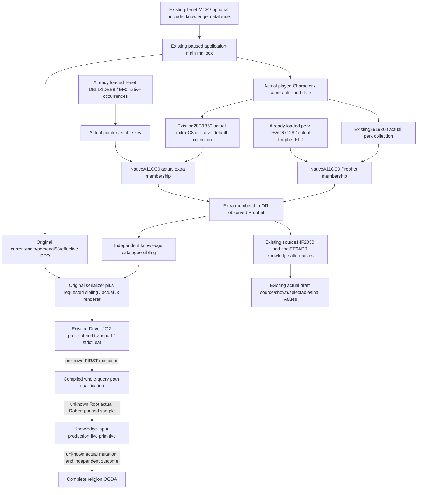

# Player Tenet knowledge catalogue without a draft — 1.20.0.3

Actual implementation start was **2026-10-07 00:00:06 Asia/Shanghai** (`2026-10-06T16:00:06Z`), after the October 6 external research draft. This is an October 7 / **2026-W41** source increment, not a retroactive October 6 early-meeting delivery. Integration base is `71b729f0cc4894331f1dadb89155920fccd42a00` in the exclusive `tenet-knowledge` worktree. Status is **research / source prepared / FIRST_NOTRUN**. Root owns the joint strict build, first native producer, sole consumer, actual Robert observation, canonical reports and commit/push.

Exact identity is CK3 **1.20.0.3 Crozier / Steam 25652598**, EXE SHA-256 `94B55397ABB687A3DCD436805A5D885E6BE90FA6C693FEB44A9E3BBEEADE02A6`, supplied by Root and the existing frozen intake. Religion and war are fully authorized; Robert **29829** in the original ordinary campaign remains the sole live entry. This source increment performs no game, SDK, pipe, process, build, tests or project imports.

## Existing native tree and concrete gap

The existing [current Tenet query](religion_doctrine12002_tenet_rows.md) already publishes current and Faith-main Core, personal **extension+88**, and the effective-state union including main Rite+788. [Target Rite/named Tenet comparison](target-rite-tenet-comparison-12003.md) gives explicit actual target and named states. [Full draft Tenet sources](religion_reform12002_tenet_sources.md) already publishes complete loaded sources, actor knowledge, actual shown/selectable and final selectable values for a visible draft. [Draft creation terms](religion-reform12003-current-draft-creation-terms.md) already covers the proposed divergence/new-Faith branch. These independent outputs are reused.

The full draft reader checks the actual current creation window first. An absent/hidden window yields `available=true`, `draft_observed=false`, `tenet_gates_complete=false`, `sources=[]` before the registry and actor knowledge are read. That empty array does not observe a complete empty actor collection. The old current query does not include **extra-C8**, Prophet or every loaded Tenet definition. The new catalogue makes those actual player inputs available before preparing a draft and for a fresh sample after a real Rite change, without constructing or opening a window.

The already frozen source filter `14F2030` consumes `Prophet OR extra-C8 membership OR actorFaithRaw24425B0 !=0`, after duplicate exclusion and before native shown at definition+658. The final `EE0AD0` gate consumes status!=5 and `(status!=0 OR extra-C8 OR Prophet)`, then shown+selectable at definition+4B8 on the actual draft TopScope. The new data observes only the extra-C8/Prophet alternatives. **Knowledge inputs complete is not final selectability, final create/edit legality, post-reform legality or action readiness.**

## Actual data sources and source evidence

| Field/input | Existing real native source | Boundary |
| --- | --- | --- |
| Played subject, date, owner epoch | Religion CoreBindings and existing paused owner envelope | No arbitrary actor request; capture epoch is not revision |
| Loaded definitions | Already initialized DB slot5D1DEB8, DB+EF0 data/capacity/count, stride8 | Preserve every real occurrence and native order; no authored fallback |
| Stable key | Existing `CopyTenetDefinitionKey12002` | Full key including `tenet_`; not a pointer or generation entity |
| Extra collection | `28B0B60(Character*)` | Character+1C8 present returns extension+C8; absent returns native default collection |
| Extra membership | `A11CC0(actualExtraCollection, &actualDefinitionPointer)` | Actual native bool, independent of personal88 and DoctrineE0 |
| Prophet definition | Already initialized perk DB slot5C67128, fixed pointer DB+EF0 | Do not invoke registry initialization getter |
| Perk collection | `2919360(Character*)` | Character+1B0 extension+220 or native default |
| Prophet membership | `A11CC0(actualPerksCollection, &actualFixedProphetPointer)` | Actual true/false, not a trait or authored guess |

The extra collection keeps its raw native name. It is not renamed to `known_character_tenets`, personal Tenets or permitted Tenets. The stock knowledge-filter/cleanup domain is separate: cached known-character-Tenet mutation references E0, whereas this candidate reads C8. No mutation or cleanup outcome is inferred from the array.

Existing `.3` [religion supplement comparison](Z:/ck3_mod_rewrite/artifacts/migrations/2026-10-02/abi-comparison/religion-supplement/religion_reform12002_tenet_sources_abi.comparison.json) has named PASS for **5 full spans / 52 referenced windows / 42 semantic anchors**, including the complete `2919360` body, the source filter and its call to `28B0B60`. The old `religion_doctrine12002_choices_abi.json` complete extra-getter body is not a named full-span result in this summary. Supplement choices/fullchoices comparison files also contain no full `28B0B60` callee span.

Root therefore authorized one bounded read of **`[28B0B60,28B0BFA)`, 154 bytes**, plus the smallest required mapping metadata. The actual first section entry was `.text`, VirtualAddress1000/PointerToRawData400, mapping this body to file offset **28AFF60**. The [actual capture receipt](Z:/ck3_mod_rewrite_process_assets/g2-parallel-20261006/faith-tenet/followup-research/observer-draft/implementation-20261007/source-capture/ACTUAL-EXTRA-TENET-12003-CAPTURE.json) records **48 metadata bytes +154 body bytes =202 new PE bytes /5 reads and seeks**, first section only, **hash0**, other callee/neighbor/image scan0. EXE identity/size reuse the frozen intake; no whole-image hash was computed.

The [full cached-hex equality receipt](Z:/ck3_mod_rewrite_process_assets/g2-parallel-20261006/faith-tenet/followup-research/observer-draft/implementation-20261007/source-capture/CACHED-HEX-EQUALITY-RECEIPT.json) confirms all **154 actual `.3` bytes** are identical to the complete cached `.2` instruction bytes. Only after equality is the cached instruction text reused. Actual `28B0B64` reads Character+1C8; its present branch `28B0B70` returns extension+C8; the absent branch `28B0B7B..28B0BF9` returns the native default collection, including its existing native static initialization path. It does not return current Rite Core. The getter body is now **static-confirmed for exact `.3`**; no other call target was read or executed.

The first cached-text regex expected an eight-character RVA, while the saved disassembly used nine characters, yielding zero parsed old bytes. That source harness parser RED remains in the original capture receipt and is not classified as a body difference or capability failure. The correction compared the already captured 154 bytes with old cached hex only: **new PE0/hash0**, full154 equality true. The capture is not repeated. Native collector/whole-query qualification and actual paused observation remain separate and NOTRUN.

Actual [execution provenance](Z:/ck3_mod_rewrite_process_assets/g2-parallel-20261006/faith-tenet/followup-research/observer-draft/implementation-20261007/EXECUTION-PROVENANCE.json) records `tools.exec_command` with outer `cmd.exe`, `login=false`, invoking the prohibited Windows shell; the full original argv remains in that evidence. The two file-only helpers used that shell and .NET rather than the prescribed Python helper convention: first the one PE capture, then only cached-body comparison. Parent/Root were informed of the actual executor. No history is rewritten through a second capture; future source helpers follow the authorized Python path.

The existing real `.3` [v32 Tenet packet](Z:/ck3_mod_rewrite/artifacts/g2-maintainer-2026-10-02/resume-12003/actual-v32-confession-permission-runtime-01/002-ck3_query_player_religion_tenets_v1.json) has actor29829/raw53236344/epoch81105/public2/native28, Rite152/main152/Faith23, two Core keys and personal empty. It validates the original query but contains no C8/Prophet/catalogue fields; no current value is filled from it. Historical [R9 full draft evidence](religion_reform12002_tenet_sources_live_r9.md) is `.2`, visible draft, 97 loaded sources, two extra-membership true and Prophet false. It remains that historical scope and is not today's `.3` non-draft observation.

## Request, native owner and additive result

`ck3_query_player_religion_tenets_v1` accepts **`include_knowledge_catalogue: bool = false`**. Native `ParsePlayerReligionTenetsKnowledgeRequest12003` uses the existing typed `JsonBooleanField`. Missing or false leaves new bindings/reader unused and adds no sibling. True requires exact `.3`, then appends **`player_tenet_knowledge_catalogue`**. Existing target/named parameters retain their pair contract and are independent; a single request may include both optional observations.

The existing `PlayerReligionTenetsMailboxContext12002` owns `include_knowledge_catalogue`, `knowledge_bindings` and `knowledge_catalogue`. Binding uses the existing TenetSources factory only to take actual DB globals and collection/membership callbacks. No current draft/window/source/filter/TopScope reader is called. The existing owner executes `ReadPlayedTenetKnowledgeCatalogue12003` and validates actual actor/date against the owning frame. Failed captures retain actual owner epoch/date/player; a new component failure does not rewrite old current results or independently successful target/named comparison.

The serializer appends requested siblings to the original current Tenet DTO. Outer status remains the original current observer's status. With the knowledge flag false, the original DTO path is unchanged. There is no new feature flag, permission, gateway, Service wrapper, game command or owning action queue.

## Nineteen-field schema

`ck3_12003_player_tenet_knowledge_catalogue_v1` contains exactly:

`schema`, `game_version`, `executable_sha256`, `scope`, `available`, `unavailable_reason`, `capture_epoch`, `date_raw`, `played_character_id`, `has_character_extension`, `extra_collection_source`, `extra_collection_complete`, `extra_tenet_keys`, `loaded_registry_complete`, `loaded_definition_count`, `native_has_prophet`, `knowledge_inputs_complete`, `knowledge_formula`, `rows`.

Scope is `actual_played_character_extra_c8_and_prophet_inputs`; formula is `extra_c8_membership_or_prophet_perk`. Each registry row has `source_index`, `tenet_key`, `native_extra_knowledge` and `knowledge`. The native producer computes the latter from the two actual booleans. Source indices/count and arrays preserve real order and duplicates. Extra collection provenance is `character_extension_c8` or `native_default_collection`; extension absence does not fabricate an empty collection. Actual empty collections and false booleans are complete observations.

An available catalogue has actual non-null fields, every real registry row, the actual extra keys and Prophet bool, all collection-complete flags true and `knowledge_inputs_complete=true`. Read failures retain actual owner metadata and a typed native failure string, leave dependent arrays/scalars null and completeness false. The schema must not be marked delivered through a permanently-null implementation.

The native leaf API is `ReadPlayedTenetKnowledgeCatalogue12003(const Bindings&, uint64_t epoch, Catalogue&)` and `SerializePlayedTenetKnowledgeCatalogue12003(const Catalogue&)`, in `xar::ck3_12003::religion::tenet_knowledge`. It reuses the actual collection callbacks/copier and existing paused reader pattern. The Python strict sibling lives in `player_tenet_knowledge_catalogue_12003.py`, reached through the same registered MCP → NativeDriver → real G2 transport/protocol. It preserves native booleans and arrays rather than inventing final legality.

## Sealed first seven complete wires and honest status

The new focused producer is `ck3_12003_player_tenet_knowledge_catalogue_mailbox_test.cpp`, target/CTest `xar_ck3_12003_player_tenet_knowledge_catalogue_mailbox_test`. It uses real new collector, existing owner mailbox/serializer and actual `.3` renderer with synthetic native callbacks. It reuses helpers without executing older fixture mains. The seven cases are:

1. No draft; C8 knowledge differs from personal88.
2. No draft; Prophet alone supplies the knowledge alternative.
3. Absent extension with an actual observed empty native default collection.
4. Native registry/extra duplicates and order, plus independently requested target/named sibling.
5. Actual complete empty loaded registry.
6. Missing actual Prophet definition while original current result remains available.
7. Missing/false knowledge request preserves the original bytes and causes zero new collector calls.

The sole Python compound reads those newly emitted complete command-result wires through `XAR_PLAYER_TENET_KNOWLEDGE_NATIVE_WIRE_DIR` and exercises the actual registered tool, Driver, protocol ingest/wait, transport and strict normalizer. Only fixture request-nonce correlation may change; no authored business DTO or normalized-row replacement is used. New build/native/consumer results are **NOTRUN** until Root's joint first qualification. Old target/named FIRST success is not this catalogue's first execution.

The first live acceptance condition is a fresh paused Robert29829 sample with no visible draft: actual full registry, complete actual C8 keys, real Prophet bool and `knowledge_inputs_complete=true`, with independent old observations retained. No game action, reform, time advance, follower conversion or post-state is scheduled by this package. Any future real reform requires its own final gates, typed action and independent outcomes before loop credit.

External records: [sealed draft and seven cases](Z:/ck3_mod_rewrite_process_assets/g2-parallel-20261006/faith-tenet/followup-research/observer-draft/ROOT-DELIVERY.json), [first bounded native plan](Z:/ck3_mod_rewrite_process_assets/g2-parallel-20261006/faith-tenet/followup-research/observer-draft/implementation-20261007/NATIVE-ABI-FIRST-PLAN.json), [metadata authorization plan](Z:/ck3_mod_rewrite_process_assets/g2-parallel-20261006/faith-tenet/followup-research/observer-draft/implementation-20261007/NATIVE-ABI-METADATA-AUTHORIZED-PLAN.json), [native source delivery](Z:/ck3_mod_rewrite_process_assets/g2-parallel-20261006/faith-tenet/followup-research/observer-draft/implementation-20261007/NATIVE-HOOKS-DELIVERY.json). Root merges the actual October7/W41 execution fields and eventual commit/push; this child does not edit central reports or run diff checks.
