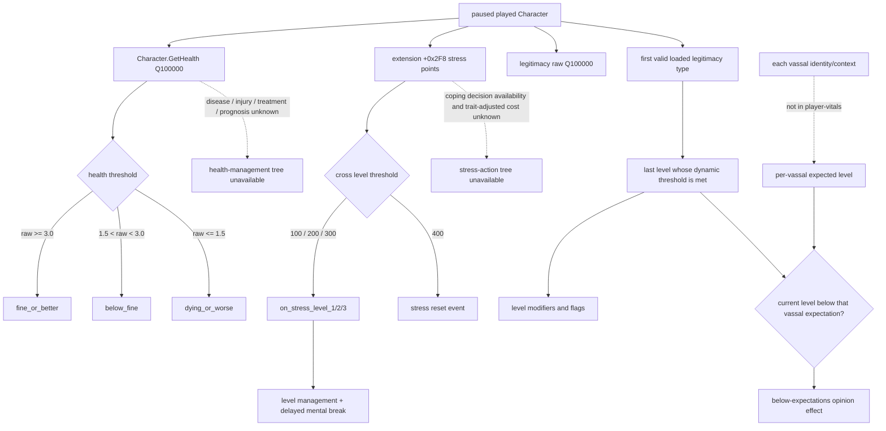

# CK3 1.19.0.6 玩家生命与正统性状态合同（player-vitals-v1）

## 结论与能力边界

本专题把现有健康、压力和正统性证据统一为 G2 realm-survival 的最低只读输入。它只冻结观测合同和 planner 可见结果，不新增写动作，也不把医疗、疾病、压力应对或正统性经营冒充成已经完成的 OODA。

| 分量 | 当前证据等级 | 已经能回答 | 仍不能回答 |
|---|---|---|---|
| `health` | **production-live primitive** | 当前玩家的 signed Q100000 health；`fine_or_better / below_fine / dying_or_worse`；是否低于 `fine_health` | 病因、伤病/疾病列表、治疗选择、死亡概率、预后和生育力 |
| `stress` | **production-live primitive** | 当前玩家的非负 stress points；是否达到第一个 100 点阈值 | 精确的下一次 mental-break 结果、trait 修正后的选项代价、应对 decision 可用性 |
| `legitimacy` | **exact-build static + read-only research-live；通用 ruler state absent** | exact getter/layout、合法零语义，以及战争退出研究帧中的当前 raw balance | 通用 paused snapshot 中的 active legitimacy type、current level；任何 vassal 的 expected level；稳定治理策略 |
| `xar.ck3.player-vitals/v1` 聚合 | **contract-frozen；尚未实现** | 规定三个分量的同帧形状、局部 readiness 和最低策略投影 | 在 legitimacy 分量补齐前不得写成 `vitals_ready=true` |

旧的 [玩家健康专题](player-health-v1.md) 和 [玩家压力专题](played-character-stress.md) 记录了各自实现时的 static-ready 边界。其后同一场 R639 bounded live 已同时命中 health 与 stress，因此本表是截至 2026-09-14 的统一能力状态。R639 只命中了健康正常、压力低于 100 的分支；低健康与高压力的数值边界仍只有 deterministic fixture/source 证据。

本合同绑定：

- CK3 `1.19.0.6 (Scribe)`；
- `ck3.exe` 大小 `95,206,008` bytes；
- `ck3.exe` SHA-256 `2D00FF3101EF70B566F2FCBAE292F09263199C80E9DC8F139B82D7D96F83DB86`。

## exact-build 证据账本

| 来源 | SHA-256 | 本合同采用的事实 |
|---|---|---|
| `game/common/script_values/00_basic_values.txt` | `9268A54F0E425D409D9D0F20D884E0A3D0A89DF85A0B6644D56133C0C4CB0096` | `fine_health=3`、`poor_health=1`、`dying_health=0`、`death_chance_dying_health=1.5` |
| `game/common/on_action/health_on_actions.txt` | `253988DA3E14BE7CC9B86CAB2A3C15843B0CB8B273B2B4BC391EB287AEF0C94C` | 年度 health pulse、四次 wounded recovery 机会，以及 health 对衰弱/伤害事件权重的参与 |
| `game/common/scripted_triggers/20_health_triggers.txt` | `7A40670167D8073B34F73AAA53387FC05DB4543D5BF1C10C5296967A4DE8F8F8` | 原版脚本对 fine/poor/dying health 命名阈值的消费 |
| `game/common/script_values/00_stress_values.txt` | `104A7EF94EE9DA1092F23AEB2FD9DC971B08C695415F3B7EBFB628F381D26395` | 100/200/300/400 点阈值和 stress change/impact authored 值 |
| `game/common/on_action/stress_on_actions.txt` | `35A9B8FC8FE6CDE91EAAD06F9C90AD6FCD41BEEFD317BFF77D3A68430E5DD839` | 进入 level 1/2/3 后触发 level 管理与延迟 mental break；level 4 触发 400 点 reset |
| `game/common/defines/00_defines.txt` | `C1ECA141C71EC1E741CA5336E01BB538EEFAEC05B0684EDEC477CFC9053C3807` | `MAX_STRESS_LEVEL=3` |
| `game/common/legitimacy/_legitimacy.info` | `D8E71FAE9CBCC446E30ACCB883981E5CA26A48096D455D55442E4B306439CD5F` | 玩家每日、AI 每年选择第一个 valid legitimacy type；每 type 有动态 level、flags 和 per-vassal expected level |
| `game/common/legitimacy/00_legitimacy.txt` | `9EA5377C4E400B9B37C11735EAB4C77A16E27A52F0A59DAAC8DAF09602C1529C` | count/duke/king/emperor/hegemon/mandate/nomadic/mandala 八种 loaded 定义及其不同阈值/效果 |
| `game/common/script_values/00_legitimacy_values.txt` | `13E43166356B5DD99358F435330B03CB9BE95AB5913280318B01681186E23A2E` | title tier 与 era 共同缩放普通阈值；expected level 依赖 vassal/liege 关系、权势、统治时长、亲属和 era |

### 健康读口与 live 证据

现有 `campaign-root-context-v1` 调用 reflection `Character.GetHealth` 的 exact native evaluator `0x2619AD0..0x2619B18`；该函数体 SHA-256 为 `B6E3700766AD592A3E9B2C1F01D8AE9B8DA4774A6F009B5D30A0DA4380A89840`。读口在 application-main paused transaction 中对玩家 full-generation CharacterID 做调用后回读，并对数值进行双采样。调用失败、generation 漂移或采样变化不能发布历史值。

R639 的单进程双场景 artifact：

- 路径：`Z:\ck3_mod_rewrite_process_assets\g2-m1-r639-700fae3\g2-m1-two-scene-live.json`；
- artifact SHA-256：`CFF681146A344AE18FDEB36C20BDAEAFC2A30344023CC7827E9A77006C3530DB`；
- bridge DLL SHA-256：`1F7DE4BCAF94959BF21E7AA110319B34D350CF8909178D9067235AD67968848E`；
- 同一 paused `date_raw=53178264` 中，CharacterID `29829` health 为 `460962/100000`，CharacterID `36108` 为 `431502/100000`；
- 两个 campaign root 与 turn bundle 均 `available/ready=true`，源存档 SHA-256 `9104CCB8AE9D5776166FBBAEDA9B43BD08CBAA2CB5C057332EB8B7A1A212CC63` 前后不变，cleanup proven。

因此 health scalar 与 `fine_or_better` 投影已经是 production-live。`<=150000` 和 `<300000` 分支仍是 source/fixture-confirmed；不需要为两个边界另开长跑，后续自然命中时再升级覆盖。

### 压力读口与 live 证据

通用 state snapshot 已使用现有 full-generation Character resolver，从 `CCharacter+0x1A8 -> extension+0x2F8` 读取 nonnegative `int32 stress_points`。extension 为空按现有 native getter 路径归一为合法零；负值使 snapshot 失败。该字段不是 stress level，也不是尚未发生的 mental-break 预测。

同一 R639 artifact 已在两场景分别发布：

- CharacterID `29829`：`stress_points=34`；
- CharacterID `36108`：`stress_points=0`；
- 两份 turn bundle 都有 `ruler_stress_alert_ready=true` 和可用的 `ruler_stress_at_or_above_100=false`。

因此 raw stress scalar 与 `<100` 分支已经是 production-live。`>=100` 的第一阈值由 exact source 和 deterministic fixtures 支持，但尚未由同一通用 state snapshot 的 production frame 命中；已有事件知识中的 stress 行也不能替代这个数值分支。

### 正统性读口与缺口

战争退出研究已冻结当前值的 exact path：

```text
generation-checked CCharacter
  -> CCharacter+0x1C0 legitimacy object
  -> object+0x28 signed Q100000
  -> max(raw, 0)
```

legitimacy object 为空时按原生 getter 语义发布合法 `0`，负 raw 同样 clamp 到 `0`。read-only research-live 帧曾读取 CharacterID `29829/36108/28180` 的 raw `32300000/31860000/73260000`。这证明了 exact pointer/value path 能在真实进程中工作，但它来自战争退出研究面，不能冒充通用 `state_snapshot`、`campaign-root-context-v1` 或 `turn-bundle-v1` 已有 legitimacy 字段。

raw balance 本身不足以判断“低于预期”。原版先从八种 legitimacy type 中选第一个 valid 定义，再按该 type 的动态 threshold 得出 current level；普通类型阈值还随最高头衔 tier 与文化 era 变化。`ai_expected_level` 的 root 是每个 vassal，`scope:liege` 才是玩家，因此同一 ruler 没有一个可脱离 vassal 身份发布的通用 expected-level 标量。v1 只要求 active type 与 current level；per-vassal expectation 应归入 faction/vassal 治理查询。

## 原版状态变化与 AI 消费边界

下面的树记录 exact source 能证明的输入关系。虚线分支是当前 bridge 未发布的数据，不得由 health、stress 或 raw legitimacy 猜测。



这不是一棵统一的 CK3 AI“生命管理算法”。health 和 stress 主要由 engine 状态、on_action 和各决议/事件的局部 `ai_will_do` 消费；legitimacy type 则明确区分玩家每日与 AI 每年刷新，并把 level flags 送给婚姻、联盟、派系、宣战成本等多个系统。我方应读取原生最终 type/level，不复制一套会随 DLC、government、tier 和 era 漂移的阈值求值器。

宗教域仍按项目约束暂缓。本合同不读取 faith/doctrine/tenet/fervor，也不以 health、stress 或 legitimacy 为入口扩展宗教策略。

## `xar.ck3.player-vitals/v1` 目标 wire

该 schema 是 `ck3_query_turn_bundle_v1` 中 `ruler_state.value.vitals` 的子合同，初版不再增加一次 native RPC。它复用 turn bundle 已有的 public/native revision、snapshot ID、date、paused 和 CharacterID 同帧绑定。为兼容既有 consumer，现有 `health_band` 与 `stress_points` 字段在迁移期保留；vitals 成为权威组合投影后再单独安排版本演进。

```json
{
  "schema": "xar.ck3.player-vitals/v1",
  "status": "partial",
  "binding": {
    "character_id": 32904,
    "snapshot_id": "native:2057",
    "snapshot_revision": 2057,
    "date_raw": 53789952
  },
  "health": {
    "status": "available",
    "value": {
      "raw": 275000,
      "scale": 100000,
      "band": "below_fine",
      "below_fine": true,
      "at_or_below_death_chance_dying": false
    },
    "unavailable_reason": null
  },
  "stress": {
    "status": "available",
    "value": {
      "points": 34,
      "at_or_above_first_break_threshold": false
    },
    "unavailable_reason": null
  },
  "legitimacy": {
    "status": "unavailable",
    "value": null,
    "unavailable_reason": "player_legitimacy_state_unavailable"
  },
  "readiness": {
    "identity_ready": true,
    "health_ready": true,
    "stress_ready": true,
    "legitimacy_balance_ready": false,
    "legitimacy_classification_ready": false,
    "vitals_ready": false
  }
}
```

实现 legitimacy 后，其 available value 必须至少是：

```json
{
  "raw": 32300000,
  "scale": 100000,
  "type_key": "mandate_legitimacy",
  "current_level": 4,
  "at_floor_level": false
}
```

示例只冻结形状，不声称 CharacterID `32904` 的真实 type/level。`type_key` 必须来自 engine 当前选中的 loaded identity，`current_level` 必须来自 engine 最终结果；不得从 primary-title tier、government key、磁盘文件顺序或 raw balance自行重算。若 engine 确认当前 ruler 没有 valid legitimacy type，使用 `status=not_applicable`、`value=null` 和 `unavailable_reason=no_applicable_legitimacy_type`，不能把它与合法 raw zero 混为一谈。

### 状态与 readiness

- full-generation CharacterID、public/native revision、snapshot ID、date 或 paused binding 不一致：顶层 `status=unavailable`，三个分量都不得拼接其它帧。
- identity 同帧且至少一个分量可用：顶层可为 `partial`；某一分量读失败只关闭本分量 readiness，不应删除其它已证实值。
- 三个分量都 `available`，或 legitimacy 被 engine 明确证明为 `not_applicable`：顶层 `status=available`。
- `health_ready` 只证明 raw、scale 和两个 frozen cutoff 的确定投影；不证明 treatment/death-risk。
- `stress_ready` 只证明 raw points 和 `>=100`；不证明 coping action 或下一事件结果。
- `legitimacy_balance_ready` 要求 raw/scale；`legitimacy_classification_ready` 还要求 active type/current level，或 engine-proven not-applicable。
- `vitals_ready` 是 identity、health、stress、legitimacy balance/classification 的合取。它不包含 succession、faction 或 council readiness。

## planner 可见结果

player-vitals 不直接发命令。realm-survival planner 只消费以下三个低损失信号，并与同一 turn bundle 的继承/派系状态组合：

| 输出 | 必要输入 | 确定语义 | readiness 不足时 |
|---|---|---|---|
| `succession_preparation_priority` | health band + primary heir/partition readiness | `dying_or_worse` 且 no-heir/split 为 `critical`；`below_fine` 且存在同类风险为 `elevated`；否则 `normal` | `unavailable`，不得把年龄或旧帧代入 |
| `avoid_discretionary_stress_gain` | stress points | `points >= 100` 时为 true；可用于事件候选已有 typed stress direction 的次级排序 | `unavailable`，不得把任意 “stress” 文案当效果 |
| `protect_legitimacy_floor` | legitimacy classification | `current_level == 0` 时为 true；只抑制有明确 negative legitimacy delta 的非必要动作 | `unavailable`，不得因 raw=0 自动判定 level 0 |

这些结果不等于完整策略。特别是：

- 低健康只能提高继承准备优先级，不能凭一个 health 数字自行选择治疗、辞任、停战或旅行；
- 高压力只能在效果已结构化、其它关键目标不冲突时影响排序；effect indicator 没有 magnitude 时不能计算精确 utility；
- legitimacy current level 不能替代每个 vassal 的 expected level，也不能自行承诺派系、婚姻或联盟接受度；这些需要对应原生 final evaluator 或治理域查询。

## 下一实现顺序与验收

1. **P0：补通用 legitimacy state。** 在既有 same-frame player reader 中读取 raw balance、engine-selected type key 和 engine current level；冻结 exact-build source/ABI，保留 full-generation identity 与双采样。不要先实现阈值重算器。
2. **P0：投影 player-vitals。** 在 `turn-bundle-v1` 中聚合 health、stress、legitimacy，增加分量 readiness；保留原字段兼容。公共 schema 变化落地时立即启动 open_kaishek 配套适配。
3. **P0：接 realm-survival planner。** 只实现上表三个可见信号，并用现有 succession readiness 形成联合优先级；不得把“读到数值”记作医疗或治理 OODA 完成。
4. **P1：一次共享 bounded live。** 在下一次本来就需要的 paused G2 场景中同时读取普通 legitimacy 和 celestial/mandate legitimacy（若场景自然可得），核对 type/level/raw 与 component-local failure。一个健康/压力/合法性字段都不安排永久长跑。
5. **P1：深度域按真实 blocker 追加。** 只有 planner 因病因/治疗或 vassal expectation 缺口无法作出高价值决策时，再分别施工 disease/treatment query 或 per-vassal legitimacy expectation；二者不阻塞 v1 raw/type/level 落地。

本工作包只新增本专题文档，不改变 native/MCP/schema/ABI/version/dependency，因此当前不触发 open_kaishek 代码适配，也不需要 CK3、桌面、DLL 或游戏文件操作。
