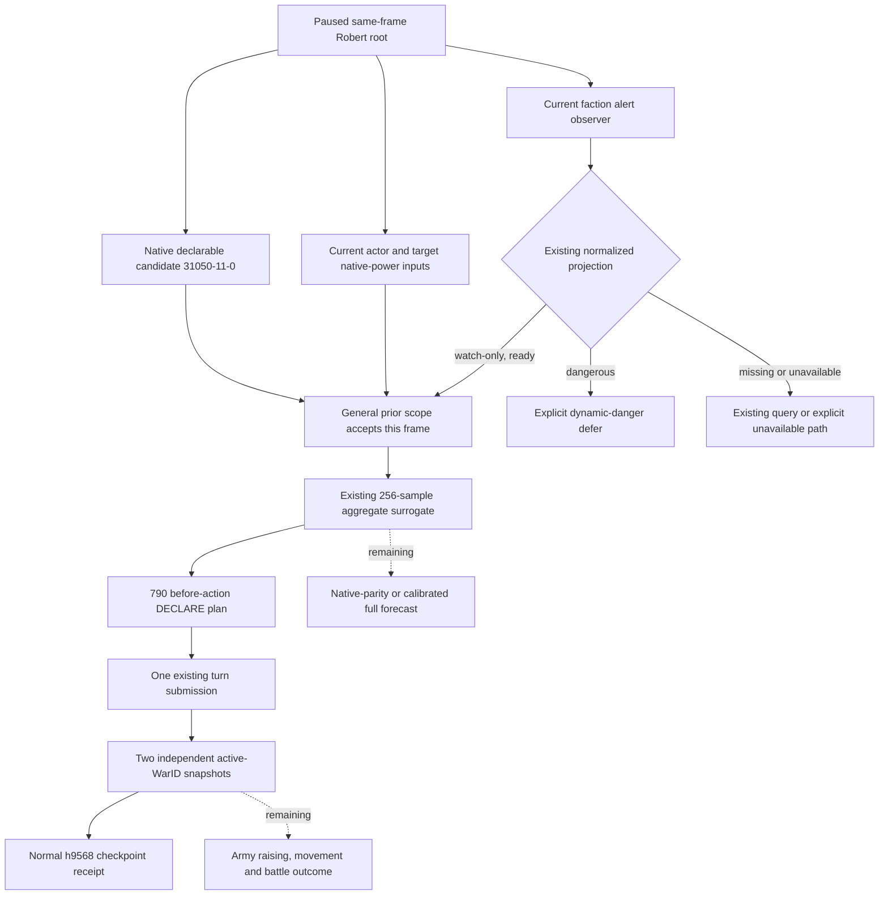

# CK3 1.20.0.3：派系 watch 与一般战争 prior 的输入范围

2026-10-06，source-first 方案及随后完成的有限消费者，当前 **static-ready**。一般战争 prior 已接入现有真实同帧告警，watch行不再因数量非零被统一排除；原生危险和不可用有独立说明。下文保留提案时的来源与缺口，新applicability及唯一测试见后两节。历史512的false不沿用到后帧，当前实机仍使用Root冻结旧planner，没有新增宣战或游戏日信用。

冻结源码为 700d0a79c53326ba1c99bc9cecde353104b0837e，独立 checkout Z:/gfp1。冻结 CK3 1.20.0.3／Steam25652598，EXE SHA-256 94B55397ABB687A3DCD436805A5D885E6BE90FA6C693FEB44A9E3BBEEADE02A6。复用 [exact .3 ABI reuse 合同](../../ck3_autonomous_player/native_bridge/research/ck3_1_20_0_3_abi_reuse.json) 的 war_entry 与 faction alerts／layout／metrics／county 四个 PASS 包；没有新 EXE 读取、hash、构建、测试或游戏操作。旧合同的 nonwar group 是迁移分类，不能恢复已撤销的战争授权限制。

## 实际问题与原生来源

[strategy.py](../../ck3_autonomous_player/src/xar_autoplayer/strategy.py) 的 same_frame_general_scope（冻结行14274–14287）将独立、feudal、domain 未超限、正 Q100000 收入与 player_targeting_faction_count==0 合为一个布尔值。故数量非零时只报告 independent_feudal_economic_scope，而没有消费既有危险/强度输入。已读到的 570-plan06、590-plan05 为合法 claim31050-11-0／claimant29829，双方 network0，native ratio31781／31330，唯一 blocker 是该复合 scope。550-plan09、630-plan24 实际是 alternative assessment，不把这些具体叶误记为 NO_DECLARE；同批其他阻塞由 Root 原记录汇总。

现有 [战争进入 ABI](../../ck3_autonomous_player/native_bridge/research/ck3_1_20_0_2_war_entry.json) 经 .3 reuse 固定：2C13460 解析 effective target；1A22D30 构造完整 State16；1A24010 分别以 actor filters1/1/1、target0/0/0 累计网络；1A23240 产出 distance、target total、actual ratio、双向 AI entries 与 flags。生产查询允许当前 declarable target 或 active-war opponent，并不依赖 campaign-root 的 targeting count==0。完整 AI 的 chance／offensive penalty／cooldown／hostage／CB评分／Top5 路径仍见 [战争原生树](war-declaration.md)；该文旧1.19地址不直接变成 .3 外层 AI 等价证明。本方案是已闭合输入上的最小我方策略，未声称复刻整棵原生宣战树。

派系 reader [ck3_12002_faction_alerts.cpp](../../ck3_autonomous_player/native_bridge/src/ck3_12002_faction_alerts.cpp) 在 exact .3 application-main 上复用原生身份与指标：Character+1C0 的 land+120／12C 给 full FactionID；storage5D1DE90／fallback5D1DE10 回查；Faction+20 的 definition 与+44领袖、两类成员分别复制。native2601EF0 给百分比点 power，26021A0 给当前动态 power threshold，Faction+28 给 discontent，2601B50 给最终月增长，2601C60 给月份，2603AB0 给 at-war。危险 native1D65BF0(faction,faction) 与源解释一致才发布。当前规则为人类领袖，或 peasant 的 months≤12，或非peasant 的月增长>0；已有 faction war 另交 war handoff。县领 exposure 用 populist、power>动态threshold、target!=player，见 [指标树](ck3-1.20.0.2-faction-metrics.md) 与 [完整来源](ck3-1.20.0.2-faction-alerts.md)。

~~~mermaid
flowchart TD
  L[exact .3 current legal declaration] --> E[2C13460 effective target]
  E --> S[1A22D30 State16 + 1A24010 actor and target networks]
  S --> P[1A23240 native power assessment]
  R[current player full ID] --> F[land120/12C full FactionIDs and storage]
  F --> M[2601EF0 power + 26021A0 dynamic threshold + growth/months]
  F --> D[1D65BF0 current stock dangerous rule]
  D --> H{human leader?}
  H -->|yes| Y[dangerous]
  H -->|no| T{peasant?}
  T -->|yes| Q{native months <= 12?}
  T -->|no| G{native monthly growth > 0?}
  Q -->|yes| Y
  G -->|yes| Y
  Q -->|no| W[watch]
  G -->|no| W
  M --> A[existing ready normalized faction query]
  Y --> A
  W --> A
  A --> C[same frame with campaign root and current declaration]
  P --> C
  C --> B[proposed: watch count > 0 may enter existing aggregate prior]
  B --> O[existing conservative prior admission and typed outcome]
  C -. unknown future faction growth / depleted-force reaction .-> U[remaining strategy quality gap]
  O -. unavailable declaration-bound regiment/arrival inputs .-> V[complete prewar battle forecast remains partial]
~~~

## 现有 MCP 输入已经足够

query-player-faction-alerts-v1／ck3_query_player_faction_alerts_v1 已发布。其 [normalizer](../../ck3_autonomous_player/src/xar_autoplayer/bridge/player_faction_alerts_contract.py) 校验 full IDs、target为玩家、实际 count/rows一致、danger解释与native结果一致，并导出 dangerous/watch/war_handoff/exposed_county。readiness.alert_ready 由现有四个组件得出，exact_ultimatum_timing_ready=false；这不是等待精确 ultimatum 才能使用 watch 的理由。县领或 surrender_impact 的独立不可用不应被误当作 targeting row 的合法空值；本最小方案直接消费现有已可用 planner_projection，不扩大合同。

[native_driver.py](../../ck3_autonomous_player/src/xar_autoplayer/bridge/native_driver.py) 的查询结果含 queried_snapshot_id／queried_revision／queried_native_revision；[service.py](../../ck3_autonomous_player/src/xar_autoplayer/bridge/service.py) 同时发布 source／binding 中的 snapshot_id、revision、native_revision、date_raw及paused。先复用生产成功的 normalized payload，再按现有 strategy 的 same-frame recovery 方式从 snapshot／成功 command history 取当前叶。比较 player full ID、date_raw、native revision，以及已有 envelope 当前 snapshot／public revision；不把历史512或上一次查询沿用到日期推进后。无新 DTO、RVA、native collector、MCP、pipe 或 DLL 依赖。

历史 [512 faction packet](Z:/ck3_mod_rewrite_process_assets/g2-resume-20261006/gameplay-responses/512-peace-current-faction-alerts.json) 绑定 native845/public846/raw53271912：targeting2、alert_ready=true、planner dangerous=false，两个非peasant均 growth−3/月。33554465 populist 的 power17.866%、threshold75%、discontent4；50331692 liberty 的 power19.591%、threshold75%、discontent0；两个 months0 是负增长的合法结果，不表示马上 demand。它与 [508 root](Z:/ck3_mod_rewrite_process_assets/g2-resume-20261006/gameplay-responses/508-campaign-root-after-war.json) 的 native844 不是同一帧；只证明 provider 与 watch事实曾真实可用，不合成当前策略输入，也不证明后来550/570/590/630的危险值。

## 最小 owned 实现计划

1. 只改 strategy.py 的一般战争分支及两个小 helper：恢复当前成功 faction-alert 叶；把已有经济条件与派系风险说明分开。既有 count0 路径维持当前行为。非零且暂无同帧叶时先选现有 query-player-faction-alerts-v1，取得数据后在同帧重新选择；不再反复把存在派系当作经济失败。历史窄 claim／de-jure canary无需一起扩张。
2. 非零且现有 ready planner_projection.dangerous=false 时，记录 watch IDs、每行 power/threshold/discontent/growth/months，进入已有 general-native-war-entry-battle-prior-v1。当前dangerous分支使用现有延期/治理选择并明确实际原因；at-war继续现有战争路径。使用原生final危险值，power与动态threshold作为真实质量输入/解释，不新增固定75/80阈值、不把不同派系百分比加成敌军人数或新风险预算。
3. 现有 _forecast_required_war_entry_plan 直接运行 forecast_prewar_power_battle：256 trials、120日、uncalibrated aggregate surrogate。其既有 admission 是 Wilson lower≥0.95 且 unresolved≤5%；可返回现有 typed DECLARE，也可 NO_DECLARE。数量替换因此影响现有整体选择，不能说仅多读一次输入或自身保证宣战成功。该提议没有新增自动宣战授权门。
4. 这一步解除的是现有 aggregate prior 的输入范围。prewar_scope_contract 仍 advertised=false，declaration-bound regiment-v3／arrival输入另缺；required_capabilities 中的名字不代表查询已可用。不能据此发布 prewar native parity、完整battle forecast、完整OODA或live信用。
5. 源树和新 actual same-frame pair封存后，再写一个新的 focused production planner case：同帧count2/watch进入aggregate evaluation；保持危险/缺叶路径的实际选择并验证old512不被消费。只执行这一个必要case一次，不重跑旧war-entry矩阵。提案阶段测试执行0，策略修改0；随后施工及首次结果见下节。

提案封存时新同帧applicability尚未取得，方案提交d5335e13仅research，Root已采用为d675。完整人物准备、Entry、未来派系危机／军力耗减后的反应、长期战争策略仍是质量缺口，不因此阻断已有可用aggregate模型施工。

## 新同帧 applicability 与授权施工输入

Root随后提供 [673 campaign-root](Z:/ck3_mod_rewrite_process_assets/g2-resume-20261006/gameplay-responses/673-current-campaign-root.json) 与 [674 faction alerts](Z:/ck3_mod_rewrite_process_assets/g2-resume-20261006/gameplay-responses/674-current-faction-alerts.json)，二者的 source/binding 均为 paused native:1001／public1002／raw53286000／player29829。Root的gameplay继续使用冻结旧planner；此后台实现不热应用。

实际root independent=true、feudal、domain5/6、income528566/Q100000、targeting2。两个非peasant均 stock危险false、at-warfalse、discontent0、growth−300000/Q100000；populist33554465 power3304900／threshold7500000，liberty50331692 power3879200／threshold7500000。完整alert现有readiness除精确ultimatum外均true，planner watch两ID、dangerous=false。surrender_impact独立不可用不影响该watch输入。本帧闭合当前watch applicability，允许按上列最小计划接线；它不预测宣战后动员/耗损导致的阈值或增长变化。

聚焦fixture只保留这两个实际包的必要frame/root字段与完整已发布faction结果；宣战候选和军力assessment另标synthetic，不能把测试的typed选择当作此实机曾宣战。先封存本段实际来源，再修改策略和写唯一新复合case。

## 有限消费者与唯一新验证

strategy.py新增同帧恢复与派系说明两个helper。它复用既有生产normalizer、command/auto-turn result形状及查询envelope身份；不把旧revision/date或public查询绑定当当前。一般branch把经济条件与派系说明分开：count0保留原行为；count>0的当前ready watch进入既有aggregate prior；当前dangerous保留stock理由并延期。缺同帧叶先选择已存在的query；当前部分不可用则保留组件说明并使用现有bounded defer，不在同帧反复查询。当前查询step不可用时仍给出明确current_faction_alert_unavailable，而不冒称经济失败。

输出war_entry_faction_context记录当前stage/frame、watch/danger/war-handoff/县exposure ID及每行原生power/动态threshold/discontent/growth/months。没有新增固定派系阈值、风险预算、native/schema/serializer/permit，也没有改旧窄canary或prewar模型公式。

[唯一新复合case](../../ck3_autonomous_player/tests/unit/test_war_entry_faction_watch_scope_12003.py) 首次 **1/1 GREEN**，unittest0.015s／完整wall2.6610141s。它使用 [673/674必要实际字段fixture](../../ck3_autonomous_player/tests/fixtures/faction_watch_current_673_674.json)，完整经过现有faction normalizer→同帧history恢复→production choose_one_life_turn→existing aggregate prior。实际watch输入＋明确synthetic4:1军力的返回是既有typed DECLARE选择；synthetic边际军力仍NO_DECLARE。changed native danger、缺叶、旧native845/public846叶、当前county组件部分不可用与query不可用均保持明确已有延期/观测路径。所有这些是静态合成决策，无实机宣战/后态信用，完整regiment-v3仍未发布。

首次receipt位于外置consumer-first-case-attempt01/RESULT.json与stderr.txt，旧case/wire重跑0、测试retry0、nativebuild0、EXE新读0、SDK/pipe/game/UI/runtime操作0。隔离checkout曾有tracked静态兼容性registry为skip-worktree，施工前仅从本checkout相同HEAD materialize其src，让生产import可用；未改其代码、未触碰Root/runtime，未产生测试harness RED。本包只授该有限Python消费者static-ready；采用后新进程实际planner、宣战/战争结果由Root另行验证和计账。

外置字段与封存来源：Z:/ck3_mod_rewrite_process_assets/g2-background-20261006/faction-battle-prior-scope/。Root合并当天/W41，不编辑shared reports、g78或gb0。

## First actual watch-aware declaration (2026-10-06)

## Result and qualification

The Root-run g79 / source715 / R0048 / v74 session used the adopted watch consumer (`30c`, originally `2536ca89283413b0f77a1f6603d04b6f4283c986`). At raw date `53287920` / campaign day `5983`, the existing planner accepted two current watch-only targeting factions into its existing general battle prior and proposed `DECLARE` for native declaration `31050-11-0`: `claim_cb`, actor/claimant Robert `29829`, target title `2132`. The existing turn submitted that declaration once and finished at `2026-10-05T23:56:29.294684Z` (`2026-10-06 07:56:29.294684 Asia/Shanghai`). Two independent saved post-action snapshots confirmed active WarID `100663329`, Robert as primary attacker, primary opponent `31050`, targeted title `2132` and objective provinces `2606/2608`. The player army list was empty and player war score was zero.

This establishes the **first actual watch-aware declaration production-live primitive**. It does not establish a battle win, army raising or movement, a calibrated battle forecast, native AI parity, regiment-v3 input availability, complete war OODA, whole Entry preparation or century completion. Natural succession remains zero. The old g78 executable did not contain this consumer; the evidence belongs to the new g79 session.

## Reused native tree and actual path

The existing exact-build source contract remains CK3 `1.20.0.3`, Steam build `25652598`, frozen EXE SHA-256 `94B55397ABB687A3DCD436805A5D885E6BE90FA6C693FEB44A9E3BBEEADE02A6`. These pins are reused from the canonical topic, without rehashing or reading the EXE.

The faction observer resolves player-targeting full faction IDs from Character `+1C0` → land `+120/+12C`, then evaluates native stock danger (`1D65BF0`), current percent-point power (`2601EF0`), loaded dynamic threshold (`26021A0`), discontent (`Faction+28`), growth (`2601B50`), months (`2601C60`) and war state (`2603AB0`). Native danger includes the human-leader path and the applicable peasant/nonpeasant branches; the nonpeasant branch uses positive discontent growth. Months zero with nonpositive growth is not an imminent ultimatum claim. The normalizer's existing watch/danger/war-handoff projection and readiness contract are reused. The consumer introduces no fixed power threshold.

The declaration query and existing native-power inputs reuse the separately sealed `.3` war-entry tree: `2C13460` effective target; `1A22D30` state16; `1A24010` actor/target filters and power-network inputs; `1A23240` ratios, distance, AI entries and flags. The count of targeting factions is not itself the source-bound native declaration criterion. The watch consumer is an explicitly bounded project policy atop that observed source tree, not a claim that the complete native AI outer caller has been reproduced.

The diagram does not turn submission acceptance into a war predicate: WarID readiness is established separately by the two saved post-action queries. No new code or input contract is required by this reconciliation.

## Before-action frames remain distinct

| Saved frame | 780 inspection, h9558 | 790 actual before-action plan |
|---|---:|---:|
| Raw date / campaign day | `53287128` / `5950` | `53287920` / `5983` |
| Snapshot native/public | `14/15` | `22/23` |
| Actor adjusted power | `6620500000` | `6614500000` |
| Target adjusted power | `1964000000` | `1962000000` |
| Native target/actor ratio, Q100000 | `29665` | `29662` |
| Populist `33554465` power, Q100000 percent points | `3296700` (32.967%) | `3301600` (33.016%) |
| Liberty `50331692` power, Q100000 percent points | `3879500` (38.795%) | `3896100` (38.961%) |
| Loaded stock power threshold | both `7500000` (75%) | both `7500000` (75%) |
| Discontent / monthly growth | both `0 / -300000` | both `0 / -300000` |
| Stock dangerous / at war | both false / false | both false / false |
| Prior source SHA-256, saved identity | `ED35C7B26622D8EE8DDDC85879185A07F56310ED47266796EAFECE3395253F29` | `2E346FA5ABFF3D0B758238EF4F33209B9203322C1AB22639006B019265BDE9C5` |

Both frames contain stock watch IDs `[33554465, 50331692]`, no dangerous, exposure or war-handoff rows, and exact-ultimatum readiness false. Both proposed the same native claim declaration and title. The 780 plan was inspected and saved; no declaration execution is credited to that frame. The 790 plan and turn share the fresh `2E346…` prior identity. The earlier `ED35…` identity must not be relabeled as the actual 790 action source.

For both saved priors, the existing model recorded `256` wins, `0` losses and `0` unresolved trials over a `120`-day horizon; Wilson lower bound `0.9852161435741286` passed the unchanged `0.95` minimum and `0.05` unresolved maximum. Fidelity is `aggregate-prewar-surrogate-not-native-parity`, with `calibrated_probability=false`. The source still omits actual regiment roster, terrain, reinforcement timing, phase events and casualty-type mechanics. The trial outcome is a surrogate admission value, not a 98.5% calibrated victory probability and not an observed battle result.

## Execution and independent postconditions

`790-v74-existing-entry-plan-07.json` ended at `2026-10-05T23:56:15.087845Z`. `790-v74-existing-entry-turn-07.json` began at `23:56:15.375945Z` and ended at `23:56:29.294684Z`. The selected step was `declare-war-31050-11-0`; the native-headless executor accepted one submitted declaration. Its returned `war_action.status` was `war_started`.

Independent `790-v74-existing-entry-post-declaration-snapshot.json` and `790-v74-existing-entry-final-snapshot.json` were saved at `23:56:29.591402–29.598808Z` and `23:56:29.879083–29.886512Z`. Both were paused, raw date `53287920`, native/public `23/24`, native revision `23`, with Robert alive in original episode `native-29829-2bc2d599f7f9`. Both showed the same active WarID `100663329`, primary attacker/opponent/title/objective tuple, empty `player_armies`, zero player war score and no active event. The returned enemy siege at objective `2608` is not credited as a player siege, occupation or battle.

Normal h9568 receipt retained history `9568`, date `53287920`, checkpoint size `104622413` bytes and saved SHA-256 `b57ce04165f8238364cded20f55d65614264b186d852fe29c24c9bdad48019a7`. The Root's physical checkpoint copy/pin is recorded once by that receipt; this background reconciliation reads only its saved metadata. The earlier h9558 inspection checkpoint remains separately retained: history `9558`, raw date `53287128`, `104250341` bytes, saved SHA-256 `c1931eea345604d2634412d2784be4ebe134dc3827d6006424767840002d7f04`.

## Actual cutoff and report accounting

The previous published `297` report used source715 but ended at h9543 / day5918, at the self-trade milestone. Its publication does not contain the subsequent actual declaration cutoff. The new cutoff is h9568 / day5983. Root-reported campaign advancement is `32 + 33 = 65` ordinary days after5918: h9558/day5950 then h9568/day5983. Resume advancement is `883 + 65 = 948` days; total resumed advancement is `2765 + 65 = 2830` days. These are the same shared campaign delta, for Root to merge once; this background documentation task adds zero simulation days. Natural succession remains `0`.

Next live work belongs to Root's army raising, movement and battle pipeline. This package needs no new policy/code/test or repeated fixture qualification; current evidence upgrades only the watch-aware declaration primitive from static-ready to production-live primitive.

## Saved evidence

All paths below are under `Z:/ck3_mod_rewrite_process_assets/g2-resume-20261006/`:

- `gameplay-responses/780-v74-existing-planner-plan-07.json` — prior inspection plan; same candidate, no action credit.
- `checkpoints/h9558-v74-5950days-declare-candidate/checkpoint-receipt.json` — separately preserved inspection checkpoint.
- `gameplay-responses/790-v74-existing-entry-plan-07.json` — fresh cached before-action plan.
- `gameplay-responses/790-v74-existing-entry-turn-07.json` — one declaration submission and returned action result.
- `gameplay-responses/790-v74-existing-entry-post-declaration-snapshot.json` — independent active-war postcondition.
- `gameplay-responses/790-v74-existing-entry-final-snapshot.json` — second independent saved active-war observation.
- `checkpoints/h9568-v74-declared-war100663329-5983days/checkpoint-receipt.json` — normal saved checkpoint/copy receipt.
- `watch-prior-declaration-qualification/CACHED-ACTUAL-EXTRACTION.json` and `CACHED-ACTUAL-SUPPLEMENT.json` — this package's saved small-receipt extraction. Initial shorthand filename misses were corrected from the filename catalog; no test or capability failure occurred.
