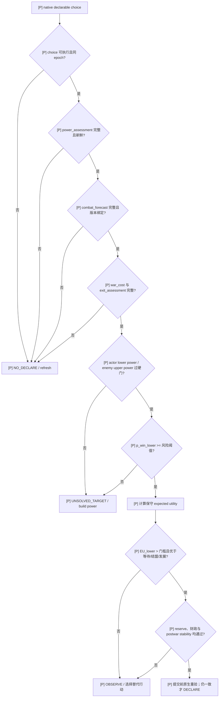
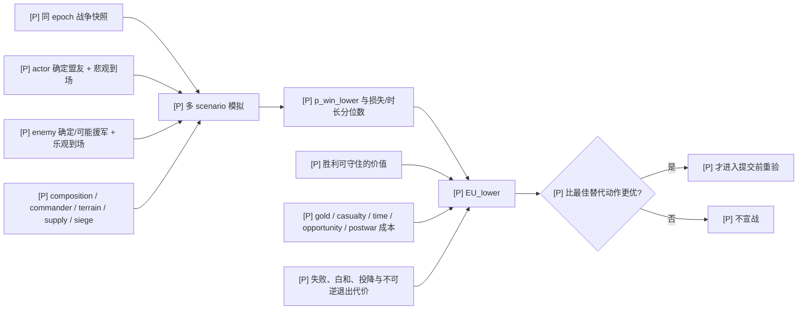
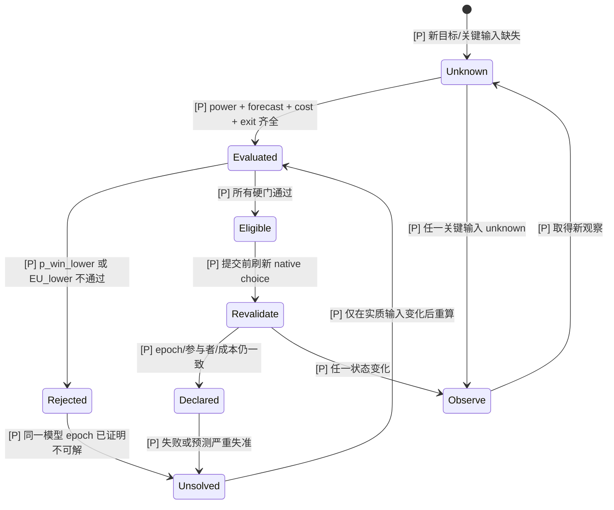

# 自动玩家主动开战策略：胜率与期望效用优先

- [policy-design] 本文中的 `policy-design` 与 Mermaid `[P]` 都表示我方拟议策略，不是 CK3 原生事实；
  `static-confirmed`、`inference`、`unknown` 沿用本目录索引中的证据定义。

## 决策结论

- [policy-design] 自动玩家必须把“可以宣战”和“值得宣战”拆成两个阶段。原生 CB evaluator 只证明声明合法；
  没有军力快照、战斗 forecast 与退出代价时，一律返回 `NO_DECLARE / OBSERVE`。
- [policy-design] 最小可实施硬门是：**declaration payload 同时缺少或无法验证 `power_assessment` 与
  `combat_forecast` 中任一项时，不得自动发出 `declare-war-*`**。CB key、target title 数量、可执行 step
  或原生 `PowerRatio` 都不能替代这一门。
- [policy-design] 若同一对手已经多次无法战胜，而兵力构成、盟友承诺、财政、地形入口与目标战争负担没有发生
  实质变化，则把该敌人标成 `UNSOLVED_TARGET`；不再用重复攻击“重新试一次”。
- [static-confirmed] 当前 exact-build bridge 还不具备完整模拟输入，故按此策略当前正常结果应是禁止主动宣战；
  这不是模拟器给出低胜率，而是关键证据缺失后的 fail-closed。原生确定性 ratio 与真实随机结算分别见
  [combat-prediction.md](combat-prediction.md) 和 [battle-simulation.md](battle-simulation.md)。

## 修复前差异与当前硬门

- [static-confirmed] 当前 `strategy.py::_preferred_native_declaration` 只按 CB key 分组排序：
  `holy_war+county`、其它 `county`、`claim`、其它；同组再偏好较少的 `target_title_ids`，最后以 target、CB
  index、configuration index 稳定破同分。
- [static-confirmed] 当前 declaration payload 只含 `declaration_id`、target、CB index/key、configuration、
  claimant 与 target title IDs；`declaration_contract.py` 没有 power、score、ally commitment、财政或
  combat forecast 字段。
- [static-confirmed] 修复前策略只要找到了上述偏好项且对应 `declare-war-*` step 可执行，就直接返回
  `phase=native_war_declaration`；没有原版的 actual/max power ratio 门，也没有胜率或 expected utility 门。
- [static-confirmed] 当前策略仍可用上述排序挑出一条**仅供诊断**的合法声明，但固定返回
  `phase=native_war_entry_evidence_required`、`selected_step=None`，并列出缺失的战斗模拟、forecast 与战争进入评估
  capability；即使 action surface 已公开对应 `declare-war-*`，planner 也不会自动提交。
- [static-confirmed] native query 不可用时的 legacy `war-declare-palermo` 视觉旁路也受同一硬门约束；命令仍可供
  人工兼容和已开始历史使用，但 planner 不再把“Palermo / low-cost”名称当作可赢性证据。
- [static-confirmed] 原版 AI 至少使用双方估算军力、盟友/overlord、目标现有战争、人格、hostage 与 CB score，
  并执行 `0.9 × best score` 截断和 Top-5 加权随机；详见 [war-declaration.md](war-declaration.md)。
- [inference] 修复前的 “best currently enumerated native county-scale war” 实际只表示“按名称与 title 数量偏好后的
  合法战争”，不能解释成原版意义上的最优，更不能解释成胜率最高；当前硬门已停止据此自动开战。

| 层 | 原版 AI | 当前 Python | 新策略要求 |
|---|---|---|---|
| [static-confirmed] 合法性 | CB/config evaluator | 已复用 native UI evaluator | 保留并在提交前重验 generation-bound choice |
| [static-confirmed] 军力 | actual/max ratio，含辅助军力 | payload 无字段 | 必须有带 epoch、双方参与者与不确定性边界的 power assessment |
| [static-confirmed] CB 价值 | title/claimant + `ai_score(_mult)` | key substring + title count | 计算战争结果价值，不以 key 名称代替效用 |
| [static-confirmed] 随机性 | 尝试率、Top-5 加权、hostage | 稳定挑一条诊断候选，但不提交 | planner 默认确定性；只在效用近似相等且风险门都通过后探索 |
| [unknown] 胜率 | 原版宣战链没有 `p_win` | 无 | 需要版本绑定、输入完备、可校准的 forecast |
| [unknown] 全程成本 | 原版完整财政账本未闭合 | 无 | gold/manpower/time/opportunity/postwar/exit 全部进入效用 |

## 最小 fail-closed 输入契约

- [policy-design] `power_assessment` 至少必须包含：snapshot/epoch、actor/target、双方 primary force、确定会加入的
  参与者集合、可能加入者的概率或上下界、`actor_power_lower`、`enemy_power_upper`、计算来源与版本哈希。
- [policy-design] `combat_forecast` 至少必须包含：与同一 snapshot/participant set 绑定的模拟器版本、样本数、
  `p_win`、保守下界 `p_win_lower`、双方损失分位数、战争时长/围城假设与所有未建模输入列表。
- [policy-design] `war_cost` 至少必须包含：宣战 cost、预计 gold burn、债务风险、manpower 补回时间、战争期间
  收入/控制损失、其它防线 reserve 与机会成本。
- [policy-design] `exit_assessment` 必须在开战前计算失败、白和、投降与被俘等退出结果的最坏可接受损失；如果
  CB 不允许 white peace 或退出后果不可观测，则提高损失上界，不能默认退出免费；原版终止树与我方止损树分别见
  [war-termination.md](war-termination.md) 和 [player-war-exit-policy.md](player-war-exit-policy.md)。
- [policy-design] `freshness` 要求合法性选择、power、forecast、盟友承诺和财政来自同一观察 epoch；任一对象
  generation、participant set、target war 或 alliance 变化即使旧结果失效。
- [policy-design] 任一必需字段为 `unknown`、过期、跨版本、样本不足或不能与 declaration ID 对齐，结果固定为
  `NO_DECLARE / REFRESH_EVIDENCE`。

## 保守胜率与期望效用

- [policy-design] 不直接用样本均值 `p_win` 作门；使用置信下界 `p_win_lower`。模拟次数、置信水平与估计方法必须
  进入 forecast provenance，不能只保存一个百分比。
- [policy-design] 对不确定盟友分别建模“确定加入”“可能加入”“不会加入”，并用 actor 侧悲观、enemy 侧乐观的
  participant scenario 计算下界；不能把所有 alliance 都当成会准时到场。
- [policy-design] 一次候选战争的保守效用为：

  `EU_lower = p_win_lower × V_win + p_white_lower × V_white
  - p_loss_upper × L_loss - C_casualty - C_gold - C_time - C_opportunity
  - C_ally_uncertainty - C_postwar_instability - C_exit`

- [policy-design] `V_win` 只计实际可获得且可守住的 title/claim/contract/战略位置价值；不能直接拿原生 CB score
  当价值单位。
- [policy-design] `L_loss` 与 `C_exit` 包含被俘、继承风险、hostage、赔款、prestige/piety、长期 truce、
  faction/邻国趁虚而入和不可接受 title loss；退出代价应按上界而非平均值计。
- [policy-design] `C_casualty` 应由损失分布与补员时间计算；即使最终胜利，若高分位损失会让下一场防御必败，
  该战争仍不通过。
- [policy-design] `C_opportunity` 至少比较等待、储备、雇佣兵、结盟、婚姻、攻击更弱目标与不宣战；只在战争优于
  最佳可行替代动作时才开战。
- [unknown] `p_win_lower`、最低剩余 reserve、最大债务月份和 `EU_lower` 门槛目前没有实机校准值；在校准前不得
  随意填一个看似合理的百分比来解锁宣战。

## “这个敌人可能根本打不过”的处理

- [policy-design] planner 为 `(actor generation, target generation, participant scenario, terrain/entry plan)` 维护
  `target_model_epoch`，记录 forecast 与真实战果；不是只按 CharacterID 永久拉黑。
- [policy-design] 一次失败后先做归因：输入缺失、盟友未到、战术执行失败、模拟偏差或真实军力劣势。只有新的
  可观测事实能解除 `UNSOLVED_TARGET`。
- [policy-design] 以下任一变化可触发重算而非直接开战：actor 有效兵力/构成显著提高、enemy 有效军力/盟友显著
  降低、目标新增战争、可验证的地形/集结方案改变、财政 reserve 达标或模拟器版本修正。
- [policy-design] 单纯 cooldown 到期、CB 仍在、同一个 title 更想要、或上次“差一点”都不算新证据。
- [policy-design] 若过去样本显示 forecast 系统性乐观，先扩大 enemy uncertainty 与 loss 上界；不得靠增加尝试次数
  消耗同一局兵力来校准。

## 已落实的硬门与后续输入边界

- [static-confirmed] 当前生产策略在任何合法声明存在时固定返回 `native_war_entry_evidence_required` 与
  `selected_step=None`；回归测试同时给出可执行 `declare-war-*`，确认合法 command 也不能绕过该门。
- [static-confirmed] 返回结果明确要求 `game.command.query-combat-simulation-inputs`、
  `game.forecast.combat-monte-carlo-v1` 与 `game.command.query-war-entry-assessments`。这些 capability 当前尚未实现，
  因而主动战争按设计保持关闭。
- [policy-design] 后续 declaration/assessment schema 必须增加同 epoch 的 `power_assessment`、
  `combat_forecast`、`war_cost` 与 `exit_assessment`；不能因为 payload 中恰好出现同名 partial 字段就自动解锁。
- [policy-design] 未来解锁时应先按 target/CB/config/participant set 校验这些对象的 freshness，再把通过硬门的候选
  交给 preference 排序；stale、unsupported 或跨版本数据一律返回 `REFRESH_EVIDENCE`。
- [policy-design] key/title-count 排序最多只能作为**已经全部通过风险门**的候选之间的次级偏好，不能提前运行。
- [policy-design] 提交前重新执行 native legality evaluator，并比较 generation-bound target、CB key/index、config、
  claimant、titles、participant set 与资源 cost；不一致即刷新，不能沿用旧 forecast。
- [static-confirmed] 按 [combat-simulation-inputs.md](combat-simulation-inputs.md) 的当前能力边界，最小门启用后会把
  所有主动战争 fail closed；等观察与模拟输入逐项闭合后再解锁，而不是为保持“能自动宣战”绕过门。

## 验收矩阵

| 场景 | 预期结果 |
|---|---|
| [static-confirmed] 有 native declaration，但 payload 无 power/forecast/cost/exit | `native_war_entry_evidence_required`；`selected_step=None` |
| [policy-design] 有 power，无 combat forecast | `NO_DECLARE` |
| [policy-design] forecast 与 declaration 来自不同 epoch | `REFRESH_EVIDENCE` |
| [policy-design] 原生 ratio 过门但 `p_win_lower` 不过门 | `UNSOLVED_TARGET` 或观察，不宣战 |
| [policy-design] 胜率高但高分位损失破坏防御 reserve | 不宣战 |
| [policy-design] 胜率高、EU 正，但退出后果 unknown | 不宣战 |
| [policy-design] 盟友是否加入 unknown | 使用 actor 悲观/enemy 乐观场景；仍不能闭合则不宣战 |
| [policy-design] 同一敌人上次失败、输入无实质变化 | 不重试 |
| [policy-design] 全部硬门通过，提交前 choice 已变化 | 取消并刷新 |
| [policy-design] 全部硬门通过且 choice/epoch 未变 | 才允许提交 `declare-war-*` |
