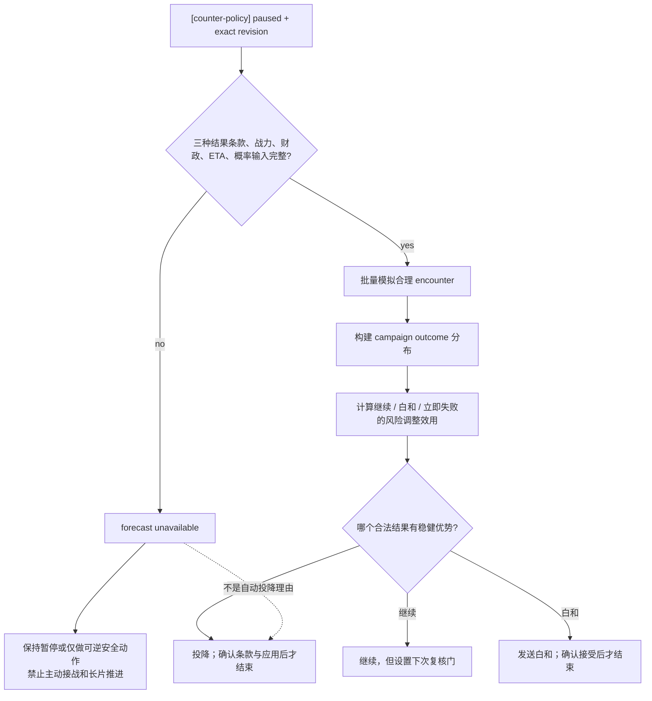
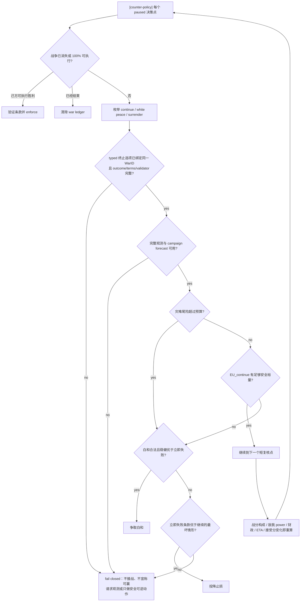
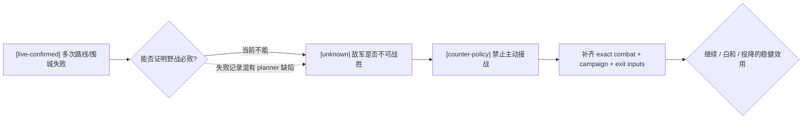

# 玩家战争止损、白和与投降决策树

## 目标

- [counter-policy] 本文是我方策略，不冒充 CK3 原生 AI 事实。原版终止逻辑见
  [war-termination.md](war-termination.md)。
- [counter-policy] 核心目标不是“尽量不投降”，而是比较继续、白和和立即承认失败三种完整结果的风险调整后效用。
- [counter-policy] 单场战斗胜率不等于战争胜率；当前战分也不等于最终可赢性。两者必须作为不同证据进入决策。
- [counter-policy] 输入不完整时 fail closed：不主动接战、不长时间推进、不伪造概率，也不因为未知就自动投降。

## 为什么当前反复失败不能直接证明敌人无敌

- [live-confirmed] 当前自动战局的大部分时间用于围城、撤离、路线改道和恢复；没有一组完整、可审计的同条件野战样本证明
  “现有兵力与该敌军正面交战必败”。
- [static-confirmed] 之前的 planner 有路线交叉漏检、multi-army 驻地威胁漏检和缺少战斗预测等问题；战役失败混合了策略错误与兵力未知。
- [static-confirmed] 当前 bridge 没有发布双方野战实际 soldiers、兵种、骑士、将领、地形、优势、补给或原生 power；
  因而当前不能计算可信的战斗胜率。
- [counter-policy] 但同样不能反向声称“有机会”。在可赢性未证明前，主动攻击该敌军和发起新的战争都必须被禁止。

## 三层概率不能混用

| 层次 | 问题 | 合法输出 |
|---|---|---|
| 原生 AI combat ratio | 原版 AI 认为眼前接战双方相对 power 如何 | 确定性 ratio；不是概率 |
| 单场战斗 Monte Carlo | 在冻结 encounter、参战者和规则下，我方赢这场战斗的频率 | 胜率、95% 区间、伤亡/全灭尾部 |
| 战争结果预测 | 考虑多场战斗、围城、增援、财政、战分与终止条款后，战争最后为何种结果 | `P(victory/white_peace/defeat)` 与成本分布 |

[counter-policy] 只有第三层可以直接决定继续战争还是止损；第二层只能决定是否接这场仗。

## 原生可行性边界先于效用比较

- [static-confirmed] 原版把“AI 何时主动投降”的 `ai_will_do` 与“玩家手动发送结果”的 validator 分开。
  玩家为 primary attacker 时，手动投降不要求防守方战分 `100` 或最大战分持续 `180` 日；只要战争/有效 CB 与
  通用 interaction validator 通过即可构造进攻方失败结果。
- [static-confirmed] 玩家投降给 AI primary defender 时，原版 `auto_accept` 为真；它是可立即结束的候选，但策略仍须先读取
  完整 defeat 条款，不能因“必接受”就忽略代价。
- [static-confirmed] 玩家提出白和还要求活动 CB 支持 `IsWhitePeacePossible`，而白和没有 `auto_accept`；AI 的
  `ai_accept` 可能拒绝，所以 `EU_white` 必须保留 rejection 分支。
- [static-confirmed] 玩家不是 primary attacker / defender 时，原生战争面板不为其构造投降或执行胜利 context；不能把
  `player_side=attacker` 单独当成提交权限。
- [counter-policy] 我方只能对指定 full-generation `WarID`、确定 outcome、完整 terms 和 validator 的 typed 选项计算效用。
  只有 instance/sender 的通用 pending interaction 必须保持 unclassified，绝不猜成白和或敌方投降。

## 冻结输入

每次止损评估必须绑定同一个 paused revision，并至少包含：

1. [counter-policy] 战争身份、玩家攻守方、是否 primary leader、CB、目标，以及绑定同一 `WarID` 的三种终止结果完整条款与合法性。
2. [counter-policy] 总战分及 battle/occupation/objective/prisoner/ticking 分项、剩余可获得分和 100% 强制条件。
3. [counter-policy] 双方已动员与可动员储备、盟军承诺、补员、补给、财政续航、雇佣兵/骑士团和到达 ETA。
4. [counter-policy] 所有合理 encounter 的 exact input 与战斗分布，而不是只模拟最有利的一场。
5. [counter-policy] 白和/投降的 native context kind、validator、对手接受分和 auto-accept；不可构造或不可接受的提议不能当成可选动作。
6. [counter-policy] CB-specific 领地、金钱、威望、虔诚、合法性、俘虏、人质、停战和派系后果。
7. [counter-policy] 玩家设定的硬预算：最大可接受伤亡、破产概率、关键人物死亡/被俘概率和最长战争天数。

任一关键输入缺失时，输出必须列出 `unknown_fields`，不得用零补齐。



## 风险调整效用

对每个合法动作计算完整分布，而不只比较期望值：

```text
EU_continue =
    P(win)       * U(victory terms)
  + P(white)     * U(white-peace terms)
  + P(lose)      * U(defeat terms)
  - E[future gold / prestige / piety / levy cost]
  - E[opportunity cost]
  - tail_penalty(stack wipe, ruler capture/death, bankruptcy, realm collapse)

EU_white = P(accepted) * U(white-peace terms)
         + P(rejected) * U(state after rejection and cooldown)

EU_surrender = U(defeat terms now)
```

- [counter-policy] Monte Carlo 的 95% Wilson 区间只覆盖抽样误差；模型不完整性必须另加 `model_risk`，不能藏在区间里。
- [counter-policy] 采用保守界：胜利用概率下界、灾难损失用概率上界；任何未建模增援都作为不利场景，而不是从样本中删除。
- [counter-policy] 已经消耗的时间和兵力是沉没成本，只能作为模型校准证据，不能成为“都打这么久了所以必须继续”的理由。
- [counter-policy] 原版战分和 AI 接受分仍是有用输入，但不得替代战争结果分布。

## 更智能的止损决策树



### 攻击方

- [counter-policy] 宣战前必须已有正的风险调整效用；进入战争后若这个前提失效，不得用“是我先宣战”作为继续理由。
- [counter-policy] 原版允许 primary attacker 在未到 `-100` 战分时手动投降，不等于我方应立即投降；它只说明
  `surrender` 可以进入合法候选集。是否选择仍由完整 defeat 条款与继续战争尾险决定。
- [counter-policy] 若没有可达的安全 objective、所有必要接战的胜率下界未过预算，且白和可接受，则优先白和。
- [counter-policy] 如果白和不可得，而立即失败的 CB 条款明显小于继续战争的灾难上界，则主动投降。
- [counter-policy] 不因当前战分为正而跳过止损。正战分可能来自早期占领，而野战主力、财政或 objective ticking 已经不可持续。

### 防守方

- [counter-policy] 先计算立即投降会失去什么：目标领地、金钱、合法性、俘虏、人质、继承和后续防御能力。
- [counter-policy] 若这些损失有限，而继续战争的上界包含领袖被俘、全军覆没、破产或多战线崩溃，允许在战分尚未极低时提前投降。
- [counter-policy] 若白和保留核心领地且可接受，白和通常支配立即投降；但要把拒绝概率、冷却和人质条款计入。
- [counter-policy] 若防守胜利仍有可信路径，则继续；“敌方是进攻方”本身不构成坚持到底的价值。

## 防抖与复核

- [counter-policy] 同一 paused snapshot 只提交一个终止 interaction，不同时发送白和与投降。
- [counter-policy] ACK 不等于战争结束；必须在新 paused snapshot 中确认 WarID 消失，并核对条款产生的关键状态变化。
- [counter-policy] 任何战斗结果、援军加入/拒绝、关键人物被俘、objective 占领、债务层级、AI 接受分或 CB 条款变化都会打开新 epoch。
- [counter-policy] 有 active route、combat、retreat、Assault 或敌 tactical route 时最多推进一日；没有这些状态也不得跨过下一次财政、补员、
  siege 或 termination acceptance 复核门。
- [counter-policy] 使用滞回：只有候选结果相对当前策略超过明确安全裕量才切换，避免白和/继续反复振荡。

## 当前战争的结论

- [live-confirmed] 当前玩家是本战争的进攻方，`player_is_primary_war_leader=true`，最近可读总相对战分为正；
  这证明原生结果构造器的 leader 身份门已满足，也只说明记分板，不证明最终可赢或当前白和合法。
- [live-confirmed] 本轮历史包含玩家 objective 围城、撤离和敌军改道，但最新可审计状态没有一场已冻结双方
  参战集合、入场边与战斗上下文的 encounter；历史围城兵力也不能代替野战输入。
- [static-confirmed] 当前 snapshot 缺完整野战输入、战争时长/分项战分、财政、储备、终止条款和 AI 接受分。
- [static-confirmed] 当前 bridge 也缺活动 CB / `IsWhitePeacePossible`、三个原生 termination context 的 validator、
  outcome 与条款；它只有 typed enforce-demands 和无法绑定 `WarID`/类型的通用 pending-interaction 回复。
- [counter-policy] 因此目前既不能报可信胜率，也不能据此断言敌人“绝对打不过”。正确状态是：
  `war_winnability = unavailable`，禁止主动接战；等战斗输入、campaign forecast 和终止选项查询闭合后，再在继续/白和/投降之间比较。
- [static-confirmed] 当前 planner 会在每个玩家为 defender 的 war summary 中显式发布
  `war_exit_assessment.status=unavailable` 及所缺 capability；它不会把 unknown 自动变成投降，100% 可执行胜利
  与尚无可控军时的一次防御性 raise 也不会被该诊断遮挡。
- [static-confirmed] 当前执行顺序进一步固定为：100% enforce 优先；主防守方无军时允许一次
  `raise-troops-default`；有可控军后若终止条款、接受态度和 campaign forecast 仍缺失，则返回
  `defensive_war_exit_evidence_required` / `selected_step=None`。明确的非 primary 盟军战争不触发自动退出门；
  primary 身份不可观测时按未知 fail closed，不能擅自当成无权退出的盟军战争。
- [counter-policy] 若这套宣战门在战争开始前就存在，由于可赢性不可证明，本次自动宣战应当被阻止。这个结论与现在是否立刻投降是两回事。



## 最小实现与测试门槛

在实现自动白和或投降前，至少需要：

0. [static-confirmed] 当前已实施的临时安全门：active war 中的 pending interaction 若没有精确 interaction kind、
   WarID、outcome 与条款，则 `selected_step=None`，不得盲目 accept/reject；100% enforce-demands 保持更高优先级。
1. `game.command.query-war-termination-options-N` / `query-war-termination-options-<WarID>` 的 paused、
   generation-safe、全条款查询。
2. 白和与投降的独立 exact-build capability、严格 WarID parser、原生 validator 和 bool queue ACK；构造器测试必须覆盖
   “bool 表示 concede own side，玩家为 attacker 时内部反转”，防止把 attacker victory / defeat 反接。
   planner 只有在对应 literal step 已广告时才能选择；缺 step 必须直接 `selected_step=None`，不能让 service 的
   capability-progress fallback 把未支持的白和/投降误降级成 `life-advance`。当前 service 已把 declare、
   white-peace、surrender 与 termination-query 前缀列入 fail-closed critical set，并有回归测试固定该行为。
3. 对手接受分/auto-accept 与人质组合的原子查询；没有接受保证时不能把提议当成已结束。
4. postcondition：同一 WarID 消失；如果仍存在，命令只能记为 submitted/rejected，不能记 applied。
5. restore/episode/WarID generation 隔离，禁止旧接受分和旧条款跨恢复复用。
6. 单测覆盖：正战分但主力不可战、负战分但援军将到、白和优于投降、投降优于灾难继续、CB 禁白和、
   AI 拒绝白和、100% 强制结果、人质导致 landless 屏障和输入 unknown 全部 fail closed。
