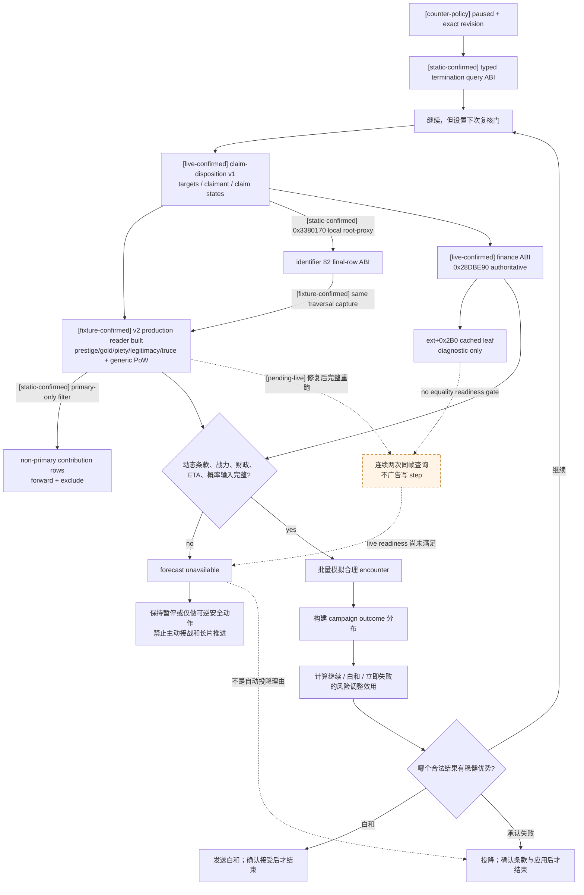
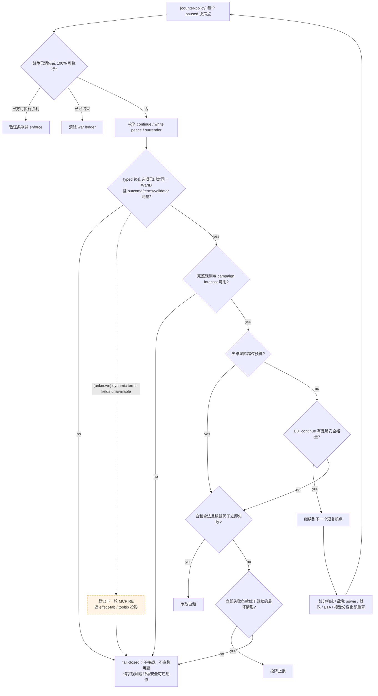
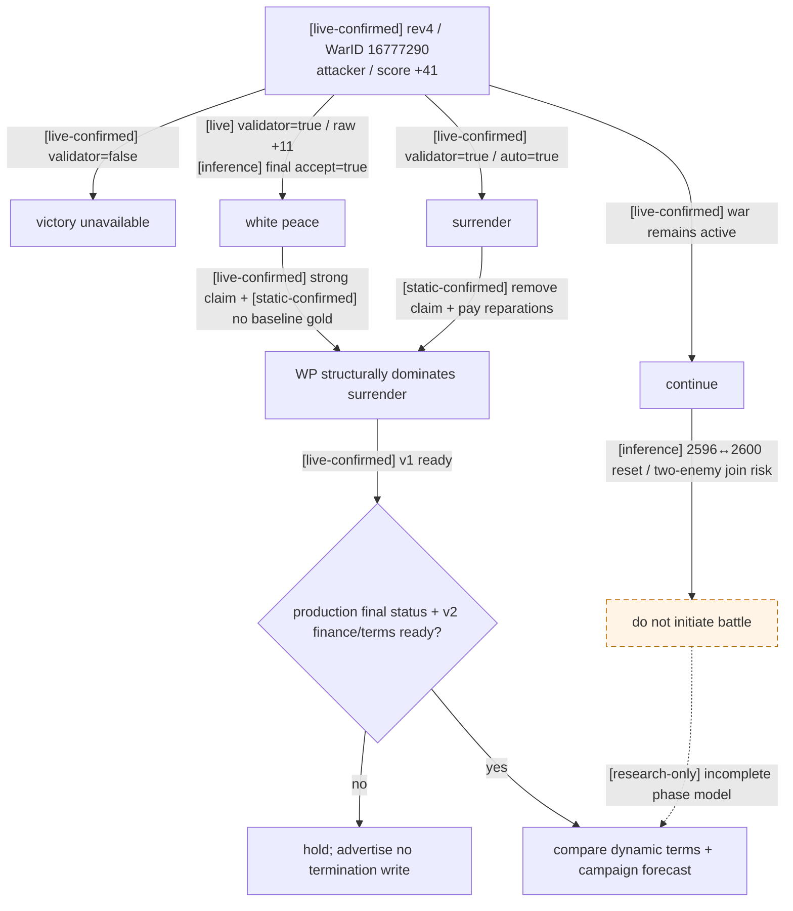
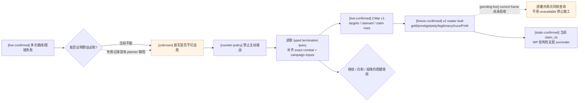

# 玩家战争止损、白和与投降决策树

## 目标

- [counter-policy] 本文是我方策略，不冒充 CK3 原生 AI 事实。原版终止逻辑见
  [war-termination.md](war-termination.md)。
- [counter-policy] 核心目标不是“尽量不投降”，而是比较继续、白和和立即承认失败三种完整结果的风险调整后效用。
- [counter-policy] 单场战斗胜率不等于战争胜率；当前战分也不等于最终可赢性。两者必须作为不同证据进入决策。
- [counter-policy] 输入不完整时 fail closed：不主动接战、不长时间推进、不伪造概率，也不因为未知就自动投降。
- [live-confirmed] 2026-08-25 的 exit-terms v2 loaded-effect preview 在两次 paused 只读查询中复现同一
  CK3 `RVA 0x334C668` 崩溃。该查询现已从 capability、action projection、strategy、native dispatch 和 MCP
  全部撤下；因此当前策略不得等待或自动重试该 step。完整条款仍是决策依赖，但只能在离线 RE 闭合 visitor/scope ABI、
  重新获得明确实机授权并完成 paused 验收后恢复。详细证据见
  [war-termination.md](war-termination.md#exit-terms-v2-实机崩溃证据与临时生产回退2026-08-25)。

## 为什么当前反复失败不能直接证明敌人无敌

- [live-confirmed] 当前自动战局的大部分时间用于围城、撤离、路线改道和恢复；没有一组完整、可审计的同条件野战样本证明
  “现有兵力与该敌军正面交战必败”。
- [static-confirmed] 之前的 planner 有路线交叉漏检、multi-army 驻地威胁漏检和缺少战斗预测等问题；战役失败混合了策略错误与兵力未知。
- [live-confirmed] 当前 bridge 已发布指定 encounter 的 soldiers、regiments/counters、骑士、将领、
  地形、holding/crossing 与 width 等 v2 输入，可跑明确标注的 research envelope；但 loaded
  phase effects 与完整 campaign transition 尚未达 planner fidelity gate，所以仍不能把该包络冒充战争胜率。
- [counter-policy] 但同样不能反向声称“有机会”。在可赢性未证明前，主动攻击该敌军和发起新的战争都必须被禁止。

## 三层概率不能混用

| 层次 | 问题 | 合法输出 |
|---|---|---|
| 原生 AI combat ratio | 原版 AI 认为眼前接战双方相对 power 如何 | 确定性 ratio；不是概率 |
| 单场战斗 Monte Carlo | 在冻结 encounter、参战者和规则下，我方赢这场战斗的频率 | 胜率、95% 区间、伤亡/全灭尾部 |
| 战争结果预测 | 考虑多场战斗、围城、增援、财政、战分与终止条款后，战争最后为何种结果 | `P(victory/white_peace/defeat)` 与成本分布 |

[counter-policy] 只有第三层可以直接决定继续战争还是止损；第二层只能决定是否接这场仗。

## 原生可行性边界先于效用比较

- [static-confirmed] 原版把“AI 何时主动投降”的 `ai_will_do` 与“玩家手动发送结果”的 validator 分开。
  玩家为 primary attacker 时，手动投降不要求防守方战分 `100` 或最大战分持续 `180` 日；只要战争/有效 CB 与
  通用 interaction validator 通过即可构造进攻方失败结果。
- [static-confirmed] 玩家投降给 AI primary defender 时，原版 `auto_accept` 为真；它是可立即结束的候选，但策略仍须先读取
  完整 defeat 条款，不能因“必接受”就忽略代价。
- [static-confirmed] 玩家提出白和还要求活动 CB 支持 `IsWhitePeacePossible`，而白和没有 `auto_accept`；最终是否接受
  由原生 `0x2C43B40(...,answer_mode=1,...)` 的 status 决定，只有 status `2` 是拒绝。production query
  未同帧返回这个 typed status 时，`EU_white` 仍必须保留 rejection 分支，不能只看 raw score；缺失态 `3`
  不进入 strict available v2。
- [static-confirmed] 玩家不是 primary attacker / defender 时，原生战争面板不为其构造投降或执行胜利 context；不能把
  `player_side=attacker` 单独当成提交权限。
- [counter-policy] 我方只能对指定 full-generation `WarID`、确定 outcome、完整 terms 和 validator 的 typed 选项计算效用。
  通用 pending query 现可读 stable interaction key、roles、routing 与 legality，但尚不发布关联 WarID/outcome 或 structured
  terms；在这些字段闭合前仍必须保持 semantic-unclassified，不能仅凭 `end_war_*` key 猜成值得接受的白和或敌方投降。
- [static-confirmed] `offer-white-peace-<WarID>` 的原生 context/validator/queue ABI 已独立闭合，但当前
  施工目标是只读 structured terms，不是发送。decision-critical terms 未在同 paused revision 真实 live-read
  前，white-peace 与 surrender capability/literal step 都不得对 planner 广告。
- [counter-policy] 未来解冻写口时，Python service 必须同时要求：同 paused revision 的 structured terms
  readiness=true、termination query 证明对应 outcome available；native 写口再 generation-safe 重解 WarID、
  复核 primary leader / outcome 极性并重跑 validator。缺任一门都必须 fail closed，不能用其它动作代替。

## 冻结输入

每次止损评估必须绑定同一个 paused revision，并至少包含：

1. [counter-policy] 战争身份、玩家攻守方、是否 primary leader、CB、目标，以及绑定同一 `WarID` 的三种终止结果完整条款与合法性。
2. [counter-policy] 总战分及 battle/occupation/objective/prisoner/ticking 分项、剩余可获得分和 100% 强制条件。
3. [counter-policy] 双方已动员与可动员储备、盟军承诺、补员、补给、财政续航、雇佣兵/骑士团和到达 ETA。
4. [counter-policy] 所有合理 encounter 的 exact input 与战斗分布，而不是只模拟最有利的一场。
5. [counter-policy] 白和/投降的 native context kind、validator、对手接受分、`decision_status_raw` /
   `would_accept_now` 和 auto-accept；不可构造或不可接受的提议不能当成可选动作。
6. [counter-policy] CB-specific 领地、金钱、威望、虔诚、合法性、俘虏、人质、停战和派系后果。
7. [counter-policy] 玩家设定的硬预算：最大可接受伤亡、破产概率、关键人物死亡/被俘概率和最长战争天数。

任一关键输入缺失时，输出必须列出 `unknown_fields`，不得用零补齐。

[static-confirmed] 对 CK3 1.19.0.6 exact build，`query-war-termination-options-<WarID>` 所需的以下只读输入
已闭合到原生 ABI：active CB ordinal/key、白和许可位、玩家 primary-leader 身份、三种无人物交换 context 的构造与
validator、attacker/defender 绝对总分、imprisonment/battles/occupation/ticking 分项、战争日数、原生
`ai_accept` raw 与 `auto_accept`。最终 AI 答复 ABI 也已闭合到
`0x2C43B40(context,1,0,null,null)`，原版 caller 只把 status `2` 当拒绝；它尚待 production query
同帧发布扁平 `recipient_response.decision_status_raw/would_accept_now`。这些字段只有在 paused query
实际返回后才成为当前战争证据。

[static-confirmed] `claim_cb` 的七个 decision-critical 域已闭合静态方向，详表见
[war-termination.md](war-termination.md)：

| 结果 | titles / claims | baseline gold | primary prestige | piety / legitimacy | truce / prisoners |
|---|---|---|---|---|---|
| victory | `conquest_claim` 把声索目标给 claimant，可有 admin 扩展与 liege 分支 | 无 attacker↔defender 基线转移 | attacker 得 `prestige_experience +10F`；defender 失 `prestige -10F` | Mandala 条件虔诚；标准 legitimacy 只可能给 winner=attacker | attacker→defender 单向停战；双方 jailers 对称释放主战者/前 3 继承人 |
| white peace | holder 不变；claim 保留，weak→strong | 无 attacker↔defender 基线转移 | attacker `prestige -5F`；defender 基线 0 | primary piety / legitimacy 基线 0 | 同向停战；同一战俘释放规则 |
| attacker defeat | holder 不变；移除 claimant 的 declared-target claims | attacker→defender；`3×medium_gold_value` 或 `3×yearly_income`，文化可×2 | attacker `prestige -10F`；defender `+10F` 或 `+20F` | Mandala 条件虔诚；标准 legitimacy 只可能给 winner=defender | 同向停战；同一战俘释放规则 |

`F=cb_prestige_factor`。victory 的 attacker 奖励是 `prestige_experience`，不是可花 `prestige`。三结果可另有
LAAMP employer→adventurer 合约付款；它必须作独立 contingent rows，不得并入 defeat 赔款。

[live-confirmed] 最小只读 terms slice 已发布：declared targets 来自 `CWar+0x270/+0x278/+0x27C`，
claimant 来自 `CWar+0x290`，`0x28B1AA0` 读逐 title 的 present/strong/implicit。v1 已在当前
paused frame 连续两次通过 getter、generation 与 temporary destructor 验收；legacy options row 的
`terms.status=unavailable` 仅指动态 v2 未嵌入，不再表示 claim disposition 不可观测。

[live-confirmed] 同一 paused 帧已两次稳定回读 claimant `29829`、target `2388`与
claim `present=true,strong=true,implicit=false` (`strong_explicit`)。因而 claim-disposition v1 可以与
动态条款 v2 分开施工：当前 white peace=保留已强 claim，surrender=移除该
declared-target claim，victory=把 conquest-claim 方向解析到 claimant。gold/prestige/truce/PoW
尚未进 v2 不得阻塞 v1 只读 query，但 v1 单独也不授权发送终战动作。

[static-confirmed] 第二切片已闭合 `cb_prestige_factor` 的 tier/additional-factor accumulator 构造路径，
identifier `82` final row 的临时 container 布局与无游戏对象写入的 root-proxy 捕获路径，以及
`pay_short_term_gold` 在本地化前发布 payer/payee/final Q100000 amount 的 preview callback。
[live-confirmed] 当前 target `2388` tier=3 的 direct factor 贡献为 raw `500000` (`5.0`)；但
additional change/vassal factor 尚未由 production paused query 直接回读，所以不得把 total `F` 填成 5，
也不得用 white-peace prestige delta 除以 `-5` 反推并冒充原生 `F`。exact 施工口是：给
`0x3380170` 传栈上 root proxy；其本地 vtable `+0x58` trampoline 转调真实 root 后、返回前扫描
`wrapper+0x18` 的 `0x20`-byte rows，取唯一 `identifier=82,tag=1,subtag=0,flag=0` 的 signed
Q100000 raw。它与 resource callback 必须来自同一次 traversal。

[static-confirmed] 当前 primary finance 读 ABI 已闭合：gold balance=`extension+0x100`，monthly income
调用 `0x28DBE90(out,character,null,null)`；`extension+0x2B0` 只是可滞后的 direct cached leaf，
prestige/fame XP=
`+0x130/+0x138`，piety/devotion XP=`+0x110/+0x118`，legitimacy=`CCharacter+0x1C0→+0x28`。
wire 必须只发布完整 evaluator 的 raw；cached leaf 只作 RE/error 诊断，不得要求二者逐位相等。
canonical v2 把它们拆成 `primary_resource_balances`（2 人 × 6 kinds）与
`primary_monthly_gold_income`（2 rows）；cached fame/devotion level 只作诊断，不进入 JSON。每个 outcome
的接受态是扁平 `recipient_response`，不另设 nested `acceptance` 对象。

[static-confirmed] 原版 `claim_cb` 还会为 allies / all participants 发出贡献型 resource callbacks。
canonical v2 明确只衡量 primary attacker/defender：generation-valid 的非 primary Character row 仍原样
forward 给 stock collector，但从 10 格 primary delta 中排除，即使其 contribution-specific node vptr 不在
当前分类表内也不拖垮这份窄切片；primary Character 的 unknown node 或非法 Character scope 则继续
fail closed。native fixture 已覆盖“第三方已知/未知 row 均排除、primary 未知 row 拒绝”与 teardown。

[fixture-confirmed] canonical `claim_cb_exit_terms_v2` production reader 已完成：同一次 dry preview 用 local
root-proxy 捕获 identifier `82` final row 与 typed primary resource/gold callbacks，并接入 truce、通用 PoW、
12+2 finance rows及 `0x2C43B40` final status；stock ally/contribution rows 按上方 primary-only 规则处理。
待部署 DLL SHA256 为
`D7B87EA01A82FD70EBA0089F21F95ACCCBF9410710825974B9AA949B9165C8DE`，CTest `6/6`、Python `254`、
anchor checks `138/20` 通过。

[live-confirmed blocker] final2 已在仍暂停的 `WarID=16777290` 实机返回 unavailable；diag4 将失败精确到
`primary_resources`，并在 native revision `3` / query revision `14`、`date_raw=53175816` 读得 attacker
`0x28DBE90=551588`、`extension+0x2B0=570772`，before/after frame identity 不变。根因是 reader 额外加入了
原生不存在的 cache-equality readiness gate，尚未运行到 PoW/preview。最小修复是保留 callable
return-pointer、Character generation、same-frame 前后两次 callable 与整份 query identity 稳定门，删除
cache equality；修复版仍须连续两次 same-frame query，复核完整 12+2 finance rows，以及
WP/attacker-defeat 两份 F、primary delta、gold、truce、PoW、final status。当前帧 PoW
虽已由两次 generation-safe research 枚举实证为空集，也不能在 production 返回 `[]` 前越过 readiness。
victory resolved title/vassal operations 与 LAAMP/hostage 扩展属于后续 broad slice，不阻塞这个已经冻结的
primary claim_cb v2，但仍不能被拿来评价 validator=false 的 victory。



## 风险调整效用

对每个合法动作计算完整分布，而不只比较期望值：

```text
EU_continue =
    P(win)       * U(victory terms)
  + P(white)     * U(white-peace terms)
  + P(lose)      * U(defeat terms)
  - E[future gold / prestige / piety / levy cost]
  - E[opportunity cost]
  - tail_penalty(stack wipe, ruler capture/death, bankruptcy, realm collapse)

EU_white = P(accepted) * U(white-peace terms)
         + P(rejected) * U(state after rejection and cooldown)

EU_surrender = U(defeat terms now)
```

- [counter-policy] Monte Carlo 的 95% Wilson 区间只覆盖抽样误差；模型不完整性必须另加 `model_risk`，不能藏在区间里。
- [counter-policy] 采用保守界：胜利用概率下界、灾难损失用概率上界；任何未建模增援都作为不利场景，而不是从样本中删除。
- [counter-policy] 已经消耗的时间和兵力是沉没成本，只能作为模型校准证据，不能成为“都打这么久了所以必须继续”的理由。
- [counter-policy] 原版战分和 AI 接受分仍是有用输入，但不得替代战争结果分布。

## 更智能的止损决策树



### 攻击方

- [counter-policy] 宣战前必须已有正的风险调整效用；进入战争后若这个前提失效，不得用“是我先宣战”作为继续理由。
- [counter-policy] 原版允许 primary attacker 在未到 `-100` 战分时手动投降，不等于我方应立即投降；它只说明
  `surrender` 可以进入合法候选集。是否选择仍由完整 defeat 条款与继续战争尾险决定。
- [counter-policy] 若没有可达的安全 objective、所有必要接战的胜率下界未过预算，且白和可接受，则优先白和。
- [counter-policy] 如果白和不可得，而立即失败的 CB 条款明显小于继续战争的灾难上界，则主动投降。
- [counter-policy] 不因当前战分为正而跳过止损。正战分可能来自早期占领，而野战主力、财政或 objective ticking 已经不可持续。

### 防守方

- [counter-policy] 先计算立即投降会失去什么：目标领地、金钱、合法性、俘虏、人质、继承和后续防御能力。
- [counter-policy] 若这些损失有限，而继续战争的上界包含领袖被俘、全军覆没、破产或多战线崩溃，允许在战分尚未极低时提前投降。
- [counter-policy] 若白和保留核心领地且可接受，白和通常支配立即投降；但要把拒绝概率、冷却和人质条款计入。
- [counter-policy] 若防守胜利仍有可信路径，则继续；“敌方是进攻方”本身不构成坚持到底的价值。

## 防抖与复核

- [counter-policy] 同一 paused snapshot 只提交一个终止 interaction，不同时发送白和与投降。
- [counter-policy] ACK 不等于战争结束；必须在命令后当前可用 paused observation 中确认 WarID 消失，并核对条款产生的关键状态变化；
  不要求 snapshot/revision 必然推进。
- [counter-policy] 任何战斗结果、援军加入/拒绝、关键人物被俘、objective 占领、债务层级、AI 接受分或 CB 条款变化都会打开新 epoch。
- [counter-policy] 有 active route、combat、retreat、Assault 或敌 tactical route 时最多推进一日；没有这些状态也不得跨过下一次财政、补员、
  siege 或 termination acceptance 复核门。
- [counter-policy] 使用滞回：只有候选结果相对当前策略超过明确安全裕量才切换，避免白和/继续反复振荡。

### 2026-08-28 production 反例：负终止评估按原生 7 日节拍复用

- [production-live] 正式一代长跑 `ca52af74` 在战争仍活动、终止条件没有变化时，于每个新 paused 日期重复执行
  `query-war-termination-options-<WarID>`，随后只推进一日。查询本身没有选出退出动作，却把普通军事推进压回
  “一日推进 → 一次 rich query”的循环；这是已发生的 G1 吞吐 blocker，不是假设性优化。
- [static-confirmed] exact build 的普通 `UPDATE_TARGETS_TICK` 为 7 游戏日；这不能证明原生终止 interaction 也恰好
  使用同一 timer，但为我方“没有新退出候选时最多延后 7 日复核”提供了已有运营节拍。该复用只减少重复只读查询，
  不改变白和/投降的合法性、效用或提交门。
- [counter-policy / static-ready] 只有 fresh termination-options 查询已经得出“本轮没有可选择退出动作”时，才记录
  一个最长 7 游戏日的负评估。键至少包含完整 active-war set、每个 full-generation `WarID`、玩家 side / primary
  身份、玩家相对战分、active CB identity，以及当前窄规则已经消费的白和许可、context/validator、hostage 与 typed
  recipient response；可见时也记录战分 breakdown。`war_duration_days` 只作查询 provenance/租约到期依据，不作逐日相等键，
  否则它每天递增会令复用立即失效；租约通常最长 7 日，但 attacker-primary `claim_cb` 在 365 日以前查询时，必须把到期日
  clamp 到“查询日 + 距第 365 日的剩余天数”，两者取较早值，到达该已知合法性门当天 fresh 重查。活动战争集合、任一稳定键
  输入、事件、pending interaction、角色/episode/connection、死亡或 terminal 状态一旦变化立即失效；第 7 日边界同样必须
  fresh 重查。
- [counter-policy / static-ready] 复用的唯一效果是跳过本轮 termination rich query 并继续普通军事 OODA。旧 options
  不投影进当前 war summary，也不得用于查询 terms、广告或执行白和/投降；任何曾经出现正的 actionable candidate 的结果
  都不进入负缓存。这样 stale positive 永远不能授权写动作。

## 当前战争的结论

- [live-confirmed] 当前玩家是本战争的进攻方，`player_is_primary_war_leader=true`；2026-08-25 的 paused typed query
  已确认 `claim_cb`、战争 347 天、玩家战分 +41，且这 41 分全部来自 battles。它仍不证明最终可赢。
- [live-confirmed] 本轮历史包含玩家 objective 围城、撤离和敌军改道，但最新可审计状态没有一场已冻结双方
  参战集合、入场边与战斗上下文的 encounter；历史围城兵力也不能代替野战输入。
- [live-confirmed] 修正极性的 bridge 已在 paused rev4 重查 `WarID=16777290`：surrender /
  attacker-defeat validator=true、acceptance=+860.0、auto-accept=true；white peace validator=true、
  acceptance=+11.0、auto-accept=false；victory / attacker-victory validator=false、acceptance=-58.0、
  auto-accept=false。旧 build 曾把 victory/surrender rows 反标，该旧 JSON 不能作 machine input；WP 走独立
  index `3` 不受影响。两次查询都未提交任何动作，日期仍为 `53175816`。
- [live-confirmed] claim-disposition v1 已在这个 paused frame 连续两次 live-ready：claimant=`29829`、
  target=`2388`、claim=`strong_explicit`，getter temporary 已按原 vtable 析构。legacy options row 的
  `terms.status=unavailable` 仅指动态 v2，不得再当成 v1 缺失。
- [static-confirmed] 本地化前 gold amount callback 和 `F` 的构造器已精确定位；当前目标的 direct
  factor 贡献是 5.0，但 additional-factor 仍可追加，两者都尚未进 termination wire。
- [live-confirmed, read-only RE] 当前 attacker `29829` 的 gold balance raw=`49048276`；diag4 同一 paused
  frame 读得 authoritative monthly evaluator `0x28DBE90=551588`、cached leaf `extension+0x2B0=570772`。
  primary defender `36108` 的 direct observations 为 gold `20244084`、cached leaf `1659854`，其 callable
  待修复版完整 v2 重跑。cache 与 callable 没有逐位相等合同。按 callable 和已闭合 `3×yearly` +
  whole-gold ceil 算术，当前 surrender reparations 的静态预测改为 raw=`19900000`；但只有同 paused frame
  的 `0x2EF4530` callback 才是 actual amount，旧 `205/206` 估算均不是当前 golden。
- [inference] `0x2C43B40` 的 exact mode-1 路径只把 status `2` 当拒绝；当前 WP raw `+11` 因而预测
  `would_accept_now=true`。production options/terms 尚未同帧发布 final status，所以它仍不是 live 接受保证。
- [live-confirmed] 当前双方 participant、全部 generation-valid imprisoned Characters 与全部 Title succession
  arrays 已两次稳定枚举；三 outcome 的实际 `prisoner_release_pairs=[]`。这是一项 research observation，
  production terms wire 尚未接入，不能因值恰为空就把未施工字段伪装成已发布。
- [unknown] 本帧实际 total prestige/resource-kind deltas、gold callback debit/credit、胜利 resolved title/vassal operations、
  piety/legitimacy 命中分支、truce expiry、production PoW/LAAMP/hostage rows、完整 12+2 primary finance 与 final AI status 尚未进入同一
  typed terms wire。不能仅凭 +11 接受分忽略条款；在这些 decision-critical structured terms live-read
  前，即使 backend 有 typed white-peace/surrender 写口，也不得对 planner 广告。
- [static-confirmed] 当前 live CB 是 `claim_cb`。原版脚本已确认 white peace 保留并可能强化 weak claim、代价包含
  `5 × cb_prestige_factor` prestige；attacker defeat 会移除目标 claim、支付短期赔款，并按
  `-10F` 损失 prestige。对当前进攻方，WP 在 titles/claims 与 baseline gold 上结构性支配
  surrender；两者的 truce 方向和 PoW 规则相同。但动态角色/合约条款未进 typed terms 前仍不自动提交。
- [counter-policy] 因此目前既不能报可信胜率，也不能据此断言敌人“绝对打不过”。正确状态是：
  `war_winnability = unavailable`，禁止主动接战；终止 query 的当前值已经取得，下一步优先补条款、战斗输入与 campaign forecast，
  再在继续/白和/投降之间比较。
- [static-confirmed] planner 仍会在玩家为 defender 的 war summary 中显式发布
  `war_exit_assessment.status=unavailable` 及退出决策所缺 capability；该诊断只禁止未经证明的白和或投降，
  不再阻塞普通军事 continue。它不会把 unknown 自动变成投降，100% 可执行胜利与尚无可控军时的一次
  `raise-troops-default` 也不会被该诊断遮挡。
- [static-confirmed] 当前执行顺序固定为：100% enforce 优先；主防守方无军时允许一次
  `raise-troops-default`；明确 `player_is_primary_war_leader=true` 且已有可控军时继续现有 route / tactical OODA，
  只有真正选择退出动作才要求对应条款、接受态度和 campaign forecast。明确的非 primary 盟军战争不触发自动退出门；
  primary 身份不可观测时返回 `defensive_war_primary_identity_required`，不能擅自当成已知主防守方或盟军战争。
- [production-blocker-live] `WarID=100663382` 在 day 0 / score 0、玩家 primary defender、ArmyID `100663369`
  已进入 gathering 后，被旧 `defensive_war_exit_evidence_required` 自锁；原生树证明完整三结果条款与 campaign forecast
  不是普通 continue 的输入。该实例与极性错误的冻结证据、最小继续门见
  [primary-defensive-war-response.md](primary-defensive-war-response.md)。
- [counter-policy] 若这套宣战门在战争开始前就存在，由于可赢性不可证明，本次自动宣战应当被阻止。这个结论与现在是否立刻投降是两回事。

### 当前实例 decision matrix

| 候选 | paused rev4 原生状态 | 条款 / 风险 | 当前策略结论 |
|---|---|---|---|
| victory | [live-confirmed] validator=`false`，acceptance=`-58`，auto=`false` | [static-confirmed] 若合法才会向 claimant 结算 conquest claim | 不可选 |
| white peace | [live-confirmed] validator=`true`，AI acceptance=`+11`，auto=`false`；[inference] exact final path 预测 `would_accept_now=true` | [live-confirmed] Title `2388` claim=`strong_explicit`；[static-confirmed] 保留该 claim、holder 不变、无 baseline gold | 在 claim/baseline-gold 上结构性支配 surrender；v1 已满足，仍等 production final status、v2 与 campaign gate |
| surrender | [live-confirmed] validator=`true`，auto=`true` | [static-confirmed] 移除该强 claim，attacker 向 defender 支付动态赔款；[inference] 当前收入预测约 `206` gold | 可立即接受，但结构性劣于 WP；赔款 callback 实值尚未 live-read |
| continue | [live-confirmed] 当前战分 `+41` | [inference] `2596↔2600` 围城/推进重置风险；两敌合流的 `phase-events-disabled` 研究包络显著不利，且其 fidelity gate=false | 禁止主动接战；不能把研究包络当战争胜率 |

[counter-policy] claim-disposition v1 的最低 live 门已经满足：同一 paused revision 原子返回
WarID/CB/claimant/target/四态并完成 claim temporary 析构。它仍只是必要条件；production final status、
dynamic terms/current finance 与 campaign forecast gate 继续适用。phase model 的未闭合项不会改变 WP 相对 surrender 的静态结构性优势，
但会阻止拿 continue 的研究胜负当作最终效用。





## 最小实现与测试门槛

在实现自动白和或投降前，至少需要：

0. [static-confirmed] 当前已实施的临时安全门：active war 中的 pending interaction 即使已有 stable interaction key，若没有
   精确关联 WarID、outcome 与条款，仍令 `selected_step=None`，不得盲目 accept/reject；100% enforce-demands 保持更高优先级。
   planner 会在该优先级检查之后先发出 `query-pending-character-interaction-context-v1`；query 必须绑定当前
   snapshot/revision/native revision/date/full pending ID，stale 结果不得复用。无 active war 的普通 pending 也遵守同一
   typed-first 门，不再因 sender 存在而默认接受。
1. [live-confirmed] `game.command.query-war-termination-options-N` / `query-war-termination-options-<WarID>` 已完成 paused、
   generation-safe 实机验收：CB、白和位、总分/四分项、战争日数、三 context validator、无人物交换 `ai_accept` /
   `auto_accept` 均返回 typed 值。极性修正后的 paused rev4 golden 是 surrender=true/auto=true、
   WP=true/+11/auto=false、victory=false。修复前交叉标签 JSON 必须被 contract 拒绝。下一版还须在同一
   finalized context 调 `0x2C43B40(context,1,0,null,null)` 并发布扁平
   `recipient_response.decision_status_raw/would_accept_now`。
2. [live-confirmed] 直接 CWar claim-disposition v1 已发布 targets/claimant/逐-title claim 四态并两次同帧通过；
   下一步按 WarOverview loaded-effect xref 发布七域动态 rows，同时用 exact getter 发布双方 current finance。
   逐字段 available/unavailable，不返回空摘要；raw localized effect description 只是审计字段，不能使
   structured readiness 变 true。
3. 写口继续冻结：白和的 special index `3` 与通用 send chain 已闭合；玩家进攻方的
   surrender 构造必须向 `0xC569F0` 传 `false`，victory 传 `true`。测试必须固定
   state0 Victory=`true`/`+0x12A0`、state1 WP=`index3`/`+0x15D8`、state2 Defeat=`false`/`+0x1910`，
   以及 attacker 的 index2=attacker victory、index4=attacker defeat。structured terms readiness 不全时，
   capability/literal step 都不得对 planner 广告，不能用 capability-progress fallback 降级成 `life-advance`。
4. [static-confirmed] 无人物交换 context 的对手接受分/auto-accept 与最终 status ABI 已闭合；查询必须同时发布原始
   `CFixedPoint` raw、`decision_status_raw` 与 `would_accept_now`，而不是 GUI clamp 或本地 `raw>0` 重算。
   带人质组合仍属 unknown；没有 production 接受保证时不能把提议当成已结束。
5. postcondition：同一 WarID 消失；如果仍存在，命令只能记为 submitted/rejected，不能记 applied。
6. restore/episode/WarID generation 隔离，禁止旧接受分和旧条款跨恢复复用。
7. 单测覆盖：正战分但主力不可战、负战分但援军将到、白和优于投降、投降优于灾难继续、CB 禁白和、
   AI 拒绝白和、100% 强制结果、人质导致 landless 屏障和输入 unknown 全部 fail closed。

## GEN-004 最小 blocker-removal 例外（2026-08-27）

[counter-policy / static-ready] owner 已明确允许在完整 v2 与 campaign forecast 尚未 live 前，先对一个极窄、原生结果已经
足够确定的 `claim_cb` 情形开放白和，以解除一代人自动游玩中的战争终局 blocker。本节按日期取代上文“dynamic v2 全部 ready
之前任何 white-peace literal 都冻结”的施工门，但不改变上文的理想策略、风险模型或质量债；它不声称原生 AI 等价、语义最优或
完整 v2，surrender 仍不开放。

### 最小 rule

只有同一 paused frame 的 full WarID 同时满足以下条件才选白和：

1. active event 仍最先处理；其后所有战争先检查 100% enforce-demands。任何可 enforce 的战争都先于 notification、pending reply、
   battle-control 与白和，literal 缺失也不能降级到后续动作。
2. 之后处理 active pending interaction；没有 pending 才进入白和门。
3. 玩家是该战争 primary attacker，active CB exact key=`claim_cb`，`0 <= score < 100`，duration 至少 365 日。
4. white peace permission/context/native validator/available 全真、hostage=`none`，并且新 typed final recipient response 明确
   `would_accept_now=true`。acceptance raw 为正不算；status `2` 仍是拒绝，unavailable 仍 fail closed。
5. options 后按相同 snapshot/revision/native revision/date、connection、episode 与 full WarID 查询 claim terms v1；v1 必须
   available/ready，claimant=played character，target IDs 与战争 declared targets 完全一致，且每个 target claim present。
   weak claim 允许，因为原生 `claim_cb` white peace 保留并强化 weak claim；只允许 strong 会无依据缩窄原生已证明的优势结果。
6. literal 与三项 raw capability 都可达、同 WarID 没有最近 720 raw proposal history，才执行
   `offer-white-peace-<WarID>`。unknown/other CB、holy war、宗教、defender/非 primary、hostage、负分、100 分、未满一年均不进入。

planner 的确定顺序是 options → claim terms v1 → offer。direct execute 会 fresh 重验同一整套 cache/frame/identity/CB/validator/
response/terms，而不是信任旧 plan。native queue 的 ACK 只表示 submitted：命令后当前 paused observation 中旧 full WarID 消失才记
`applied`；仍在则记 `submitted_pending`，同日只 `life-advance` 一次等待 AI，再用持久 history 抑制 720 raw 内的同 WarID 重提。
restore 后同样抑制；`+719` 不可重试、`+720` 可重试。strict runner 只把带 `war_changed` 的 WarID 消失算 visible gameplay；pending
submission 仍可审计地保留 decision/submission/result，但绝不冒充战争已结束或 run complete。

### 为什么当前允许、仍欠什么

原版树已经静态证明当前 slice 中 white peace 相比 attacker defeat 保留（并可能强化）declared claim、holder 不变、没有 baseline
gold reparations；因此对“played claimant、全部 declared claims present、无 hostage”的窄 `claim_cb` 可以先采用确定性止损。它没有使用
原生白和评分树中的债务、其它战争、人格、文化/特质和特殊战争分支，也没有使用我方完整模型中的 finance、军事储备、补员、合理
encounter distribution、围城/增援 ETA、actual resources/truce/PoW、动态 title/vassal operation 或 campaign utility。以上全部保留为
替换入口；首次 production outcome 后继续校准，不能把本规则包装成“高智商终态”。宗教域没有扩展，holy war 明确被本 slice 阻断。

production6b 目前只有旧字段 live：played `29829`、WarID `16777290`、attacker/primary、score `37`、target `[2388]`；duration
`436`、WP validator/available 来自旧帧，必须 fresh 重查。旧 acceptance `+12.7912` 不能代替新 final status；production6b 从未查询
v1 terms，历史 strong claim 不能跨帧复用。因此这里只能预测 T1 options → T2 same-frame v1 → T3 offer →（若 pending）T4
life advance，不能称新门 production-live。固定 G1 source `480f287` + 旧 DLL 是独立 legacy 组合；新 strict source 必须配套新 DLL
另跑 canary，二者不得混配。

## 2026-08-31 Raiktor primary-attacker surrender：六域策略合同

[static design / not implemented / not live] G2 当前实例已经由 paused native options 证明：WarID `50331699`、玩家
CharacterID `29829` 是 primary attacker、CB=`raiktor_claim_cb`、战争 1281 日、战分 `-50`，surrender 的 context、validator、
available、auto-accept 与 `would_accept_now` 均为真。它只证明 surrender 是合法且会被接受的候选，不证明该候选优于继续战争。
现有 typed partial 只发布 claimant/targets/claims 与原版 formula，`ready=false`；因此当前仍不得广告或执行 surrender literal。

本窄策略的 structured decision terms 固定为六域：actual gold、`cb_prestige_factor` 与 attacker prestige delta、truce days/expiry、实际
PoW release pairs、conditional favor-hook application、当前 war-bound source regiments/armies lost。原生 reader、readiness、两个 reverse
gap 和一次启动验收矩阵见 [war-termination.md](war-termination.md)。“六域 terms ready”只解除 CB-specific 条款观测 blocker；
faction/opinion/feud/Mandala/LAAMP 等 broad rows 继续作为显式能力债，不得从 payload 中悄悄删除或伪装成零。

[fixture-confirmed / pending MCP+live] 六域中的 PoW 原生 core 已由
`ReadRaiktorSurrenderPrisonerReleases` 闭合：它发布完整 participant、双方 primary+前三继承人候选和 actual release pairs，并把
完整扫描后的空 pairs 与 unavailable 明确区分；同一 paused date 双采样必须一致。该原子尚未进入 terms JSON 或策略输入，所以此处的
动作门、`decision_terms_ready` 与 `automatic_surrender_ready` 均保持 false，不得因单域 fixture GREEN 广告投降 literal。

### Readiness 与动作分层

Native 只允许发布 `decision_terms_ready`，不能发布或暗示 `automatic_surrender_ready`。Python 的
`_raiktor_surrender_readiness(snapshot, WarID)` 至少还要在同一 paused frame 验证：

1. options 与 terms 的 snapshot/revision/native revision/date/connection/episode/full WarID 完全相同，active CB key/index 相同；
2. 玩家仍是 primary attacker，claimant/targets/claims 与 active-war row 完整一致，`allow_hostages=no` / hostage variant=`none`；
3. surrender context constructed、native validator、available、typed final response 与 `would_accept_now` 全真；
4. 六域 `decision_terms_ready=true`，且输出不含重复、漂移或 overflow；
5. 独立 continue-vs-surrender policy 已明确选择 surrender，且同 WarID 没有 pending submission/cooldown。

只有前四项满足时，策略才拥有一个**可评估**的 surrender 候选；第五项满足后才投影
`surrender-war-<WarID>`。不能因为当前战分为 `-50`、战争已久、AI auto-accept 或 terms reader 已 ready 就直接把第五项写死为 true。
如为解除当前 G2 blocker 采用更窄的 deterministic policy，必须另行写明分数/期限/军事状态/损失预算和替换入口，并继续声明
`native_ai_equivalent=false / semantic_optimal=false`。

普通 `claim_cb` 的 GEN-004 white-peace 例外完全不变：仍是 options → claim-disposition v1 →
`offer-white-peace-<WarID>`，不调用 Raiktor 六域 helper，也不因 favor-hook 或 regiment-origin reverse gap 变为 unavailable。执行入口必须把
当前 blanket surrender reject 改成两个互斥分支，而不是放宽现有 claim rule：普通 claim 只走白和 gate；exact Raiktor 才走新 surrender gate；
其它 CB、side 或非 primary 继续 fail closed。

### 提交与 postcondition

Surrender queue ACK 仍只表示 `submitted_pending`。同一 paused snapshot 不能同时提交白和与投降，也不能在 pending 时重复提交。应用验收
不仅要求旧 WarID 消失，还必须与提交前冻结的六域预测逐项匹配：

- attacker/defender gold 与 attacker prestige delta；
- declared-target claims 移除；
- attacker→defender truce 与 expiry；
- exact PoW pairs 不再被对方 participants 关押；
- favor hook 存在 iff `will_apply=true`；
- 所有冻结的 war-bound source RegimentID 消失，非 war-bound army 不受误判。

优先让 command 在同一 paused `date_raw` 的消息泵内完成；如果必须推进一天，日收入、其它当日 effect 和 truce 起算日会令余额差不再是
干净的 action postcondition。没有 action-boundary observer 时应记 capability RED，不能把 WarID 消失升级为六域 GREEN。当前仓库还没有
通用 truce/hook post-state observer；它们是实机验收依赖，不是以 OCR 读取 tooltip 的理由。

### 离线与实机门

- 离线：普通 `claim_cb` golden JSON、action projection 和 GEN-004 tests 不变；Raiktor 覆盖 options/terms 不同帧、CB/role/generation
  漂移、六域逐项 unavailable、policy false、pending duplicate 与 typed submit ACK。
- Native crash 回归：旧 `ReadWarTerminationExitTerms` 继续在 preview 前返回
  `loaded_effect_preview_disabled_after_live_crash_rva_0x334C668`；Raiktor visible-root reader 不得引用 hidden-truce projection。
- 实机：一次 CK3 启动内完成两次同帧 MCP options+terms、未 ready 时 literal 隐藏、ready 后一次 typed surrender、六域 applied
  postcondition、postwar checkpoint 与继续 G2。不得用 OCR，也不得为每一域分别重启 CK3。
