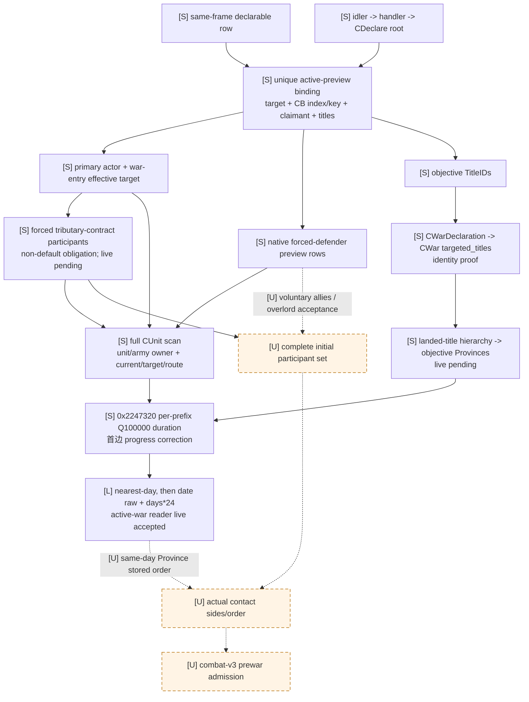

# CK3 1.19.0.6 宣战前 encounter 输入

## 结论

- [static-confirmed] 玩家宣战窗口不会构造一份临时 `CWar`。它长期持有一个
  `CDeclareWarInteractionWindow`，在其中保存当前 interaction、选中的
  `SCasusBelliItem`、目标头衔行和原生强制防守者行。把
  `CWarOverviewWindow+0x1298` 的既存 `WarID` 语义套到宣战窗口，是错误的跨类型偏移迁移。
- [static-confirmed] 当前选中的宣战候选可以被被动、只读地绑定回同一 paused snapshot 的
  `declarable_wars`：interaction actor/recipient、CB 数据库 ordinal、canonical key、claimant 与
  target TitleID 向量必须唯一匹配同一 row。无需猜 `configuration_index`。
- [static-confirmed] 窗口已经物化的 `GetDefenders` 行给出两类 exact-build 原生强制防守者：
  great-holy-war 区域共同防守者（raw reason `0`）与
  `defender_faith_can_join`（raw reason `1`）。它们不是自愿盟友、宗主可能加入提示或全部最终参战者。
- [static-confirmed] `CUnit` storage 足以被动发布每个已知参与者当前已集结单位的 owner、当前位置、
  move target 与剩余 route；但 `CUnitID` 和 `CArmyID` 是两个不同的 full-generation ID，生产 DTO
  必须分别发布。现有 army-strength/combat-v3 wire 有意把 `CUnit+0x10` 命名为 public `army_id`；
  prewar DTO 应保留兼容命名，并另读 `CUnit+0x178` 为 `native_carmy_id`，不能让一个字段兼任两种 ID。
- [static-confirmed] `Send` 前的真实 materializer 会把同一 selected TitleID 向量写入
  `CWarDeclaration` special-interaction payload；命令克隆后，原生 executor 将该向量原样交给
  `0x27A2210`，后者原样复制到新 `CWar+0x270 targeted_titles`。因此可以在不建战、不提交命令的
  前提下复用已实机确认的 landed-title 层级 walker，精确投影 declaration-bound objective Provinces。
- [live-confirmed] 假设路径的 native duration/date ABI 与 active-war production reader 已闭合：规划器的
  `MovePath+0x128` cost 不直接参与
  到达时间换算；`0x2247320` 按 route row 重算 Q100000-day duration，并扣除已经行进的首边部分，
  `0x2947A60` 再按最近整数日换成 CK3 date raw hours。`query-route-contact-horizon-v1-N` 已在 paused exact-build
  replay 返回完整 subject/hostile timelines，并安全授权一日推进。
- [unknown] 当前结果仍不是完整 encounter forecast。自愿盟友/宗主接受、宣战候选与 timing reader 的生产接线、
  同日 tick 顺序与 contact opponent stored order 尚未闭合，所以 prewar forecast capability 继续保持关闭；但
  active-war native arrival 与 bounded one-day contact horizon 已独立完成实机验收。

## 版本与证据边界

- [static-confirmed] 游戏版本：CK3 `1.19.0.6`。
- [static-confirmed] `ck3.exe` SHA-256：
  `2D00FF3101EF70B566F2FCBAE292F09263199C80E9DC8F139B82D7D96F83DB86`。
- [static-confirmed] `game/common/casus_belli_types/_casus_belli.info` SHA-256：
  `E3BACD9F3360837F6ED7D5F22B937AB7E79CB675AD804819A627CB73970CE699`。
- [static-confirmed] `game/gui/interaction_declare_war.gui` SHA-256：
  `00E47623902D8B4E536444D6C66AC249ECBDA672E8F8537DF4A8CFCFFFC1DF1A`。
- [static-confirmed] 本轮在 2026-08-25 只读取文件和反汇编，没有启动、控制或写入 CK3。
- [static-confirmed] RVA 均以 pinned EXE 模块基址为零点；EXE SHA 变化后全部失效。

机器可读边界位于
`ck3_autonomous_player/native_bridge/research/prewar_scope_v1_abi.json`，合成源夹具位于
`ck3_autonomous_player/native_bridge/research/fixtures/prewar_scope_v1_source_contract.json`。

## 严格类型边界：这里没有 preview `CWar`

| 对象 | RTTI / vtable | 已证字段 | 禁止迁移的解释 |
|---|---|---|---|
| `CDeclareWarInteractionWindow` | RTTI `0x5236048`；primary vtable `0x411DE90` | selected CB、claimant、titles、forced defenders、interaction context | `+0x1298` 不是 preview WarID |
| `CWarDeclaration` | RTTI `0x5236020`；primary vtable `0x411DAA0`；size `0x30` | command-bound CBType、TitleIDs、claimant | special-interaction payload，不是 `CWar` |
| `CWarOverviewWindow` | RTTI `0x5210C20`；primary vtable `0x4108DF0` | `0xF54D90` 路径读取既存战争选择 | 不参与宣战前候选物化 |
| `CWar` | 已存在战争的游戏对象 | war storage、participants、combat state | 宣战窗口的 append/clear/refresh 链没有构造它 |

[static-confirmed] `0x1086440` 枚举 CB，使用 `0x2D95D00` 生成 `0x98`-byte 配置，再由
`0x108F180` append `0xB0`-byte UI rows。`0x108D130` 逐个析构这些 rows；
`0x1086080` 重新运行 evaluator 验证选中 item。三条路径都只处理宣战 UI 数据，没有 `CWar`
allocation、constructor 或 destructor。

[static-confirmed] 宣战窗口 object size 是 `0x1418`。allocation/store 为
`0xA8A5E1/0xA8A608`，constructor 为 `0x10849A0`，deleting/core destructors 为
`0x10852E0/0x1085320`。core destructor 清理 CB rows、title rows、forced-defender rows 与其他
窗口字段；它没有销毁 preview `CWar`。

## 可被动读取的稳定根链

[static-confirmed] 原生 getter 路径 `0xAA43C0` 从 `module+0x570F7B8` 取得 idler root，读取
`+0x10 CIdlerGfxBase*`，再从 `CIdlerGfxBase` dynamic-cast 到
`CIngameInterfaceIdlerGfx`。MSVC class hierarchy descriptor 的 PMD `mdisp=0`，所以只读 reader
可以在严格 vtable gate 后原位使用该指针，而不调用 dynamic-cast：

```text
module+0x570F7B8
  -> owner = *slot
  -> idler = *(owner+0x10)
       require *(idler+0x00) == module+0x40B1D30
       RTTI CIngameInterfaceIdlerGfx, base CIdlerGfxBase at offset 0
  -> interface_handler = *(idler+0x88)
       require *(interface_handler+0x00) == module+0x40AF630
       RTTI CIngameInterfaceHandler
  -> declare_window = *(interface_handler+0x120)
       require *(declare_window+0x00) == module+0x411DE90
       RTTI CDeclareWarInteractionWindow
```

[static-confirmed] `CIngameInterfaceIdlerGfx` virtual method `0xAA4350` allocates `0x16CE8` bytes，
调用 handler constructor `0xA71E00`，并把结果写到 idler `+0x88`。handler 初始化链在
`0xA74EE2` 调用 `0xA8A5D0`，后者创建宣战窗口并写 `handler+0x120`。

[static-confirmed] `CDeclareWarInteractionWindow` constructor `0x10849A0` 把 owning handler 写入
`CDeclare+0xD0`；`0x10855F0` 则从 `handler+0xF0` 取当前 character-interaction context，并写入
`CDeclare+0x100`。因此 passive snapshot 除了检查三层 vtable，还必须要求
`*(declare+0xD0) == handler` 与 `*(declare+0x100) == *(handler+0xF0)`。这两项证明对象属于同一
handler/current-context 链，仍不证明窗口当前可见。

[static-confirmed] `handler+0x120` 是常驻窗口对象指针，而不是“只有 UI 打开才非空”的 active
标记。被动 reader 还必须要求当前 interaction、selected CB 与 selected-valid 均存在，并双采整条根链。

[static-confirmed] 更短的 GUI-state leaf 已定位：`CDeclare` primary vtable `+0x38` 指向继承函数
`0x1F30970`。同一通用 vtable 的 `+0x28/+0x30` 分别由 `0x1F30930/0x1F30950` 请求 GUI true/false
状态；`0x1F30970` 从 `CDeclare+0x78` 取 GUI instance，用
`0x36EBB00(instance, layer=1/0)` 得到状态行索引，再从 `0x3827900` 返回的表中读取
`index * 0x308 + 0x300` 的 byte，并结合 `instance+0xD0` bit `3` 得出当前状态。
[static-inferred] 这一组 inherited methods 的语义是 window show/hide/currently-active；在 exact live
对照前仍以 `gui_state_predicate` 命名，不把 `0x1F30970` 擅自导出为最终 `is_visible`。
[unknown] `0x36EBB00` 会进入 GUI registry/同步路径，第一版不得从 worker 调用；需要先把它依赖的
instance registration index 与状态表做无调用镜像，再在 paused snapshot 对照打开/关闭两态。因此当前只允许在
已知已打开并已选择 CB/title 的人工 paused 验收场景发布 partial `active_preview`，不能把常驻对象本身当作
active 证明。

### selected item 与 forced rows 的物化生命周期

[static-confirmed] `CDeclare` vtable `+0x18` 的 `0x10855F0` 是当前 interaction 进入窗口状态的生命周期
入口：它复制 `handler+0xF0 -> CDeclare+0x100`，调用 context vtable `+0x20`，再依次进入
`0x1006F40`、`0x1086440`、`0x1086810`、`0x1086890` 等窗口刷新链。它仍只构造/刷新 GUI model，
不构造 `CWar`。

[static-confirmed] `0x108A200(CDeclare*, SCasusBelliItem row*)` 是 selected-row copier：它逐字段复制
row `+0x00/+0x08/+0x10/+0x58/+0xA0/+0xA8` 到 window
`+0x120/+0x128/+0x130/+0x178/+0x1C0/+0x1C8`，清空并重建 title rows，最后选择合法 title row。
CB row callback `0x1085F00` 在选择变化时于 `0x1085F44/0x1085F4C` 调 copier/materializer；另一条
GUI dispatch 路径在 `0xBD5259/0xBD5261` 做同样操作。title row 改选路径 `0x108A470` 则在
`0x108A4B9` 单独重跑 materializer。三条路径都把 `handler+0x16840` 置 `1`，说明 forced rows 是
selected CB/title 当前 GUI revision 的派生数据，而不是独立的 preview War participant storage。

### `Send` materializer 与 `CWarDeclaration` 生命周期

[static-confirmed] `interaction_declare_war.gui` 的 `Send` binding 在 `0x14E300` 注册 callback
`0x108D760`，wrapper 进入 core `0x1087360`。core 首先调用 can-send path `0x1087DC0`；后者在任何
校验或 confirmation 分支前都于 `0x1087DE8` 调用 `0x1087C80`。直接提交路径 `0x1087C20` 也会再次
调用同一 materializer。因此以下复制不是仅供 tooltip 的预览，而是 command-bound 的最终 UI revision：

1. `0x1087C80` 先复制 claimant 与 embedded arrays 到 caller-owned temporaries；
2. `0x1087D02` 调 `0x1088780`，所以存在 title rows 时，选中 rows 会权威覆盖 embedded TitleID array；
3. `outer_context = *(CDeclare+0x100)`，`actual_interaction = outer_context+0xF8`；其
   special-interaction pointer 位于 `actual_interaction+0x330`，等价于 `*(outer_context+0x428)`；
4. `0x1087D15/0x1087D29/0x1087D32` 分别把 selected `CCasusBelliType*`、权威 TitleID array 与 claimant
   写入 special payload `+0x08/+0x10/+0x28`；
5. passive reader 必须要求 payload vtable 为 `module+0x411DAA0`，即 RTTI `CWarDeclaration`，不能只凭
   三个相邻字段猜类型。

[static-confirmed] `CWarDeclaration` 是 `0x30`-byte `CSpecialInteraction` 派生 payload。默认/复制 factory
为 `0x10A42E0/0x10A4220`；registration `0x14BFC0` 把两组 lambda vtable
`0x411D950/0x411D988` 写入 special-interaction factory registries `0x22828E0/0x2282980` 的
`+0x340`，即固定 index `13`。copy factory 保留 `+0x08` CBType、复制 `+0x10` TitleID array，并复制
`+0x28` claimant。它证明这里存在真实 command payload，但仍没有 preview `CWar`。

[static-confirmed] 提交流程保持这份 payload：`0xFE5190` 调 `0x26B3220` 构造
`CSendCharacterInteractionCommand`（RTTI `0x513C108`，primary/secondary vtable
`0x40829F8/0x40829C8`），再以 flags `0x0E` 交给 `0x973E00`。构造期间 `0x2C3ED50` 复制 interaction
context，并由 `0x2282A20` 通过上述 index-specific copy factory 克隆 `context+0x330` special payload。
真实 interaction executor `0x2C3FA20` 再取 `context+0x330`，于 `0x2C3FAA2` 调 payload vtable
`+0x40`；对 `CWarDeclaration` 精确落到 `0x24D7690`。`0x2752AB8` 是标准 send 分支进入该 executor
的直接 tail-jump。这条链闭合了 GUI selection、queued command 与建战输入之间的身份，不要求 reader
调用其中任何函数。

## 选中候选与 `declarable_wars` 的唯一绑定

### 字段布局

[static-confirmed] 宣战窗口相关布局：

| 偏移 | 类型 / 语义 |
|---|---|
| `+0x100` | current character-interaction context pointer |
| context `+0x3D0` | actor full CharacterID |
| context `+0x3D4` | interaction recipient/raw target full CharacterID |
| `+0x108` | `CPdxArray<SCasusBelliItem row>`；row stride `0xB0`，item at row `+0x08` |
| `+0x120` | embedded selected item：`CCasusBelliType*` |
| `+0x128` | selected claimant CharacterID；`-1` 合法 |
| `+0x130` | selected item target TitleID native array |
| `+0x178` | selected item secondary native ID array；尚未命名，不发布 |
| `+0x1C0` | selected item backpointer，必须等于当前 window |
| `+0x1C8` | selected item native validity byte |
| `+0x1D0/+0x1DC` | title-row root/count；stride `0x40` |
| title row `+0x08/+0x38` | TitleID / selected byte |
| `+0x1E8/+0x1F4` | forced-defender row root/count；stride `0x10` |
| forced row `+0x00/+0x04/+0x08` | CharacterID / raw reason / window backpointer |

[static-confirmed] selected `CCasusBelliType` 继承 `CGameDatabaseObject`：dense database ordinal 在
`+0x10`，canonical key 的 MSVC string 在 `+0x18`（size `+0x28`、capacity `+0x30`）。

[static-confirmed] `0x1088780(CDeclare*, out TitleID array*)` 给出选中 title 的权威分支：

1. `window+0x1DC == 0` 时复制 embedded selected item 的 `+0x130` TitleID array；
2. 否则按 native order 遍历 `0x40`-byte title rows，只收集 `row+0x38 != 0` 的 `row+0x08`。

paused reader 不需要调用它；直接镜像字段可以避免 caller allocator 和 helper callability 边界。

### 唯一匹配规则

[static-confirmed] 同一 snapshot 中，active preview 只能在以下 tuple 与一条且仅一条
`declarable_wars` row 完全相等时绑定：

```text
(
  interaction_recipient_character_id,
  selected_cb_type.database_ordinal,
  selected_cb_type.canonical_key,
  selected_claimant_character_id,
  selected_target_title_ids_native_order
)
```

它分别对应 declarable row 的
`target_character_id / casus_belli_index / casus_belli_key / claimant_character_id /
target_title_ids`。若零匹配或多匹配，返回 `candidate_binding_ambiguous`；不得凭 CB key 或 title 数量选择
configuration。匹配成功后才继承 declarable row 的 `declaration_id/configuration_index`。

[static-confirmed] context `+0x3D0/+0x3D4` 是 interaction actor/recipient。prewar participant primary
defender 仍应使用同 snapshot `query-war-entry-assessments-v1` 的
`effective_target_character_id`；在 static ABI 未证明 redirect 等价前，不把 raw recipient 偷换成 effective
target。若两者相同，这是可验证的合法特例，不是 schema 默认。

## 原生强制防守者

[static-confirmed] `interaction_declare_war.gui:679-712` 把
`DeclareWarInteractionWindow.GetDefenders` 绑定到 `forced_defenders` grid，每一行通过
`WarAllyItem.GetCharacter` 显示。它与 `GetAllyList`、`GetOverlordJoinAcceptance`、
`DefenderTopLiegeMightJoinLater` 及 `GuiAttacker/DefenderFaithMightJoin` 警告是不同数据域。

[static-confirmed] outcome refresh `0x1088AA0` 先调用 `0x1088780`，再清空
`window+0x1F4`，最后由 `0x108F360` append `0x10`-byte rows：

- CB flags `CCasusBelliType+0x1718` bit `17`（`is_great_holy_war`）为真且 titles 非空时，
  `0x2357AA0(target_title, actor_faith, out)` 聚合区域共同防守者，移除 primary recipient 后以 raw
  reason `0` append；稳定语义名为 `great_holy_war_region_co_defender`。
- 否则 bit `15`（`defender_faith_can_join`）为真时，
  `0x2901960(actor, primary_recipient, out)` 求出同信仰且通过原生
  `can_defensively_join_holy_war`/join-value 路径的角色，以 raw reason `1` append；真实建战路径
  `0x27A29A6` 调同一 helper 后用 `0x2225FB0` 把结果加入战争。

[static-confirmed] bit `17` 的名字由 `IsGreatHolyWar` API callback `0xF5D510 -> 0xF5BE80`
对同一 `+0x1718` bit 的读取闭合；bit `15` 由真实建战路径与 `_casus_belli.info` 的
`defender_faith_can_join` 契约闭合。raw reason 必须始终保留，语义字符串只是版本绑定解释。

[static-confirmed] `0x2901960` 的入口 ABI 已闭合为
`(RCX=actor Character*, RDX=primary defender Character*, R8=caller-owned CharacterID vector*)`。
它先比较双方 `Character+0xB4` 的 faith ID，相同则直接返回；否则建立 script scope/evaluator 临时对象，
扫描 defender-faith 候选，排除 actor、primary defender 与原生排除集合，并由脚本 trigger/value 路径筛选后
经 `0x8154D0` 追加输出。已见的 evaluator/cleanup 调用包括 `0xA9BF70`、`0x3358160`、
`0x1B36670`、`0x334C510` 与 `0x3369820`。有界函数体内未见直接 RNG 调用，但这不构成无副作用或
任意线程可调用的证明；其 script context、lazy initialization、allocator 与 application-main 约束仍待闭合。

[static-confirmed] 被动 query 只读已经由 UI 刷新的 rows；它不得调用会清空/重建 UI 状态的
`0x1088AA0`。`0x2357AA0/0x2901960` 的 application-main callability、allocator lifetime 与 script-evaluator
副作用边界尚未闭合前，也不得由 worker/paused reader 直接调用。

[unknown] forced rows 只回答当前 native preview 的确定性附加防守者，不回答：

- attacker/defender voluntary allies 与各自 acceptance；
- overlord join chance 或 top-liege-later warning；
- 宣战提交和真正创建 `CWar` 之间状态变化后的结果；
- 中途加入、雇佣兵/圣战团购买或第三方 contact。

## 强制属国／朝贡参战者

[static-confirmed] `Character+0x1B8 -> extension+0x248`（signed count `+0x254`）不是盟友 CharacterID
列表，而是该角色作为 suzerain/liege 一端持有的 `CSubjectContract` component ID 列表。每行是 4 字节 full ID，
经 storage `module+0x570CCA0`（null-object fallback `module+0x570CC50`）解析。类型证据来自
deleting destructor `0x2251B90` 与 core destructor `0x2251C40`，对象大小 `0xD8`；
它们关联 primary vtable `0x42F9C40`、secondary vtable `0x42F9C08`，COL type descriptor
`0x522F770` 的 RTTI 名为 `.?AVCSubjectContract@@`。resolved object 的 full ID 在 `+0x08`，
subject/tributary `Character*` 在 `+0x20`，liege/suzerain `Character*` 在 `+0x28`。因此不得再把 `+0x248` 命名为
ally/participant CharacterID array。

[static-confirmed] `0x2255360(CSubjectContract*)` 从原生 subject-contract term database 的
`+0xF18` 读取 key 为 `tributary_war_participation_obligation` 的 term，再调用
`0x2253C40(contract, term_type)`。后者在 contract `+0x38` term-pointer array（signed count
`+0x44`）中查找该 term：存在时取 contract `+0x68` 对应 current level，不存在时按 level `0`；
它返回 current level 是否等于 `term+0xAB40` 的 default level；外层 `0x2255360` 只有在 term 显式
存在且这个比较为 false 时才返回真。原版
`common/subject_contracts/contracts/special_contracts.txt` 也把这个约束钉死为二态契约，并明确注释代码
只检查 non-default。这个谓词代表“被宗主强制参加战争的属国／朝贡国”，不是自愿盟友 acceptance。
被动 query 必须直接读 singleton slot `module+0x570C790` 后镜像 `database+0xF18`；singleton 为 null
即 fail closed。不得调用 accessor `0x9A67B0`，因为其 null 分支会经 `0x3B98000` 惰性初始化。

[static-confirmed] 新 `CWar` builder `0x27A2210` 在 primaries 已写入、返回前于 `0x27A2A33`
唯一调用 `0x27A1EC0(nascent CWar*, primary attacker, primary defender)`：先按 attacker 的
`+0x248` contract native order 枚举并把 qualifying `contract+0x20` subject 加入 attacker side，再按
defender 的 contract native order做同样投影到 defender side。实际追加使用 mutator
`0x2225FB0(CWar*, Character*, attacker_side, raw_flag, raw_fifth_flag)`；它选择
`CWar+0x20/+0x80` participant container、分配 `0x28` row、写 full CharacterID，并注册战争关系和可能的
后续副作用。paused DTO reader **不得** 调用 `0x2225FB0` 或构造临时 `CWar`；只可镜像
contract IDs、endpoint identity 与 non-default obligation 判定，并保持两次样本一致。原生构造路径在
generation resolve 失败时会落 fallback object；被动 reader 不得把 fallback 当有效 participant，必须以 full ID
identity、`contract+0x28 == source primary`、可解析的 `contract+0x20` subject 与 database `+0xF18`
term identity 全部通过为 admission。

[static-confirmed] `0x2225FB0` 在 `CWar+0x358 != 0` 时整体 no-op；真实 nascent `CWar` 构造链
`0x255AB00` 明确先把该 dword 置零，所以此 guard 不会取消当前初始参战子集。它仍是写世界函数，不能被
paused reader 用来“试算”。同样禁止直接调用 `0x9A67B0`、`0x2255360`、`0x2253C40`、
`0x25FD2C0`、`0x27A1EC0` 或 `0x2225FB0`。

[static-confirmed] 两轮并非完全对称：attacker round 会把 subject full CharacterID 等于 primary defender 的
row排除，并改走有世界写入的 `0x25FD2C0`；defender round 没有对应的 primary-attacker collision 检查。
两轮都没有 duplicate/self/source-endpoint 去重，且调用 `0x2225FB0` 时固定 raw `R9=1`、fifth stack flag
`0`。因此 wire 需要保留 `source_contract_native_order` 与 raw level，不能自行排序、去重或推导更强语义。
双方 container 顺序分别是：primary attacker 后接 qualifying attacker-source contracts；primary defender 后先
接 CB bit 15 faith defenders，再接 qualifying defender-source contracts。

[static-confirmed] 这条链闭合的是 initial participant set 中的
`native_forced_tributary_contract` 子集。它没有覆盖 voluntary attacker/defender allies、overlord/top-liege
接受、faith warning rows 或宣战提交后的状态变化。因此
`forced_tributary_contract_participants_static_ready=true` 可以成立，live gate 仍为 `false`，而
`complete_initial_participants_ready` 必须继续为 `false`。

## CUnit、CArmy 与当前地理 skeleton

[static-confirmed] CUnit storage singleton slot 是 `module+0x570CC80`：storage slots `+0x20`，
capacity `+0x2C`，slot stride `0x10`，object pointer `+0x08`。每个非空对象必须通过 full-generation
index 与 object identity 回读。

| `CUnit` 偏移 | 发布字段 |
|---|---|
| `+0x10` | public `army_id`，full CUnitID；沿用现有 bridge contract |
| `+0x20 -> CProvince+0x10` | `current_province_id`；null 是合法“当前无 Province”状态 |
| `+0x30 -> CProvince+0x10` | `move_target_province_id`；null 是合法“当前无 move target”状态 |
| `+0x38/+0x40/+0x44` | route data/capacity/count；每行 pointer 指向首字段为 full ProvinceID 的 row |
| `+0x174` | owner full CharacterID |
| `+0x178` | `native_carmy_id`，full CArmyID |

[static-confirmed] production 最小军队 row 必须同时含 public `army_id` 与 `native_carmy_id`，再以
CArmy storage `module+0x570C730` resolve `native_carmy_id`。该 storage 同样使用
`+0x20` slots、`+0x2C` capacity、`0x10`-byte slot 与 slot `+0x08` object；resolved object 必须以
`CArmy+0x10` 回读完整 CArmyID，并要求 `CArmy+0x124` generation-resolve 回同一 public `CUnit`。只发布
owner 相等不足以接入 combat-v3；也不得使用相邻 fallback `module+0x570C720`，或把 internal CArmyID
写回既有 `army_id` 字段。

[static-confirmed] active-preview partial participant set 的 canonical 顺序为：primary actor、war-entry
effective target、forced-defender rows 的 native order。军队 row 在 side 内按
`(participant_order, army_id, native_carmy_id)` 排序；不得按 pointer 排序。每个 participant 的 CUnit scan 必须来自同一
paused revision 的完整 storage 双采。

[static-confirmed] 当前 location/target/route 是已经存在的命令状态。它不预测宣战后会下什么命令，也不证明
军队会沿这条 route 去 objective。因此它可以解锁“当前部署/已下令状态”诊断，不能单独令 arrival 或 contact
readiness 为真。

## Objective、arrival 与 contact 的剩余门

- [static-confirmed] selected target TitleIDs 已 exact；`objective_title_ids_ready=true` 可以成立。
- [static-confirmed] `CWarDeclaration` vtable `+0x40` 的 `0x24D7690` 从 payload `+0x08/+0x10/+0x28`
  读取 CBType、同一 TitleID array 与 claimant，同时从 interaction context `+0x2D8/+0x2DC` 读取
  attacker/defender，再调用建战函数 `0x27A2210`。后者在 `0x27A246D` 写 `CWar+0x100=CBType*`，在
  `0x27A2474/0x27A247B/0x27A2482` 把 caller TitleID array 原样复制到
  `CWar+0x270 targeted_titles`；中间不存在 CB-specific title 替换。
- [static-confirmed] active-war `game.state.war-objectives` 已闭合并实机验证同一 `CWar+0x270` 投影：
  `CLandedTitleManager = CK3GameData+0x2FC8`，storage pointer `+0x20`，slot stride `0x10`/object `+0x08`，
  `CLandedTitle+0x10` 回读完整 TitleID；de-jure child array 为 title `+0x240`、count `+0x24C`；barony
  template `+0x160` 的 `+0x80` 是 ProvinceID。`title_province` evaluator `0x19D5AB0`、field dispatcher
  `0x20B2C80` 与 recursive walker `0x20B4D50` 共同钉死：barony 直接取省，county 取首个 de-jure
  capital barony，duchy/kingdom 按 native child order depth-first 展开各 county capital；每 war 最多
  4096 titles、深度 8，并按首次出现稳定去重 ProvinceID。
- [static-confirmed] 因为 selected TitleIDs 到新 `CWar targeted_titles` 是恒等复制，declaration-bound reader
  可直接对 selected vector 运行同一只读 title-storage walker，发布 `objective_province_ids`；无需构造
  `CWar`、调用 `Send` 或猜 capital。既有最小化 live 证据为 war `16777290`：target title `2388` 经
  `2388 d_spoleto -> 2389 c_spoleto -> 2390 b_spoleto` 投影为 province `2585`。prewar 同源投影仍需
  一次 paused active-preview live 对照，所以拆为 `objective_provinces_static_ready=true` 与
  `objective_provinces_live_ready=false`。
- [static-confirmed] native path builder ABI 为
  `0x23C33D0(PathCtx*, origin Province*, target Province*, route_kind=2, MovePath*)`；
  `MovePath+0x128` 是 int64 A* planning cost。它只生成 caller-owned path 输出；arrival wrapper
  `0x2947A60` 不读取该 cost，而是另行调用 per-edge calculator。因此不能把 route cost 或 row 数量当天数。
- [static-confirmed] arrival wrapper 的真实五参数 Win64 ABI 为
  `CDate* 0x2947A60(CDate* out, CUnit*, CProvince* origin, CProvince* target,
  const CDate* base_date)`，第五参数位于 caller stack `+0x28`。其直接 xref 为
  `0x23D3519/0x261F336/0x3DE6645`。它构造 `0x130`-byte `MovePath` 与 `0x70`-byte `PathCtx`，以
  `route_kind=2` 调 `0x23C33D0`，但不检查 builder 返回的 bool，随后无条件调用 `0x2247320`；生产 reader
  不得照搬这个失败语义。
- [static-confirmed] duration calculator ABI 为
  `int64* 0x2247320(CUnit*, int64* out_q100000_days, const MovePath*, const CProvince* origin)`；直接 xref 为
  `0xC70E25/0x2249530/0x2947AEB`。它只读 `MovePath+0x00` row-pointer data 与 `+0x0C` count，按原存储顺序
  逐 row 在当前 Province 的 adjacency `+0x50/+0x5C` 中找边，调用 `0x23C45B0` 累加每边 duration，
  再把 row ProvinceID 解析为下一 origin。它不去重，所以 route 的 loops/duplicates 与每个 index 必须原样保留。
- [static-confirmed] `0x2246EC0` 计算 land speed，使用 native exact aggregate index `0x189`、条件 aggregate
  `0x19D/0x18A`、friendly-area bonus、minimum clamp，以及 normal/retreat movement-speed define；
  `0x2247180` 使用 aggregate index `0x10F`、minimum clamp 与 fleet-speed define 计算 naval speed。
  `0x23C45B0` 在 land/water 边上选择相应速度，跨入 water 或 land 时分别用 Q100000
  `EMBARK_COST`/`DISEMBARK_COST` 覆盖普通边耗时。stock define 值为 `30`/`10` days。
- [static-confirmed] 若 `CUnit+0x44` existing-route count 非零，且 proposed path 首 row ProvinceID 等于
  `CUnit+0x38` existing route 首 row，calculator 会从总 duration 恰好扣一次当前边已走部分：progress raw
  为 `CUnit+0x168`，speed 优先取正值 `CUnit+0x190`，否则经 `0x2247B40` 重算，再做 signed Q100000
  fixed division。tick path `0x2247D3C..0x2247D94` 同样每 tick 把该 speed 加到 `+0x168`，到达当前边 raw cost
  后扣 cost 并 pop row，独立印证 progress/speed 字段语义。
- [static-confirmed] `0x2947A60` 的精确换算为
  `days = trunc_toward_zero((q >= 0 ? q + 50000 : q - 50000) / 100000)`，然后
  `arrival.raw = base_date.raw + days * 24`。即最近整数日、恰好半日时远离零；合法非负 duration 等价于
  `floor((q + 50000) / 100000)`。`CDate` raw 单位为 hour。短 prefix 可以得到 `0` days，多个相邻 route index
  可以合法落在同一 date，不能要求日期严格递增。
- [static-confirmed] `0x2247320` 不写 path/header/rows，始终返回 caller 的 out pointer，没有成功 bool：空 path
  返回零，找不到 adjacency 时静默跳过该 row。land/naval divisor 或 current-edge correction speed 为零时，
  相关分支的 `mov eax,0xffffffff` 在 x64 上零扩展为 `4294967295`：它会成为边 duration，或从累计 duration
  中被扣除，而不是 int64 `-1` status。再加上 wrapper 忽略 builder bool，`arrival == base_date` 不能证明成功。
  严格 reader 必须保留 builder bool，逐 row generation-resolve ProvinceID、验证 exact adjacency 与最终 target，
  并拒绝非正 speed、负 duration、异常大 duration 或 prefix duration 下降；合法相等值必须保留。
- [live-confirmed] `0x2247320` 与速度 helper 的生产调用边界固定在 paused application-main mailbox：同 revision
  generation preflight 之后、owner `MovePath` 析构之前同步调用；不允许从 worker thread 直调。该边界已经由
  active-war route-contact replay 验收。arrival 同日 ties 与 Province stored-order/contact tick 的先后关系仍未闭合。
- [static-confirmed] 真正 contact opponent builder `0x2209450` 按 target
  `CProvince+0x748/+0x754` 的 CUnit stored order 选对手；实际 constructor path `0x27FB7C0` 会创建
  `CCombat`，paused query 禁止调用。
- [unknown] production/live arrival 已闭合为有界 active-war 输入，但同日 stored-order 投影未通过时，仍无法提前
  确定真实 contact opponent set/order。当前 province/route/timeline 与一日 predicate 只能证明所查询窗口无冲突，
  不是实际 contact 结论。

## 最小 DTO 与 readiness

[bridge-design] active-preview 扩展应在既有 declaration-bound primary skeleton 之上增加：

```json
{
  "candidate_binding": {
    "declaration_id": "<unique current row>",
    "interaction_actor_character_id": 29829,
    "interaction_recipient_character_id": 29097,
    "effective_target_character_id": 29097,
    "casus_belli_index": 11,
    "casus_belli_key": "<canonical key>",
    "configuration_index": 0,
    "claimant_character_id": -1,
    "objective_title_ids": [2388],
    "objective_province_ids": [2585]
  },
  "forced_defender_preview": [
    {
      "character_id": 4001,
      "native_reason_code": 1,
      "reason": "defender_faith_can_join"
    }
  ],
  "current_raised_armies": [
    {
      "army_id": 16777217,
      "native_carmy_id": 33554449,
      "owner_character_id": 29829,
      "side": "attacker",
      "current_province_id": 100,
      "move_target_province_id": 101,
      "route_province_ids": [101, 102]
    }
  ]
}
```

[bridge-design] readiness 必须拆开：

| gate | 当前状态 | 含义 |
|---|---|---|
| `primary_scope_ready` | static skeleton ready | actor/effective target 与其当前 CUnits |
| `active_preview_root_ready` | static ABI ready；live pending | 根链、vtable、selected-valid 双采 |
| `candidate_binding_ready` | static ABI ready；live pending | 唯一匹配 declarable row |
| `forced_defender_preview_ready` | static ABI ready；live pending | 只读 `+0x1E8` rows |
| `forced_tributary_contract_participants_static_ready` | `true` | 两侧 primary 的 contract native order + non-default obligation |
| `forced_tributary_contract_participants_live_ready` | `false` | 尚缺 active-preview paused 双采对照 |
| `forced_tributary_contract_participants_ready` | `false` | production/read-only capability 尚未接线与实机验收 |
| `objective_title_ids_ready` | static ABI ready；live pending | exact selected TitleIDs |
| `objective_provinces_static_ready` | `true` | command identity + 已验证 title hierarchy projector |
| `objective_provinces_live_ready` | `false` | 尚缺 active-preview paused source 对照 |
| `complete_initial_participants_ready` | `false` | 缺 voluntary allies/overlord 与非 UI materialization |
| `objective_provinces_ready` | static fixture `true`；production `false` | 静态投影闭合；live gate 尚未通过 |
| `native_arrival_timeline_ready` | `false` | 该键专属 prewar declaration-bound timing；active-war sibling `route_contact_horizon_supported` 已实机通过，但不能改写此门 |
| `actual_contact_scope_ready` | `false` | 缺同日 Province candidate/stored order/tick；一日无冲突不能证明实际 contact sides/order |
| `combat_v3_prewar_scope_ready` | `false` | 还未形成有序双方 CArmy scenario |
| `war_entry_forecast_inputs_ready` | `false` | 上述门未全闭合 |
| capability advertised | `false` | 不接 production bridge/MCP |



## 下一项 RE 与最短 live 验收

### 下一项可施工 RVA

1. [static-confirmed] 首先实现无 native call 的 passive mirror：稳定根链
   `0x570F7B8 -> +0x10 -> +0x88 -> +0x120`，验证 `declare+0xD0` owner 与
   `handler+0xF0 == declare+0x100` current context，再镜像 selected item、title rows、forced rows 与
   `0x1F30970` GUI-state leaf。
2. [unknown] 为去掉“必须打开 UI”的限制，优先闭合
   ABI 已知的 `0x2901960(actor, defender, out)` 的 application-main callability、allocator ownership 与
   script-rule side-effect；这是 `defender_faith_can_join` 的最短 exact no-UI 入口。
3. [unknown] great-holy-war 分支对应 `0x2357AA0(target_title, actor_faith, out)`；同样先闭合 caller thread、
   output lifetime 与 world-write/RNG 边界。
4. [static-confirmed] objective Province 的最短 reader 已可施工：在上述 passive mirror 中额外 gate
   `CWarDeclaration` vtable `0x411DAA0` 与 fields，再把 selected TitleIDs 交给现有 generation-safe landed-title
   walker。只读 reader 不调用 `0x1087C80/0x2C3FA20/0x27A2210`；这些 RVA 只构成恒等来源证明。
5. [live-confirmed] active-war arrival reader 已按此入口施工：在 paused main-thread mailbox 内调用
   `0x23C33D0` 并保留其 bool；owner `MovePath` 存活期间，为 route index `i` 建一个只复制同一 row-pointer data、
   `count=i+1` 的 caller-owned shallow prefix header，逐 prefix 调 `0x2247320`。shallow header 不得析构；
   full owner 最后按原生路径清理。输出 array 必须与 route indexes 一一平行并保留 loops/duplicates；每个 prefix
   独立应用 `0x2947A60` 的 exact rounding，允许相同 date。任一 Province/edge/speed/duration gate 失败则整条
   timeline unavailable，不能从 route cost/hops/soldiers 猜值。
6. [unknown] contact 最后继续 `0x220842F..0x2208646` 的 same-tick candidate mutation/scan 与
   `0x2209450` stored-order policy；paused query 永不调用 `0x27FB7C0`。

### Active-war arrival / 一日 horizon 实机验收

[live-confirmed, 2026-08-26] 首次从 paused date `53176176` 重放时，route ticket 在 native executor 运行前因
通用 2 s queued wait 超时；exact EXE/hash 与 bindings 均已通过。修复让同一 queued ticket 保留 8,000 ms，并在
executing 后以 2,000 ms slices 等到 terminal；2,200 ms delayed-pump fixture 覆盖该真实失败。

最终生产 DLL SHA-256
`7AF3472A67218BDC407693D93A51826E2D99E29DB101EF724DC0B10FA60DC524` 对 ArmyID `83886341`、target
`2604` 与完整 hostile scope `[357,33554657]` 在 2.466 s 返回 `available`，mailbox `executed_requests 0 -> 1`。
timeline 给出 `one_day_contact_free=true`，只授权 `53176176 -> 53176200` 的一日 speed-1 paused-to-paused
推进；war projection 发生变化，checkpoint SHA-256 为
`51A3C202D6785988F3E3E7F028B64C4F0949DD83A4E32F3222E286B110224BE8`，normal cleanup proven。
这闭合 production arrival/一日 contact horizon，不闭合同日 stored order 或 actual contact sides/order。

### 宣战前完整输入的最短 paused live acceptance

[live-pending] 不操作宣战命令：人工打开一个合法宣战 interaction，选中 CB 与 title 后暂停；只读 reader：

1. 从 `module+0x570F7B8` 走完整 vtable-gated 根链，校验 owner/current-context 回链与镜像后的
   `0x1F30970` GUI-state leaf，两次完整采样必须逐字段相等；
2. 读取 actor/raw recipient、CB ordinal/key、claimant、selected TitleIDs，并与同 revision
   `declarable_wars` 恰好一条 row 完全匹配；同时要求 `*(context+0x428)` vtable 为
   `module+0x411DAA0`，其 CBType/claimant/TitleIDs 与 window materialization 完全相等；
3. 读取 `+0x1E8` forced rows，逐个 generation-resolve CharacterID，并按 native order 与 GUI
   `forced_defenders` portraits 对照；
4. 对 primary/effective target/forced owners 扫 CUnit storage，同时发布 public `army_id` 与
   `CArmy+0x124` 回链验证后的 `native_carmy_id`、current、move target、route；
5. 用同一 paused sample 的 selected TitleIDs 走 generation-safe landed-title walker，要求
   `objective_province_ids` 可重复，并与窗口目标头衔的 barony/county hierarchy 一致；若随后由人工另行提交，
   可把新 active war 的 `targeted_title_ids/war_objective_province_ids` 作为第二阶段对照，但第一阶段不提交即可
   验收只读 prewar query；
6. 复用已实机通过的 timing adapter，在同一 paused mailbox revision 对 declaration-bound current Province ->
   objective route 做两次完整采样：
   builder 必须成功，每个 route index 必须有同 index prefix duration/date，duration 非负且单调不降、date
   单调不降并允许相等；full-prefix 结果必须等于 full-path 单次结果，两次采样必须逐字段相等；
7. active-war arrival gate 已为 true；在第 6 项通过前只保持 prewar binding 为 pending。通过后仍保持
   contact/combat-v3 gates 为 false，直到 same-day candidate/stored-order 分支单独闭合。

第一阶段一次即可同时证实根链、active candidate binding、command-bound title identity、objective projection、
forced-defender rows 与 CUnit/CArmy identity；它不发送 interaction、不推进时间，也不把 GUI 预览冒充最终
战争结果。
