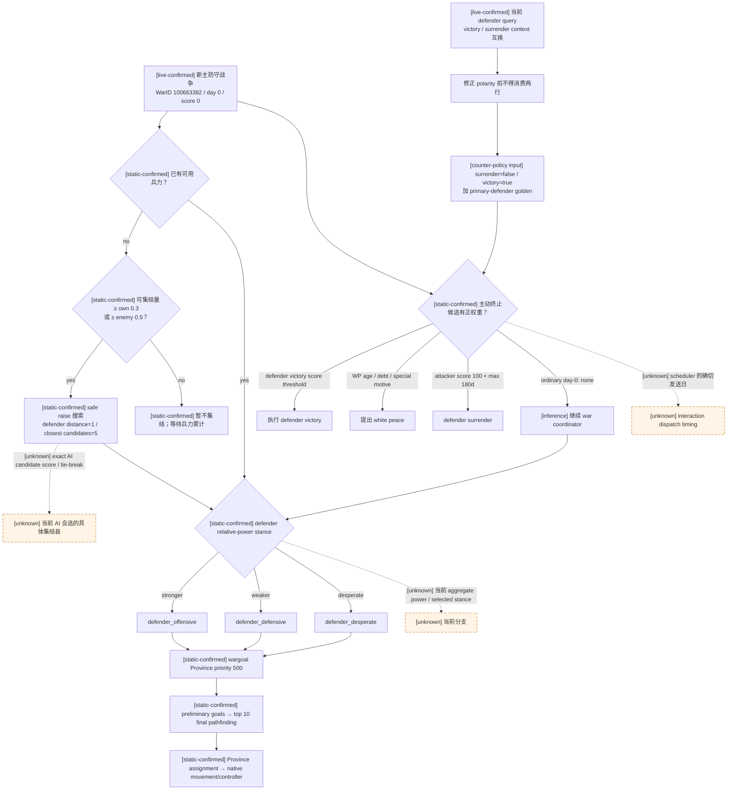

# CK3 1.19.0.6 新发生主防守战争的原生响应树

## 结论

- [static-confirmed + inference] 原版 AI 在一场新发生的主防守战争中，并不先计算完整 campaign forecast 或三种退出结果的
  完整动态条款，再决定能否集结和移动。原版数据分别定义兵力集结门、defender stance / objective controller 和
  战争终止 interaction；没有终止候选时继续运行军事 controller 是这三条已证独立链的 fallthrough 解释，尚未把外层
  scheduler 的每条 C++ edge 都命名。
- [static-confirmed] 三个默认 defender stance 都把 `wargoal_province` 设为最高基础 priority `500`。
  因此尚未读出相对总兵力、无法区分 offensive / defensive / desperate 时，**战争目标仍是三者的共同原生输入**；
  相对兵力影响后续目标质量，不是新战争从零开始行动的绝对门禁。
- [production-blocker-live] run `20260828T053149Z-one-generation-9ace0939` 中，玩家 `29829` 在
  `date_raw=53232216` 成为 `naval_expansion_cb` 的 primary defender，WarID `100663382`、战分 `0`、
  objective Province `2627`。`raise-troops-default` 已在同一暂停日期生成可控 ArmyID `100663369`，随后 planner
  仍因完整 victory / white-peace / surrender terms 和 campaign forecast 缺失而停止；这是我方门禁，不是原版继续作战门。
- [static-confirmed + production-blocker-live] 当前 source `88dba0a` 还有一个更早的语义错误：
  `ReadWarTerminationOptions` 把 `0xC569F0` 的 bool 当成“绝对 attacker victory”，但该参数已经由战争面板调用链
  闭合为 `player_victory`。所以玩家为 defender 时，当前 query 的 `victory` 与 `surrender` context 实际互换；
  本次 live 返回值恰好与该互换完全吻合。修正并加 primary-defender golden 以前，这两行不得作为退出决策输入。
- [counter-policy input] 解除当前 B1 的最小输入不是完整战争模拟器：先修正 defender outcome 极性；随后在
  day-0 / score-0、没有可执行胜利且未选择退出时，允许已经集结的军队消费 exact wargoal、army route/state、
  route preview/contact 与 tactical safety，继续既有军事 OODA。完整条款与 campaign forecast 只在真正比较或提交
  white peace / surrender 时成为门，不应阻塞无退出动作的普通防守行动。

## 版本、原版数据与 live artifact

- [static-confirmed] CK3 `1.19.0.6`；`ck3.exe` SHA-256：
  `2D00FF3101EF70B566F2FCBAE292F09263199C80E9DC8F139B82D7D96F83DB86`。
- [static-confirmed] 原版数据均来自同一安装包：

| 文件 | SHA-256 | 本文消费的原生输入 |
|---|---|---|
| `game/common/ai_war_stances/_ai_war_stances.info` | `0F01AAAB6922FDCA19B87A4421768F83B0C75534A128A73AF8CECADD52F6205E` | stance 选择顺序、相对兵力和 objective 语义 |
| `game/common/ai_war_stances/00_ai_war_stances.txt` | `4F5AA322C4D7272338F4C7B111B7462D4A1FEC886E93E7178084D318CEB8E294` | 三个 defender stance 的 objective priorities |
| `game/common/defines/ai/00_ai.txt` | `C78F9CD8DF9938CC9F38E817BCB6E32CD13720B5BD9DE077B85E3E1C6F030293` | 集结阈值、安全集结范围、目标/stance cadence |
| `game/common/character_interactions/00_war.txt` | `5C99B8F14893929A9BC2DBB5B258CDD2D4233D5805091952209413DE876EE09F` | 胜利、白和、投降的主动提出和接受树 |
| `game/common/casus_belli_types/07_ep3_admin_cbs.txt` | `305622DE1A876510380355B2328E6989E377E5D32133A03AA24D9AB35B44D5A6` | `naval_expansion_cb` 的目标和三结果 effect |

- [production-blocker-live] run：
  `C:\Users\xenoa\AppData\Local\Temp\xar-marriage-reject-c21c096-state\runs\20260828T053149Z-one-generation-9ace0939`。
  `report.json` SHA-256
  `433A661EABBE554626A6936D0711012C711CFD87E36AC7E78BC882FB2B7D82C5`；`first-blocker.json` SHA-256
  `1C74C447EC1982BE80CD026EE3CAD62F92A3828C01C4B77720F9E5960BEEF24A`；seed checkpoint SHA-256
  `EDEF4C588C0BA937B45605C3DED1747A95FD0F1B6898501BE1614555B321D4FE`。
- [evidence-boundary] 该 report 的 `ck3_executable_sha256` 字段为 `null`，所以它本身不独立证明 EXE hash；
  live 证据只能与 report 广告的 `game_adapter_id=ck3-1.19.0.6-msvc-x64` 和本目录已有 exact-build 冻结并列使用，
  不能把空字段改写成 live hash observation。

## 当前 B1 的真实时间线

| turn | 日期 | 已观测事实 |
|---:|---:|---|
| 11 | `53231952 → 53232216` | [production-blocker-live] 原 30 日非战术推进在第 11 日被 `war_changed` 停止；新 WarID `100663382`，玩家无军，objective=`[2627]`，敌 primary default rally=`476`。 |
| 12 | `53232216` | [production-blocker-live] 第一次 `query-war-termination-options-100663382` 成功。 |
| 13 | `53232216` | [production-blocker-live] `raise-troops-default` submitted；after snapshot 新增 ArmyID `100663369`，日期未推进。 |
| 14 | `53232216` | [production-blocker-live] 第二次同帧 termination query 成功。 |
| 15 | `53232216` | [production-blocker-live] planner 以 `defensive_war_exit_evidence_required` 停止，没有发出移动或时间推进命令。 |

[production-blocker-live] blocker row 还确认：玩家是 primary defender；primary attacker 是 CharacterID `31948`；
战争日数 `0`；attacker / defender score 及 battles / imprisonment / occupation / ticking 全为 `0`；CB database index
`69`、key `naval_expansion_cb`、允许白和。当前 artifact 没有发布 ArmyID `100663369` 的省份、兵力或 route，
因此本研究不猜它的实际集结省，也不宣称 Province `2627` 已经 route-safe。

## 原生第一步：兵力集结

### 原版 AI 数据门

[static-confirmed] `00_ai.txt` 明确给出：

- AI 尚无已集结军队时，待集结兵力至少达到自身最大兵力的 `0.3`，**或**至少达到敌军的 `0.5`，才会集结；
- 已有军队后再次尝试集结 levy 的 cooldown 是 `180` 日；
- 决定需要更多军队后，新增可集结兵力至少累积到自身 possible troops 的 `0.1`，避免频繁生成极小军团；
- defender 和 attacker 的 safe raise 搜索距离均为 `1` county；
- 计算到 war-goal counties 的距离后，improved raising 从最近的 `5` 个 safe counties 中选择实际集结县。

[unknown] exact-build 中消费这些 define 的 AI tick 入口、五个 safe county 的完整评分/tie-break、事件触发与周期重试的
精确顺序尚未闭合。原版数据能证明这些是原生 AI 的集结输入，不能证明当前角色在当前帧实际选中了哪一个县。

### 当前 bridge 命令不是原生 AI 的完整集结选择器

- [static-confirmed] 当前 `raise-troops-default` 使用 `0x224CC80(Character*)` 解析角色的 default rally Province，
  再由 `0x26D6FC0` 构造单省 `CRaiseTroopsCommand`、`0x26D7150` validator、flags `7` queue 和
  `0x10E7950` teardown。它是合法的原生玩家命令 ABI。
- [static-confirmed] 因为这个写口只消费 default rally Province，它没有复现上述 war-aware safe-county candidate tree。
  本次命令成功只能证明“一次合法集结已生成可控军”，不能写成“与原生 AI 选择了同一集结县”。
- [counter-policy input] 对当前已经成功集结的 B1，不应为了追求完整 AI rally parity 再冻结推进；先读取新 ArmyID 的
  current/route/state 并做下一条 exact route 决策。只有后续真实 outcome 证明 default rally 导致不可用或危险，才把
  safe-rally selector 提升为该 run 的新 blocker。

## 原生第二步：defender stance 与移动

[static-confirmed] `_ai_war_stances.info` 的顺序是：按 participant side 与计入 elite troop quality 的相对 army size
产生 `stronger / weaker` 属性；defender 显著弱势且接近战败或只剩一个 landed title 时还可进入 `desperate`；先执行
behaviour attribute 过滤，再执行 `can_be_picked`，最后取最高 `ai_will_do` score 的 stance。

三个普通 defender stance 的第一个 objective block 为：

| stance | 共同最高项 | 其它主要项 |
|---|---|---|
| `defender_offensive` / stronger | `wargoal_province=500` | wargoal/primary-defender area enemy unit `250`；任意 enemy unit `200`；enemy capital `150`；enemy province `100` |
| `defender_defensive` / weaker | `wargoal_province=500` | area enemy unit `250`；任意 enemy unit `200`；`defend_wargoal_province=100`；capitals `50` |
| `defender_desperate` | `wargoal_province=500` | area enemy unit `250`；own capital `50`；own province `25` |

- [static-confirmed] 每个 unit stack 先得到 preliminary goals，仅 top `10` 进入包含 pathfinding 的 final evaluation；
  assignment 最终落为 Province target，再走普通 native move command。
- [static-confirmed] stance 正常每 `30` 日重算；split/merge 每 `14` 日；target 正常每 `7` 日重算，lopsided
  power ratio 不高于 `0.33` 时为 `14` 日。事件驱动的更早 invalidation 仍是 unknown。
- [static-confirmed] all-defender common invariant 是 exact war goal，而不是 enemy default rally Province。
  当前 active-war snapshot 已发布 objective `2627`；因此下一军事 epoch 应优先对这个 exact objective 做军队状态和 route
  查询，不能把 `476` 当作自动目标。
- [unknown] 当前 report 没有双方 aggregate power、selected stance、ArmyID `100663369` 的位置/route 或敌已集结军，
  所以本研究不选择具体 move literal，也不声称 `2627` 已安全。

## 原生第三步：胜利、白和、投降或继续

### 主防守方的普通主动终止树

[static-confirmed] 原版的三种战争终止 interaction 与军事 controller 是分离的：

- 防守方执行胜利使用 `end_war_attacker_defeat_interaction`。普通 AI defender 在 defender score `100` 时主动执行；
  Peacemaker、文化、dynasty 或断首变量可在带附加门的 `90/70` 分支提前执行。
- 防守方投降使用 `end_war_attacker_victory_interaction`。当 AI actor 是 defender 时，普通主动分支要求
  attacker score `100`，并在 maximum war score 停留至少 `180` 日；这不是未来战斗预测。
- 防守方主动提出 white peace 的普通早期分支要求战争至少 `182` 日且 defender score 不高于 `15`；
  至少 `365` 日又有长期战争分支；债务分支也要求至少 `182` 日。conqueror defender 对 AI attacker 有独立 `+100`
  特例，人质分支通常要求至少 `365` 日。
- `ai_will_do` base 为 `0`。没有任何主动终止分支形成正权重时，原版继续执行 war coordinator；
  `00_war.txt` 的这些分支不消费 battle Monte Carlo、完整 campaign outcome distribution 或 CB structured terms query。

[inference] 因此在普通 day-0 / score-0 防守战中，若没有未观测的 conqueror 等特例，原版行为是“继续军事 controller”，
不是“因没有 forecast 而暂停”。当前角色是否带所有特例变量没有在本 artifact 发布；该缺口不改变完整 forecast 并非
原版普通 continue gate 的静态事实。

### `naval_expansion_cb` 的当前结果方向

[static-confirmed] 对玩家 defender：

| 玩家结果 | 绝对 CB result | 原版脚本的关键后果 |
|---|---|---|
| surrender | attacker victory | target county holder 改为 attacker；attacker 获得 victory legitimacy/influence/prestige-experience，并建立 truce |
| white peace | white peace | 不转移 target title；attacker 损失 `minor_prestige_value`，双方按人格承受可能 stress，并建立 truce |
| victory | attacker defeat | attacker 支付 `pay_short_term_gold_reparations_effect(GOLD_VALUE=2)`、损失 medium prestige/legitimacy/influence；defender 获得 medium prestige，并建立 truce |

[static-confirmed] 这足以证明 surrender 会放弃目标 county，而 white peace / victory 不会；但 dynamic gold、实际 target
holder operations、truce expiry、盟友、战俘和当前资源仍未进入 production terms wire。它们在真正比较退出效用时仍是质量依赖，
不应被写成已完成。

## 当前 primary-defender query 的极性错误

### exact-build builder 合同

[static-confirmed] WarOverview 的 `SetEffectsTabVictory` 调
`0xC569F0(war, true)`，`SetEffectsTabDefeat` 调 `0xC569F0(war, false)`。函数内部只在玩家为 attacker 时
反转该 bool，再按结果选择 index `2` attacker-victory 或 index `4` attacker-defeat。由此 bool 的 caller 语义明确是
`player_victory`：

- `0xC56A14` 读取 primary attacker，`0xC56A20` 与 local player 比较；命中 attacker 后在
  `0xC56A24` 改取 primary defender recipient，并于 `0xC56A2A` 执行 `xor sil,1`；
- 玩家是 primary defender 时，`0xC56A30–0xC56A3C` 保留输入 bool；`0xC56A41–0xC56A4B` 再把结果映射到
  interaction database slot。

| 想构造的玩家结果 | 必须传入 |
|---|---:|
| surrender / player defeat | `false` |
| victory / player victory | `true` |

[static-confirmed] 该输入不随玩家 side 改变；side 极性已经由 `0xC569F0` 内部处理。

### source `88dba0a` 与 live fingerprint

[static-confirmed] commit `88dba0a244a93a7d5c054e4909fdfa4f8eb31a6e` 的
`ck3_autonomous_player/native_bridge/src/ck3_11906.cpp`（Git blob
`1621592442a7cc8f465b8e3bc38dfd805421804d`）在 `ReadWarTerminationOptions` 中却调用：

```text
surrender: EvaluateWarResolutionContext(..., !player_is_attacker)
victory:   EvaluateWarResolutionContext(...,  player_is_attacker)
```

[static-confirmed] 这只在玩家是 attacker 时偶然等价于 `false / true`；玩家是 defender 时变成 `true / false`，
恰好交换两个 context。

[production-blocker-live] 当前 artifact 的两行形成独立 fingerprint：

- JSON `surrender` 标成 `attacker_victory`，但实际传入 `true`，所以构造的是玩家胜利 / `attacker_defeat`；
  在 score `0` 时 validator=false、raw=`-99`、auto=false。
- JSON `victory` 标成 `attacker_defeat`，但实际传入 `false`，所以构造的是玩家失败 / `attacker_victory`；
  在 score `0` 时 validator=true、raw=`-99`；recipient 是 AI primary attacker，原版该 interaction 的 auto-accept
  条件因此为 true，最终 status=`0` / would-accept=true。
- white peace 用独立 special index `3`，本次 validator=false、raw=`-30`、status unavailable；不受 bool 互换影响。

这组 validator/auto-accept 组合与原版两个 interaction 的脚本门逐项吻合，不能解释成“victory 在 0 分已可执行”。
在修复 defender polarity 并加一个 score-0 primary-defender golden 前，当前 `options.victory/surrender` 是 invalid machine input；
先研究完整 dynamic terms 或 campaign forecast 不能修复这个标签错误。

## 合并后的原生响应树



## 最小 counter-policy 输入与质量债

### 当前 B1 可以立即消费的最小集合

1. [counter-policy input] 修正并 fixture-lock `player_victory` 极性：surrender=`false`、victory=`true`，不按 side
   改调用参数；white peace 保持 index `3`。
2. [counter-policy input] 继续门只要求：paused same-frame WarID、玩家 side/primary-leader、战争仍 active、
   `player_relative_war_score`、没有 100% enforce、没有已选择且已核验的退出动作。structured exit terms 缺失不能自动变成 hold。
3. [counter-policy input] 无军则沿现有合法 `raise-troops-default`；已有军后读取 ArmyID 的 current Province、route、
   target、combat/retreat/siege 状态。
4. [counter-policy input] 从 exact `war_objective_province_ids` 取 `2627`，只在 fresh native route preview、route-contact
   audit 与既有 tactical gate 通过后提交 move。`enemy_primary_default_raise_province_id=476` 只作诊断，不作 objective。
5. [counter-policy input] 敌军出现、route 相交、进入 combat/retreat、objective occupation 改变或 termination legality
   改变时打开新 epoch；否则按既有有界战争推进，不为每个军事 order 重查完整三结果条款。

### 不阻塞当前 continue、但仍需保留的质量债

- [unknown] 双方 aggregate campaign power 与当前 defender stance；补齐后可在共同 wargoal 基线上改善 offensive / defensive
  选择，但不应让 ArmyID `100663369` 永久停住。
- [unknown] war-aware safe rally 的具体候选、评分和 tie-break；只有 default rally 的真实坏 outcome 才把它升级为本局 blocker。
- [unknown] `naval_expansion_cb` 的 production structured dynamic terms、当前资源、战俘/盟友/合约和完整 campaign forecast；
  在选择 white peace / surrender 时必须继续 fail closed，在普通 continue 时不是硬门。
- [unknown] 当前 attacker 是否已经在未发布范围集结其它军队、其 ETA 与海运路径；敌军一旦进入 snapshot，必须重新走
  route/contact 和 tactical safety，不能因当前未见就推断不存在。
- [unknown] 原生 interaction scheduler 把 `ai_frequency_by_tier` 与正 `ai_will_do` 映射到具体发送日的 C++ 顺序。

## 与既有专题的边界

- stance、objective、target cadence 与 movement 主干见 [army-controller.md](army-controller.md)。
- termination context、AI acceptance 和三种 interaction 见 [war-termination.md](war-termination.md)。
- 当前 query 极性错误取代“player-defender polarity 仅待 fixture”的旧宽泛表述；只升级这次已证 B1，不把其它 CB、
  hostage 或 dynamic terms 宣称为 complete。
- 我方策略设计仍属于 [player-war-exit-policy.md](player-war-exit-policy.md)；本文只给出可消费的原生事实和最小输入，
  不实现 planner。
