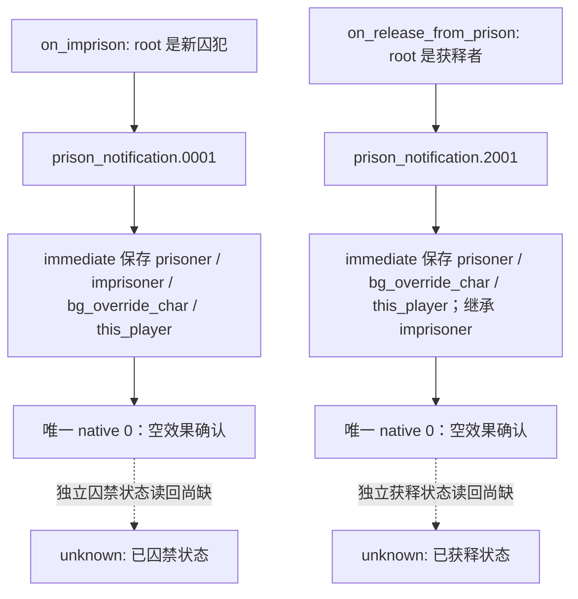

# CK3 1.19.0.6：玩家囚禁与释放通知

冻结构建：CK3 1.19.0.6 / Steam 23530548，EXE SHA-256 `2D00FF3101EF70B566F2FCBAE292F09263199C80E9DC8F139B82D7D96F83DB86`。原版 `events/prison_events/prison_notification_events.txt` SHA-256 `56023FBADC5F56C98293B1FB4AB7D846AD957F115B2E329422A0DCAD283B6C7F`；`common/on_action/prison_on_actions.txt` SHA-256 `D9CEBF10ED0E2E5ECC33E18BC71768F634E5F5504B690C5EDE6B095ACC1A2ECD`。

原版调用链：`prison_on_actions.txt:7-239` 的 `on_imprison` 将 `.0001` 交给被囚禁角色；`prison_on_actions.txt:254-343` 的 `on_release_from_prison` 将 `.2001` 交给被释放角色。`.0001` 定义在事件文件第 6–97 行，`.2001` 在第 269–323 行。两个事件的 `show_as_tooltip` 分别展示 `imprison` 与 `release_from_prison`，并非选项执行效果；唯一 `option` 均只有 `name`。因此可将原生选项判作无额外效果的通知确认，但不能以选项 ACK 或弹窗消失证明囚禁状态。

R0109 自然运行中，角色 36403 的 `.0001` 实例 24 先出现，后有 `.2001` 实例 25；两者的唯一选项已由正式路径选择且下一循环消费。封存证据：`Z:/ck3_mod_rewrite/.task-tmp/RUN-001/century-h1120-continuation/R0109-evidence-manifest.json`，运行使用 source `e0adeaa60ec548d44ad23799d02cea1589a0dc33`。现有 campaign-root/played-character paused 观测没有监禁状态；物质囚禁与释放仍待同角色、独立 paused 读回，且不得把该运行的后续战争 RED 误归因于这两条通知。

策略边界：仅在此原版源码版本、玩家 root、囚犯与 root 相同、囚禁者与 root 不同、背景角色等于囚禁者、唯一合法可用原生选项 0 成立时，选择空效果确认；继承自 on_action 的其他 saved scope 只作完整性和名字唯一性检查，不决定该空选项的语义。原生资料未提供的游戏状态仍标 `unknown`，后续需最小只读 native/MCP 囚禁状态查询核实。
