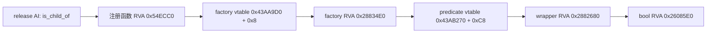

# 囚犯对玩家的原生亲子关系读口（CK3 1.19.0.6）

状态：**私有 opt-in static-ready；尚无 paused 实机读回、释放决策或动作**。此包只回答已关押囚犯是否为玩家亲子关系中的“子女”，不把 `false` 扩大为非近亲、非宿敌或没有战争扣留价值。正式 M6 状态不变。

## 本次实际问题

H2825 的 [Git 正式报告摘录](../autonomous-agent-progress/coordination/war-requests/evidence/WAR-ROBERT-H2825-SIEGE-PARTITION-20260928.r0265-formal-report.json)在同一 paused native revision `3` 读到玩家 `29829` 关押 `34486`、`44484`、`47028`；三人原生无条件释放均合法且零 on-send 资源成本，但赎金报价均不可用。House/Dynasty 不能判定原版 `is_child_of = scope:actor`。原版 `00_prison_interactions.txt` SHA-256 `3E05C94CDCE4D42CCE8256D2D79CD78FEB1C9D5B79DAA64AA8243AA0C658F22B` 在 release AI 中对子女加权；该权重仍不等于我方应当释放。战争扣留/PoW 缺口独立走 [WAR-PRISONER-RETENTION-H2825](../autonomous-agent-progress/coordination/war-requests/requests/WAR-PRISONER-RETENTION-H2825-20260928.json)。

## exact-build 调用链

冻结 `ck3.exe` 1.19.0.6，SHA-256 `2D00FF3101EF70B566F2FCBAE292F09263199C80E9DC8F139B82D7D96F83DB86`。可复验的 [ABI 数据](../../ck3_autonomous_player/native_bridge/research/player_prisoner_child_relation_1_19_0_6.json) 与 [独立 verifier](../../ck3_autonomous_player/native_bridge/research/verify_player_prisoner_child_relation_1_19_0_6.py)固定了字符串、函数哈希、指令及每条调用边：

`0x26085E0` 的 Windows x64 入参为 `RCX=child CCharacter*`、`RDX=parent CCharacter*`，结果为 `AL`。它先验证 parent 的 generation-bearing 身份，再读 child `+0x1A0` 父母双 ID 指针，将 `+0x00/+0x04` 两个完整 32 位 ID 与 parent `+0x18` 完整 CharacterID 比较；空父母指针给出原生 `false`。本包没有从反射字符串猜函数地址，也没有把 House/Dynasty 代入该谓词。`is_close_family_of` 的邻近注册/虚表与布尔函数另有分支，本包不外推其语义。

## 私有读口与边界

现有 `player_prisoner_collection_query_v1_private` 在应用主线程、暂停帧内先解析玩家与每名囚犯的完整 CharacterID，再双采样、复核帧 revision。新编译选项 `XAR_CK3_ENABLE_G2_PRISONER_CHILD_RELATION_PRIVATE_V1` 默认 **OFF**，仅在现有 v4 private collection/release/ransom 选项已开时能启用；此时第 5 版私有 row 加 `is_child_of_played_character: bool`，Python transport 对类型与原行身份继续逐项验证。谓词入口不可用则整个读口返回 `child_relation_unavailable`，不会以 `false` 代替缺项。公开 MCP 广告与囚犯 action surface 仍不开放。

静态验证：EXE/原版脚本 verifier 在 normal 与 `-O` 均 `GREEN_STATIC`；MSVC Debug/Release 聚焦 reader 测试各 `16/16 GREEN`，私有 transport 在两种模式都通过编译；Python focused transport 测试 normal/optimized 各 `15 passed`，正式 runner 囚犯观测聚焦测试各 `5 passed`，同时确认 v5 不漏掉后续赎金逐人读回。这些没有取得三人的实际关系值，也没有验证新的 DLL 实机加载。

下一项实机验证只在已准备的正式候选窗口里启用私有 flag，并从一个有三名囚犯的自然 paused 帧读 v5 row：核 full ID、同帧 native revision、三条 bool 与 `unavailable`，并以真实已知亲子对做正控制（若场景可得）。随后仍需 close-family/rival/nemesis 与战争扣留价值才能作正收益释放决定；任何释放动作另按合法性、独立后置、下一 turn 和冷恢复验收。
