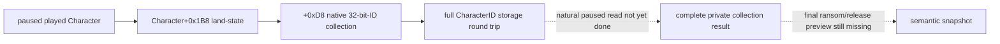
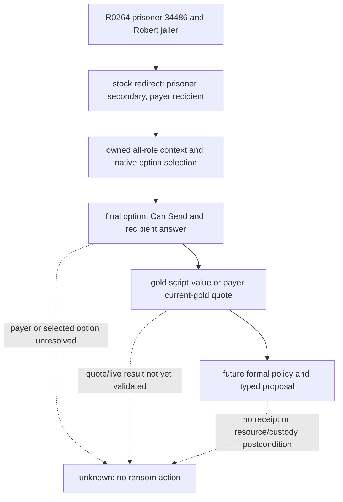
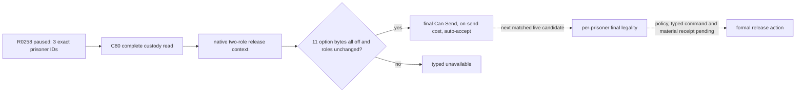
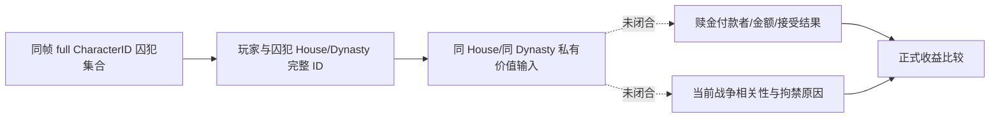
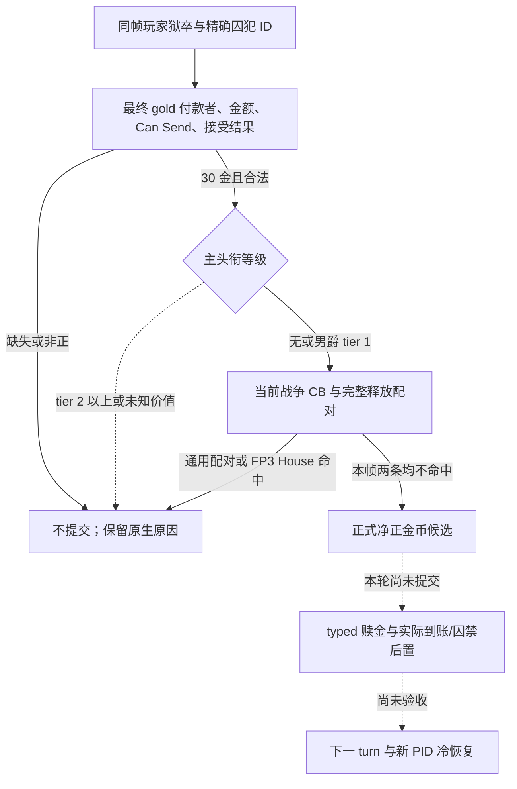

# 非宗教囚犯、犯罪、赎金与惩罚原生 AI 树（CK3 1.19.0.6）

> 工作包：**G2-M6-PRISONER1-NATIVE-TREE**。
> PRISONER1 原始状态：**static-ready / research-only**；2026-09-15。后续 C80
> 已接默认关闭的私有 bridge/pipe/MCP 集合查询；R0258 已有 3 人的 paused live
> 集合读回，仍无囚犯 action 或 planner。详见文末增量。
> exact build：ck3.exe 95,206,008 bytes，SHA-256
> **2D00FF3101EF70B566F2FCBAE292F09263199C80E9DC8F139B82D7D96F83DB86**。
> 机器可复验账本：
> ck3_autonomous_player/native_bridge/research/nonreligious_prisoner_management_native_tree_1_19_0_6.json。

## 结论与下一刀

当前 G2 已有一次 exact pay_ransom pending 的 production-live 拒绝循环，但那只证明通用 interaction
收件箱能够绑定、拒绝、跨 checkpoint 消失；它没有提供玩家的完整囚犯集合、赎金各角色、付款选项、犯罪理由、
惩罚合法性或费用。因此，现有 live primitive 不能当作“囚犯/犯罪能力完成”。

现实 P0 是私有只读 **player_prisoner_management_snapshot_v1**。它必须从当前玩家的引擎拥有集合完整枚举囚犯，
再为每个囚犯构造 allowlist 内的 finalized interaction preview，返回角色、可见选项、准确费用、Can Send、
原生失败理由，以及引擎最终的 imprisonment/banishment/execution reason。集合不完整、被 cap、角色重定向不明
或 option ownership 不明时都要 typed unavailable，readiness 不能变 true。

R0258 已用 C80 私有查询从自然 paused frame 读出当前玩家的完整囚犯集合。
下一项施工入口是对同一囚犯接原生最终互动预览并核验结果；R0258 尚无任一
赎金或释放的最终合法性和价值读回。两类最终结果及物质动作证据取得前，
不公开正式能力。

## 范围与宗教域排除

本专题覆盖普通 imprison、地牢/软禁、ransom/pay_ransom/ransom_me、无条件释放与非宗教释放条件、execute、
torture、castrate、blind 和 systematic maim 的机会、AI 权重与最终 legality 边界。

**宗教域排除**继续生效：不展开 faith、doctrine、tenet、conversion、vows、piety、human sacrifice、holy order
或通用宗教政策。release 的 demand_conversion/take_vows、execute 的 kinslaying/doctrine 与特殊 tenet 分支仍被
exact 原文件哈希覆盖，但只允许未来 observer 返回引擎最终 allow/deny 和 opaque reason，不能把这些分支复制进
planner。prison_break_contract 属 scheme 域，也不进入本包。

## exact-build 证据账本

所有相对路径位于 Crusader Kings III。verifier 会核对完整文件大小、SHA-256、必要锚点、定义边界、
AI modifier 数、hard-zero 数、tier cadence 与 send-option inventory。

| 原版资产 | size | SHA-256 | 使用边界 |
|---|---:|---|---|
| game/common/character_interactions/00_prison_interactions.txt | 201,766 | 3E05C94C...C658F22B | 1–8737 行全部 prison interaction 定义；本专题保留的十二个定义逐项冻结 |
| game/common/character_interactions/_character_interactions.info | 27,227 | F360C05B...940D5D10 | Can Send 权威顺序、AI targets 和角色选择语义 |
| game/common/script_values/00_interaction_values.txt | 18,763 | 47A24A4B...5B9E6BC | ransom、increased ransom 与 herd 的原生 value |
| game/common/script_values/00_basic_values.txt | 47,113 | 9268A54F...C4CB0096 | dread answer 值与 banishment tyranny gain |
| game/common/script_values/01_dynamic_values.txt | 44,999 | 049303EF...6D7064 | tyranny-war 财政门 |
| game/common/defines/graphic/00_graphics.txt | 60,198 | D276199C...1999619 | GUI prisoner grid cap；不能拿 GUI cap 代替完整集合 |
| game/common/scripted_triggers/00_scripted_triggers.txt | 14,623 | 490C3784...95B5E | basic/advanced allowed-to-imprison 门 |
| game/common/scripted_triggers/00_crime_triggers.txt | 1,563 | 879A7E08...23A2ABD | crime 辅助触发；信仰细节不展开 |
| game/common/scripted_triggers/00_interaction_triggers.txt | 8,713 | 2C77FDED...237C789 | ransom payment-shape helper |
| game/common/scripted_effects/00_prison_effects.txt | 59,488 | F745201E...1D26A66 | ransom 对账并 release；execution 的 death envelope |
| game/gui/window_court.gui | 23,731 | E730078C...2AD5135 | CourtWindow.GetPrisoners 与 mass ransom/release/execute 表面 |
| game/gui/window_ledger.gui | 252,225 | 11314E88...0C53BD5 | Character.GetPrisoners 的只读 GUI 消费者 |

ck3.exe 内有唯一 ASCII reflection 锚点：GetExecuteReasons 在 **0x40CEDD0**，
GetBanishReasons 在 **0x40CEDE8**，GetImprisonmentReasons 在 **0x40CF0E8**，
GetPrisoners 在 **0x4107BA8**。这些字符串只证明 exact build 暴露相应反射名；它们没有证明安全 method RVA、
返回容器布局、生命周期或线程条件。实现前仍须闭合这些 unknown，不能从字符串直接调用。

### C57：`GetPrisoners` 引擎集合入口（2026-09-27，纯静态）

[可复验 ABI](../../ck3_autonomous_player/native_bridge/research/player_prisoner_getprisoners_binding_1_19_0_6.json)
在同一 SHA 的 EXE 中闭合了名称到 getter 的两条不同注册链。`GetPrisoners` 常量被编译器拆成
`movsd` 等拷贝，常规只找 `lea` 的 xref 会漏掉它；C57 找到 `0x50E409` 与 `0xFB2AB` 两个引用。

| GUI 名称 | 注册与真实调用 | 能读到什么 |
|---|---|---|
| `Character.GetPrisoners` | `0x50E3B0` 经 `0x97EA90` 绑定 wrapper `0x26233E0`，再调 `0x2614F30` | `CCharacter+0x1B8` land-state 存在时返回其中 `+0xD8` 的借用容器；为空时走 `0x15B2D10` 全局空容器 |
| `CourtWindow.GetPrisoners` | `0xFB260` 经 `0xF4C0D0` 绑定 wrapper `0xF4C090`，再调 `0xF482D0` | `CourtWindow+0x2B8` UI 成员；不可当成玩家完整囚犯集合 |

同一原生关系搜索 `0x2614F50..0x2614FC9` 从 `+0xD8` 容器的 `+0x00` 取数据、`+0x0C` 取数量，
按 4 字节元素扫描，并拿元素与 `CCharacter+0x18` 的完整 generation-bearing ID 比较。私有 reader 可复用已存在的
Character 存储解析模式（`module+0x570C130`，解析后重读 `+0x18` 全 ID），但必须在应用主线程的同一暂停帧内
复制、再采样并验证列表；借用指针不得跨查询。`0x2614F50` 是关系搜索调用链，不是本包批准使用的动作 ABI。

`verify_player_prisoner_getprisoners_binding_1_19_0_6.py --exe <exact ck3.exe>` 校验整 EXE 哈希、注册函数
与 wrapper 哈希、函数表项、名称拷贝及 getter/容器关键指令；normal 和 `-O` 均为 `GREEN_STATIC`。
本轮未启动 CK3、未连接 DLL、未发布私有查询或 MCP。因此**只把集合入口从 unknown 收窄为静态已映射**；
完整性、空容器语义、囚犯行的 custody/duration、赎金与释放最终结果和冷恢复仍需实机及后续原生绑定。

## 通用 interaction 管线

本专题复用 core-diplomatic-proposals 已冻结的 exact-build substrate：

| seam | RVA span | SHA-256 |
|---|---|---|
| interaction database getter | 0x831890..0x8318E7 | 954B2668...532C2 |
| two-role context constructor | 0x2C3EE50..0x2C3EFF9 | A9CDB970...9CE83A |
| finalize context | 0x2C40B20..0x2C40BFE | 1A6393A2...72661 |
| final Can Send validator | 0x2C43F00..0x2C44070 | 3B9A75EC...86ED54 |

stock schema 给出的 Can Send 顺序仍是权威：角色完成、外交距离、special is-shown、is_shown、重复 pending、
is_valid_showing_failures_only、has_valid_target_showing_failures_only、can_send、is_valid、
has_valid_target、special can-send，最后才判断是否需要以及是否能获得 AI 接受。囚犯菜单里的“按钮亮了”
不能替代 finalized context，也不能把 ai_will_do 当作 recipient ai_accept。

prisoner 集合和 ransom 特殊角色 payload 尚未闭合。ransom 的 actor、recipient/payer 和 secondary prisoner
不总是普通二角色；所以这里只复用数据库、stable definition、finalize 与 final validator，不声称现有 constructor
已经能安全构造所有赎金形状。

## 逮捕原生树

imprison_interaction 的 stock AI 从 vassals 与 courtiers 取候选；barony 不检查，county cadence 36，
duchy/kingdom/empire/hegemony 为 10。ai_will_do base -100，有 19 个直接 modifier 与两个 factor=0；
ai_accept base 0，有 25 个直接 modifier。interaction 可以在预计拒绝时发送，所以 recipient answer 表示成功概率，
不是发送合法性的同义词。

ai_accept 主要输入是双方 intrigue、hook、vassal refusal treason、prison perk、目标 rank、dread、军力比、
rival/nemesis、court grandeur、legalistic culture 与若干地区内容。sender tree 对合法 imprisonment reason
大幅加分；战争、可玩强敌、低军力与低财政风险大幅减分；lover/friend/child/spouse 和缺乏实际惩罚动机可降到
-1000。grand activity 对 count+ 目标、以及未满足 eviction 条件的 landless adventurer 是 hard zero。

~~~mermaid
flowchart TD
    A[AI cadence + vassal/courtier candidate] --> B{ai_potential 与 basic/advanced imprison gates}
    B -->|失败| Z[无机会]
    B -->|通过| C[构造 exact imprison context]
    C --> D[final Can Send 与 tyranny/reason]
    D -->|无效| Y[保留原生 failure reason]
    D -->|有效| E[ai_will_do base -100]
    E --> F{hard-zero state}
    F -->|是| Z
    F -->|否| G[reason + risk + relation + struggle 权重]
    G --> H[recipient ai_accept 成功概率]
    H --> I[stock AI 决定是否尝试]
    B -. prison collection / evaluator RVA 未闭合 .-> U[unknown]
~~~

未来自动玩家不能只读 has_imprisonment_reason 就发命令。它还需要完整候选、最终 Can Send、预计成功、
显示的 tyranny 后果、资源/战争风险和明确后置条件；本包只定义 observer，不设计动作。

## 赎金三种角色形状

### jailer 发起 ransom

ransom_interaction 对 prisoners 运行；barony cadence 36，其余 tier 为 6。sender base 0、9 个直接 modifier、
3 个 hard zero；recipient base 0、11 个 modifier。合法全额/当前金额在长期监禁后加 100，greed 可继续加分；
rival -100、nemesis -300；对自己 vassal 要 favor 可加 100。actor 在战争、human payer 战争或拒绝标记、
active prison break 时 hard zero。

八个 authored option 是 extortionate_gold、extortionate_current_gold、gold、current_gold、favor、
influence_send_option、herd_send_option 和 mass-action invalid fallback。effect 根据最终 option 在 payer 与
imprisoner 间转移准确资源，最后 release 精确 prisoner。

R0264 的 Robert paused frame（`native:3`，`date_raw=53217264`）已有囚犯
`34486`、`44484`、`47028` 的完整 jailer/custody 读回，但只有无条件释放的
finalized preview，**没有赎金选项、付款者或金额**。H2825 先用 `34486`
作为场景定位，在本地拥有的三角色 context 内尝试原版 `gold`（authored
index 2）或 `current_gold`（index 3）；原生 option setter/refresh/finalize
路径在 [C95 增量](prisoner-ransom-final-evaluator-c95.md) 中按 exact EXE
冻结。选项未被引擎最终选中、付款者重定向不明、最终 Can Send/回答或金额
读不到时，沿下图虚线返回 typed unavailable，不以已有 release 合法性推断赎金。

### 第三方 pay_ransom

pay_ransom_interaction 从 family、spouses、scripted relations、liege，以及受限 neighboring/peer/top-realm
domicile 集合找机会。barony 为 0，其余 cadence 6。sender 有 17 个 modifier、6 个 hard zero；recipient 有 16 个。
它把被救者放在 secondary recipient，jailer 是 recipient，付款者是 actor。compassion 与亲属/关系决定是否值得救；
heir、钱款/有效 favor 增益；目标无关、option 无效、human jailer 战争/拒绝、prison break 会 hard zero。

### prisoner 自赎

ransom_me_interaction 的 AI recipient 是 self；barony/county/duchy/king+ cadence 为 72/24/24/12，
sender 有 7 个 modifier和 3 个 hard zero，jailer accept 有 15 个 modifier。它与第三方赎金共享若干 option key，
但 role identity 不同，不能用同一二角色 payload 猜测。

~~~mermaid
flowchart TD
    P[完整 prisoner row] --> K{interaction kind}
    K -->|ransom| R1[jailer actor -> payer recipient -> prisoner secondary]
    K -->|pay_ransom| R2[payer actor -> jailer recipient -> prisoner secondary]
    K -->|ransom_me| R3[prisoner actor -> jailer recipient]
    R1 --> O[枚举 exact visible/valid options]
    R2 --> O
    R3 --> O
    O --> C[materialize option + exact resource terms]
    C --> V[finalize + Can Send + recipient answer]
    V -->|有效| E[ransom effect: 对账后释放 exact prisoner]
    V -->|失败| F[原生 failure reason]
    R1 -. role/option ownership 未闭合 .-> U[unknown]
    R2 -. role/option ownership 未闭合 .-> U
    R3 -. role/option ownership 未闭合 .-> U
~~~

## 释放、处决与其它惩罚

release_from_prison 的 ai_frequency 固定 1，ai_accept base 0 有 33 个 modifier，ai_will_do base 0 有 21 个，
另有 prison-break hard zero。所有条件都为 false 时才是 auto-accept 的无条件释放。非宗教条件包括
renounce claims、banish、gain hook、become executioner、recruit、disfigure、blind、castrate 和 demand admin；
demand conversion 与 take vows 排除。sender 对各条件增加意愿，同时 revenge 会压低释放，compassion 和较长
监禁会促进无条件释放；feud、struggle 与部分文化输入继续由原生树决定。

execute cadence 是 barony 72、其它 tier 12；ai_will_do base 0，有 18 个 modifier和两个 hard zero。
合法 execution reason、sadistic/lunatic、继承利益、vengeance、rival/nemesis 与 struggle/nomad 输入提高意愿；
若没有 reason、rival/nemesis、配偶背叛、继承利益或 lunatic，原版直接 factor 0。kinslaying/doctrine 与特殊
tenet 分支只保留在 source hash，不进入策略模型。execution 的七个 option 也必须走引擎最终 legality。

torture base -25，只由 sadistic、family feud、escape attempt 三个直接正 modifier 推动。
castrate 和 blind base -20，各有上述三项加 Byzantine punishment emulation，共四个 modifier。
systematic maim 只在 kingdom+ cadence 60，base -50，直接考虑 sadistic、callous、feud、escape attempt；
它依赖 co-rulership/special legality，留在 P2。

~~~mermaid
flowchart TD
    A[prisoner + current custody/reasons] --> B{选择 stock interaction}
    B -->|unconditional release| R[compassion/time/revenge/feud/struggle]
    B -->|conditional release| C[非宗教 option + recipient acceptance]
    B -->|execute| E[reason/inheritance/vengeance/struggle]
    B -->|torture/castrate/blind/maim| P[trait/feud/escape/special legality]
    C --> V[final Can Send + exact consequence]
    E --> V
    P --> V
    R --> V
    V -->|失败| F[保留 native failure / tyranny / reason]
    V -->|通过| G[只形成 observer 机会；动作仍未设计]
    C -. conversion/vows .-> X[宗教域排除]
    E -. doctrine/tenet .-> X
~~~

## crime/reason 的权威边界

crime 不是可以从 trait、secret 或 opinion 抄出的一枚稳定外部布尔值。stock interaction 同时消费
has_imprisonment_reason、has_banish_reason、has_execute_reason、temporary legality、tyranny effects、
recipient answer 与 special validator。最小合同必须发布引擎最终 reason result、final validity、Can Send、
原生 failure reason，以及引擎实际展示的 tyranny/资源后果。planner 不重写 crime 分类，也不猜信仰派生理由。

这同样解释为什么 observer 先于 action：若只能看到 prisoner ID 而看不到 exact roles、option、cost 和 final reason，
自动玩家无法区分“当前不能做”“会产生 tyranny”“对方拒绝”“可以做但不值得”。

## P0 observer 合同

**player_prisoner_management_snapshot_v1** 是 private、read-only、paused application-main 查询：

- 无 caller-supplied character ID；actor 永远绑定当前 played character。
- 完整枚举 engine-owned prisoner collection；只返回 full generation-bearing CharacterID。
- 返回 total_count、returned_count、collection_complete、稳定 copied order/source ordinal 和 typed unavailable。
- 每个 row 返回 alive/resolved、exact jailer equality、house arrest/dungeon/unknown、time imprisoned，以及能由同一
  exact reader 证明的 hostage/prison-break 状态。
- P0 preview 为 ransom、unconditional/nonreligious release、execute legality、move dungeon 和 move house arrest；
  torture 可作为便宜的 P1 附带字段。
- 每个 preview 返回 stable definition key、全部角色、shown/candidate/final-valid/Can Send、needs-answer/auto-accept、
  visible/valid option keys、准确资源 terms 和 native failure/answer reasons。
- demand_conversion 与 take_vows 永不进入 allowlist；religion 派生只保留 opaque final result。
- 同一 paused revision 完整采样两次，最后再确认 snapshot binding 未变；任何 raw pointer 都不能越过查询边界。
- GUI 的 MAX_PRISONER_COUNT_GRID 只是显示阈值。被 cap、截断或漏 row 时 collection_complete=false，
  readiness=false，不能静默声称完整。

~~~mermaid
flowchart TD
    S[paused current-player snapshot] --> E[exact engine prisoner enumerator]
    E --> C{完整且 full-ID 可解析}
    C -->|否| U[typed unavailable; readiness false]
    C -->|是| P[复制稳定 prisoner rows]
    P --> R[读取 jailer/custody/time/reason]
    R --> I[为每个 P0 allowlist 构造 finalized context]
    I --> O[roles + options + exact cost + Can Send + native reasons]
    O --> D[同 revision 第二次完整采样]
    D --> Q{两次结果与最终 binding 一致}
    Q -->|否| U
    Q -->|是| G[player_prisoner_management_snapshot_v1 ready]
    E -. method RVA / ownership 未闭合 .-> X[下一项逆向入口]
~~~

## readiness 与遗留 unknown

### PRISONER2 私有 semantic core

**G2-M6-PRISONER2-PRIVATE-OBSERVER** 已把上述合同落成 default-off、value-only 的
player_prisoner_management_snapshot_v1 semantic core。它接收 future exact-build adapter 在同一 paused
application-main turn 取得的两份完整 source sample；两份样本和前后 frame 必须完全一致，played character
由 frame 绑定，不接受 caller-supplied character ID。输出按 full prisoner ID 排序，且只包含 copied ID、
fixed key、boolean 和 integer，没有 native pointer 或 borrowed lifetime。

每个囚犯 row 现在表达 jailer equality、custody、监禁天数、三种 opaque native-final crime/reason 结果，以及
ransom、无条件 release、execute、move-to-dungeon、move-to-house-arrest 与 torture 的 finalized preview。
ransom 另保留 payer、selected option、resource/amount 和 native-final acceptance。宗教派生输入仍不进入
semantic core；输出只有 religious_details_exposed=false，reason source 固定为 native_opaque_final。

独立 fixture 的正向样本包含两名囚犯，其中一名的 gold ransom 已 finalized 为 can_send=true、
would_accept_now=true，因而 ransom_candidate_available=true 且整体 semantic_ready=true。另一组 fixture
证明 native evaluator/role 未闭合时 snapshot 仍可保留 typed unknown，但相应 readiness 必须为 false；
它不能冒充 P0 可用。集合不完整或 count/total 不一致、ID 重复、jailer 不匹配、非 native-final source、
preview/terms 不变量失败和双采样漂移都会拒绝整份输出。

MSVC x64 C++20 的独立测试在 /Od /W4 /WX 与 /O2 /DNDEBUG /W4 /WX 下都完成
**9/9 GREEN**。这证明 private semantic core 和 standalone fixture；未接 CMake、shared bridge、schema、
MCP 或 source adapter，也没有启动 CK3。真实 prisoner enumerator 和 paused live artifact 仍待后续工作包。

### PRISONER3 exact-build collector source adapter

**G2-M6-PRISONER3-SOURCE-ADAPTER** 在 `e9652edd` 上增加 private source adapter。它只接受
1.19.0.6 exact executable SHA、application-main thread 和 paused frame；输入不是 caller 填好的 semantic
sample，而是每次 callback 序列内有效的 player、prisoner collector 与 prisoner row borrowed memory lease。
每个 lease 都携带 native address、identity、generation 和 full CharacterID，collector 另携带
`complete/total_count/row_count`。第二次采样会重新解析所有 lease，不复用第一次地址。

adapter 为每个 row 分别调用 opaque native-final imprisonment/banishment/execution reason、specialized ransom
preview，以及 unconditional release、execute、move-to-dungeon、move-to-house-arrest、torture finalized preview。
只有两次完整值样本一致、最后 frame 未漂移且 PRISONER2 core 接受，才发布 value-only snapshot。player、
collector、prisoner 的 identity 漂移和 generation/lifecycle 漂移都有独立 typed failure；集合截断、count
不一致、读取失败、final evaluator 失败或 preview 值漂移继续 fail-closed。宗教派生信息不进入 adapter 数据面，
只允许存在于引擎已经给出的 opaque final boolean 内。

standalone collector-memory fixture 用两名囚犯完成双采样，其中一名 gold ransom 的 native-final 结果为
`can_send=true`、`would_accept_now=true`；最终 `ransom_candidate_available=true`、`semantic_ready=true`。
MSVC x64 C++20 在 `/Od /UNDEBUG /W4 /WX` 与 `/O2 /DNDEBUG /W4 /WX` 下均为 **8/8 GREEN**，
exact-build/source verifier 在 normal 与 `-O` 下均为 **GREEN_STATIC**。这些结果证明 private adapter 到
semantic core 的静态事务；本包没有接 CMake/shared bridge/schema/MCP，也没有启动 CK3，因此没有
paused live artifact。生产 DLL 仍需把 exact-build collector 与 final evaluator 实现绑定到这些 callbacks。

因此 stock tree、exact-build source/native substrate、private semantic core 和 private collector source adapter
为 static-ready。
paused live artifact 不存在，action 没有设计，public MCP 与 planner 都不 ready；G2 的囚犯/犯罪整项仍不能标
production-live。已有 pay_ransom 拒绝 loop 继续只作为通用 interaction primitive 证据。

### C80 private paused collection query

`player_prisoner_collection_query_v1_private` 将 C57 的 exact-build `Character.GetPrisoners`
内存路径接入一个同步、只读、默认关闭的 native bridge 查询。它仅在已准入
`1.19.0.6` EXE SHA、application-main thread 和 paused frame 上读取当前 played character；
从 `Character+0x1B8` 到 land-state `+0xD8`，复制 `+0x0C` count 与 `+0x00`
四字节元素，并经 `0x570C130` character storage 对每个完整 generation-bearing ID
回读 `Character+0x18`。land-state 为空时遵循 exact getter 的空集合分支。
同一帧重读全部值，结束时复核 frame；截断、非法 ID、内存失败或漂移均返回 typed
unavailable。每个 row 复用 [war-termination prison relation 已证明的原生字段](war-termination.md)：
`CCharacter+0x1A8` extension → `+0x288` prison relation → `+0x00` full jailer ID，
要求反向 jailer 与当前 played character 的完整 ID 相同；不一致时整份查询不可用。
返回值只有 source ordinal、full prisoner ID 与经原生关系读回的 jailer ID，
不携带借用指针。

私有 native pipe step `query-player-prisoner-collection-private-v1` 使用现有 application-main
mailbox 的专用 slot 53，采样前后核对正式 native `ReadSnapshot`，结果由 value-only
serializer 交给 NativeDriver 的 opt-in 私有读回；同一 opt-in 才注册 MCP 只读
tool，默认工具列表、公共 capabilities/ad 均不包含此能力。返回
`collection_owner_character_id` 与 `jailer_character_id` 同时证明该 ID 位于当前角色的
`Character.GetPrisoners` 集合且其 prison relation 指向当前角色。house arrest/dungeon
位置、赎金和释放 final validity 仍缺对应 ABI，不借 custody owner 推断这些结果。
CMake 私有选项默认 `OFF`；本包只具源码、构建与测试证据，没有启动 CK3，也没有
paused live artifact，M6 readiness 不变。Debug/Release x64 私有 DLL 构建通过；
集合读取 fixture **11/11**、既有 mailbox 聚焦 CTest **1/1**、Python 私有
pipe/MCP 消费 **7/7**。C57 EXE ABI verifier 的 normal 与 `-O` 旧证据及 war
termination prison relation 的静态/实机证据继续复用。
下一入口是实机验证集合值与生命周期，
然后映射 custody、duration 和 final previews 到 PRISONER3 callbacks；仅有 ID 时
不发布完整 semantic snapshot。

### C151：有界正式 runner 的集合观测入口（2026-09-27）

R0254 的 h2357/raw53216424 Robert 来源配对只冻结了 save/driver；正式报告没有
囚犯集合查询，因此无法从这份报告判断有无可赎金或释放的囚犯。C151 在现有
`native-auto-run` 增加默认关闭的 `--allow-private-prisoner-collection-observation`，
operator 对应 `run --private-prisoner-collection-observation`。候选 DLL 还须单独用
`-DXAR_CK3_ENABLE_G2_PRISONER_COLLECTION_PRIVATE_QUERY_V1=ON` 构建并冻结完整 SHA；
仅改 operator profile 不会给旧 DLL 加能力。

启用后，runner 在第一个 ready 的 paused frame，以该帧的 public revision 调用
NativeDriver `query_player_prisoner_collection_private_v1`，它与本机私有 MCP 工具
`ck3_query_player_prisoner_collection_private_v1` 共用同一查询合同。结果或有类型的
查询错误写入正式报告的 `private_prisoner_collection_observation`；只取一次，不让
囚犯观测进入策略选择，也不提交囚犯动作。零囚犯仅证明该帧没有集合阳性；非零
完整集合只证明玩家拥有和反向狱卒关系，尚不证明 ransom/release 的最终合法性、
金额、接受或收益。下一有界候选若读到非零集合，再针对具体 ID 补 final preview。
这一路径目前只有源码与聚焦测试，尚无 CK3 paused live 证据，M6 不变。

必须继续闭合：

1. 用 C80 私有查询在 paused live 观察 count、元素顺序、空值、full-ID 与 lease
   生命周期；不使用 `CourtWindow` UI 成员代替；
2. 把 prison relation、custody、duration 和三类 reason native surface 接到已冻结 callback；
3. 把 ransom 三种角色、option ownership/resource terms 和 release/punish finalized context 接到 callback；
4. 为每种 punishment 补 final consequence/tyranny presentation；
5. 产出至少含一名真实囚犯、能得到两类 final result 的自然 paused fixture。

以上 unknown 是下一轮可施工入口，不是把缺字段长期输出 null 的许可。

### R0258 自然囚犯阳性与 C182 最小释放预览入口（2026-09-27）

R0258 正式 Robert 候选源 `1fe1833f934aa07c3b90f202cc35ebd0cd9ad46e`，在
`native:3`、`date_raw=53216640` 的暂停帧，从 C80 私有读口取得完整的 3 人集合：
`34486`、`44484`、`47028`。三人均在当前玩家 `29829` 的原生集合内，反向狱卒关系
也指向 `29829`。正式报告 SHA-256 为
`5255FF3EFEC3BC41C7131C008E2CF463B16D83417BFEF69256B5E4D4B56CCC0B`，
原件位于 `Z:\r171b-robert-h2437-candidate\run-formal-36\formal-report.txt`。
该轮在首帧因开局 LIFE focus 证明不完整而 RED，囚犯查询没有导致动作或日期推进。
上述值证明真实集合阳性，不证明任何一人可赎金或可释放。

原版 `00_prison_interactions.txt:4088-6227` 的
`release_from_prison_interaction` 是玩家狱卒与囚犯两个角色、无重定向的互动；
其 11 个附加选项均不以 `starts_enabled` 开启。选择向量全零时，原版
`auto_accept` 走无条件释放，接受后按 exact 囚禁关系执行释放。C182 只为这个
分支接入默认关闭的私有读取：复用 C80 同帧集合，在应用主线程为每名囚犯构造、
刷新、完成并销毁独立的原生互动 context。发布 `Can Send` 前逐字节核对原生
actor/recipient、定义的 11 项数量和最终选中向量全零；读取原生十槽
`on_send` 费用与最终自动接受结果；任何读不到或漂移保持 typed unavailable。
旧私有集合查询的 v1 输出在新编译开关关闭时不变；显式打开
`XAR_CK3_ENABLE_G2_PRISONER_RELEASE_PREVIEW_PRIVATE_V1` 后，同一私有查询的
schema version 2 为各行增加 `unconditional_release_preview`。默认公共查询、广告、
正式策略和囚犯动作均未开启。

`Can Send=false` 是最终不能发送的读回，尚未附带原版详细失败 reason；不能从
狱卒关系推断为 true。释放囚犯的目标价值、战争俘虏义务和具体当前场景均待同帧
结果与政策比较。赎金仍缺付款者重定向、原生金额求值与接受后转账；通用
`on_send` 十槽费用不能充当 `on_accept` 赎金收入。C182 只有源码和聚焦构建/测试，
尚无新 DLL 的 paused live 读回或任何囚犯动作，因此 M6 和正式自动游玩能力不变。

### R0261：三名真实囚犯的无条件释放最终预览实机读回（2026-09-27）

C202 候选从正式 Robert h2543/raw53216856 原配对经官方 ordinary `xar_off`
prepare/rebind/no-launch，使用 source `585f2aea984faa0638980d208ba75b08ed75126c`、
Release DLL SHA-256 `C279C0F5D512AFBAB579ED8EE08BA5FA65475DA8CDB8C633FFF4BEED2F80CA70`。
R0261 新 PID26168 的首个 paused `native:3` 帧，私有查询返回完整集合 3/3：
34486、44484、47028；各自的 custody relation 与玩家狱卒 29829 一致。
各行 schema version 2 的 `unconditional_release_preview` 均为
`status=available`、`payload_shape=two_role_all_release_options_off`、
`can_send=true`、`auto_accept=true`、`would_accept_now=true`；`on_send` 十项资源费用
raw 均为 0，`readiness` 全项为 true。这些是同帧原生最终预览，证明该构建与场景下
三名囚犯分别可发送无条件释放，**没有执行释放**，不代表囚犯关系改变、赎金收入、
惩罚后果或已形成正式政策选择。私有口保持 `read_only=true`、`advertised=false`、
`action_surface_present=false`；M6 状态不提升。

[R0261 正式报告](Z:/c202-prisoner-h2543-final-preview/master585/run-formal-16/formal-report.txt)
SHA-256 `E39AEE7ED9B8FF025C993DC56D416C90E3170E801E1C687B42799001BA4025A6`；
匹配候选的 [索引](Z:/c202-prisoner-h2543-final-preview/master585/C202-CANDIDATE-INDEX.json)
SHA-256 `C777485266E60E94C062D9E6039E14DDC961D9F776F7FDE9DDDAE060881CB910`。
下一有效施工入口是结合三个具体囚犯的战争义务、关系与机会成本选择一个
净正值动作，接正式 typed 提交、原生囚禁关系后置、下一 turn 和新 PID 恢复；
不能把本次只读阳性算作动作闭环。

### C211：同帧囚犯宗族身份的窄价值输入（2026-09-27）

上节 R0261 的 `Can Send=true` 证明释放合法，未提供谁值得释放的比较输入。
C211 只复用已冻结的
[House/Dynasty exact-build reader](combat-phase-events.md#dynasty-perk-exact-build-reader-abi)：
`CCharacter+0x150` 是 full HouseID，House store/fallback 为
`module+0x570C408/0x570C400`，`CHouse+0x10` 回读身份，`CHouse+0x2C`
是 full DynastyID，Dynasty store/fallback 为 `module+0x570C748/0x570C700`，
`CDynasty+0x10` 回读身份。`-1` 是原生无身份；store 缺失或 generation
不符应使私有查询 unavailable。现有囚犯 reader 已在同一应用主线程暂停帧
对玩家和每名囚犯作 full CharacterID 回读，并双次采样，故可把各人的
House/Dynasty ID 加入相同双采样指纹，再发布同 House/同 Dynasty 布尔值。

同 Dynasty 仅表示当前身份相同，不等于近亲、友好关系或释放的正收益。
原生 `GetImprisonmentReasons` 目前仅有反射字符串锚点，未闭合 callable RVA
及 owner/context；当前战争数组虽已有其他查询的 exact reader，囚犯集合
入口尚无绑定的当前 War 对象。因此 C211 不把这两项猜成 false，也不据
宗族身份提交释放动作或开放公共能力。新增代码仍须聚焦验证和匹配实机读回。

### R0296：男爵囚犯赎金的同帧价值输入（2026-09-28）

Robert `29829` 的正式只读轮次 R0296 从 history `3564` 冷恢复，暂停在
`native:4`、`date_raw=53219304`。私有集合对囚犯 `44484` 读得完整狱卒关系、
`primary_title_tier_raw=1`（男爵）、`same_dynasty=false`、
`is_child_of_played_character=false`，House/Dynasty 均为原生无身份。
同一选项绑定的原生 `ransom_interaction` 最终预览选择普通 `gold`：
付款者就是 `44484`，报价 raw `3,000,000` / `100,000` = **30 金币**，
`can_send=true`、`would_accept_now=true`、`recipient_answer_status_raw=0`，
且 `amount_is_acceptance_time_quote=false`。此报价不是 `on_send` 成本，实际到账
仍须按接受后的金钱与囚禁关系独立读回。

同帧唯一战争 WarID `16777231` 为 `individual_county_de_jure_cb`，玩家为
defender；完整参与者与前四继承顺位扫描得到 `release_pairs=[]`，
`44484` 不在两方 release candidate 集合。故本战争已冻结的通用 PoW
释放条件不命中，FP3 House 专用条件因 CB 类型不适用。这两项不证明所有
未知的政治、关系或未来扣留价值为零。原版 `ransom_interaction` 的 stock AI
在 actor 战时会把主动发送意愿归零，**但**本次最终原生合法性与 recipient
接受结果均为真；玩家自动策略可以有独立价值判断，不能把 stock 意愿当作
`Can Send=false`。男爵 tier `1` 也不满足原版无条件释放才有的公爵以上
legitimacy 门；它不能解释赎金策略对所有有头衔者的一刀切排除。

当前正式选择器的 `primary_title_tier_raw is not None` 门把 `44484` 唯一排除；
另一个仍在狱中的 `47028` 报价为 `option_mask_unexpected`，没有可计价的
普通金币选项。因此 R0296 的 `formal_policy_selected_prisoner_id=null`
是已观测的策略漏消费，**不是**战争模型已证明应扣留男爵。最小下一步只放宽
无主头衔与 tier `1` 的普通金币候选，同时保留同帧完整战争配对、宗族、亲子、
最终合法性与正金额门；tier `2` 及以上和未知等级继续等待独立估值。

原始证据：[R0296 当前同帧囚犯回执](Z:/m6ransom-44484-observe-h3564-v2/evidence/R0296/current-prisoners.json)
SHA-256 `527B56B22D9C602D0D6F092565EC051211B905F1CF74A05165DAC5D7FAC90104`；
[正式报告](Z:/m6ransom-44484-observe-h3564-v2/evidence/R0296/formal-auto-run.json)
SHA-256 `66121C1C56E731A1FBEE4917EF635D64C4D9CC84F622E5865F892A22A365C590`。
两者只证明只读机会，没有赎金动作、收入或 M6 readiness 提升。
