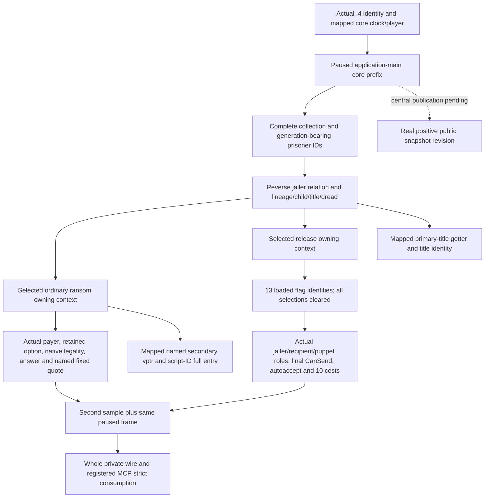

# Prisoner collection, ransom and release in CK3 1.20.0.4

The installed build is Crozier 1.20.0.4, Steam build 25734779, executable SHA-256
`98702F88A547CDE2EAF29A85F93B85F68EE4CF8148336A4F7AFAEB75319DD518`.
The frozen identity is `artifacts/migrations/2026-10-07/installed-build/BUILD-FREEZE.json`.
The previous .3 executable has changed `.text` and `.rdata`; its live and fixture
receipts remain historical evidence and do not admit native .4 addresses.

This migration covers the adopted private complete prisoner collection, selected
ordinary ransom quote and unconditional release final terms. The existing .3
kinship and negotiated release candidates are outside its qualification scope.
The domain uses the same registered collection MCP and copied value contracts.
Every native entry is bound directly to the actual .4 identity and mapped RVA.
The .2/.3 native binders are never called with substituted old hashes.

The new mailbox compares only the mapped core clock and player identity fields.
It does not promote the partial core snapshot to a complete gameplay snapshot.
Collection and interaction observations retain their own complete same-frame
checks. A native false final `CanSend` is a valid observation. Read failures
remain distinct from zero costs, empty custody, absent lineage and no title.

Source implementation starts from `caa4adc3d1278e324cf4ec19774028e9b9138e28` in an
exclusive migration worktree. The sole mapper delegated finite declared function
and operand spans; retained caches and exact shared range claims are reused.
External mapping, bounded read costs and source closure are recorded under
`Z:/ck3_mod_rewrite_process_assets/g2-background-20261007/upstream-build-migration/prisoner/`.
Eight collection instruction spans now have complete decode and equal normalized
instructions, ordered rel/RIP edges and local control topology. Five no-unwind
leaves used equal adjacent runtime gaps to generate candidates before complete
span comparison. Their actual current getter entries are jailer `0x289E810`,
prisoners `0x28C17E0` and dread `0x2B641D0`. Character storage/fallback RIP targets
remain `0x5C67568`/`0x5C67570`; generation checks, custody extension `+0x1B0`,
relation `+0x288`, collection land state `+0x1C0`, lineage `+0x158`, family `+0x1A8`
and dread `+0x350` are preserved. The central resource operand packet separately
closes living extension `+0x1B0` and gold QWORD `+0x100` without another EXE read.
The sole mapper confirmed its other families do not consume the primary-title
getter and delegated its original 118-byte span here. It is now fully compared
at `0x289DA30` → `0x289DA10`; title storage/fallback RIP targets remain
`0x5D1DAF8`/`0x5D1DAE0`. The nine collection spans used 1,314 bounded bytes in
18 old/new read calls. These are offline source proofs, with no live claim.

The shared core-prefix mailbox dependency is commit
`6ba4132fa7a16d4a8c3af44716cf11c895e5a5b5`. The existing registered Driver query
still requires a real positive published public snapshot revision. The standalone
core-first tool's revision zero does not satisfy that route. A fresh campaign
collection query waits for the central actual .4 snapshot publication path;
the domain never invents a public revision from the standalone core receipt.

The shared context and ordinary ransom leaves are now enabled with those actual
proofs. The script-ID table getter is fully compared over 211 bytes at
`0x3F8A800` → `0x3F8A7E0` by the central function owner. Named secondary vptr
adjustment is confirmed by the actual old/new vbtable `[-8,128]`, retaining
object offset `+0x88`. The domain's additional finite read cost totals 20,044
bytes and 106 old/new span reads, with zero whole EXE reads, hashes or PE parses.
The committed ABI manifest is
`ck3_autonomous_player/native_bridge/research/ck3_12004_prisoner_domain_abi.json`.

Current status is static-ready for source and bounded ABI inputs. New .4
whole-wire and registered consumers are
FIRST_NOT_RUN; no .4 fixture, paused live observation or release/ransom action
has been claimed. Root owns compilation, SDK and the fresh Robert 29829 query.
