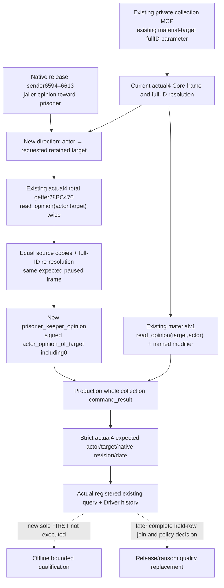

# Keeper direction opinion input — CK3 1.20.0.4

The new read-only `prisoner_keeper_opinion` sibling measures the current played **actor's opinion toward the requested retained target**. It uses the existing private collection MCP and existing `release_material_target_character_id` parameter. The published `target_opinion_of_actor` material field measures the opposite direction. This is a new actor-direction input, with no policy or action change.

Source baseline is the private tree `337270d7700e514169d6fc55e121a3063c579e08`. The current build is CK3 **1.20.0.4 Crozier / Steam25734779**, reused EXE SHA-256 `98702F88A547CDE2EAF29A85F93B85F68EE4CF8148336A4F7AFAEB75319DD518`. The native/consumer lanes read no EXE bytes and perform no hash, import, build, test, SDK, process, game or Git operation. Parent commits source only. New source is **implemented / FIRST NOT RUN / research**; adoption and qualification belong to Root.

## Native AI participation and the concrete production gap

The [current disposition tree](prisoner-disposition-native-ai-tree-12003.md) is the source-first ledger. Its [cached stock excerpt](Z:/ck3_mod_rewrite_process_assets/g2-parallel-20261006/prisoner-release/next-observations/native-ai-tree/CURRENT-STOCK-AI-EXCERPTS.txt) pins the installed prison file at222958B/SHA `1bb43b3c2061212af8d41b11314ff4e569af2a3506319f820d05877a7762abc5`.

Release sender `ai_will_do` modifier6594–6613 enters `scope:puppet_or_actor` at6596, evaluates `opinion` at6601, sets `target=scope:recipient` at6602 and tests `value>=low_negative_opinion` at6604. It separately requires recipient imprisonment >1year, nonplayability and close family at6609–6612. That opinion belongs to the jailer/actor and points toward the prisoner. The execution inverse-opinion modifier6738–6743 separately names the recipient as its target.

These lines are retained .3-authored script evidence. Existing actual4 [material](prisoner-release-material-opinion-12004.md) and [formal release](prisoner-release-formal-service-12004.md) topics explicitly reuse the same prison-data pin, with the unchanged data depot manifest5078208590259867811. This permits reuse of direction semantics. The named `low_negative_opinion` threshold and compassion/duration branches are authored conditions, not newly measured actual4 loaded numeric values. This observer does not evaluate their complete sender score or copy a historical threshold into policy.

The current [formal release consumer](../../ck3_autonomous_player/src/xar_autoplayer/prisoner_release_formal_consumer.py:101) uses actual selected CanSend/acceptance, same-frame war retention and positive eligible monetary ransom priority, then constructs an actionable choice at158. It does not publish or consume actor-to-target opinion. Current collection, ordinary/selected previews, kinship, retained named material and war inputs already have their own source/qualification. They are reused without replay.

The existing material reader at `ck3_12004_prisoner_release_material_opinion.cpp:66` calls `read_opinion(sample.target,sample.actor)` and publishes `target_opinion_of_actor` at163. The new leaf calls the current getter with `actor,target`. A reciprocal +20 named modifier and a native actor opinion of -35 can coexist; neither direction substitutes for the other.



## Reused current native entry and exact pair contract

Existing `ck3_12004_gift_opinion.hpp` binds total opinion at **0x28BC470**. Its source `OpinionPair` at70–83 resolves owner and toward, calls `reader(owner,toward)` twice, compares the values and repeats full-ID resolution. `ReadCharacterOpinion12004` at244–252 reaches that current entry using actual4 Core. The fixture-bindable overload at437–462 permits the same resolver and callback path on fixture-owned objects. Legacy names `recipient_id/player_id` do not change parameter order: for this leaf, pass **current actor first, retained target second**.

Historical source metadata records105B `recipient_total_opinion` at28BC490–28BC4F9, SHA `6594307325C64CB7366CCDBBDA7F70AF28AEF56F2A11FC407B6C24D7BE681DB0`, in `ck3_12002_gift_opinion_abi.json`; the .3 reuse manifest classifies that manifest PASS at1729–1732. Current actual4 binding/source is separately migrated and reused. No blanket RVA shift or old build admission is introduced.

The native sibling supplies `KeeperOpinionBindings12004`, `KeeperOpinion12004`, `BindKeeperOpinionImage12004`, `ReadKeeperOpinion12004` and `SerializeKeeperOpinion12004`. The copied JSON fields are exactly:

```text
schema = xar.ck3.prisoner-keeper-opinion-12004-v1
build_version, executable_sha256, available, unavailable_reason
snapshot_revision, date_raw, actor_character_id, target_character_id
actor_opinion_of_target
```

Available values keep native signed int32, including positive, negative and0, with empty unavailable_reason. Failure keeps a nonempty typed reason and null opinion. Integer0 is never a failure substitute. No numeric [-100,100] clamp, probability, rivalry inference, named modifier, pointer or full native utility is added.

## Same MCP, strict join and compatibility

The new strict `prisoner_keeper_opinion_contract_12004.py` validates the exact actual4 build/schema, current expected native revision/date, actor and requested full target, availability and signed integer semantics, and returns a detached copy. The existing typed transport uses it when the sibling is **present** on a request for the existing retained target. Legacy material packets remain usable; ordinary requests without a material target keep their original output. No MCP/Driver/Service API, policy, action, collection schema or old material-v1 contract is changed.

The new sole registered compound requires its five new produced packets to contain the keeper sibling. It calls the actual registered private collection method with the existing target parameter, passes each complete native packet intact, changes only outer request_id correlation and records actual normalized output and driver command history. It tests real public-to-native revision mapping and independently preserves the opposite material value. Presence in this new qualification does not create a new mandatory field for legacy material clients.

This is a **raw player-to-retained-target measurement**. A retained target can be queried after leaving custody, so an empty complete collection proves no current captive relationship. Before a later prisoner disposition policy uses it, join the same full target with an actual current held row and jailer. This source does not add such a policy or infer captivity, a release cause, improved relations or a game effect from the pair measurement.

## Single new FIRST plan

The native sibling's target/CTest is `ck3_12004_prisoner_keeper_opinion_whole_first`, with one output directory argument. The new `run_prisoner_keeper_opinion_12004_registered_first.py` accepts `--source-root`, `--native-fixture-dir` and `--output-dir`.

Five actual source cases use actor29829, retained full target0x03000002/50331650, native revisions801–805, date1220410, proof91 and an actual empty complete collection. Controls are:

| New whole file | Actor → target | Target → actor | Existing named material |
| --- | ---: | ---: | --- |
| keeper-positive.json | 25 | -10 | Observed absent/null |
| keeper-zero.json | 0 | 45 | Present0 |
| keeper-negative.json | -35 | 80 | Present20 |
| keeper-reverse-distinct.json | 60 | -60 | Present20 |
| keeper-material-independent.json | 25 | -10 | Present20 |

These are synthetic native callbacks and fixture-owned stores. The two25/-10 cases deliberately differ only in named material to show that the new total direction does not depend on the release modifier. All five are new whole source packets, not leaf transplants or old material-result bodies. The old material, release/kinship and ordinary-ransom FIRSTs are not run again.

[Source plan](Z:/ck3_mod_rewrite_process_assets/g2-background-20261007/upstream-build-migration/prisoner/current4-keeper-opinion/python-and-tree/SOURCE-PLAN.json), [Root delivery](Z:/ck3_mod_rewrite_process_assets/g2-background-20261007/upstream-build-migration/prisoner/current4-keeper-opinion/python-and-tree/ROOT-DELIVERY.json) and [Oct7/W41 fields](Z:/ck3_mod_rewrite_process_assets/g2-background-20261007/upstream-build-migration/prisoner/current4-keeper-opinion/python-and-tree/OCT7-W41-FIELDS.json) record source/cost/argv. Native build, registered consumer FIRST and fresh paused live are **NOT RUN**. Existing current Robert prisoners0 supplies no M6 live/action credit and is not a reason to manufacture a prisoner or delay the ongoing game goals.
