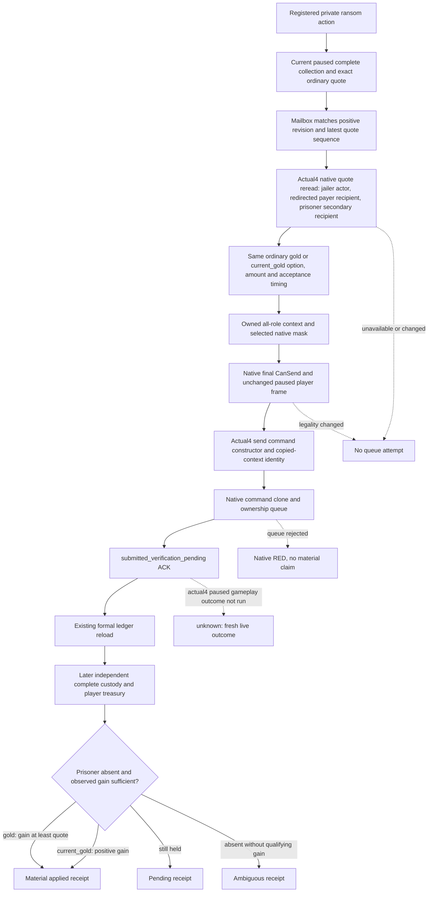

# Ordinary prisoner ransom action: CK3 1.20.0.4 migration

This package migrates the previously adopted outgoing ordinary ransom action,
in addition to the collection and readonly quote package. The actual117 build
arguments enable `XAR_CK3_ENABLE_G2_PRISONER_RANSOM_ACTION_PRIVATE_V1`, and
`mcp_server.py` registers `ck3_ransom_player_prisoner_private_v1` when its
existing private action option is enabled. A quote alone does not cover this
adopted action surface.

The frozen build is CK3 Crozier **1.20.0.4**, Steam **25734779**, EXE SHA-256
**98702F88A547CDE2EAF29A85F93B85F68EE4CF8148336A4F7AFAEB75319DD518**.
The isolated source starts at `e0ea249ae557749299735bc4cf53dfaa757aad50`, which
includes the adopted prisoner preview commit `dd8fb98b6c6d687fccbacacf82bc8475bc882049`.
The earlier `d23f89f32f0159f37d0f07567e1c7b0f96d0d2e6` candidate is immutable.

The native input tree precedes this implementation. The ordinary stock role and
payment semantics are recorded in [the prisoner native tree](prisoner-disposition-native-ai-tree-12003.md)
and [the exact ransom evaluator](prisoner-ransom-final-evaluator-c95.md).
Their historical live results retain their own builds and cannot qualify .4.
This migration changes bindings and routing, without introducing a new ransom
selection policy or admitting negotiated release, kinship, favor, influence,
herd, extortionate terms, or a self-ransom reply action.

The actor is the played jailer. The redirected payer occupies `recipient` and
the prisoner remains `secondary_recipient`; the other secondary role and
intermediary remain absent. The bridge selects only the loaded `gold` or
`current_gold` option already returned by the actual4 quote. Final CanSend and
the fresh quote are actual native inputs, rather than values reconstructed
from the amount or custody row.

The shared command manager and ownership queue come from the central actual4
provider, `BindCommandImage12004`, committed as
`d2ced9237c25e758f9380637eaf76e4f02891452`. Its authoritative command layout and
queue function maps are reused. The complete send constructor, its actual
context-copy call edge and send vtable identities are owned by the
faction/diplomacy mapping lanes. Marriage's shared linkage receipt additionally
closes the complete 262-byte copy helper and the actual primary-table delete
and clone slots. This package owns only the complete 66-byte deleting method
and 167-byte clone method proofs, and does not recapture shared spans. The command
clone and scalar deleting destructor remain native ownership operations;
queue acceptance means only that the command was submitted.

The local paired ownership mapping cost is **466 bytes / 4 reads**. The shared
Marriage linkage packet costs **540 bytes / 4 reads** in its owning lane;
that external cost is recorded separately rather than counted twice. Its
[actual send-copy linkage receipt](Z:/ck3_mod_rewrite_process_assets/g2-migration-20261007/marriage-family/actual4-marriage-actions/send-copy-linkage/SEND-COPY-LINKAGE-RECEIPT.json)
joins the constructor's `context+0x20` copy path with the table's deleting and
clone pointers and the complete helper body.

The domain mailbox stores the most recent quote with its positive published
revision and query sequence. The request must match that exact prisoner, payer
and quoted amount. Its actual4 executor shares the existing application-main
mailbox and `core_frame` comparison API. The existing public snapshot revision
is required; standalone core revision zero is not promoted into a public
snapshot. The existing action flag admits the additional executor, while the
collection-only environment retains its two executors.

The registered Python action routes directly through `NativeDriver`, alongside
the registered service. It has no old version or SHA literal to migrate. Its
existing exact ACK check and central `private_native_provenance` already cover
the actual4 identity. No additional identity restriction or shared MCP/Driver
facade is introduced. The existing formal consumer writes an unresolved
ledger before submission, records the pending ACK, and independently reads
custody and treasury after a later frame.

For full `gold`, absence from complete current custody plus player gold gain
at least the quoted amount is the existing material receipt. For
`current_gold`, stock acceptance samples payer gold later, so the independent
receipt uses a positive observed gain after release. A paused quote does not
determine that later transfer. Queue ACK, prisoner absence, and payment are
kept as distinct observations.

The new target and CTest entry are `ck3_12004_prisoner_ransom_action_test`.
It authors whole native command-result wires through the production serializer
after the actual4 submit algorithm over fixture-owned native callbacks and
objects. The sole registered consumer uses the real registered action and
existing formal ledger/receipt functions. Source scenarios cover pending,
applied, ambiguous, changed quote, and rejected queue. The pending scenario
submits native full `gold`; the other four submit or reject native
`current_gold`, so both adopted action option branches have new planned
coverage within the same five packets. The current-gold applied
scenario deliberately uses an observed gain below the paused quote to exercise
the existing acceptance-time receipt semantics.

**Readiness: source implemented; compiled native FIRST and sole registered
consumer FIRST are AUTHORED_NOTRUN.** No .4 game submission, payment, release,
primitive, loop, or complete OODA qualification is claimed. Root owns shared
hooks, compiled offline migration regression and future gameplay validation.
The migration does not call for a fresh live ransom solely to test bindings.

The compact proof/dependency/cost ledger and Oct7/W41 report fields are stored
under [the external action delivery](Z:/ck3_mod_rewrite_process_assets/g2-background-20261007/upstream-build-migration/prisoner/current4-action/ROOT-DELIVERY.json).
