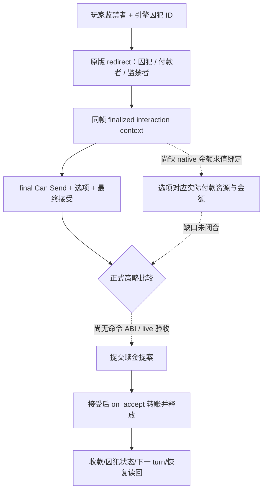

# 囚犯赎金：最终金额与关系约束的原生入口（C95）

状态：**exact-build static research**，未启动 CK3、未取得自然囚犯 paused frame，未提交赎金或释放动作。对应独立[版本化证据与校验器](../../ck3_autonomous_player/native_bridge/research/player_prisoner_ransom_final_gap_c95_1_19_0_6.json)；承接[囚犯原生树](prisoner-crime-ransom-ai.md)及 C80 私有囚犯集合读口。后者只列出囚犯 ID，不提供最终赎金金额或可发送动作。

## 冻结来源与具体决策

CK3 `1.19.0.6` 的 `ck3.exe` 为 95,206,008 字节，SHA-256 `2D00FF3101EF70B566F2FCBAE292F09263199C80E9DC8F139B82D7D96F83DB86`。原版 `00_prison_interactions.txt`、`00_prison_effects.txt`、`00_interaction_values.txt` 的完整 SHA 与行段在版本化证据中。校验器逐字节核对三份来源及 EXE。以下对应**玩家作为监禁者提出 `ransom_interaction`**；没有自然囚犯帧，不能断言当前 Robert 可执行。

1. `00_prison_interactions.txt:1718-1730`：最初选中的囚犯成为 `secondary_recipient`；若囚犯不是统治者且有领主，`recipient` 被重定向为领主，即实际提案对象/付款者。`1747-1760` 要求该囚犯正被 actor 监禁，且 actor 不能与 recipient 相同；后续还有拷问、摄政与清洗等有效性限制。不能只用玩家与囚犯的二角色预览。
2. `1921-2065`：选择普通、加价、付款者现有黄金、favor、influence、herd 等不同 `send_option`，原版按付款者资金、监禁者宗族特性与具体资源判定显示/有效。`2070-2222` 的 AI 接受权重含付款者与囚犯的本人、配偶、亲属、朋友、宿敌等关系；关系分数只是原版输入，**最终接受结果**仍由 finalized context 判定。
3. `1778-1871`：接受时重新检查监禁关系，设 `prisoner=secondary_recipient`、`payer=recipient`、`imprisoner=actor`；`current_gold` 类选项先保存当时的 `payer.current_gold_value`，再调用 `ransom_interaction_effect`。这段存在角色与金额的求值时点，早先的预估金额不能冒充实际付款。
4. `00_prison_effects.txt:2-51,138-183,225`：未手选选项的 mass action 会自行选项；普通黄金和加价黄金分别按囚犯的 `ransom_cost_value`、`increased_ransom_cost_value` 转账，现有黄金选项按保存的金额转账，最后释放囚犯。`00_interaction_values.txt:161-322` 的脚本值包含 native `ransom_cost` 等输入；需要在正确作用域求值。favor、influence、herd 也有不同义务，不能统一当作金钱零成本。



## exact-build ABI 入口与边界

EXE 的 `ransom_cost` 字符串在 RVA `0x439F388`；`0x5495A0..0x549638` 注册函数于 `0x5495B1` 引用该名称、`0x5495E7` 调用 `0x3B58330` 注册，`0x549619` 将 `0x439E528` vtable 放入构造节点。vtable 第二项指向 `0x2871B00`，该 thunk 跳至 `0x2876B70` **节点工厂**；它不返回赎金数值。下一个可施工 ABI 是追踪此节点的实际求值调用与 prisoner/付款者作用域，在同一 finalized 三角色 context 中读选定选项的金额，并将结果接到已有私有囚犯 source adapter。

现有通用 interaction 基底已映射 all-role context 构造 `0x2C3F000`、final Can Send `0x2C43F00` 和十槽 `on_send` cost 求值 `0x2CDB7B0`。**十槽 cost 不能替代赎金转账**：上述原版路径在 `on_accept` 的 `ransom_interaction_effect` 才付款。现有 prisoner payload extractor 能从*已经 finalized* 的 context 取 `secondary_recipient` 和选项 mask；它既不自行构造当前帧合法 context，也不求得该项实际付款。

下一步先在自然囚犯 paused frame 核实至少一项玩家可发送的普通赎金或无条件释放预览，再为对应选项接 native 最终金额、关系接受与命令语义。命令前后须核对同一囚犯、付款者/监禁者、实际资源转移与释放状态，下一 turn 和冷恢复继续消费；在此之前不把 C80 私有读口或 C95 静态研究称为正式可用动作。信仰仅沿婚姻/战争限定边界保留原生最终判定，本文不展开宗教策略。

验证命令（不启动 CK3）：

```powershell
py ck3_autonomous_player/native_bridge/research/verify_player_prisoner_ransom_final_gap_c95_1_19_0_6.py --exe '<CK3>/binaries/ck3.exe' --game-root '<CK3>/game'
```
