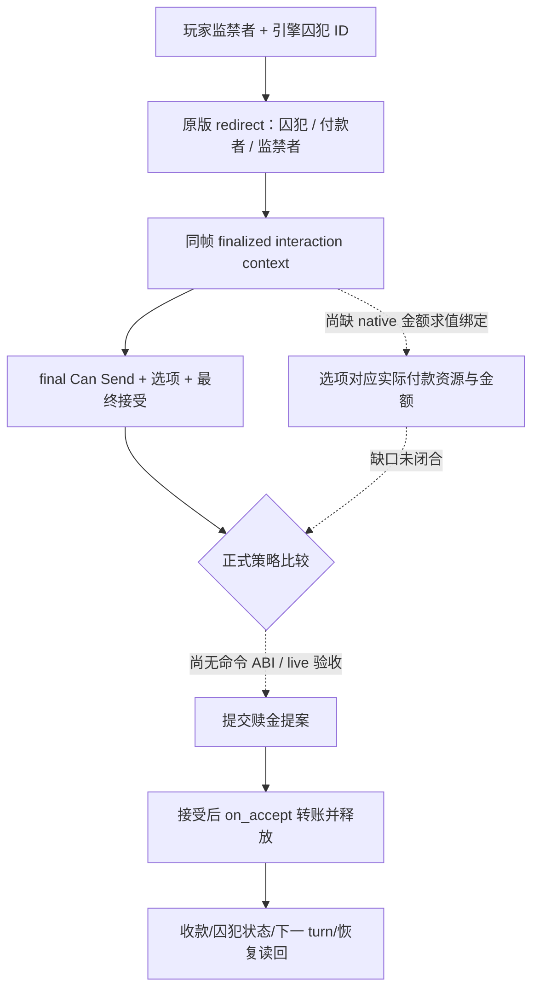
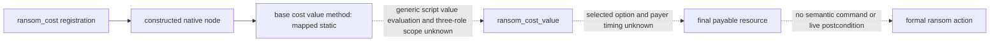
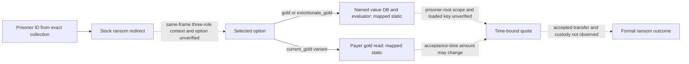
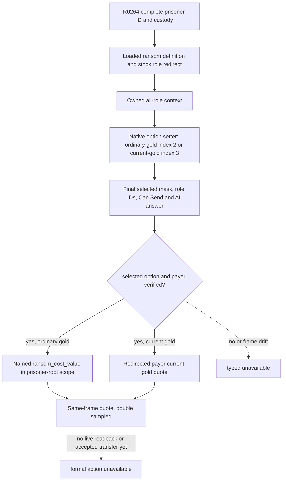
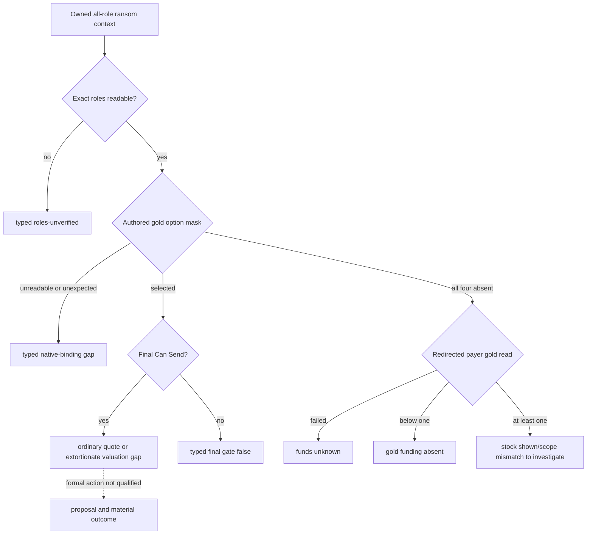
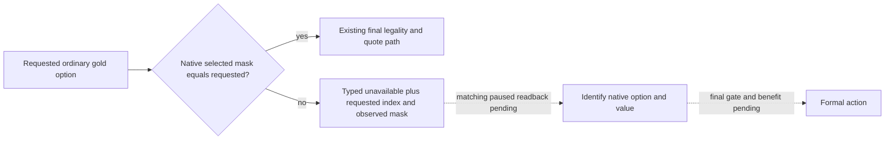
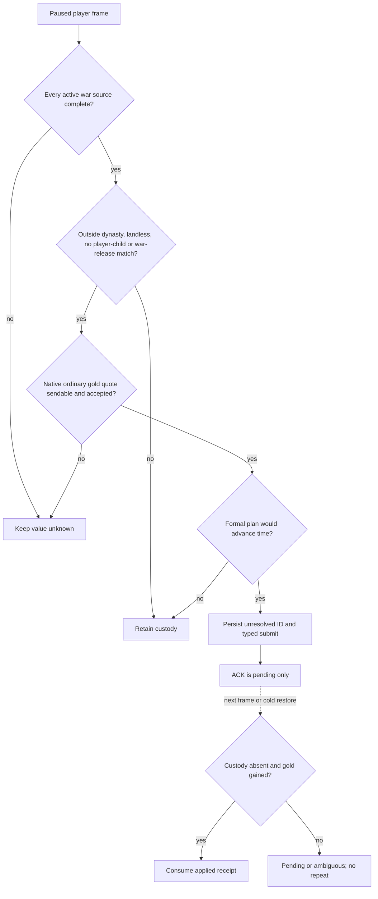
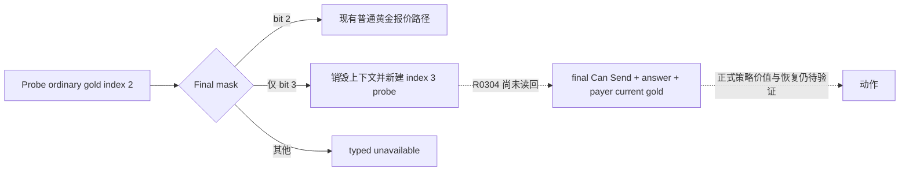

# 囚犯赎金：最终金额与关系约束的原生入口（C95）

状态：C95 原生金额调用链为 **exact-build static research**；H3446 已有只读实机囚犯与报价尝试，三个报价仍不可用。尚未提交赎金或释放动作。对应独立[版本化证据与校验器](../../ck3_autonomous_player/native_bridge/research/player_prisoner_ransom_final_gap_c95_1_19_0_6.json)；承接[囚犯原生树](prisoner-crime-ransom-ai.md)及 C80 私有囚犯集合读口。

## 冻结来源与具体决策

CK3 `1.19.0.6` 的 `ck3.exe` 为 95,206,008 字节，SHA-256 `2D00FF3101EF70B566F2FCBAE292F09263199C80E9DC8F139B82D7D96F83DB86`。原版 `00_prison_interactions.txt`、`00_prison_effects.txt`、`00_interaction_values.txt` 的完整 SHA 与行段在版本化证据中。校验器逐字节核对三份来源及 EXE。以下对应**玩家作为监禁者提出 `ransom_interaction`**；本节 C95 当时尚无自然囚犯帧，后续实测边界见下文 R0276。

1. `00_prison_interactions.txt:1718-1730`：最初选中的囚犯成为 `secondary_recipient`；若囚犯不是统治者且有领主，`recipient` 被重定向为领主，即实际提案对象/付款者。`1747-1760` 要求该囚犯正被 actor 监禁，且 actor 不能与 recipient 相同；后续还有拷问、摄政与清洗等有效性限制。不能只用玩家与囚犯的二角色预览。
2. `1921-2065`：选择普通、加价、付款者现有黄金、favor、influence、herd 等不同 `send_option`；`2355-2362` 还有仅用于 mass ransom 失败的第八项 `invalid`。原版按付款者资金、监禁者宗族特性与具体资源判定显示/有效。`2070-2222` 的 AI 接受权重含付款者与囚犯的本人、配偶、亲属、朋友、宿敌等关系；关系分数只是原版输入，**最终接受结果**仍由 finalized context 判定。
3. `1778-1871`：接受时重新检查监禁关系，设 `prisoner=secondary_recipient`、`payer=recipient`、`imprisoner=actor`；`current_gold` 类选项先保存当时的 `payer.current_gold_value`，再调用 `ransom_interaction_effect`。这段存在角色与金额的求值时点，早先的预估金额不能冒充实际付款。
4. `00_prison_effects.txt:2-51,138-183,225`：未手选选项的 mass action 会自行选项；普通黄金和加价黄金分别按囚犯的 `ransom_cost_value`、`increased_ransom_cost_value` 转账，现有黄金选项按保存的金额转账，最后释放囚犯。`00_interaction_values.txt:161-322` 的脚本值包含 native `ransom_cost` 等输入；需要在正确作用域求值。favor、influence、herd 也有不同义务，不能统一当作金钱零成本。



## exact-build ABI 入口与边界

EXE 的 `ransom_cost` 字符串在 RVA `0x439F388`；`0x5495A0..0x549638` 注册函数于 `0x5495B1` 引用该名称、`0x5495E7` 调用 `0x3B58330` 注册，`0x549619` 将 `0x439E528` vtable 放入构造节点。vtable 第二项指向 `0x2871B00`，该 thunk 跳至 `0x2876B70` **节点工厂**；它不返回赎金数值。下一个可施工 ABI 是追踪此节点的实际求值调用与 prisoner/付款者作用域，在同一 finalized 三角色 context 中读选定选项的金额，并将结果接到已有私有囚犯 source adapter。

现有通用 interaction 基底已映射 all-role context 构造 `0x2C3F000`、final Can Send `0x2C43F00` 和十槽 `on_send` cost 求值 `0x2CDB7B0`。**十槽 cost 不能替代赎金转账**：上述原版路径在 `on_accept` 的 `ransom_interaction_effect` 才付款。现有 prisoner payload extractor 能从*已经 finalized* 的 context 取 `secondary_recipient` 和选项 mask；它既不自行构造当前帧合法 context，也不求得该项实际付款。

R0276 已在自然囚犯 paused frame 读回无条件释放预览，但赎金仍未取得可发送选项；下一项必需原生观测见文末。将来命令前后须核对同一囚犯、付款者/监禁者、实际资源转移与释放状态，下一 turn 和冷恢复继续消费；在此之前不把 C80 私有读口或 C95 静态研究称为正式可用动作。信仰仅沿婚姻/战争限定边界保留原生最终判定，本文不展开宗教策略。

验证命令（不启动 CK3）：

```text
py ck3_autonomous_player/native_bridge/research/verify_player_prisoner_ransom_final_gap_c95_1_19_0_6.py --exe '<CK3>/binaries/ck3.exe' --game-root '<CK3>/game'
```

## C210: native base cost is mapped; payable amount is still unresolved (2026-09-27)

The exact `1.19.0.6` executable shows that the `ransom_cost` registration at
`0x5495A0` constructs a node at `0x2876B70`. The constructed node's vtable is
`0x439A218`; slot 32 points to `0x2870FD0`. That method resolves a Character
from the script scope and calls `0x28DCEC0` at `0x2871029`. The versioned C95
ABI verifier now checks the factory and value-method hashes, vtable edge and
native call edge. These are static findings; neither the call signature nor
the amount's fixed-point units have been qualified by a paused game readback.

This is the **base** `ransom_cost` node, not the amount the jailer can receive.
The stock `ransom_cost_value` script (`00_interaction_values.txt:161-274`)
changes that base for culture, guest wealth, haggler office and difficulty.
`ransom_interaction` redirects a landless prisoner's payer to their liege, then
chooses between full, increased, current-gold, favor and other options
(`00_prison_interactions.txt:1718-1730,1921-2065`). The `current_gold` option
saves the payer's **then-current** gold on acceptance
(`00_prison_interactions.txt:1816-1827`), and the transfer occurs in
`ransom_interaction_effect` (`00_prison_effects.txt:138-183`). A base-cost
value or generic `on_send` cost cannot be published as final payable gold.



Next bounded ABI step: locate the generic script-value evaluation call under a
finalized three-role interaction context, read the selected option and its
payer on the same paused frame, and map the corresponding value to the existing
private prisoner source adapter. Until this is done, return typed unavailable
for ransom terms. No private field, public capability, action or M6 readiness
is added by C210.

## C213: reusable exact-build entries and the remaining value binding (2026-09-27)

The bridge already uses the exact-build role redirect at `0x2C3C4C0` and an
owned all-role interaction-context constructor at `0x2C3F000` for marriage.
Its combat differential evaluator uses `0x337B210(compiled_value, &raw,
scope)` for a **resolved** compiled script value; that result is signed
Q100000. C213 pins the first 64 bytes of each entry in the C95 verifier.
This only proves the entries exist in the frozen executable. The marriage
context and combat scope are different from a finalized ransom context, and
neither route resolves the stock `ransom_cost_value` object by name.

The frozen EXE does not contain the literal `ransom_cost_value` in its file
bytes; that named definition is in `game/common/script_values/00_interaction_values.txt`.
The current bridge has no qualified runtime lookup for the loaded named
script value, no proved prisoner scope adapter for `0x337B210`, and no
selected-option final value. Calling the mapped native **base** method or
publishing the generic ten-slot `on_send` cost as payable gold would conflate
different stock paths. Full-gold and extortionate-gold use the prisoner's
script value on acceptance. `current_gold` and `extortionate_current_gold`
save the redirected payer's gold at acceptance, so a paused-frame amount is
only a time-bound quote. Favor, influence and herd carry different resources
or obligations, not a zero-gold ransom.

The next executable **read-only** experiment is one bounded paused prisoner
frame, reusing a row from the private prisoner collection. Resolve the loaded
`ransom_interaction` definition and the complete jailer/prisoner IDs; invoke
the stock redirect and owned all-role context path, then read back actor,
recipient, secondary recipient and the exact authored option. Confirm that
recipient is the actual payer and secondary recipient is the prisoner; read
final Can Send and acceptance from that same option-bound context. Separately
map the loaded `ransom_cost_value`/`increased_ransom_cost_value` object lookup
and the prisoner's script-value scope ABI. C214 below corrects the evaluator
choice for a loaded named definition. Double-sample the same paused frame and
label the result as a quote tied to actor, payer, prisoner, option and frame.
A later accepted proposal must compare actual payer/jailer gold and prisoner
custody. If lookup, scope or option ownership cannot be proved, the amount
remains typed unavailable. No CK3 process was launched and no query, command, action or
readiness was added by C213.

## C214: named-value route exists; ransom option binding remains open (2026-09-27)

C213's proposed `0x337B210` call needs a correction. That routine owns a
generic compiled-value evaluation context. The already implemented MIL4 reader
resolves loaded **named** script values through the exact-build database getter
`0x999AF0`, name hash `0x3B8B000` and lookup `0x9999B0`, then evaluates the
definition with `0x3369820`. The faction gift reader proves the related
interaction-scope recipe: clone the finalized interaction scope through
`0x3358E00`, replace its root character, supply the evaluation support
containers and the 0x28-byte source descriptor as the **fifth** argument to
`0x3369820`, and tear down the owned clone. C214 adds those full executable
spans to the C95 verifier. This is reuse of implemented ABI code, not a new
prisoner query.

The stock ransom `send_option` reads
`scope:secondary_recipient.ransom_cost_value` for `gold` and
`scope:secondary_recipient.increased_ransom_cost_value` for
`extortionate_gold`. Thus the quote scope must retain the finalized
interaction's `actor` (jailer), redirected `recipient` (payer) and
`secondary_recipient` (prisoner), with the cloned root set to the prisoner.
For `current_gold` and `extortionate_current_gold`, `on_accept` saves the
payer's gold **at acceptance**, so the existing exact character gold read
(`Character+0x1A8` extension, `+0x100` Q100000 gold) could provide only a
same-frame quote. Neither path may use the generic ten-slot `on_send` cost as
the ransom transfer. The stock effect actually pays on acceptance.

The remaining concrete binding is a single paused prisoner row: resolve the
loaded ransom definition and both named values by canonical identity; apply
the stock redirect and build/finalize its three-role context; read the authored
selected option, final Can Send and AI answer; clone that exact scope and
double-sample only the selected gold value or payer gold. The generic preview
has an AI answer status and score, but no option-specific refusal explanation
for ransom. A negative score is not itself a complete reason. If the loaded
definition, selected option, named scopes or refusal reason is unavailable,
return typed unavailable for that field. Only a later accepted proposal with
independent payer/jailer gold and prisoner-custody readback can establish an
actual payment. This C214 pass launched no CK3 process, added no private
runtime field or action, and changes no M6 readiness.



## H2825 private ransom observation entry (2026-09-28)

The R0264 Robert paused frame (`native:3`, native revision 3, `date_raw=53217264`)
contains three full-ID prisoners held by the played character: `34486`,
`44484`, and `47028`. The private collection proves custody and shows legal
unconditional release for each. It has **no ransom preview**, so none is yet
a proved payable opportunity. Prisoner `34486` is the first bounded read-only
target; the ID is a fixture locator, not a policy constant.

The same exact EXE SHA as above and the stock `00_prison_interactions.txt`
SHA `3E05C94CDCE4D42CCE8256D2D79CD78FEB1C9D5B79DAA64AA8243AA0C658F22B`
give a narrower native option route. The all-role constructor `0x2C3F000`
calls `0x2C40540`, which tests the definition's exclusive-options flag at
`+0x2A4E`, scans authored options through `0x2C408B0`, writes a selected byte
in the owned context's `+0x300` vector, refreshes at `0x2C40950` and finalizes
at `0x2C40B20`. The local clear `0x2C405F0` and setter
`0x2C406D0(context, index)` use the same refresh
and finalizer after selecting one authored index. Exact code-span hashes and
the original script source are recorded in the versioned C95 contract. This
is a **local context operation**, not a player command or world action.



The stock ordinary `gold` option is authored index 2; `current_gold` is index
3 (`00_prison_interactions.txt:1960-2018`). The observer must require exactly
one of these selected after native finalize, the redirected payer as recipient,
prisoner as secondary recipient, jailer as actor, final Can Send, and the
recipient's final answer in the same paused frame. The generic ten-slot
`on_send` cost is still **not** the ransom payment. A gold quote uses the
loaded `ransom_cost_value` definition with the finalized interaction scope
rooted at the prisoner; current-gold is only a quote because the stock
`on_accept` saves payer gold later. Definition identity, scope ownership,
selected option and amount units require a natural paused readback before
any formal consumer. All other options and any missing input stay typed
unavailable. No action, readiness or M6 claim follows from this static entry.

## R0271 paused quote gap and narrow failure split (2026-09-28)

The formal R0271 report (SHA-256
`A5C5D21266D7ACFDC2CDD4C619B2846DE100BFF7F4CAD1E261DC116B880790CD`)
queried all three complete prisoner rows on the first H3388 paused frame,
`date_raw=53218968`: `34486`, `44484`, and `47028`. Their independent
unconditional release previews remain sendable, but each ransom quote attempt
returned `option_unavailable`; no payer, payable amount, or
positive ransom value was observed. The later H3446/raw53219112 checkpoint
has an official no-launch pair but no new prisoner query; its paused prisoner
state cannot be inferred from the earlier frame.

The private quote reader previously used `option_unavailable` both when
neither authored gold option was selected with verified roles and when one was
selected but native final `Can Send` returned false. The source now retains
`option_unavailable` for the first case and returns
`final_can_send_false` for the second. This is a read-only distinction from
the same owned interaction context; it does not provide a detailed native
refusal reason, alter option selection, or authorize an action. A future
matching paused readback is needed to classify the three actual prisoners.
Until a sendable option and same-frame positive quote are observed, ransom
remains unavailable to formal policy and M6 readiness is unchanged.

## H2825/R0271 `option_unavailable` narrowing candidate

R0271 still proves no payable gold quote for `34486`, `44484`, or `47028`; it
does not prove a broken quote reader. The exact stock definition has eight
authored options. Ordinary `gold` (index 2) is shown when the actual payer
has at least `ransom_cost_value`; ordinary `current_gold` (index 3) requires
at least one gold but less than that value. Both are hidden for an actor with
`fp1_pillage_legacy_3`; that actor instead gets the two extortionate variants
(indices 0–1) against `increased_ransom_cost_value`. These conditions are at
`00_prison_interactions.txt:1921–1995` under the frozen source hash above.

Exact-build `ck3.exe` disassembly of the existing bridge calls confirms
`0x2C405F0` sizes/clears the context option byte vector to the definition's
option count, `0x2C406D0` sets the requested authored index, and its
`0x2C40B20` finalizer clears an option when the native shown/valid check
fails. The selected-option byte vector follows this native setter; its
previous seven-byte bound missed the final authored `invalid` option.
`option_unavailable` alone cannot distinguish a payer with
less than one gold, an extortionate-only opportunity, or another stock gate.

The narrow private candidate keeps the same unavailable payload shape and
adds two exact reasons after both ordinary options fail: it checks the two
extortionate options with their owned finalized native contexts and reports
`extortionate_gold_option_requires_valuation` only if final `Can Send` passes;
otherwise a double read of the redirected payer's current gold reports
`payer_below_one_gold` when it is below one. Any other case remains
`option_unavailable`. Neither reason is a ransom quote or an action.

## R0275/R0276 H3446 live readback and remaining native gate (2026-09-28)

The H3446/raw53219112 Robert source pair remained unchanged: actor `29829`,
save SHA-256 `DB1C897F1C4C93FA3927DDC0D901B225A797678B41687A9275744F898E712C65`,
`ordinary_campaign_succession/xar_off`. The candidate used source commit
`430228384d11d418b2a365cbc01d1711653f3e43` and private DLL SHA-256
`B9984237BF96696409BBB5AB806D7A0EDDE74ABB3D8FA3D719F7D1C6C510CA6D`.
The first read-only R0275 attempt was **harness RED**: its standalone runner
omitted `succession_lifecycle_binding`, so driver adoption rejected the
persisted ordinary lifecycle against its legacy default. Its report at
`Z:\m6ransom28-candidate\evidence\R0275\report.json`
has SHA-256 `F550BB96F17F15102DD0973AB4179C2AD89B46E1B1946DDCDD65F76FB2AACC2A`;
no prisoner query or gameplay action ran. Cleanup proved the CK3 tree gone.

An independent state and runner then used the official paired checkpoint
validator's `succession_lifecycle` as the driver's binding. Official
prepare/rebind/no-launch and normal/optimized runner preflight passed. Its
frozen candidate index SHA-256 is
`5A9009DF1C1195F027591530BE544CF27746C7B3DC351A40CF7871DE99595DAE`;
runner SHA-256 is
`734D83398F819099D062B3CCBD7E10ADE77FEE32BE652C16B067BB20126EF11E`.
R0276 report at
`Z:\m6ransom28-candidate-lifecycle-v2\evidence\R0276\report.json`
SHA-256 `9DA1D039FBF974F13A997C89C1F9C5023A5C0837981614ADE0E0624491A3F53B`
is **read-only GREEN**: same paused raw date, all three full IDs `34486`,
`44484`, `47028` present, one visible CK3 window minimized, zero gameplay
actions, source save unchanged, and controlled CK3 tree cleanup passed.
Each private ransom quote remained `unavailable/option_unavailable`.

That result excludes an observed sendable extortionate quote and an observed
sub-one-gold payer result; it does **not** prove either option is absent from
the game. In the current reader, `option_unavailable` means no ordinary
option had both matching finalized roles and an exact selected option, neither
extortionate probe passed final `Can Send`, and the payer-gold fallback did
not classify below one. The fallback also uses this reason if the gold read
fails. The specific native shown/valid predicate or role mismatch is still
unknown. The next bounded read-only probe must expose the authored option's
final selected versus role-match state, native shown/valid failure, and payer
gold read status on the same paused frame. Only then can the policy decide
whether a gold proposal exists or whether another prisoner disposition has
greater value. No quote amount, ransom action, next-turn consumption, cold
restore, or M6 readiness increase follows from R0276.

## H3446 next private discriminator: role, option mask, final gate, payer funds

R0276's three `option_unavailable` results remain a decision blocker, because
the old reason combined a failed role equality with an unselected native option
mask and also combined payer gold read failure with a nonzero payer. The
exact-build stock `00_prison_interactions.txt:1921-1995` partitions each of
the ordinary and extortionate gold pair at its ransom cost. For a readable
payer with at least one gold, one member of the applicable pair should be
shown under the stock funds rule. The jailed person's `secondary_recipient`
and redirected payer's `recipient` roles are required before applying that
inference; it is not a quote or proof of final Can Send.

The narrow private observer now keeps the same unavailable response shape
while distinguishing independently observed states:

| Typed reason | Native readback represented |
| --- | --- |
| `option_context_roles_unverified` | The constructed, finalized context did not yield the exact actor, redirected payer, prisoner, and definition roles; the other option/funds gates cannot be trusted. |
| `option_mask_unreadable` / `option_mask_unexpected` | The authored option bytes/count could not be read consistently, or the setter left a different/multiple option selected. This is an observer/native-binding gap, not a zero-value prisoner. |
| `final_can_send_false` / `extortionate_final_can_send_false` | An ordinary or extortionate gold option was selected with verified roles, but native final Can Send rejected it. |
| `payer_gold_read_unavailable` | No gold option survived; the redirected payer's gold could not be double-read, so funds are unknown. |
| `payer_below_one_gold` | No gold option survived and the redirected payer's double-read gold was below one. Other non-gold ransom terms are outside this gold-only conclusion. |
| `gold_options_not_selected_with_funded_payer` | The four gold options had verified roles and readable, all-zero selected masks, yet redirected payer gold was at least one. The exact native shown predicate or context scope remains to be resolved. |

The ordinary option still returns a same-frame amount and final answer only
when selected and sendable. An extortionate option remains unavailable to
formal policy until `increased_ransom_cost_value` is valued. The private
ordinal query, Python transport and public action surface stay unchanged.
R0279 tested this first split on the same H3446/raw53219112 official paired
source: report SHA-256
`690911DC540EAF5FB4C91B10FCE9C5BC155DE3C209EF638E6C741F08CE94B8F8`,
candidate private DLL SHA-256
`BB6F9C4B05F87908008E90F9060B0E5618ABF5CFB831A402C5C76E61E91DEFF6`.
All three prisoners returned `unavailable/option_mask_unreadable`. Three
fresh minimized pump gates and three main-thread queries completed; the paused
date and source save were unchanged, zero gameplay actions ran, and the CK3
tree was removed. The unavailable reason combines multiple possible failures
within the observer's option-vector read. It does **not** establish an absent
native option, payer funds, zero quote, or a release decision.

## R0279 option-mask read discriminator

The exact EXE's `0x2C405F0` reads the interaction definition's option count at
`+0x2554`, updates the context count at `+0x30C`, and clears the bytes from
the context pointer at `+0x300`. The `0x2C406D0` setter writes one byte into
that same vector and calls refresh/finalize. The script file SHA-256
`3E05C94CDCE4D42CCE8256D2D79CD78FEB1C9D5B79DAA64AA8243AA0C658F22B`
contains seven ransom `send_option` rows at `1922-2042` and an eighth at
`2355-2362` after the AI blocks. Thus the
offsets are supported statically, but R0279 cannot tell
which runtime read failed. The next private candidate keeps the same
read-only ordinal query and unavailable payload. It splits the former
`option_mask_unreadable` into a specific reason for definition pointer/count,
definition count mismatch, context vector pointer/count, count mismatch, or
invalid/unreadable selected byte. A typed reason will identify the next native
binding repair; it is not a quote or a formal ransom consumer. Payer gold is
still unknown until all preceding option reads are sound.

R0280 ran the independent H3446 candidate on the same paused raw date with
source commit `9d1c513ead3c38f83027065ae1c6a13dfec6e328`. Its report at
`Z:\m6ransom-gate-h3446-candidate-v3\evidence\R0280\report.json` has
SHA-256 `64E183EE829E6E5E45E9E6F034539C47F8CD9BD1C8C070C61FCC0EFEF977E3DA`.
All three prisoner queries returned
`unavailable/option_definition_count_unexpected`. Each query had a fresh
verified pump while minimized; no gameplay action or date advance occurred,
the source save hash stayed unchanged, and cleanup removed the CK3 tree.
This pins the first failed read to a **readable** value at the loaded
definition's `+0x2554` that differs from the hardcoded seven; it does not
record that value. The earlier source review missed the definition's eighth
authored row. The count cannot be guessed from this
reason, and neither the payer gold nor ransom value was reached.

The next private failure payload includes the observed signed 32-bit
definition count and a separate context count read at `+0x30C`, with `null`
only if that read fails. This candidate still rejects any count other than seven
and makes no ransom action available. A matching paused readback must show
the actual numbers before changing the option index mapping or loaded
definition assumption.

R0281 reported `observed_definition_option_count=8` and
`observed_context_option_count=8` for each of the three prisoners. Its
read-only report at
`Z:\m6ransom-gate-h3446-candidate-v4\evidence\R0281\report.json` has
SHA-256 `AC3B78D67FBCCCC2B1AA0ACB5468288CF912CAB53B23C661B51B5A9CB2C8CDB8`.
The frozen script's final `send_option` at `2355-2362` has `flag = invalid`;
its `is_shown` requires `scope:mass_action = yes`. It is deliberately last
so a bulk ransom with no valid money option fails explicitly. The eight
native option rows therefore correspond to indices 0-6 (the previously
identified gold, favor, influence and herd options) and index 7 (`invalid`).
The exact `0x2C408B0` uses the loaded definition's `+0x2554` count and
`+0x2548` row vector with stride `0x7D0`. The narrow correction requires
count eight and round-trips the eight authored flag IDs at each row's
`+0x3A8` through the existing exact-build script identifier lookup. A
different loaded order returns `option_flag_identity_unverified` without
pricing. It reads all eight selected bytes while probing only gold indices
0-3; index 7 cannot become a ransom quote. R0281 still contains no payer
gold or price, no
proposal, and no gameplay action. A fresh candidate must prove the corrected
reader's result on H3446 before any formal value or readiness claim.

R0282 provides that paused readback. Its report at
`Z:\m6ransom-gate-h3446-candidate-v5\evidence\R0282\report.json` has
SHA-256 `888395C1C42EF490AD1D621291B76A55F9AC31A95ACD374DF1918F6B64516CED`.
The same actor `29829`, native revision 3 and date raw `53219112` yielded:

| Prisoner | Redirected payer | Native gold option | Quote (scale 100,000) | Final readback |
| --- | ---: | --- | ---: | --- |
| `34486` | `30470` | `gold` | `5,000,000` = 50 gold | `can_send=true`, `would_accept_now=true`, acceptance raw `2,500,000` |
| `44484` | `44484` | `gold` | `3,000,000` = 30 gold | `can_send=true`, `would_accept_now=true`, acceptance raw `10,000,000` |
| `47028` | unknown | unavailable | unknown | `option_mask_unexpected` |

The two available quotes passed the loaded eight-flag order check before
option selection. All three queries used fresh verified pumps with the CK3
window minimized. No gameplay action or date advance occurred; source save
SHA-256 `DB1C897F1C4C93FA3927DDC0D901B225A797678B41687A9275744F898E712C65`
remained unchanged and controlled cleanup removed the CK3 tree. For `47028`,
the setter left an unexpected selected mask; the reason does not establish a
zero quote, absent payer, or unlawful proposal. The two positive rows are
private same-frame **opportunities**, not sent proposals or payments. The
formal consumer still needs a value comparison with release, typed submit,
independent prisoner/gold/relationship postconditions, next-turn consumption,
and matched cold restore before claiming a production loop.



## Bounded formal gold consumer candidate (source only)

The exact `1.19.0.6-steam23530548` script
`00_prison_interactions.txt` SHA-256
`3E05C94CDCE4D42CCE8256D2D79CD78FEB1C9D5B79DAA64AA8243AA0C658F22B`
selects the ordinary `gold` option at authored ordinal 2 when the redirected
payer can afford `prisoner.ransom_cost_value`. Its `on_accept` calls
`ransom_interaction_effect`; the exact
`00_prison_effects.txt` SHA-256
`F745201EFD827EFF9F4AE8BF61060FE81D1048C47F7C7B487AB5476218D26A66`
transfers gold from payer to imprisoner, then releases the prisoner. A payer
may gain an opinion or hook relationship with the released prisoner; neither
is a gold payment to the player. `current_gold` is an acceptance-time amount,
so the first controlled policy admits only the fixed ordinary `gold` quote.
The stock `ai_will_do` has a wartime `factor=0`; that is an AI preference,
not an `is_shown` or `is_valid` gate. Our candidate evaluates native legality
and observed treasury benefit separately, retaining this wartime policy
difference for outcome review.

The opt-in private consumer uses the current paused collection, one quote
read per prisoner, and the native full WarID participant/successor release
scan. It considers a prisoner only when the current player is the verified
jailer; player dynasty is readable; the prisoner is outside that dynasty,
not the player's child, and has no primary landed title; and every active
war's completed source scan excludes the prisoner from its generic PoW
release pairs and primary/first-three candidate sets. A matching FP3 free
House CB is excluded. This limits known succession and war-exit custody
costs; ransom, hook, diplomatic, or other future retention value is not
claimed to be zero. Among eligible ordinary positive gold offers, the
candidate chooses the highest observed amount, then re-reads the selected
ordinal so the native submit consumes the most recent same-frame quote.
Existing non-advance actions retain priority. This narrow policy can submit
during a war only if the current formal plan otherwise advances time through
`life-advance` or the existing bounded route/contact horizon step; the ransom
command consumes one paused turn before that unchanged war continuation.

The private typed submit binds actor, prisoner, redirected payer, quoted
amount, quote query sequence, native revision, all eight loaded option flags,
selected mask, native final Can Send and current answer before sending the
stock interaction command. Authored ordinal 7 (`invalid`) is never selected.
Its command ACK is `submitted_verification_pending` only. Before sending,
the consumer persists an unresolved action record; after ACK it writes the
pending request and saves a game/driver checkpoint. A later paused frame
reads the exact prison collection and player gold. Only prisoner absence
plus a player-gold gain at least equal to the fixed quote is marked applied;
absence without that gain is ambiguous and remains unresolved. The next
formal turn consumes that receipt. A cold restart reads the same ledger and
observes before allowing any new ransom; it never repeats an unresolved
submission. Gold gain is a near-date co-observation rather than proof that
no other income occurred, so the live report must retain the source date and
other actions. Public prisoner action and advertising remain OFF pending
their separate publication gates.

The H3446 private native calls require a fresh verified paused
application-main pump before each war-source, prisoner-ordinal, selected
ordinal re-read, typed submit and material receipt. R0277 proved that a
previous heartbeat plus minimized window can leave a ticket queued until
timeout. This candidate stops before a query or action on a five-second
`no_fresh_pump` result, with the epoch reason preserved. The sole operator
may briefly restore an ordinary window if the owned instance demonstrably
needs it, then return to minimized after the native call. A missing pump is
not a ransom value of zero.

R0285 on the frozen v2 candidate reached the formal consumer at H3446:
the paused actor was 29829 on raw date 53219112, and it chose prisoner
34486, redirected payer 30470 and a fixed 50-gold quote. Before attempting
the native command, it persisted `submission_unresolved`. The connected
bridge then returned `unsupported native gameplay step`; no ransom action
or date advance occurred. The report is
`Z:\m6ransom-formal-h3446-candidate-v2\evidence\R0285\formal-auto-run.json`
(SHA-256 `35957185EEF2E75023E5B6EDDDFE3AB09312034C588FF654142BB1FC682DF3CA`);
controlled cleanup proved the process tree gone. The exact source defect was
the outer `game.supports_step` admission list omitting the private typed
ransom step although its handler and opt-in build flag existed. The v3
candidate adds only that flag-scoped admission. R0285's pending ledger and
evidence remain untouched; the fresh H3446 pair needs a new live action,
material postcondition, next turn and cold restore before claiming a formal
loop.

R0286 on v3 again selected prisoner 34486, payer 30470 and 50 gold in the
same paused H3446 frame. The outer step admission now passed, but the typed
submit returned `private ransom executor unavailable` before a main-thread
ticket was published; there was no action, date advance or material receipt.
Its report is
`Z:\m6ransom-formal-h3446-candidate-v3\evidence\R0286\formal-auto-run.json`
(SHA-256 `8C5FEA42719AEB5EF519711690672988078E38AFDE2D3DB6AAB04FFA696B6182`).
The bridge had not registered the submit callback in the mailbox's exact
executor identities. V4 adds one flag-scoped fixed slot for that callback.
R0286's pending ledger and original evidence remain preserved. V4 still
requires the actual native submit and independent material result before its
action can be qualified.

R0287 reached a typed submit ACK for the same 50-gold offer and saved a
pending action; a same-date receipt remained pending. R0288 cold restored
that checkpoint in a new PID, made no duplicate ransom submission, and read
pending receipts on turns 1 and 6. It ended its 12-turn bound at raw date
53219160 with the prisoner action still unresolved. The R0288 report is
`Z:\m6ransom-r0287-cold-receipt-candidate-v1\evidence\R0288\formal-auto-run.json`
(SHA-256 `0C4A771213937B1405200366F772D2BDBAF32F1A88485E9A8523142A2EFEBEDB`).
The run's compact receipt rows retained only `status` and
`postcondition_verified`, which prevented auditing whether custody or gold
was the remaining condition. The compact report now retains the bounded
prisoner-held flag, observed player-gold gain, quote, post native revision
and post date from each independent receipt; the full ledger remains the
authority for pending identity. No ransom material result is claimed yet.

R0289 independently read an applied ransom at raw date 53219304: prisoner
34486 was no longer held and the player's observed gold gain was 5,019,222
raw against a 5,000,000 raw quote. Its ledger resolved `applied` with no
duplicate submit. The report is
`Z:\m6ransom-r0288-cold-receipt-candidate-v1\evidence\R0289\formal-auto-run.json`
(SHA-256 `63BBCC33F454108C4B9EA8F634DA6902858C737CEECDAF248CE514B36F0805E0`).
The harness nonetheless stopped RED before a following turn: it appended
the observation-only material-readback label to the same list used to detect
semantic mutation by read-only queries. Its before/after native paused frame
was unchanged. The turn gate now checks only the actual semantic delta plus
the independent native frame comparison, while keeping the material-readback
label in the report. Genuine query frame changes remain RED. A new PID must
still confirm the resolved ledger and consume it on a following turn before
claiming a complete cold-recovery loop.

R0290 used the R0289 final durable checkpoint (history 3547, raw date
53219304; save SHA-256 `B809FD507B3EB7FFB16AFC7AE1B63B93BE58A40FEDEBF1C6386F89E1FE5F4CC8`)
and the resolved ledger in a new PID after official rebind/no-launch. The
formal strategy executed one read-only `query-war-termination-options-16777231`
turn. Before submitting its next `query-army-strengths-v1` plan, the runner
saved a candidate checkpoint and independently read the prisoner collection
and player gold on the same paused frame. Prisoner 34486 remained absent;
the observed player-gold gain remained 5,019,222 raw against the 5,000,000
raw quote. The ledger retained `pending=null` and `resolved=applied`, with no
duplicate ransom submission or game-date advance. Its verdict was
`material_reconfirmed_with_next_turn`, and controlled cleanup removed the
process tree. The formal report is
`Z:\m6ransom-r0289-resolved-cold-candidate-v1\evidence\R0290\formal-auto-run.json`
(SHA-256 `11C5AB1F4D41547498257E2A78B1CC9F24C3522A859556C23792D58B4F97B536`).
This closes the one-off private 50-gold ransom action, independent material
readback, next-turn consumption and cold recovery for this exact H3446
candidate. The other two prisoners and public action coverage remain
unqualified. The gold gain is an observed near-date delta that may include
other income; the prisoner release and at-least-quote gain are the bounded
postcondition, not an exclusive attribution of every coin.

## R0296 prisoner 47028: option selection remains unresolved

The read-only R0296 formal report at
`Z:/m6ransom-44484-observe-h3564-v2/evidence/R0296/formal-auto-run.json`
has SHA-256 `66121C1C56E731A1FBEE4917EF635D64C4D9CC84F622E5865F892A22A365C590`.
At paused `native:4`, date raw `53219304`, actor `29829` held prisoners
`44484` and `47028`. The separate ordinal query returned a legal, accepted
30-gold ordinary quote for `44484`, while `47028` returned
`option_mask_unexpected`. The latter is a **query classification gap**:
the native option setter was called, but the current reader discarded the
actual eight-option selected mask when it differed from the requested gold
option. This does not establish a zero amount, a legal alternate offer, or
that no gold option exists. The stock source at
`00_prison_interactions.txt:1921-2065,2355-2362` permits several distinct
option kinds, including a non-gold favor and a mass-only invalid fallback.
The exact loaded eight-option order and application-main context reader are
already bound; no new game ABI is inferred here.

The private read-only quote now carries `requested_option_index` and
`observed_option_mask_bits` **only** for `option_mask_unexpected`. The bits
are copied from the same validated eight-byte native option vector before
the owned context is destroyed. An unexpected mask still returns
`status=unavailable`; neither the formal consumer nor the native submit path
may turn it into an action. A future matching paused readback can identify
whether stock selected favor, another monetary option, multiple options, or
an unexpected mask, then use the stock final gate and value source for that
specific option. R0296 itself predates this diagnostic and cannot answer
which mask was present. No new CK3 run or M6 action is claimed by this change.





## R0304: 47028 的原生回退选项是 current_gold

R0304 在 Robert 的首个 paused 帧读取囚犯 47028，raw date
`53219496`，没有游戏动作或日期推进；原始 verdict 为
`Z:\m6r47028mask-h3686-runner-v1\evidence\R0304\verdict.json`，
SHA-256 为
`ECC435E342544826EA468AC86C73DD6E1FE6505CFB555CAD27F2DCE4367B71BA`。
查询请求原版 `gold` 的 authored index 2，最终八位 selected mask 是
`8 = 1 << 3`。已核对的 loaded option flag 顺序中 index 3 为
`current_gold`，而 `favor` 为 index 4、mass-only `invalid` 为 index 7。
因此这个读数证明原生 finalized context 选中了另一种**金钱选项**；
它不是零金额、favor 或 invalid，也尚未证明提案可发送、会被接受或会付多少钱。

在同一 SHA-256
`2D00FF3101EF70B566F2FCBAE292F09263199C80E9DC8F139B82D7D96F83DB86`
的 EXE 中，`0x2C406D0` 先把请求 index 写入 owned context 的
`+0x300` 向量，调用 refresh `0x2C40950`，再进入 finalizer
`0x2C40B20`。finalizer 在 selected index 的原生 option gate 不成立时，
于 `0x2C40BC8–0x2C40BCF` 调用默认选项选择器 `0x2C40540`。
只读反汇编
`Z:\m6r47028mask-analysis-v1\disasm.txt`
SHA-256 为
`79BF7DD04885C84008CA4B0F18C21F27A8BD38E6B1C918CA009804EBE67016B9`。
原版 `00_prison_interactions.txt:1954–1995` 把普通 `gold` 和
`current_gold` 的付款者资金条件写成互斥区间；这与回退到 index 3
相符，但 R0304 没有直接读付款者黄金、完整赎金成本、最终 Can Send
或 AI answer，因此不能把资金不足推为实测原因。

现有私有报价循环在 probe index 2 遇到任何不同 mask 时立即返回
`option_mask_unexpected`，使合法候选的 index 3 原生最终判定和
acceptance-time 付款者黄金读口永远无法执行。这是已实测的只读消费缺口。
最小修复只承认 `requested index 2 → exact mask 1 << 3` 这一原生回退，
销毁该 owned context 并在新的 owned context 中显式 probe index 3；
其他不同 mask 继续返回 typed unavailable。后续需独立 paused 读回
`current_gold` 的实际 option、重定向付款者、Can Send、AI answer 和
同帧付款者黄金，才可比较赎金与保留囚犯的价值。付款金额在接受时重新取值；
不能把这次 mask 或未来只读报价当成已收款。


