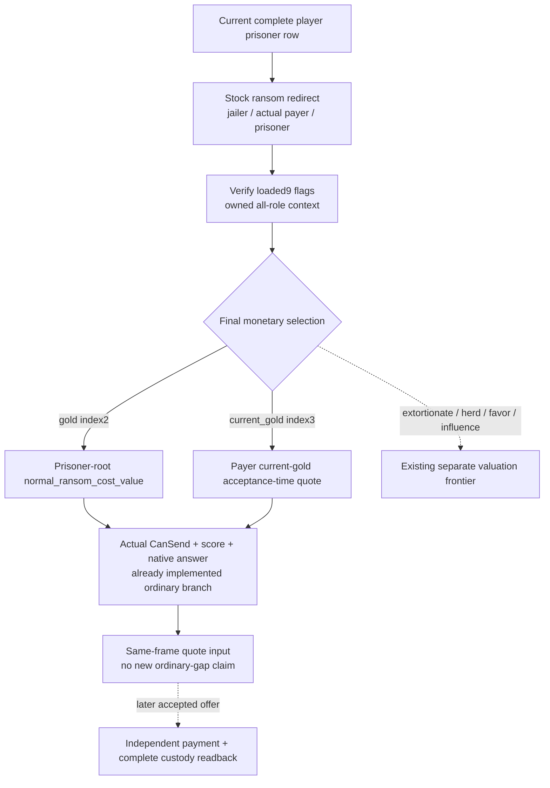
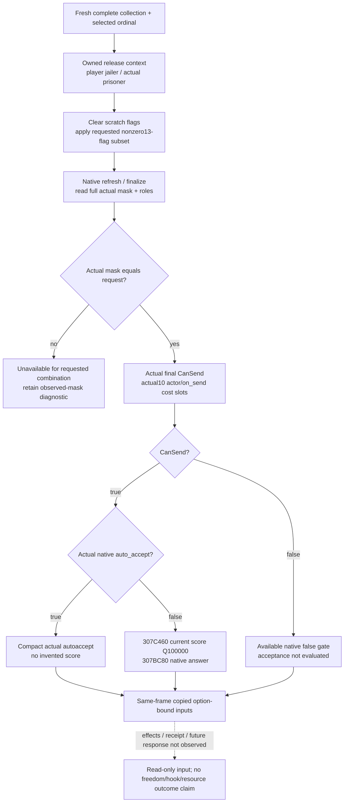
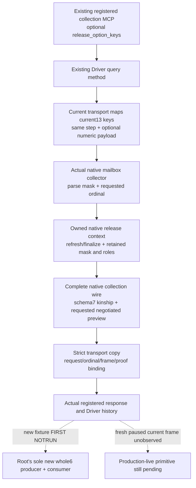

# Current ransom and negotiated-release inputs — CK3 1.20.0.3

Status: **research / implemented same-MCP source candidate; FIRST NOT RUN**.
The Oct7 follow-on connects option-bound observation to the existing registered
collection query. Source is uncompiled; no import, test, game/SDK/process query
or main-tree edit was performed. The parent owns the isolated English commit,
and Root owns adoption and publication. It reuses exact CK3 `1.20.0.3` Crozier / Steam
`25652598`, EXE SHA-256
`94B55397ABB687A3DCD436805A5D885E6BE90FA6C693FEB44A9E3BBEEADE02A6`.
No new executable bytes, metadata, scans or hash were read.

The current installed source is
`Z:/SteamLibrary/steamapps/common/Crusader Kings III/game/common/character_interactions/00_prison_interactions.txt`,
222,958 bytes, reused SHA-256
`1bb43b3c2061212af8d41b11314ff4e569af2a3506319f820d05877a7762abc5`.
The older ignored game copy is not an input. The observed .3 ABI reuse manifest
has `classification=PASS` for `ck3_12002_prisoner_ransom_abi.json` and preserves
the selected option, score and answer entries below. Historical `nonwar` labels
in that manifest describe provenance, not a current war authorization rule.
Religion and war are fully authorized; this observer does not add religious or
war policy, and live work remains Root-owned on Robert `29829`.

## Closed monetary inputs are reused

The existing outgoing `ransom_interaction` reader is already source-closed for
ordinary `gold` and `current_gold`: it executes current stock redirect
(`1893–1905`), verifies jailer/actual payer/prisoner and the current nine loaded
flags, constructs owned all-role scratch, selects index2 or3, then reads final
CanSend, `307C460` acceptance score and `307BC80` native answer from that context.
The quote amount uses the prisoner's named `normal_ransom_cost_value` for full
gold; current gold is a quote of the payer's acceptance-time payment. Source
implementation is `ck3_12002_prisoner.cpp:350–463`. It already explicitly
re-probes actual ordinary-gold→current-gold fallback. No missing ordinary
quote/role/answer is invented by this packet.

Stock `00_interaction_values.txt:187–241` starts with native `ransom_cost`, then
accounts for jailer culture, wealthy landless guests, hard/very-hard difficulty
and haggler factor; `280–285` increases this value by1.5. Current-gold accept
snapshots `scope:payer.current_gold_value` at prison source `1987–1998`; the
actual transfer/release is in the already frozen prison-effect topic. Ten
generic on-send cost slots cannot substitute for that on-accept payment.

The old received self-ransom `70766` loop already observed56gold, independent
player gold `+5,600,000` raw and absence from the complete player collection at
the same paused date. The [received self-ransom topic](pending-self-ransom-received-quote-12003.md)
and its frozen actual artifacts retain that limited production-live loop. It is
reused evidence, not rerun, and gives no new prisoner/conditions credit.

For outgoing ransom the stock AI acceptance `2238–2422` starts at0 and includes
celestial hierarchy; paid-resource greed/generosity; whether actual payer equals
prisoner; parent/spouse/family/lover/friend/soulmate/best-friend relationships;
rival/nemesis; dynasty and intimidation/cowed. For example, self-payment gives
`+100`, ordinary relations `+25`, strong relationships `+200`, rival `-200` and
nemesis `-500`. These are authored current inputs, not a probability model.
The existing final native evaluation incorporates those loaded branches; this
packet does not duplicate them into a player heuristic.

## Decisive selected-condition gap

The adopted release leaf `c4be504f6c552fe49489236e54b5c29a69f28247` verifies13
flags but intentionally rejects any nonzero finalized selected mask. It only
serializes `two_role_all_release_options_off` and requires native autoaccept.
The g104 sole FIRST already established five whole collection wires, five
registered reads and102checks **GREEN / static-ready**. Those results must be
reused; none was rerun here.

Source `4282` defines the same release interaction. `4312–4347` tests current
custody, torture, imprisoned former-regent rules and purging. All13 loaded
option identities are retained:
`demand_conversion, renounce_claims, banish, gain_hook, take_vows, change_prison,
make_puppet, become_executioner, recruit, disfigure, blind, castrate, demand_admin`.
The new request is an explicit nonempty subset; the native setter and finalizer
determine whether the exact requested combination survives.

Source `5986–5997` checks10 conditions for `auto_accept`; it does not check all13
flags. Therefore nonzero mask cannot be translated into autoaccept=false.
The candidate evaluates the actual trigger/scalar. If the final context is
sendable and autoaccept is false, it reads the actual native score and answer.
When CanSend is false, that false gate and its costs remain available while
acceptance is explicitly `not_evaluated_unsendable`.

Source `5999–6457` gives base0 plus freedom `+100`, ambition `-20`, rite head
`-120` and celestial hierarchy. Selected conversion reads zeal, refusal flag
and faith hostility. Claim renouncement has greed bands `-25/-50/-75/-95`;
executioner reads sadistic/callous; banishment reads legal punishment/culture;
gain_hook adds `-50` and further positive vengefulness penalty. Vows read
lustful/rakish/fornicator/seducer/deviant/cynical and sinful trait counts;
recruitment reads culture; disfigure/blind/castrate read actual traits,
sociability, children and boldness; demand_admin reads culture/government;
struggle supplies conditional modifiers. Full current stock evaluation is the
native evaluator's responsibility. Individual underlying values and localized
reason breakdown remain unexported; they do not block this independent current
final score/answer input.

All thirteen options are observation scopes. `change_prison`, `make_puppet` and
`become_executioner`, and injury/banishment choices, must not be labeled ordinary
freedom merely because the definition is named release. On-accept custody,
claims, hooks, court membership, religion, injuries, dread, stress, opinion and
legitimacy effects remain outside these ten actor/on-send costs.

## Implemented same-query source route

The four original source files deliver the DTO/binding header, provider `.inc`,
serializer `.inc` and strict Python nested contract. They are included in the
existing release TUs at `840d0d9949a0d658f2ef4370d6911b3d13eaa5aa`, with no second
context implementation or new production translation unit. A new inline
`ck3_12003_prisoner_negotiated_collection.hpp` is shared by the actual mailbox
collector and the new whole-wire producer: it parses the optional request and
routes the requested collection ordinal to the actual native leaf.

The existing registered `ck3_query_player_prisoner_collection_private_v1` now
accepts optional `release_option_keys`. Its existing Driver method passes that
input to the current collection transport, which maps the nonempty distinct
current13 keys to `release_option_mask_bits` in the same execute_step payload.
The current `ransom_ordinal` selects the preview row. No new query step or
registered tool is added. When the optional input is absent, the original backend
call and request shape are retained.

The native mailbox parses the optional bitset, binds the exact .3 negotiated
leaf and calls `ReadPrisonerNegotiatedCollectionRow12003` on the owner thread.
Every returned row carries the requested-mask metadata when this preview is
requested; only the selected row is evaluated. The owned native context and
finalizer supply its actual retained mask, chosen roles, final CanSend, costs
and answer. Request metadata never substitutes those observations.

The complete collection serializer's sixth optional array remains native
kinship; its seventh optional array adds `negotiated_release_preview` only for
a requested preview. Schema7 keeps all v6 fields and native_kinship; the optional
negotiated row union also supports v6 serializers without a kinship pointer.
Strict transport normalization checks each requested mask, selected ordinal,
native role/frame binding and available proof epoch against the collection.
The validated result is recorded by the existing Driver history hook.
`queried_release_option_keys` and `queried_release_option_mask_bits` are copied
transport metadata, separate from the unchanged native envelope fields.

Detailed fields, exact API and six new FIRST cases are in
[MISSING-FIELDS-AND-API.json](Z:/ck3_mod_rewrite_process_assets/g2-parallel-20261006/prisoner-release/next-observations/ransom-negotiated/MISSING-FIELDS-AND-API.json); shared hooks are external in
[SHARED-HOOKS-RECIPE.md](Z:/ck3_mod_rewrite_process_assets/g2-parallel-20261006/prisoner-release/next-observations/ransom-negotiated/SHARED-HOOKS-RECIPE.md). The concrete Oct7 hooks are adopted in the isolated source tree; [Root delivery](Z:/ck3_mod_rewrite_process_assets/g2-parallel-20261006/prisoner-release/next-observations/negotiated-integration/ROOT-DELIVERY.json) records the follow-on pin and [Oct7/W41 fields](Z:/ck3_mod_rewrite_process_assets/g2-parallel-20261006/prisoner-release/next-observations/negotiated-integration/OCT7-W41-FIELDS.json) record the honest scope.

First qualification is one new actual whole-wire producer target
`ck3_12003_prisoner_negotiated_preview_test` and one new registered compound,
six new cases, all **NOT RUN**. The producer and mailbox use the same request
parser and selected-row helper; the consumer passes real optional keys through
the registered query and receives the complete native producer wire. Synthetic
native callbacks qualify only that path after Root executes FIRST; they do not
claim a current prisoner's legal combination or release outcome. This does not
reopen g104, CTest, the old self-ransom loop or passed ordinary-ransom fixtures.

After adoption and new FIRST, Root's next legal readonly recipe is: obtain one
fresh complete Robert collection, choose its current ordinal with valid hook
target (not a hardcoded old prisoner), then call the same registered MCP with
that paused public revision and `release_option_keys=["gain_hook"]` (mask8).
Compare its returned actual selected mask, CanSend, costs and native answer with
the same current row's already available ordinary ransom quote and unconditional
preview. An unavailable combination or false gate is itself a useful current
observation. Only actual paused results can qualify production-live primitive;
there is no release command in this packet.
