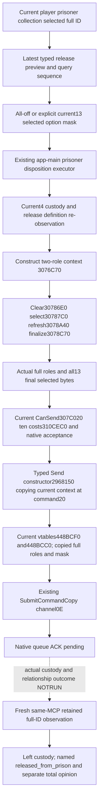

# Actual4 player prisoner release action consumer

Source-first action work dated 2026-10-07, exact Root baseline
`89e2ed5341fdc1a2f80627a2346c1fa3065220a7`. It depends on owned query commit
`204844b7a66940d2d98b83f4506a1955482e2b4d` and its six-file external wiring
patch. The local prerequisite cherry-pick is `e4dcf880`; no merge is used.
Root supplied Robert29829 H9638, raw date53288448, saved6005, natural
prisoners0. This packet is SOURCE_ONLY_AUTHORED_NOTRUN, with no natural action
or M6 live credit.

## Existing native tree and actual4 send chain

The stock release source and its exact data pin, option conditions, acceptance,
war retention and on-accept branches were frozen before this consumer in
[the prisoner source tree](prisoner-disposition-native-ai-tree-12003.md) and
[the actual4 selected release tree](prisoner-war-capture-negotiated-release-12004.md).
The actual executable is 1.20.0.4 Crozier Steam25734779, SHA-256
`98702F88A547CDE2EAF29A85F93B85F68EE4CF8148336A4F7AFAEB75319DD518`.
The current data manifest is5078208590259867811; the stock prison source SHA is
`1bb43b3c2061212af8d41b11314ff4e569af2a3506319f820d05877a7762abc5`.

The ordinary interaction initiator samples declared options but supports only
zero declarations. Release declares thirteen even when all are off, so its
`declared_options_unsupported` path is a concrete action blocker. The fix is a
release-specific consumer of the already mapped context and command substrate.
It does not expand the generic initiator or accept arbitrary special payloads.

`ck3_12004_interaction_context` closes constructor, clear/select,
refresh/finalize, validator, cost, trigger, score and answer callbacks.
`ck3_12004_prisoner_ransom_action.hpp/.cpp` closes the generic typed Send
constructor `0x2968150`, primary `0x448BCF0`, secondary `0x448BCC0`, command
size0x368, copied context+0x20 and channel0x0E. Its source receipt is
`research/ck3_12004_prisoner_ransom_action_abi.json`.
`ck3_12004_commands` binds the actual command manager/queue and the existing
software command-copy ownership algorithm. These entries serve a generic
interaction context, not a ransom-only command class. No executable read,
new RVA, runtime hook, or replacement provider is introduced here.

The release context uses the same reviewed 0x338 temporary object. The current
definition has thirteen canonical flag rows; the local selection vector is at
context+0x300/count+0x30C. Actor and recipient are full IDs, the secondary roles
are absent, and the effective actor is the played jailer. Command construction
copies that finalized context. The consumer reads back the copied definition,
roles and all thirteen selection bytes before passing it to SubmitCommandCopy.

## Production consumer and publication

The independent native leaf is
`ck3_12004_prisoner_release_action.hpp/.cpp`. It rebuilds current custody,
definition, mask, final native CanSend, ten costs and native acceptance, comparing
the copied current terms with the latest observed selected preview. It keeps
the finalized context alive through Send construction and checks the current
owner frame immediately before the one queue invocation. Context and copied
context are destroyed using the existing ownership algorithm after submission.

The dedicated public tool is `ck3_release_player_prisoner_private_v1`, taking
the latest collection and selected prisoner full ID. Its wire step is
`submit-player-prisoner-release-private-v1`, with the existing current revision,
`release_query_sequence`, full prisoner ID and observed
`release_option_mask_bits`. Mask0 means the all-off observed release path;
nonzero masks are the explicit current selected terms. Terms come from the
query result, rather than a second independent public option vector.

The minimum release decision consumes the existing observed CanSend and
acceptance: submit only when the current native reply predicts acceptance.
Legal refused offers remain available as query results. This consumer does
not compute a personality utility, choose injured/banished captives, or claim
that a native score guarantees the later recipient response.

The existing prisoner disposition executor slot handles either ransom or
release through its trusted typed context. No new mailbox executor ordinal is
needed. The latest selected release cache is retained alongside the existing
quote in `PrisonerPrivateWorkerState12004`; its sizeof change makes Bridge.cpp
a real Root compilation input. No Bridge request token or generic ordinary
interaction contract changes. Existing private ransom-action registration
enables this sibling disposition tool as well.

Only `submitted_verification_pending` is a successful action response. After
a real release, Root must obtain a fresh frame, verify the full ID left custody,
then call the same collection MCP with `release_material_target_character_id`
to measure the named relationship modifier and total opinion separately.
Root's already GREEN retained-material native4/public5 FIRST is reused and
not rerun. It does not qualify this new sending path.

## Root adoption and next natural trigger

Root adopts the owned query leaf and query wiring before the owned action
leaf and external action/Python hooks. Compile inputs and header ABI changes
are enumerated in the external delivery; this lane does not run build, tests,
SDK, injection, CK3, Steam or executable inspection.

Next trigger remains a real combat/siege capture while advancing the ordinary
Robert campaign. Query the current captive, inspect existing per-war retention
pairs, compare ransom with observed all-off or selected accepted release terms,
and retain the material baseline. The action still requires Root's first native
and registered consumer qualification before a natural use. Prisoners0 is a
normal current state and gives no release or material credit. Root clock and
Byzantine work need not wait for this source candidate or for a capture.
