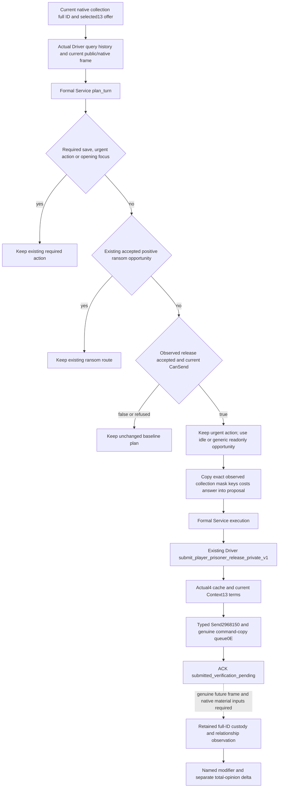

# Actual4 negotiated release in the formal Service turn

The source integration baseline is Root
`ae003bece794acb7eed977a3a017555bab303394`, dated 2026-10-07. Robert29829's
ordinary campaign remains the only game entry and currently has no natural
prisoners. This packet concerns an offline formal Service entry; it does not
claim a captured prisoner, release effect or M6 live loop.

## Native input ledger before the minimum policy

The native source tree is already frozen in
[prisoner disposition](prisoner-disposition-native-ai-tree-12003.md),
[selected actual4 release](prisoner-war-capture-negotiated-release-12004.md)
and [actual4 release Send](prisoner-release-action-consumer-12004.md).
Reuse their CK3 1.20.0.4 Crozier Steam25734779 executable pin
`98702F88A547CDE2EAF29A85F93B85F68EE4CF8148336A4F7AFAEB75319DD518`
and stock prison data pin
`1bb43b3c2061212af8d41b11314ff4e569af2a3506319f820d05877a7762abc5`.
No executable, SDK or game inspection is performed here.

| Native input or branch | Existing production source | Formal consumption and boundary |
| --- | --- | --- |
| Current full captive ID, ordinal, jailer and verified custody | Complete player-prisoner collection | Bind the candidate to the same played actor and current full ID. |
| Actual thirteen selected option bytes and canonical keys | Finalized actual4 Context, copied negotiated preview | Preserve the observed selection. No fabricated option combination or second public option vector. |
| Final native CanSend | Context validator307C020 | A complete false result remains an observed unsendable offer. |
| Ten current actor on-send costs | Cost310CEC0 and strict preview contract | Retain the actual typed costs in the plan and execution result; no invented personality utility. |
| Automatic acceptance, native answer/status and score | Trigger, score307C440, answer307BC60 | Use current acceptance for the minimum send decision. These are recipient inputs, not an actor value score. |
| Current ransom quote and payer | Existing ransom preview/formal consumer | Preserve the existing accepted positive ransom priority. |
| Per-war captive retention pairs | Existing query-war-prisoner-release-pairs-v1 | Reuse current observations. Generic pair completeness does not close special FP3 house-member retention. |
| Named released_from_prison and separate total opinion | Existing same-MCP retained full-ID material query | Only a fresh game observation can establish custody/material outcome. Queue ACK is pending. |
| Close/extended family, child and dynasty | Existing native_kinship and collection projections | Available inputs are not relabeled globally missing; the minimum release entry does not compute full sender score from them. |
| Greed, compassion, vengefulness, time_in_prison and prison-break state | Sender score branches in the frozen stock tree | No new projection or sender weighting in this packet; source quality gap remains explicit. |
| Opinion, rival/nemesis, spouse betrayal, feud, house unity and struggle helpers | Sender score branches in the frozen stock tree | Not inferred from title or dynasty. A later same-MCP native projection can replace the minimum opportunity ordering. |
| Conversion, vows, banishment, recruitment, vassalage and injury outcomes | Stock option conditions and on-accept effects | Native selection/CanSend remains observable. The minimum policy does not rank these outcomes or synthesize trait values. |

The stock source gives freedom base+100 and selected gain_hook-50 in recipient
acceptance; renouncing claims depends on current greed. Its sender release
score has its own renunciation/religion/banishment/recruitment weights and
family/peace/duration/compassion/revenge/struggle/prison-break branches. The two
scores are separate. The functional entry below uses an observed accepted
offer, rather than claiming full native actor arbitration.

## Concrete gap and source chain

At Root ae003bec, `bridge/service.py` imports and dispatches only
`prisoner_ransom_formal_consumer`. The dedicated negotiated collection query,
Driver release submit and registered release tool are implemented, but formal
`plan_turn`/execution does not consume them. Generic read-only discovery can
therefore keep an already observed accepted captive offer outside the formal
action plan.

The minimum ordering uses current accepted selected terms and keeps the
existing ransom choice and urgent/due actions ahead of a release opportunity.
It can consume a real Driver query receipt before an idle advance or generic
campaign-root, declarable-war or marriage-choice discovery. These three exact
read-only discovery steps do not represent a current marriage or war action.
It introduces no new MCP tool, private
permission switch or native schema. Pending identity belongs to the actual
formal execution record; it is not an outcome or material score.

An initial ordinary succession expectation may otherwise query generic
campaign-root data before formal arbitration. The source defers this initial
root enrichment only when the current accepted release is already observed.
Required save/opening focus, existing succession reconciliation, a changed
played character and urgent events remain authoritative. If final arbitration
keeps another action, the ordinary root enrichment resumes in the same call.
Following a submitted release it resumes on the next turn.

The current-query requirement means this entry consumes the most recent
selected offer; it does not enumerate or optimize all thirteen option
combinations. The retained release receipt does not yet automatically resolve
the formal pending ledger. A fresh full-ID custody and relationship observation
and its receipt resolver remain the next integration after a real submission.
No queue ACK, event disappearance or absent prisoner collection alone is used
as a named-opinion outcome.

## Qualification boundary

The original native five-case and registered five-case release action FIRST
are actual offline GREEN and are reused without repeat. Their final receipt is
`Z:/ck3_mod_rewrite_process_assets/g2-background-20261007/g2-m6-institutions/release-action-first-r21/ROOT-FIRST-RESULT.json`.
All-off and gain_hook queue successfully; native-false and refused offers do
not queue; a changed copied mask reaches native rejection. Those cases are
fixture-owned memory and callbacks and do not qualify a paused game release.

This new packet adds one unique production Service compound consuming the
original all-off, gain_hook and changed-copy whole packets. The two existing
native-false/refused registered results are reused without repeating their
execution. The new compound must exercise planning and the actual typed
execution route, retaining native/public frame, selected mask and on-send
costs. It keeps all successful submissions pending and material_result=false.
Native execution, old tests and the old retained-material GREEN are not
replayed. The compound completed with exit0 and GREEN at source
`4d1d38fa` on 2026-10-07 20:21 Asia/Shanghai. Its actual verdict is
`Z:/ck3_mod_rewrite_process_assets/g2-background-20261007/g2-m6-institutions/release-formal-service-12004/first05/CONSUMER-FIRST.json`;
the companion `consumer-first.log` and `run.log` retain the executed recipe.
All-off and gain_hook selected the formal release step and retained pending
ACKs. Changed-copy terms selected the same formal step, reached the original
native rejected reply and retained an unresolved, nonmaterial receipt.

The ordinary lifecycle binding comes from the actual H9638 bootstrap argv
and its existing prepared environment manifest, using the six-field conversion
already implemented by the production MCP constructor. The manifest is not
rehashed. The original release-only native frames have empty command history,
so the Service fixture explicitly prepares a synthetic saved-baseline caller
state through the existing persisted Driver format. This fixture state is not
a native checkpoint, actual H9638 history or a game recovery result. Production
save priority is unchanged, and the native packets are not rewritten.

The earlier attempts remain preserved as harness RED in `first01` through
`first04`. The concrete findings were initial generic root enrichment, an
unconfigured legacy one-life caller, the original empty checkpoint history and
the exact marriage-choice discovery opportunity. The final source preserves
required saving and ordinary lifecycle semantics, while allowing the current
accepted release before those three specified discovery steps. The two reused
negative cases are not new Service executions.

This is offline fixture qualification of the formal consumer. No fresh
independent native after-frame, real captive, native saved baseline or custody
change is established. There were no new native executions, SDK calls, pipe
connections, builds, CK3 actions or game process operations in this compound.

For a future natural captive, use the existing ordinary configuration and
`--private-prisoner-ransom-action` permission already shared by the release
submit path. Query `ck3_query_player_prisoner_collection_private_v1` for the
selected ordinal and actual option keys, then call existing `ck3_plan_turn`
and `ck3_auto_turn` while the query's played actor/date/native frame remains
current. Keep the selected full ID after submission and use the existing
retained-material query on a genuinely fresh frame. An unchanged or missing
result remains pending; it is not material freedom or opinion credit.

A future genuine combat/siege capture in Robert's ordinary campaign triggers
the complete current query/offer/baseline/release/fresh-custody/retained-material
recipe. Current prisoners0 supplies no action or live credit, and this work
does not delay existing clock or Byzantine goals.
