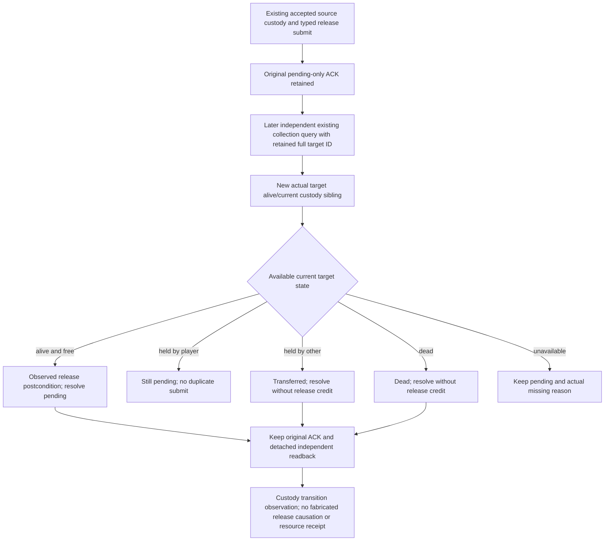

# Independent retained-target release receipt — actual4

2026-10-08 / W41, source-first on CC1
`cc1e6a9e249ebeffdba1e6c910615041f090bf34`. Current exact build is
1.20.0.4 / Steam25734779, frozen EXE SHA
`98702F88A547CDE2EAF29A85F93B85F68EE4CF8148336A4F7AFAEB75319DD518`.
No game, SDK, process, EXE read/hash, import, build or test is performed here.

## Existing native source and real missing consumption

Reuse [formal release](prisoner-release-formal-service-12004.md),
[material opinion](prisoner-release-material-opinion-12004.md),
[keeper opinion](prisoner-keeper-opinion-12004.md) and the
[disposition tree](prisoner-disposition-native-ai-tree-12003.md).
The typed submit returns `submitted_verification_pending/material_result=false`.
The ordinary consumer stores its original actor/target, selected option mask,
native/date frame and ACK, but ends without independently reading the target.
That is the actual R76 target61540 pending gap, not a new disposition policy.

The native source owner separately closes the new current-target sibling using
already retained actual4 sources: target death pointer `+1D0`; actual4 jailer
getter `289E810..289E868` (88B), Character extension `+1B0`, relation `+288`,
full jailer ID at relation `+0`. An absent relation is a known no-captor value;
a present invalid full ID remains unavailable. Player collection absence alone
cannot distinguish free, transferred and dead. No new EXE bytes belong to this
consumer. The source owner supplies full-ID resolution and same-query sampling.



## Minimal implementation scope before code

Keep the existing material-target MCP parameter and collection API. Add a
dedicated strict actual4 retained-target sibling parser; normalize it when
present, preserving older material clients. Ordinary recovery explicitly needs
that new sibling and never infers free from collection absence or an opinion
modifier. Validate its actual schema/build, current native revision/date and
original full actor/target pair with mutually consistent state fields.

Reuse the existing `player-prisoner-release-formal-v1.json` pending record,
accepting its historical one-key form. A small receipt consumer preserves the
original ACK and returns independent target custody. Free is a verified freedom
postcondition; causation remains unobserved. Transfer/death are distinct terminal
outcomes with `material_result=false`. Missing input remains pending. No resend
or new native submit path is introduced. Keep existing urgent war, ransom and
ordinary action precedence; pending receipt is an idle/discovery opportunity.

The shared Service delta is limited to one existing release planner call's
receipt choice, one import and one typed receipt dispatch. No CMake/native edit.
One new registered compound must consume new whole native packets through the
actual existing registered MCP query, strict transport and normal Service
dispatch; free/held/transfer/dead/unavailable and full-ID mismatch are distinct.
It is authored FIRST0 and waits for Root's unique native build/consumer run.
Historical passed release/keeper/material tests and wires are not replayed.

## Qualification boundary

This tree is a source candidate. Existing R76 ACK and later day/SAVE6007 do not
by themselves prove freedom or action causation. No release/M6/live credit is
claimed until Root consumes an independently observed current-target state.
Opinion direction/modifier, actual fees and negotiated effects retain their
existing boundaries; this package does not manufacture a command fee receipt.

## Authored source delivery / FIRST0

The native owner's source-first tree is
`C:/codex-ck3-background/prisoner-retained-state12004/source01/docs/ck3-native-ai/prisoner-retained-target-state-12004.md`,
with the frozen API at
`Z:/ck3_mod_rewrite_process_assets/g2-background-20261008/prisoner-retained-target-state/native/API.json`.
It confirms the thirteen exact fields and state conventions before the parser
is authored. Its new whole target/CTest is
`ck3_12004_prisoner_retained_target_state_whole_first`; five packets are
`retained-free.json`, `retained-held-player.json`, `retained-held-other.json`,
`retained-dead.json`, `retained-unavailable.json`. Actor29829, retained target
67108867, other captor83886084, native901–905/date1220411 are fixture inputs.
No original R76 packet is relabeled or replayed.

Implemented candidate API:

* `normalize_prisoner_retained_target_state_12004(value, native_revision=...,
  date_raw=..., player_character_id=..., target_character_id=...)` validates
  exact actual4 identity and state consistency, returning a detached value.
* `read_release_receipt_private(driver, pending=...)` queries the original
  retained full target through the existing Driver. `applied` is actual observed
  freedom, `transferred`/`dead` are terminal without release credit; unavailable
  and player-held remain `pending`. The receipt explicitly preserves
  `release_causation_observed=false` and `command_costs_verified=false`.
* Existing release planning chooses
  `query-player-prisoner-release-receipt-v1` only at its existing idle/discovery
  opportunity on a later unchecked frame. Original actor/target and ACK remain
  in the durable result; an unchanged checked frame is not queried again.
* Service has only a new import and typed dispatch for this planner step. It
  changes no native route, registration, ordinary priorities or CMake.

Root's sole new registered compound recipe, after native FIRST GREEN:

```text
<full-venv-python> -B -X utf8
  <source-root>/ck3_autonomous_player/tests/unit/test_prisoner_release_retained_receipt_registered_12004.py
  --source-root <coherent-source-root>
  --native-fixture-dir <five-new-whole-native-wire-directory>
  --output-dir <new-unique-FIRST-output>
```

This uses actual registered `ck3_auto_turn`, the production release planner,
normal typed Service dispatch and NativeDriver transport. Only the unrelated
baseline campaign arbitration is fixture-selected as idle; no full strategy
quality is claimed. Each whole native body passes intact, one read per state,
zero native submit. Pure full-generation mismatch controls make no query.
The consumer and new fixture are **AUTHORED_NOTRUN / FIRST0**; Root alone runs
the unique compound after adopting both coherent source packages. No syntax
import, compile, native test, prior wire consumer or live attempt occurred here.
