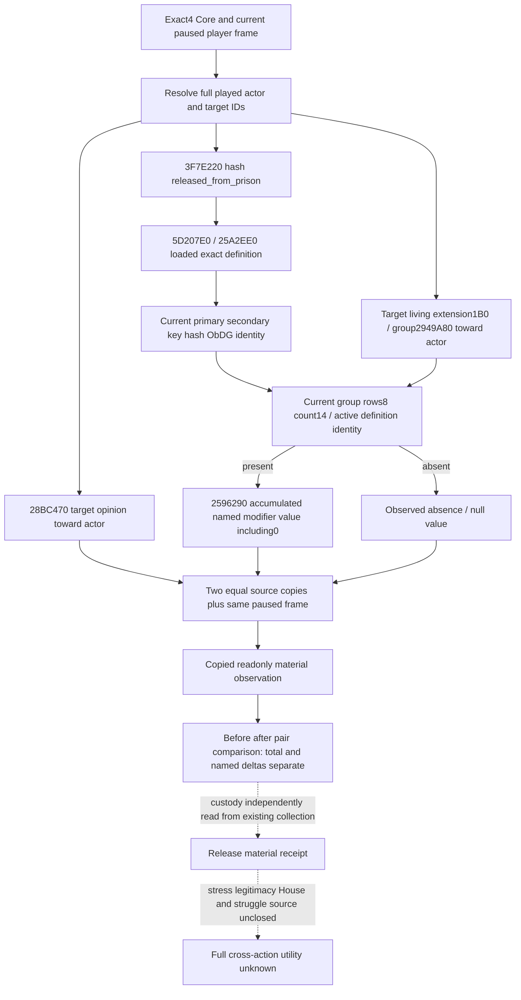

# Prisoner release named relation material — CK3 1.20.0.4

Source plan sealed before implementation on October 7 Asia/Shanghai. Baseline
`23c3c4bc`; CK3 **1.20.0.4 Crozier / Steam25734779**, frozen EXE SHA-256
`98702F88A547CDE2EAF29A85F93B85F68EE4CF8148336A4F7AFAEB75319DD518`.
This lane makes no EXE read, hash, build, test, SDK, Steam or game operation.

## Concrete value gap and scope

The [current prisoner native tree](prisoner-disposition-native-ai-tree-12003.md)
separates native final release legality and ten on-send costs from on-accept
consequences. The current release source grants a `released_from_prison`
opinion modifier, reduces dread and conditionally changes stress, legitimacy,
House relations and struggle resources. An all-zero send cost is not an
observation of those consequences. Existing actual4 collection observations
already publish custody, primary title tier and player dread; they do not
publish this fixed named modifier or the prisoner's opinion toward the player.

This independently useful slice reads **target -> current played actor** total
opinion and the current `released_from_prison` modifier. The same full target
CharacterID remains queryable after leaving the collection. It supports a
before/after relationship comparison without claiming release causation from
a modifier or total-opinion delta. It does not redo the historical Steward,
CA1 or selected Feast contracts, change outgoing ransom selection, send a
release, or claim the whole M6 complete.

## Exact4 native source before policy

The authored prison tree/source hash and on-accept branch are reused from the
current source ledger. The [.4 event data proof](vanilla-event-source-migration-12004.md)
records identical old/new game-data depot manifest `5078208590259867811`;
this permits explicit reuse of reviewed scripts, not old EXE ABI or live credit.
No old numeric +20/duration/legitimacy value is projected as current observed
material. Loaded native definition and current accumulated modifier value are
read directly.

The already migrated actual4 Faction/Activity/Sway substrate supplies:

| Source operation | Current actual4 binding / operand |
| --- | --- |
| Player and target full-ID resolution | `ck3_12004::BindCoreImage/ResolveCoreCharacter`; generation-bearing ID +18 |
| Total recipient opinion toward actor | `0x28BC470` |
| Stable loaded definition key hash | `0x3F7E220` |
| Loaded opinion DB and lookup | slot `0x5D207E0`, lookup `0x25A2EE0` |
| Definition identity | primary `0x48C5380`, secondary `0x48C5348`, hash14/key18/length28/capacity30/ObDG38 |
| Recipient opinion group | living extension `+1B0`; group getter `0x2949A80` for played full ID |
| Active named modifier identity | rows8/count14; active `0x473DE18` or temporary `0x473DDE0`, definition pointer +8 |
| Current accumulated named value | sum `0x2596290` |

Evidence is reused from `ck3_12004_gift_opinion.hpp/.cpp`,
[sway migration source closure](sway-adopted-mcp-migration-12004.md) and the
current prisoner .4 source ledger. This adds no new address, field layout or
mapping assumption. Definition key identity is checked against
`released_from_prison` at runtime; the helper does not assign a guessed hash.

## Minimum implementation and shared hook recipe

The independent header/source use the already genuine actual4 gift-opinion
binder and native hash, the existing collection frame/access callbacks and
two agreeing source samples. No engine pointer reaches the result. Legal
absence is `observed=true,present=false,value=null`; a present zero retains
`present=true,value=0`. Read failure remains unavailable.

Root owns shared Bridge/CMake/native_driver and registration. The integration
recipe extends the existing prisoner query with an **optional full-ID material
target**, kept independent of the current collection ordinal so that post-release
reads still work. Omitted requests keep the existing wire. The same owning
collection executor, paused frame and current source identity are reused.
The strict Python helper and before/after comparator consume the new optional
value. The source is not a provider or production-ready capability until the
shared hooks and new qualification are actually adopted.

Use current full target IDs from the collection or a tracked selected action.
An arbitrary human ruler's existing modifier can qualify only the observer,
not a release result. Original ordinary Robert29829 is the sole game entry.
No historical prisoner/action is resubmitted. One necessary new whole native
producer plus one registered full-consumer compound should cover absent,
present0, positive current sum and post-custody full-ID reading; old completed
cases must not be replayed. Root then takes one fresh paused observation for an
actual current/selected target and separately records material outcome and cold
recovery if a later selected action is performed.

Readiness: **research / source closed / implementation pending** at this plan
cutoff; new fixture/native/registered/live status is NOTRUN. Player legitimacy
still reports `actual4_legitimacy_field_source_unavailable`; stress and full
House/struggle consequences are explicit next inputs, never filled with zero.

## Implemented independent candidate

The new `ck3_12004_prisoner_release_material_opinion.hpp/.cpp` implements the
source-proved fixed-key reader and value serializer. The Python
`prisoner_release_material_opinion_contract_12004.py` supplies its strict
actual4 consumer and the independent before/after comparator. It preserves
present0 versus absence/null and reports total and named changes separately.
It intentionally publishes no raw public-revision alias; native
`snapshot_revision` binds to the existing query, with the actual public SDK
revision kept at the outer query.

The [concrete shared integration and FIRST recipe](Z:/ck3_mod_rewrite_process_assets/g2-background-20261007/g2-m6-institutions/ROOT-INTEGRATION-RECIPE.md)
extends the existing owning collection query with an optional full-ID material
target. Shared files, normal policy selection and current runtime remain
unchanged until Root applies those hooks. No build, import, test, game, SDK,
Steam or EXE operation has run here. Status is **research / implemented source
candidate**; static-ready, fixture-live and production-live remain NOTRUN.
