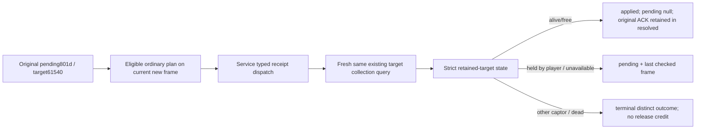

# R0077 ordinary consumption of the retained release receipt

Source check, October8 / 2026-W41. Base `6ee7dea1b4d2fa4ecb05223f12c66b7afe72ac2d`; no production source change is necessary. This lane performed no import, build, test, SDK, game, EXE read, save read or large Driver/store read.

## Current evidence and preserved original request

Root's [R77 response002](Z:/ck3_mod_rewrite_process_assets/g2-background-20261007/upstream-build-migration/managed-full-h9696-startup32restore01/operator/gameplay-responses/002-r77-retained-release-target.json) reports target61540 alive, `custody_state=free`, `is_imprisoned=false`, `jailer_character_id=null`, with released-from-prison opinion20 present. This is the actual retained-state observation; collection absence and ACK are separate facts. The response is referenced directly, without rereading its body in this source lane.

The [extra eleventh stream restoration receipt](Z:/ck3_mod_rewrite_process_assets/g2-background-20261008/runtime32-r77-deployment/ROOT-R77-RELEASE-LEDGER-RESTORED.json) records the opaque3202B original release ledger preserved into R77. Its exact small [frozen ledger](Z:/ck3_mod_rewrite_process_assets/g2-background-20261007/upstream-build-migration/normal-r76-h9696-saved6009-freeze01/r77-extra-preserved-release/player-prisoner-release-formal-v1.json) was read once as the necessary consumer input: pending stage `receipt_pending`, player29829, target61540, all13options off/mask0, ten send costs0, original ACK request `prisoner-release-801d779a60204a83a9100c9af8eb0445`, pre-native2/date53288472. It has no last-checked frame. Neither this source check nor opaque preservation resets or resolves that ledger.

## Production chain already present

* `prisoner_release_formal_consumer.py:165–195` reads the existing pending ledger. On an eligible ordinary idle turn (`life-advance` or `advance-route-contact-horizon-v1-*`), or a discovery step while no active wars exist, a different current native/date frame selects `query-player-prisoner-release-receipt-v1` and supplies the original pending identity. Active events, pending interactions and already selected concrete gameplay steps retain their existing priority.
* `bridge/service.py:1839–1844` calls the formal release planner on the normal plan path. Its typed dispatcher at3295–3299 calls `read_release_receipt_private` for that selected receipt step.
* `prisoner_release_receipt_consumer_12004.py:24–59` takes a fresh current snapshot, joins the original player/target/date, pumps the existing private query path and invokes `query_player_prisoner_collection_private_v1(expected_revision=now['revision'], release_material_target_character_id=target)`.
* `bridge/player_prisoner_collection_private_transport.py:139–155,430–445` accepts the optional retained-state sibling for this existing target request, normalizes exact build/native/date/player/target, checks its paused frame and retains queried provenance.
* `prisoner_release_receipt_consumer_12004.py:49–95` explicitly consumes `prisoner_retained_target_state`. Available free becomes `applied/material_result=true/postcondition_verified=true`; the ledger becomes `{pending:null,resolved:result}`. Held-by-player stays pending, transferred and dead resolve separately without release credit, unavailable stays pending with the observed reason. Original request/ACK remain in `source_pending`. Causation and command-cost verification remain false.

Response002 publishes the observation; it does not itself execute this ledger consumer. The consumer deliberately takes a fresh query when its normal turn is selected. Current marriage work does not prove a missing receipt input or justify changing the strategy's priority.

## Exact next normal Root request

Use the existing registered `ck3_plan_turn` with body `{}`. When its actual current plan selects `query-player-prisoner-release-receipt-v1`, use registered `ck3_auto_turn` with body `{}`; this method plans and executes one normal typed turn. It will select and consume the original pending record and generate its own fresh expected revision. No prisoner ID, option mask or old revision is supplied to these tools.

The receipt string is a software planner/Service step. It is not a newly registered native `ck3_execute_step` token: `GameplayBridgeService.execute_step` passes ordinary unhandled steps to Driver. Do not route this receipt directly to Native32. The named read-only existing collection tool remains available for separate state observation, but such a read does not consume the pending ledger.

The successful ordinary receipt should expose plan.selected_step=`query-player-prisoner-release-receipt-v1` and result.status=`applied`, material_result=true, postcondition_verified=true, current_target_state.target61540/free; preserve original801d ACK under source_pending and set pending=null/resolved=result in the normal release ledger. Root must freeze that actual result before claiming the full ordinary release loop. Existing whole5/registered fixture qualification is reused; no repeated or new compound was run here.
