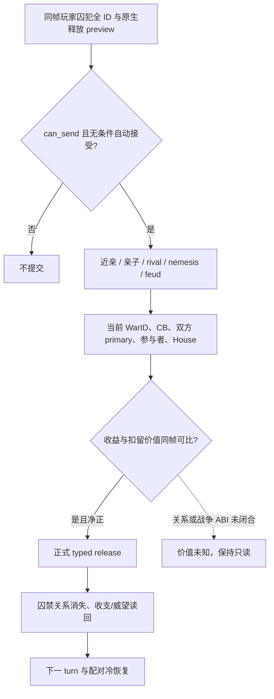

# 囚犯释放的关系与战争价值输入（CK3 1.19.0.6）

状态：**exact-build 原版脚本已核；主头衔等级及玩家 dread 私有 v6 读口已在 R0278 paused 实机读回，策略与动作未接线**。本篇只处理玩家已关押囚犯的 `release_from_prison_interaction` 无条件选项。宗教释放条件、处决、赎金金额和战争决策模型均不在本次施工范围。

## R0278：H3446 同帧只读结果

正式 Robert actor `29829`、`date_raw=53219112`、`native_revision=3` 的 H3446 原始配对，经独立 v6 DLL 和官方 prepare/rebind/no-launch 后，在暂停地图上取得三名囚犯的同帧结果：`34486` 主头衔 `null`、`44484` 主头衔等级 `1`、`47028` 主头衔 `null`；玩家 `played_dread_raw=1500000`，即 dread `15`，故原版 `minor_dread_loss=-10` 在当前值下存在实质边际代价。三名囚犯仍在集合内，没有游戏动作或日期推进。证据为 `Z:\m6releasev6-candidate-v2\evidence\R0278\report.json`，SHA-256 `8D6F4F5B8C939914044CAA3C7CECB3166B7D1265FDF84247DFDCBCBA4E56A7CD`。查询在最小化窗口通过 fresh application-main pump gate，结束后仍为最小化，受控停止和进程树回收成功。先前 R0277 的 `pump_start=pump_end` 是一次无读数的 harness RED，不计 v6 阴性。

`44484` 等级 `1` 是男爵等级，未达到公爵等级 `3`；其余两人无主头衔，所以三人均不能由本帧的原版主头衔门取得合法性收益。三人的潜在 +20 被释好感仍须和 dread 损失、赎金及其他关系价值比较。R0276 的新版赎金读口对三人均返回 `unavailable/option_unavailable`，只证明未读到已验证可发送的金币报价，赎金价值保持 **unknown**；R0278 的冻结 DLL 源码早于该分类改动，不能把自身旧版 `option_unavailable` 当作新版证据。没有可证明净正收益候选，未提交释放动作，M6 仍未获得释放闭环。

## 2026-09-28 增量：实际收益与当前缺项

原版 `00_prison_interactions.txt` 第 4615–4830 行明确显示，无条件释放会给被释放者对玩家的 `released_from_prison` 好感修正，并让玩家承受 `minor_dread_loss`；若被释放者有公爵及以上主头衔，还给玩家 `miniscule_legitimacy_gain × (title_tier−2)`。冻结的 `00_prison_opinions.txt`（1,369 字节，SHA-256 `8215ED7EEAAF9CEB859E13EE9E13262DD99EDB31A27F6C7B2844E3AB488F6FEB`）把好感定为 **+20、10 年衰减**；`00_basic_values.txt` 的 `minor_dread_loss` 为 **−10**；`00_legitimacy_values.txt`（27,465 字节，SHA-256 `13E43166356B5DD99358F435330B03CB9BE95AB5913280318B01681186E23A2E`）的 `miniscule_legitimacy_gain` 为 **20**。原版还可能调整 House 关系、sadistic/callous 压力或地区 struggle 收益；不能把这些未知分支填零，也不能直接把不同资源数值相加当效用。

已合入的 R0268 private v5 实机首帧读回 34486、44484、47028 三人均 **不是玩家的子女**；这只排除 `is_child_of`。战争同事的 H2825 attempt-08 同帧只读 join 已证明三人均不在**该战争**的 generic PoW release pairs，且当前 CB 不适用 FP3 House 条款；结果是 `not_from_these_two_rules`，没有证明赎金、关系或其它扣留价值为零。来源分别见[当日日报](../autonomous-agent-progress/daily/2026-09-28.md)和[同帧战争摘录](../autonomous-agent-progress/coordination/war-requests/evidence/WAR-PRISONER-RETENTION-H2825-20260928.attempt-08-same-frame-green.json)。

新增的 private v6 `primary_title_tier_raw` 复用已冻结的 `GetCharacterPrimaryTitle`（RVA `0x25F3350`）和 [campaign root ABI](../../ck3_autonomous_player/native_bridge/research/campaign_root_context_v1_abi.json)：在现有囚犯 full ID、反向狱卒和双采样暂停帧内，核 LandedTitle storage generation，再读 template `+0x5C` 等级。`null` 表示该人物没有原生主头衔；读取失败则整个私有查询给 `title_tier_unavailable`，不把失败当无头衔。此字段默认关闭，**R0278 已有 H3446 paused readback 与官方 no-launch；尚无释放动作或新 PID 恢复**。其目的只是判断上述合法性收益能否发生，不单独构成正收益释放资格。

同一 v6 同帧加入 `played_dread_raw`。在冻结的 `ck3.exe` SHA-256 `2D00FF3101EF70B566F2FCBAE292F09263199C80E9DC8F139B82D7D96F83DB86` 中，由 RTTI `CDreadTrigger` 的 vtable 追到原生 getter RVA `0x28780E0`：它用完整 CharacterID 校验角色槽，再读取 `CCharacter+0x1B8` 的 land-state 指针和 `land-state+0x350` 的 64 位 `CFixedPoint` dread 原值；land-state 不存在时原生返回 0。固定点 1 单位为 100,000 raw，因此实际 −10 dread 必须与当前值比较，不能总按 −10 扣。私有查询复用已校验的玩家 full ID，在同一个暂停帧双采样；read 失败给 `dread_unavailable`，两次原值不同给 `sample_drift`。v6 编译开关默认关闭；**R0278 已有 H3446 paused readback 与官方 no-launch；尚无释放动作或新 PID 恢复**。

当前 H2825 同帧净值仍缺：三人各自主头衔等级、玩家释放前实际 dread（决定 −10 的边际损失）、可兑现赎金及付款方、close-family/rival/nemesis/feud、House 关系和其他扣留义务。若下次正式候选要消费释放，先在同一 paused frame 读这些实际输入，比较某名囚犯与保留、赎金两条路线，再提交 typed action 和独立后置；眼下不能从 +20 好感或两条战争规则未命中直接挑人释放。

## 自然阳性与缺口

R0262 Robert 玩家 `29829` 的同一 paused frame `date_raw=53216880` 从完整私有集合读取囚犯 `34486`、`44484`、`47028`。每行囚禁关系的 jailer 均回读为玩家；原生 finalized `release_from_prison_interaction` 的全条件关闭选项均为 `can_send=true`、`auto_accept=true`，各资源 on-send 成本为零。证据是 [R0262 正式报告](Z:/r0262-h2660-family-betrothal-freeze-20260927/evidence/formal-report.txt)，SHA-256 `767C93E3D06603A2381709F3471F16483E7571B20251AC2655DF692E2FAB0B86`。这些是**只读机会**；该 report 没有释放动作、关系收益或新 PID 后置。

三个候选的 `can_send` 与成本相同，不能据此判断谁值得释放。后续 H2825 的同帧 House/Dynasty 私有读取已对这三人实机读回：玩家为 `174/174`，囚犯 `34486` 为 `2370/2370`，`44484`、`47028` 为 `null/null`；三条赎金报价均 `unavailable`。该轮 paused native revision `3`、`date_raw=53217624` 同时报告 WarID `16777231`。证据是已随 Git 交付的 [H2825 正式报告摘录](../autonomous-agent-progress/coordination/war-requests/evidence/WAR-ROBERT-H2825-SIEGE-PARTITION-20260928.r0265-formal-report.json)，SHA-256 `B990E9F9E0F3E83B2412F86D9AE491820A0A5AA7EA6B83A028F7DF5A5B77E95B`。House 值或缺值都不代表原版的近亲、亲子、友好、敌对或战争价值；H2825 没有释放动作。

## 原版选择树与动作后果

冻结原版 `game/common/character_interactions/00_prison_interactions.txt`，201,766 字节，SHA-256 `3E05C94CDCE4D42CCE8256D2D79CD78FEB1C9D5B79DAA64AA8243AA0C658F22B`；`ck3.exe` SHA-256 `2D00FF3101EF70B566F2FCBAE292F09263199C80E9DC8F139B82D7D96F83DB86`。以下行号以此原版文件为准。

- 第 4088 行开始的 release definition 在 `is_shown` 检查目标确被 actor 关押；无条件选项的 `on_accept` 第 4160 行附近调用 `release_from_prison=yes`。`can_send` 是合法性，不能当成价值。
- 第 6030–6140 行的 stock `ai_will_do`：rival/nemesis 在非 forgiving actor 下减 40，vengeful 可再减 100；actor 未参战才可能因囚禁时间、compassion、近亲和亲子得到正权重。近亲条件是 `is_close_family_of`，亲子是 `is_child_of`，不是同 House/Dynasty。
- 第 6198–6224 行另有家族世仇减 50、`being_prisonbroken_by_laamp` 权重归零。这里只记录原版输入，不重建文化/宗教/LAAMP 全矩阵。
- 第 4880–4906 行 `on_accept` 有窄战争后果：当 actor 是 `fp3_free_house_member_cb` 防守方、primary attacker 的 House 与 prisoner 的 House 相同时，原版向 attacker 增加 `major_prestige_gain`、向 defender 增加 `major_prestige_loss`。这使“零资源成本释放”也可能有明确战争机会成本。具体当前战争是否命中，R0262 报告未读。

## 最小可复用读口与未闭合边界

| 输入 | 已有 exact-build 来源 | 当前结论 |
| --- | --- | --- |
| 囚犯与 jailer、finalized 无条件释放 preview | `player_prisoner_collection_query_v1_private` 对完整 32 位 CharacterID 双采样；`CCharacter+0x1A8` extension、`+0x288` prison relation、其 `+0x00` jailer；R0262 自然 paused 阳性 | 三人可合法释放；仍是 private/read-only |
| House/Dynasty | C211 同 reader 扩展：`CCharacter+0x150` HouseID、`CHouse+0x2C` DynastyID，完整 ID 回读；H2825 paused 私有报告 | 玩家 `174/174`；34486 `2370/2370`，另两人 `null/null`；不能代替 close family |
| 玩家当前 dread | `CDreadTrigger` getter RVA `0x28780E0` → `CCharacter+0x1B8` land-state → `+0x350` CFixedPoint，private v6 同帧双采样 | R0278 H3446 paused 实值为 `1500000` raw，即 15；本帧 −10 有实质边际代价 |
| 近亲、亲子、rival/nemesis、世仇与囚禁时长 | 原版 release AI 第 6030–6140、6198–6204 行 | 亲子 private v5 已有三人实机 `false`；其余原生关系和时长仍未取得。只查反射字符串或猜 House 关系均不够 |
| 当前战争身份 | 现有 `ck3_11906.cpp` 的 WarID/参与者 reader；`CWar+0x100` CB type、`+0x288/+0x28C` primary attacker/defender、`+0x20/+0x80` 参战方集合；`ResolveWar` 与 full CharacterID 回读 | ABI 已用于战争读口；囚犯集合查询尚未把同帧 WarID/CB 和候选 House 绑定。战斗模型不由本包更改 |
| 窄战争释放配对 | `ReadRaiktorSurrenderPrisonerReleases` 已能在 **Raiktor claim CB 的投降条款预览**读双方 primary 与前三顺位继承人及效果中的 release pair | 仅该 CB/结果的 PoW 条款预览，不是已经发生的释放。匹配是保留候选的强信号；空 pair 不说明囚犯在其它战争、赎金或关系上无价值 |
| FP3 解救家族成员 CB 后果 | 第 4880–4906 行的原版 `on_accept` 条件，加已有 CB/primary 与 C211 House 输入 | 当前 WarID 是否为该 CB、House 是否匹配尚无同帧结果；不能填 false 或估成零 |

下一项最小施工是补同帧已验证的赎金报价以及 close-family/rival/nemesis 判定，选择有实际价值差异的一名囚犯比较。亲子谓词已有 exact-build callable ABI 与 R0268 负例；其余关系不能用 House/Dynasty 代替。H2825 战争 PoW/FP3 已有窄结果，未来新战局仍需重新绑定。R0278 已闭合三人主头衔等级与玩家 dread，但未知赎金金额、关系价值、长期义务或战争机会成本仍标缺项，不能强行选人。

正式动作验收：同帧重新构造 exact `release_from_prison_interaction` 无条件选项，提交 typed 动作后在下一 paused revision 读**该 full CharacterID** 已不在玩家 prisoner 集合且 prison relation 不再指向玩家；读玩家与目标的实际资源/威望/关系变化以及如适用的 WarID/CB 后果，避免把 ACK 当生效。再由下一 turn 消费 action receipt/checkpoint，并由新 PID 从官方配对冷恢复确认囚禁关系仍已解除且不重复提交。R0262 未执行这一步，M6 readiness 不提升。
