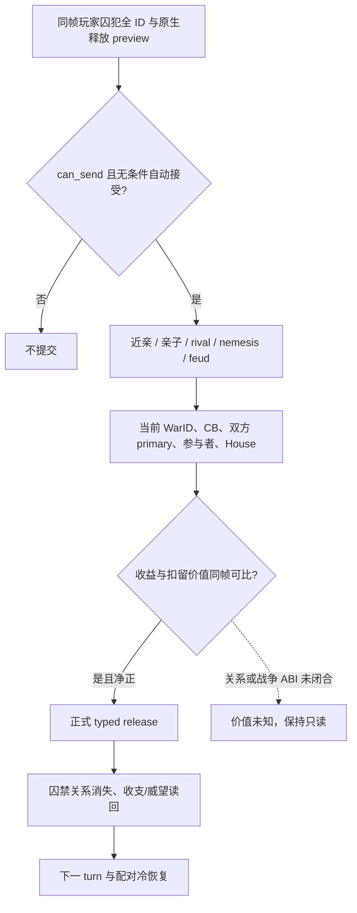

# 囚犯释放的关系与战争价值输入（CK3 1.19.0.6）

状态：**exact-build 原版脚本已核、现有 ABI 可复用范围已核；策略与动作未接线**。本篇只处理玩家已关押囚犯的 `release_from_prison_interaction` 无条件选项。宗教释放条件、处决、赎金金额和战争决策模型均不在本次施工范围。

## 自然阳性与缺口

R0262 Robert 玩家 `29829` 的同一 paused frame `date_raw=53216880` 从完整私有集合读取囚犯 `34486`、`44484`、`47028`。每行囚禁关系的 jailer 均回读为玩家；原生 finalized `release_from_prison_interaction` 的全条件关闭选项均为 `can_send=true`、`auto_accept=true`，各资源 on-send 成本为零。证据是 [R0262 正式报告](Z:/r0262-h2660-family-betrothal-freeze-20260927/evidence/formal-report.txt)，SHA-256 `767C93E3D06603A2381709F3471F16483E7571B20251AC2655DF692E2FAB0B86`。这些是**只读机会**；该 report 没有释放动作、关系收益或新 PID 后置。

三个候选的 `can_send` 与成本相同，不能据此判断谁值得释放。后续 H2825 的同帧 House/Dynasty 私有读取已对这三人实机读回：玩家为 `174/174`，囚犯 `34486` 为 `2370/2370`，`44484`、`47028` 为 `null/null`；三条赎金报价均 `unavailable`。该轮 paused native revision `3`、`date_raw=53217624` 同时报告 WarID `16777231`。证据是已随 Git 交付的 [H2825 正式报告摘录](../autonomous-agent-progress/coordination/war-requests/evidence/WAR-ROBERT-H2825-SIEGE-PARTITION-20260928.r0265-formal-report.json)，SHA-256 `B990E9F9E0F3E83B2412F86D9AE491820A0A5AA7EA6B83A028F7DF5A5B77E95B`。House 值或缺值都不代表原版的近亲、亲子、友好、敌对或战争价值；H2825 没有释放动作。

## 原版选择树与动作后果

冻结原版 `game/common/character_interactions/00_prison_interactions.txt`，201,766 字节，SHA-256 `3E05C94CDCE4D42CCE8256D2D79CD78FEB1C9D5B79DAA64AA8243AA0C658F22B`；`ck3.exe` SHA-256 `2D00FF3101EF70B566F2FCBAE292F09263199C80E9DC8F139B82D7D96F83DB86`。以下行号以此原版文件为准。

- 第 4088 行开始的 release definition 在 `is_shown` 检查目标确被 actor 关押；无条件选项的 `on_accept` 第 4160 行附近调用 `release_from_prison=yes`。`can_send` 是合法性，不能当成价值。
- 第 6030–6140 行的 stock `ai_will_do`：rival/nemesis 在非 forgiving actor 下减 40，vengeful 可再减 100；actor 未参战才可能因囚禁时间、compassion、近亲和亲子得到正权重。近亲条件是 `is_close_family_of`，亲子是 `is_child_of`，不是同 House/Dynasty。
- 第 6198–6224 行另有家族世仇减 50、`being_prisonbroken_by_laamp` 权重归零。这里只记录原版输入，不重建文化/宗教/LAAMP 全矩阵。
- 第 4880–4906 行 `on_accept` 有窄战争后果：当 actor 是 `fp3_free_house_member_cb` 防守方、primary attacker 的 House 与 prisoner 的 House 相同时，原版向 attacker 增加 `major_prestige_gain`、向 defender 增加 `major_prestige_loss`。这使“零资源成本释放”也可能有明确战争机会成本。具体当前战争是否命中，R0262 报告未读。

## 最小可复用读口与未闭合边界

| 输入 | 已有 exact-build 来源 | 当前结论 |
| --- | --- | --- |
| 囚犯与 jailer、finalized 无条件释放 preview | `player_prisoner_collection_query_v1_private` 对完整 32 位 CharacterID 双采样；`CCharacter+0x1A8` extension、`+0x288` prison relation、其 `+0x00` jailer；R0262 自然 paused 阳性 | 三人可合法释放；仍是 private/read-only |
| House/Dynasty | C211 同 reader 扩展：`CCharacter+0x150` HouseID、`CHouse+0x2C` DynastyID，完整 ID 回读；H2825 paused 私有报告 | 玩家 `174/174`；34486 `2370/2370`，另两人 `null/null`；不能代替 close family |
| 近亲、亲子、rival/nemesis、世仇与囚禁时长 | 原版 release AI 第 6030–6140、6198–6204 行 | 原生判定树已知；这三个囚犯的同帧 callable ABI / 值未取得。只查反射字符串或猜 House 关系均不够 |
| 当前战争身份 | 现有 `ck3_11906.cpp` 的 WarID/参与者 reader；`CWar+0x100` CB type、`+0x288/+0x28C` primary attacker/defender、`+0x20/+0x80` 参战方集合；`ResolveWar` 与 full CharacterID 回读 | ABI 已用于战争读口；囚犯集合查询尚未把同帧 WarID/CB 和候选 House 绑定。战斗模型不由本包更改 |
| 窄战争释放配对 | `ReadRaiktorSurrenderPrisonerReleases` 已能在 **Raiktor claim CB 的投降条款预览**读双方 primary 与前三顺位继承人及效果中的 release pair | 仅该 CB/结果的 PoW 条款预览，不是已经发生的释放。匹配是保留候选的强信号；空 pair 不说明囚犯在其它战争、赎金或关系上无价值 |
| FP3 解救家族成员 CB 后果 | 第 4880–4906 行的原版 `on_accept` 条件，加已有 CB/primary 与 C211 House 输入 | 当前 WarID 是否为该 CB、House 是否匹配尚无同帧结果；不能填 false 或估成零 |

下一项最小施工是**同一 paused native revision** 为这三名囚犯补原生 close-family/child/rival/nemesis 判定，并将已有战局 CB、primary、参战方与 C211 House 值绑定到 prisoner row；每个字段明确来源、完整身份回读和 unavailable。当前 bridge/research 没有这四个关系的可调用 exact-build ABI：EXE 中出现 `IsChildOf`、`GetMother` 等字符串，不证明函数入口、参数和结果语义，不能把它们接成 false 或静态完成。战争 PoW 保留与 FP3 结果由 [WAR-PRISONER-RETENTION-H2825 请求](../autonomous-agent-progress/coordination/war-requests/requests/WAR-PRISONER-RETENTION-H2825-20260928.json)交给战争维护者，关系判定仍由非战争包逆向。应先对实际有价值差异的一名囚犯做只读 paused readback。若发现同一人属于当前 Raiktor PoW release pair 或 FP3 条款，优先保留并核战争合同；若原生关系为近亲且无已知扣留/赎金/战争义务，再评估释放的正收益。未知赎金金额、长期义务或战争机会成本仍标缺项，不能强行选人。

正式动作验收：同帧重新构造 exact `release_from_prison_interaction` 无条件选项，提交 typed 动作后在下一 paused revision 读**该 full CharacterID** 已不在玩家 prisoner 集合且 prison relation 不再指向玩家；读玩家与目标的实际资源/威望/关系变化以及如适用的 WarID/CB 后果，避免把 ACK 当生效。再由下一 turn 消费 action receipt/checkpoint，并由新 PID 从官方配对冷恢复确认囚禁关系仍已解除且不重复提交。R0262 未执行这一步，M6 readiness 不提升。
