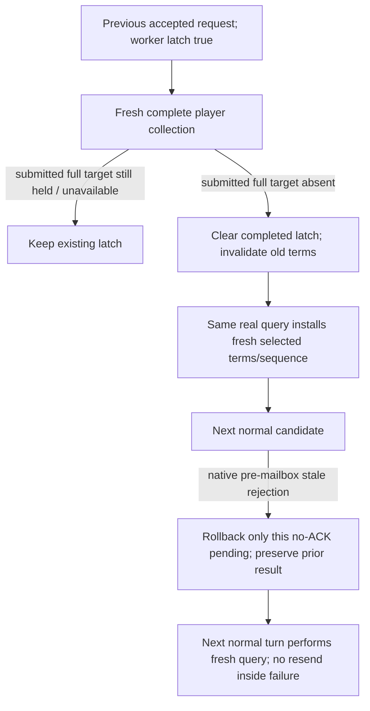

# Actual R77 subsequent release rejected by the worker latch

Source-first input/lifecycle ledger, October8 / 2026-W41. SDK base `a7460b11147d532d78d1b3edcef5ed49902525ed`; qualified Native32 source `1dc2abf0d6d0342b12f634bd27cee70c4331e146`. No EXE, game, SDK, import, build or test operation is performed by this lane.

## Actual necessity

The [hotperf03 finite batch](Z:/ck3_mod_rewrite_process_assets/g2-background-20261008/runtime32-r77-sdk-hotperf03/normal-batch01/ROOT-FINITE-BATCH-RESULT.json) stopped on the actual [normal010](Z:/ck3_mod_rewrite_process_assets/g2-background-20261008/runtime32-r77-sdk-hotperf03/operator/gameplay-responses/010-r77-hotperf-normal-batch-turn05.json) error `private release terms or request are stale`, before any new day advance. The precise [normal008](Z:/ck3_mod_rewrite_process_assets/g2-background-20261008/runtime32-r77-sdk-hotperf03/operator/gameplay-responses/008-r77-hotperf-normal-batch-turn04.json) was decoded once:56063 receipt applied/free, post-native4/date53288544, original request48cf42e87d184a728d8f98b8e9856c71/query6 retained. Its independent current collection query8 contains one next captive54235 with an available ordinary release preview. The precise small current ledger contains `submission_unresolved`, target54235/query9/pre-native4/date53288544 and no ACK. Old61540 already resolved; its consumer is not changed here.

`PrisonerPrivateWorkerState12004` lives in the long-lived router. `HandlePlayerPrisonerRelease12004` sets `may_have_submitted=true` before its mailbox; the stale gate rejects whenever that flag remains true. Only a failed mailbox with ticket0 clears it. Completed collection queries update the selected terms and query sequence but never clear the flag. Thus the successful previous56063 release keeps the next54235 attempt rejected even after the actual new collection. This is a proven worker lifecycle defect, not a missing AI input or a new policy restriction.

## Minimal source change

Retain the existing cached actor/full target while its latch is pending. A fresh available complete player collection that no longer contains that full target clears the latch and invalidates its old quote/terms. The same query then installs fresh terms through the existing code. Still-held, incomplete and unavailable collections keep the old latch/terms. The shared release/ransom latch uses this already copied pair; there is no new worker field, struct layout, query, action token, wire field or protocol. Only the native mailbox TU consumes the new small inline lifecycle header.

For the exact existing pre-mailbox stale error, the Python action retains the actual native error/request ID. The normal consumer rolls back only its just-created unacknowledged pending record, preserves its previous resolved receipt and records a requery need in the current driver. It returns `rejected_before_submit/material_result=false`; it does not send again. The next eligible normal turn requests the selected ordinal/options through the same existing collection API before accepting a new offer. Other errors, unknown mailbox execution and ACK paths keep their current behavior.

This fix requires Native and SDK adoption together; a hot SDK alone cannot clear the already-running Native32 latch. The legacy already-failed54235 pending has no persisted native error, so absence of ACK alone is not treated as proof of rejection. A separate Root-only repair recipe uses the actual010 rejection and actual008 prior receipt to restore just that small ledger; this lane does not execute it.

One new connected compound is source-authored and NOTRUN. Its new native fixture consumes production collection/lifecycle code and checks held-versus-absent transitions; its registered normal consumer uses the precise existing008 validated readback as labelled source data and an explicit reproduction of the actual pre-mailbox rejection. No successful synthetic ACK is created, and no old retained5, keeper5 or negotiated6 FIRST is rerun.
