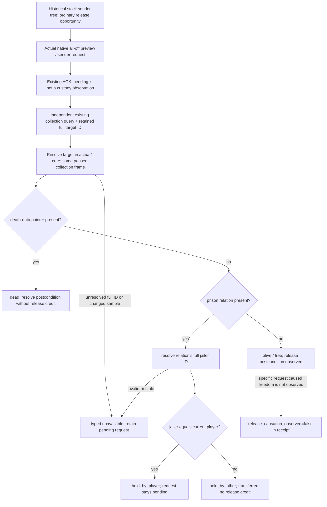

# Retained prisoner identity after a release request, actual 1.20.0.4

Research / source implementation; build, native FIRST, registered FIRST and paused-game qualification are NOTRUN. This topic is sealed before the new observer source. It addresses the actual R0076 release postcondition blocker, rather than changing prisoner policy.

## Necessary production gap

Root reports Robert29829, raw date53288496, public8/native7, active war100663329. Normal auto013 sent the ordinary all-off, zero-cost release for prisoner61540 under request `prisoner-release-801d779a60204a83a9100c9af8eb0445`. Its ACK remained pending after a real one-day advance and SAVE6007. The CC1 formal consumer's pending branch only appends a flag; it has no independent query/consume phase. These are Root-provided current facts, not new live observations by this lane.

The current player collection proves membership in the player's jail. Complete absence proves only that the target is outside that list. It cannot distinguish alive and free, held by another captor, or dead. Existing retained material and keeper opinion values do not contain those target state fields. Reuse `ck3_query_player_prisoner_collection_private_v1` with its existing `release_material_target_character_id`; append one optional `result.prisoner_retained_target_state` sibling. No new query token or argument is needed.

## Source and exact-build boundary

The source parent is Runtime30 `4e06f9454ef9f0e8173d30d8259625d3396929b9`; Python sibling uses CC1 `cc1e6a9e249ebeffdba1e6c910615041f090bf34`. Actual CK3 is 1.20.0.4 Crozier, Steam25734779, EXE SHA256 `98702F88A547CDE2EAF29A85F93B85F68EE4CF8148336A4F7AFAEB75319DD518`. This reuses the already admitted actual4 core, collection and full-ID inputs; it does not grant current live credit to a new leaf.

* `ck3_12004.hpp`: actual4 death data at Character+0x1D0; storage slot0x5C67568; full ID+0x18; existing `BindCoreImage` and `ResolveCoreCharacter`.
* `ck3_12004_abi_profile.cpp`: `ReadCoreSnapshot` resolves the played full ID and publishes alive exactly when death-data pointer is null. The new retained-target reader applies that same closed field to the resolved target.
* `ck3_12004_prisoner_collection.cpp`: current custody uses Character+0x1B0 -> extension+0x288 -> relation+0 full jailer ID; its rows require that full ID equal the played actor.
* [Frozen actual4 jailer getter](Z:/ck3_mod_rewrite_process_assets/g2-background-20261007/upstream-build-migration/prisoner/current4-collection/leaf-map01/jailer_getter-DETAIL.json): old0x289E830/88B maps to actual4 0x289E810/88B. The complete cached body uses the same relation fields and generation-bearing resolver. Missing extension/relation yields the native no-captor sentinel. A present but stale captor ID resolves to a fallback object: that case must remain typed unavailable rather than being reported free.
* [Existing disposition tree](prisoner-disposition-native-ai-tree-12003.md): historical authored `.3` release sender branch6596–6604 reads puppet_or_actor opinion toward recipient. Existing ordinary all-off release and retained opinion work remain separate. Those `.3` AI thresholds are historical source, not a newly read actual4 stock qualification.

New EXE reads: **0 bytes / 0 spans**. No requalification of the actor-to-target opinion ABI is required or performed. Native/consumer lanes perform no game, SDK, import, build or test operation; Root integrates source and commits it independently of runtime qualification.

## Native input tree and postcondition

The raw leaf fixes actor to the current player and target to the retained full ID. It publishes `target_alive`, `is_imprisoned`, `jailer_character_id` and `custody_state`. Here `is_imprisoned` is the copied interpretation of the closed current prison relation, not a newly called script predicate. A dead target publishes alive=false with custody scalars null; it is never labelled free. A missing/stale target ID is unavailable, not dead. Only copied IDs and values escape the owning-thread read.

The normal independent receipt consumes a fresh query, joins exact build/native revision/date/actor/target, and preserves the original release request and option mask. Alive/free can close the observed postcondition; held_by_player remains pending; held_by_other and dead resolve separately with no release credit. No branch resubmits the release. Historical ACKs and existing fixture results are not reused as qualification.

## One fresh source FIRST

One new native whole producer and one registered compound will cover free, still held by the player, held by another full-ID captor, dead, and stale captor identity. Each packet comes from fixture-owned memory through actual production readers and the owning collection command-result serializer. These are five new cases, independent of keeper5, negotiated6 and old g104 GREEN. All FIRST stages remain NOTRUN until Root runs the sealed recipe.

Native target and Ct: `ck3_12004_prisoner_retained_target_state_whole_first`. Private source path: `C:/codex-ck3-background/prisoner-retained-state12004/source01`. Shared native formatter/mailbox/CMake hooks are delivered as a precise patch for Root integration, not edits to shared main. [External source ledger and API](Z:/ck3_mod_rewrite_process_assets/g2-background-20261008/prisoner-retained-target-state/native/ROOT-DELIVERY.json) records the final source pin and readiness.
