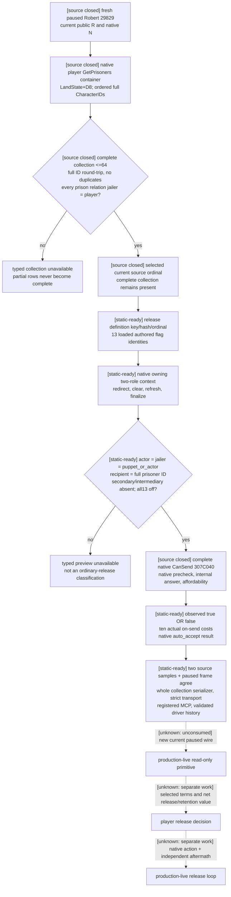
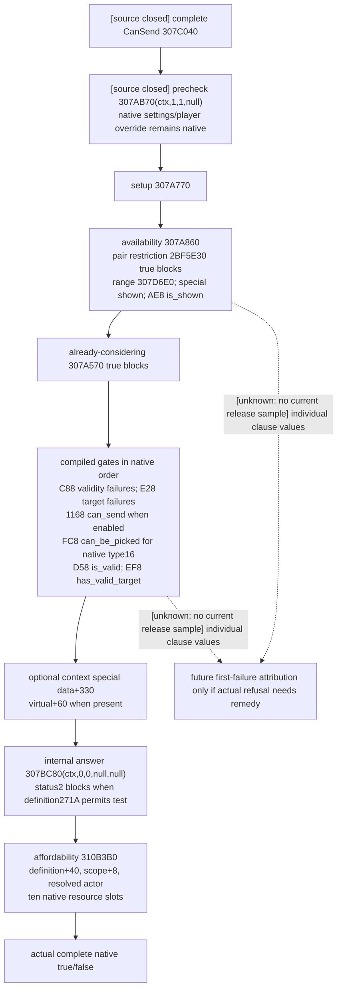

# Prisoner roles, complete custody and final release gates — CK3 1.20.0.3

Recorded 2026-10-06 23:42:59 Asia/Shanghai. File-only source review of read-only `Z:/gb0`. The direct current-player, all-thirteen-options-off release input is **source closed and static-ready through the existing g104 sole FIRST**. This packet adds no observer or test. Its useful next step is one new, Root-owned paused observation through the already registered collection query.

Exact build: CK3 `1.20.0.3` Crozier, Steam `25652598`, reused EXE SHA-256 `94B55397ABB687A3DCD436805A5D885E6BE90FA6C693FEB44A9E3BBEEADE02A6`. No new EXE bytes, scans or hashes were read. Current installed prison-interactions source is the existing frozen `222958`-byte file with SHA-256 `1bb43b3c2061212af8d41b11314ff4e569af2a3506319f820d05877a7762abc5`; [the current-stock pin](Z:/ck3_mod_rewrite_process_assets/g2-parallel-20261006/prisoner-release/STOCK-PIN.json) and [numbered current-stock excerpt](Z:/ck3_mod_rewrite_process_assets/g2-parallel-20261006/prisoner-release/stock-release-excerpt.txt) are reused. The ignored repository game copy and old eleven-option layout are not current evidence.

The existing [g104 FIRST receipt](Z:/ck3_mod_rewrite_process_assets/g2-parallel-20261006/prisoner-release/g104-first/sole-first-20261006T143706Z/FIRST-RECEIPT.json) and [registered MCP result](Z:/ck3_mod_rewrite_process_assets/g2-parallel-20261006/prisoner-release/g104-first/sole-first-20261006T143706Z/registered-mcp/RESULT.json) already qualify five actual compiled whole wires, five registered read-only queries and 102 checks. These results were referenced, not rerun. The current release leaf still has no real `.3` paused release gate sample in this packet. Source721 and the completed 70766 self-ransom are historical production evidence for collection/role semantics, not a current ordinal or release sample.

The private collection is complete for **the current player's actual jailer collection**. It does not enumerate all globally imprisoned characters or another jailer's puppet collection. No current production artifact in this task requires such an alternate collection. A different finalized `puppet_or_actor` cannot silently become this API's direct player release row; it remains `option_context_roles_unverified`. That existing result is a scope classification, not a native refusal or an invented missing ordinary-ransom role.

| Role flow | Actual role source | Closed observation boundary |
| --- | --- | --- |
| Direct unconditional release | Native two-role constructor `3076C90`, final context `actor+2D8`, `recipient+2DC`, secondary actor/recipient `+2E0/+2E4`, intermediary `+2E8`, `puppet_or_actor+2EC` | Final actor and puppet root must equal current collection jailer; recipient must equal selected full prisoner ID; auxiliary roles must remain `-1`. |
| Ordinary outgoing ransom | Stock redirect `3148DE0` followed by owning all-role constructor `3076E50` | Actor is jailer; payer is final recipient; prisoner is secondary recipient. Existing gold/current_gold provider already reads final CanSend, answer and the correct amount source. No new three-role or price gap is asserted. |
| Received self-ransom | Borrowed actual pending context and loaded `ransom_me_interaction` | Ordinary actor is prisoner/payer; recipient is player jailer; secondary roles absent. Existing current_gold named value is `floor(gold)` on payer/prisoner, with an independent live 56-gold outcome. It is not outgoing ransom redirection. |
| Received pay-ransom | Actual pending `pay_ransom_interaction` context | Prisoner is secondary recipient and payer is actor. Existing ordinary full-gold observer is closed; distinct-payer current_gold remains its separately documented extension, not a missing direct-release role. |

`ck3_12002_prisoner_collection.cpp:226–397` reads Character `+1C0 → LandState+D8`, copies all IDs, checks generation-bearing Character `+18`, requires `Character+1B0 → extension+288 → relation+0` to name the current player, then compares the entire repeated sample. Negative/invalid counts, a count above 64, missing memory, invalid custody, duplicate IDs or drift return a typed failure before `collection_complete=true`. A zero native collection is a complete empty collection; a truncated scan is unavailable. The serializer and existing Python transport require `total_count=returned_count=len(prisoners)` and retain `custody_relation_verified=true` for every available row. The direct release leaf repeats custody resolution before both native evaluations.

The current exact-build reuse ledger [ck3_1_20_0_3_abi_reuse.json](Z:/gb0/ck3_autonomous_player/native_bridge/research/ck3_1_20_0_3_abi_reuse.json) admits the context, gift constructor, prisoner collection, ransom and war-retention manifests. The `.3` leaf checks the actual `.3` SHA before calling the reviewed strict `.2` internal ABI binder; public/runtime identity remains `.3`. This reuse is already frozen, with no new executable audit in this task.

For this interaction, "CanRelease" is the existing complete native `CanSend(context,nullptr)` result. This packet does not claim discovery of a separate named `CanRelease` getter. The final native call is broader than custody or stock `is_shown` alone:

Stage order, signatures and polarities are reused from the exact `.3` [complete native-gate topic](Z:/gb0/docs/ck3-native-ai/call-ally-final-cansend-false-12003.md) and its cached [FINAL-GATE-ABI.json](Z:/ck3_mod_rewrite_process_assets/g2-resume-20261003/call-ally-native-action/final-cansend-false/native-tree/FINAL-GATE-ABI.json). Those historical CallAlly refusals are not release refusals. The release provider invokes the complete native evaluator; this diagram is not a new observer or a conjunction substituted for the engine.

Current release stock `4312–4346` supplies the following gates:

- `is_shown`: `puppet_or_actor` exists and recipient is imprisoned by that role. The AI/no-human-puppeteer branch additionally requires `has_prisoners`; no player release strategy is introduced from that AI clause.
- `is_valid_showing_failures_only`: recipient is not flagged `is_being_tortured`, the former-regent trigger passes, and recipient is not flagged `is_currently_being_purged`.
- The former-regent trigger is current installed `00_diarchy_scripted_triggers.txt:376–393`, SHA-256 `3995f62fe332f98ccecd39abf70a2a2574fbfb18c86f5d5d3c02a367fda0607a`. Only when prisoner has `imprisoned_by_diarch`, has a liege, and the given regent is diarch of that liege, it requires a NOR: that stored diarch is neither the actual imprisoner nor the liege's current diarch. The exact fragment is retained in [current-former-regent-gate.txt](Z:/ck3_mod_rewrite_process_assets/g2-parallel-20261006/prisoner-release/next-observations/roles-gates/current-former-regent-gate.txt).
- Native `auto_accept` uses the actual loaded trigger/scalar. Stock `5986–5997` accepts the all-options-off path. The public nested row is `available` for either complete CanSend boolean; a read/binding/role/selection failure remains unavailable. False does not require a fabricated price or score.
- `on_accept` rechecks actual recipient custody at `4358–4359` before the ordinary release effect at `4370`. A preview does not prove that future acceptance/release or its effects have happened.

No current real release refusal has been observed after g104. Consequently this packet adds no first-failure schema, reason sink or repeated test. If Root's one new paused sample supplies `available/can_send=false` and choosing a lawful remedy is useful, the source-bound next input is the already proven generic stage observer on this same finalized release context, followed only by the concretely failed stock predicate. This is a future construction entry, not a present blocker.

| Decision input | Current source/API state | What is actually still required |
| --- | --- | --- |
| Complete actual custody, IDs, same-house/dynasty, player-child, prisoner tier, player dread | Existing complete private collection, source721 production-observed; no new field needed for this scope | Fresh current collection from Root's current paused Robert campaign. Old IDs/ordinals cannot be assumed current. |
| Direct all13-off legality, final roles, native auto-accept, ten on-send costs | Existing `.3` release leaf, g104 sole FIRST static-ready | One unconsumed real current paused preview. No new code or executable bytes. |
| Displayed refusal and individual torture/regent/purge/native subgate values | Not separately published by the release leaf | Useful only if an actual current false needs attribution/remedy. Aggregate final legality is already an executable observation path. |
| Native release preference: prison duration, adult/playable status, compassion/vengefulness, rival/nemesis/family/feud/prisonbreak | Current stock `6514–6707` uses these inputs; complete private collection does not expose all of them | Quality/retention valuation remains separate. Not required to obtain current alloff final legality; no zero/false assumptions and no copied native-optimality claim. |
| Custody kind, crime/punishment, torture/execution/move-prison inputs | Only old broad future management DTO slots exist; private collection does not publish these actions | This packet does not mark full prisoner management complete or build an unrelated punishment observer. Selected negotiated terms belong to the sibling packet. |
| On-accept dread/stress/opinion/legitimacy/struggle/House-war effects and retention value | On-send costs do not price them | Sibling value/effects work plus same-frame war joins where relevant. Existing complete generic PoW pairs and FP3-specific join are retained, not merged into a blanket zero-retention claim. |

The [fresh paused recipe](Z:/ck3_mod_rewrite_process_assets/g2-parallel-20261006/prisoner-release/next-observations/roles-gates/FRESH-PAUSED-QUERY-RECIPE.json) is `NOT_RUN` and Root-owned. It uses the current public snapshot revision in `ck3_query_player_prisoner_collection_private_v1`; the production transport converts it to the actual native revision and obtains validated history through `NativeDriver._record_command`. One default-ordinal call returns the whole current collection and an ordinal-0 release preview. If that current row is useful, it already supplies the new observation without repeating it. Only if a different currently returned row is needed, call the same tool once with its exact returned source ordinal and the same current paused revision. Other rows' release previews are `not_evaluated`, not missing custody.

Remaining readiness is honest: direct release observation stays **static-ready**, complete collection and the received self-ransom keep their own historical production qualifications, new release live/action/loop credit is zero, normal-game-day and natural-succession deltas are zero. Finite new-EXE-byte plan is empty; no new candidate source, import, build, test, game/SDK/process/window operation, main-tree edit, Git operation or commit/push was performed by this child. Root owns canonical adoption and Oct6/W41 reporting.
