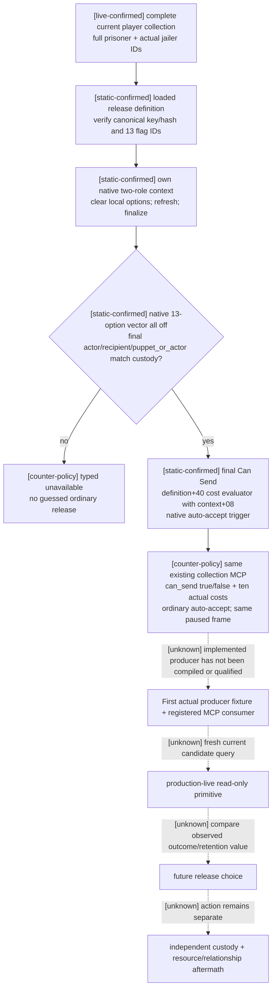

# Player prisoner unconditional release final terms — CK3 1.20.0.3

Source-first construction packet, 2026-10-06 Asia/Shanghai. Status: **research; implementation complete, FIRST not run**. The read-only provider, strict consumer, shared hooks and first-fixture sources are complete. Compilation, fixture qualification and current paused release observation remain pending.

The missing input is the **final native Can Send, native auto-accept and ten on-send resource costs of `release_from_prison_interaction` with every authored release option off**. The actual current-build collection response already contains a place for this input. It returns an implementation-unavailable marker rather than a native decision. Restoring this input lets the player distinguish a currently executable unconditional release from a custody row which cannot be released. It does not by itself decide whether releasing is preferable to keeping or ransoming the prisoner.

## Actual evidence and successful primitives to reuse

The frozen response [721-custody-structured.json](Z:/ck3_mod_rewrite_process_assets/g2-background-20261006/pending-self-ransom-720/721-custody-structured.json), public revision `8` / native `1014`, raw date `53286360`, contains Robert `29829`, complete four-prisoner collection `[54235,56063,61540,70766]`, jailer `29829` and verified custody for all four. Each `unconditional_release_preview` is `unavailable`, reason `release_preview_not_enabled_for_12002_ransom`. The corresponding producer is `Z:/gb0/ck3_autonomous_player/native_bridge/src/ck3_12002_prisoner_wire.cpp:103–106`; it hardcodes this marker. This is a real unavailable production observation, not a theory or a inferred native refusal.

Received self-ransom for `70766` was subsequently completed by Root on the exact current build: native `current_gold_value` quote **56 gold**, one ordinary accept, independent player gold `77117044→82717044` and complete collection `[54235,56063,61540,70766]→[54235,56063,61540]`, then h9543 checkpoint. Reuse [pending-self-ransom-received-quote-12003.md](Z:/gb0/docs/ck3-native-ai/pending-self-ransom-received-quote-12003.md) and the [immutable checkpoint receipt](Z:/ck3_mod_rewrite_process_assets/g2-resume-20261006/checkpoints/self-ransom-70766-56gold-v74/checkpoint-receipt.json). Do not replay or requalify it. The pending pay-ransom gold observer is separately source/fixture qualified; the old rejected offer is not a live price sample.

`61540` at source721 is a useful historical row for the new **observer fixture**, because its prisoner ID, jailer, dynasty `2237`, player-child false and no primary title are actually observed while the release preview is unavailable. Its continued presence or release legality in Root's latest session is not assumed. A future live query selects an ordinal only after Root obtains the fresh complete collection.

## Exact build and source pins

- CK3 `1.20.0.3` Crozier / Steam `25652598`.
- Frozen EXE SHA-256 `94B55397ABB687A3DCD436805A5D885E6BE90FA6C693FEB44A9E3BBEEADE02A6`; reused from existing build contracts, with **zero new EXE reads or hashes**.
- Current Steam stock prison interactions: `222958` bytes, SHA-256 `1bb43b3c2061212af8d41b11314ff4e569af2a3506319f820d05877a7762abc5`. The exact read path and release lines `4282–6711` are frozen in [STOCK-PIN.json](Z:/ck3_mod_rewrite_process_assets/g2-parallel-20261006/prisoner-release/STOCK-PIN.json) and [stock-release-excerpt.txt](Z:/ck3_mod_rewrite_process_assets/g2-parallel-20261006/prisoner-release/stock-release-excerpt.txt). This is the installed Steam file named by the existing self-ransom stock pin. The repository's ignored `Crusader Kings III/` reference copy has older release data and was discarded as a current-build source.
- `ck3_1_20_0_3_abi_reuse.json` already admits current-build context, pending context, gift context, prisoner collection and ransom APIs. Keep the current adapter/manifest binding; do not copy the old 1.19 addresses or rewrite the compatibility SHA by hand.
- Existing source: `ck3_12002_context.hpp/.cpp`, `ck3_12002_prisoner.cpp`, `ck3_12002_prisoner_mailbox.cpp`, `ck3_12002_prisoner_wire.cpp`, `player_prisoner_collection_private_transport.py`. The old `character_interaction_preview_v1.cpp` is a reusable **semantic contract**, not a current ABI provider.

The old preview validates exactly eleven options and old definition count `+0x2554`. The current release definition has **thirteen** nonexclusive options and uses the already-bound current definition rows/count `+0x2258/+0x2264`, row stride `0x730`, flag ID `+0x368`. Do not port the old eleven-option check unchanged.

Current authored order:

| Index | Flag | Source line |
| ---: | --- | ---: |
| 0 | `demand_conversion` | 5348 |
| 1 | `renounce_claims` | 5409 |
| 2 | `banish` | 5446 |
| 3 | `gain_hook` | 5520 |
| 4 | `take_vows` | 5546 |
| 5 | `change_prison` | 5726 |
| 6 | `make_puppet` | 5738 |
| 7 | `become_executioner` | 5773 |
| 8 | `recruit` | 5815 |
| 9 | `disfigure` | 5854 |
| 10 | `blind` | 5902 |
| 11 | `castrate` | 5929 |
| 12 | `demand_admin` | 5960 |

`is_shown` at `4312–4325` requires `puppet_or_actor` and actual custody by that role. The final validity conditions include ongoing torture (`4328–4333`), the existing former-regent trigger (`4335–4338`) and purge (`4339–4346`). A complete collection row alone does not prove these gates. The observer calls native final Can Send; it does not guess a gate from script, invent a zero fee, or rename implementation unavailability as refusal.

The native two-role context constructor already initializes the actor/recipient, absent secondary/intermediary roles and initiating `puppet_or_actor` role. Its current ABI is frozen by `ck3_12002_gift_context_abi.json`: constructor `0x3076C90`, context size `0x338`, actor `+0x2D8`, recipient `+0x2DC`, secondary roles `+0x2E0/+0x2E4`, intermediary `+0x2E8`, initiating actor `+0x2EC`, scope `+0x08`. Read the final copied roles; require this actual collection's jailer to be the finalized `puppet_or_actor` before labeling this particular player-custody preview.

## Native/authored tree and effect boundaries

The stock `auto_accept` expression at `5986–5997` is true for the all-options-off path. The observer must evaluate the actual native trigger/scalar; it must not infer a human/AI flag or publish a fabricated acceptance score. A compact `acceptance` row needs only the already-supported `kind=auto_accept`, actual `auto_accept=true` and `would_accept_now=true`. It should omit unused unobserved `recipient_is_ai` and score fields rather than defaulting them to false/zero. The existing Python collection transport accepts this shape.

Sending costs are evaluated by existing `0x310CEE0` over `definition+0x40` and finalized `context+0x08`, with Q100000 slots `gold, prestige, piety, renown, influence, herd, treasury, treasury_or_gold, merit, barter_goods`. These are **on-send actor costs**. They do not include on-accept dread/stress/opinion/legitimacy or future custody value. A false native Can Send is a successfully observed false gate when context and sample are valid; a binding/read failure remains unavailable. Exact displayed refusal text is not required for this first gate and is not claimed observed.

The ordinary on-accept branch rechecks `recipient.is_imprisoned_by=puppet_or_actor` at `4358–4359` and performs release at `4369–4370` when the mutilation options are off. It can also grant the released-person opinion modifier (`5024–5028`), incur `minor_dread_loss` and personality stress (`5105–5108`), and produce conditional struggle prestige (`5116–5125`), tier-based legitimacy (`5227`), or free-house-CB prestige effects (`5304–5331`). Thus zero compiled costs cannot be labeled zero outcome cost. Source721 actually observes player dread `1680000` (16.8), so the ordinary dread loss can matter. This packet neither assigns unobserved branches zero nor introduces a new policy/value gate.

Stock AI reference remains the existing source-first release tree, now with current scope `puppet_or_actor`: rival/nemesis branches `6523–6543`, peaceful/time/compassion branches `6554–6597`, close family/child `6612–6623`, feud `6686`, prisonbreak `6707`. It guides later quality work; this read-only implementation does not change the player strategy or claim native-optimal release value.

## Minimal implementation in the existing API

Keep registered `ck3_query_player_prisoner_collection_private_v1(expected_revision=R, ransom_ordinal=k)` and its existing native step/mailbox. The selected ordinal already controls which ransom context is evaluated; use the same ordinal for one release preview per call. The complete collection remains complete; other rows' release preview should say `not_evaluated`, rather than the removed implementation-disabled marker. No new MCP name, global effect preview, command, WAL, gate or release executor is needed.

1. The new `PrisonerReleasePreview12003` result/provider in `ck3_12003_prisoner_release_preview.hpp/.cpp` reuses the frozen gift two-role constructor/definition lookup and existing context refresh/finalizer/validator/cost/trigger bindings. It admits the actual `.3` SHA before invoking the existing strict `.2` context binder. It populates only the proven gift bindings needed here, avoiding unrelated gift-opinion dependencies; it does not invoke the full `BindFactionGiftImageV1` factory or any submit/queue API.
2. Lookup the loaded release definition by stable key; verify actual key/hash/ordinal and all thirteen authored numeric flag identities using current script ID lookup `0x3F8A800/0x3F8A680`. Construct owned scratch from current jailer/prisoner. Clear, refresh and finalize. Read actor/recipient/secondary/intermediary/initiating roles, option pointer/capacity/count and every selected byte. Preserve an unexpected mask as unavailable; never call it an ordinary release.
3. Evaluate final native Can Send `0x307C040`, ten compiled costs `0x310CEE0`, and the native auto-accept trigger/scalar (`definition+0x2290` / `+0x2718`, evaluator `0x372DF30`). Destroy owned scratch through `0x30773A0`. Reuse existing paused envelope/sample identity validation; two samples must agree. Do not add another generic session protocol.
4. Root adds the selected-row provider call and copied preview array to existing `CollectionQuery`/`ExecutePlayerPrisonerCollection12002`; no shared executor registration is required. Extend `SerializePlayerPrisonerCollectionPrivateV1` with an optional preview argument so existing callers keep their signature. Root replaces the hardcoded marker with the provider serialization for the evaluated row and `not_evaluated` for the other rows.
5. The current schema-v6 nested `unconditional_release_preview` contract preserves native snapshot ID/revision/date, canonical definition, two final roles, `payload_shape=two_role_all_release_options_off`, `unconditional_prisoner_release=true`, actual `can_send`, ten actor/on-send cost rows, compact auto-accept and existing readiness booleans. The new `.3` strict Python contract additionally requires all13 `option_keys`, zero `selected_option_mask_bits` and actual `puppet_or_actor_character_id`; it binds the proof epoch to the collection observation. Both native gate values remain available inputs. The existing registered tool delegates through the actual driver's transport and records the returned collection in validated history; the server creates its existing GameService without a new action route.

Completed new files: provider `.hpp/.cpp`, serializer `.cpp`, one actual whole-collection native fixture `.cpp`, one CMake fragment, strict Python contract and one registered MCP compound. Shared hooks extend the existing declaration, serializer, mailbox, CMake and Python transport. CMake includes the new fragment after `include(CTest)` so default `BUILD_TESTING` is initialized. The frozen API/file/case list is [IMPLEMENTATION-FIRST-PLAN.json](Z:/ck3_mod_rewrite_process_assets/g2-parallel-20261006/prisoner-release/IMPLEMENTATION-FIRST-PLAN.json).

## First-fixture and live recipe

The **one new** producer target calls the actual complete collection reader, new leaf and whole collection serializer. Its fake objects preserve source721's four prisoners, current `0x338` context, thirteen loaded flags, selected jailer `29829` and prisoner `61540`, actual cleanup, complete lineage/title/dread metadata and current serializer. The three groups contain five cases: (1) `gate_true`, all13 off with ten distinct nonzero synthetic costs; (2) `gate_false`, the same costs with a complete native negative gate; (3) `old11`, `selected_change_prison` and `puppet_role_mismatch`, ordinary-release classification unavailable before gate/cost evaluation. Synthetic amounts, definition identity and callbacks are never ascribed to CK3 stock/live. Root owns the first build/run. No previous passed tests need repeating.

After genuine native fixture wire exists, one new compound consumes it through the existing injected endpoint, real native driver/private transport, service and registered collection MCP. Verify current native/public revision binding, source ordinal, jailer/prisoner full IDs, all costs/auto-accept/false-versus-unavailable distinction and unchanged collection metadata. This is the first consumer for the new nested preview, not a replay of existing collection/ransom fixtures.

Future live work is Root-owned: fetch the fresh complete collection once; choose its actual current ordinal; call the same registered MCP with that exact paused revision. A genuine available preview with unchanged native frame qualifies only **production-live read-only primitive**. If a later independently chosen release is executed, verify that exact full prisoner is absent from complete player collection and read custody/resource/dread/relationship aftermath; ACK alone cannot qualify the result. This packet does not require that future release before collecting a useful native false/true gate.

Finite new-byte plan: **empty** (`0 spans`, `0 code bytes`, `0 metadata bytes`). All required callable/layout evidence comes from already frozen manifests and current script. There is no new EXE batch for Root to authorize. Compilation, first fixture, registered MCP consumer and fresh live observations are all **NOT RUN** in this packet.
# External implementation update, 2026-10-06

Root authorized construction after review of the source721 hardcoded preview
gap and current installed 13-flag source. The complete reviewable candidate was
prepared externally against `df87fd8562120b901413793ded4680b7b4dabd8e` and
integrated in the isolated worktree at
`be06a134b9a5472275e08ea452a8e3542b192fb8`. Its DTO, actual-.3 binder,
read-only two-sample adapter, serializer, strict Python contract, whole actual
collection producer, CMake target and one registered MCP compound are complete.
`shared-hooks.apply-patch` supplies the five shared integration hooks for Root;
`ROOT-FIRST-RECIPE.md` supplies the narrow first qualification and live-query
recipe. This updates construction progress only: readiness remains research,
FIRST is not run, and no new game/SDK/pipe/test/build/import/EXE operation has
occurred. Only this isolated candidate's named implementation files were
changed; Root owns shared-tree adoption, reports and push. Full release effects and action readiness
remain outside this observation leaf.
