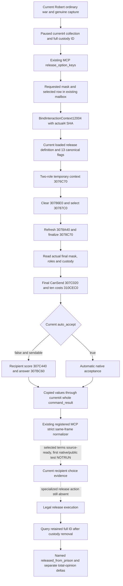

# Actual4 war capture, negotiated release, and retained material

Source-first work dated 2026-10-07. The ordinary campaign is Robert, full
character ID `29829`. Root's latest supplied frame is H9638, raw date
`53288448`, saved checkpoint `6005`, with **zero prisoners**. This packet does
not claim a prisoner action or an M6 live loop.

## Provenance and the real missing input

The current executable is CK3 1.20.0.4 Crozier, Steam build `25734779`, SHA-256
`98702F88A547CDE2EAF29A85F93B85F68EE4CF8148336A4F7AFAEB75319DD518`.
The stock data manifest remains `5078208590259867811`. The reviewed prison
interaction source is 222958 bytes, SHA-256
`1bb43b3c2061212af8d41b11314ff4e569af2a3506319f820d05877a7762abc5`.
Its frozen excerpts are under
`Z:/ck3_mod_rewrite_process_assets/g2-parallel-20261006/prisoner-release/`.
This lane reads the existing excerpts and mapped source; it does not reopen
the executable or claim that a historical .3 candidate is actual4-qualified.

The current collection provides the full prisoner ID, custody, child-of-player,
title tier, ransom quote, and native-final all-thirteen-off release preview.
The per-war query provides the generic captive war-release pairs. The retained
release material query can resolve the same full ID after custody becomes
empty, and observes `released_from_prison` separately from total opinion.
Root's actual retained material FIRST is reused unchanged: native four whole
wire cases and registered MCP five cases, one compound, all exit zero, at
`g2-background-20261007/g2-m6-institutions/retained-release-material-native-public-first01/ROOT-STANDALONE-FIRST.json`.

One value query is still missing in actual4. The registered collection MCP and
Driver already accept `release_option_keys`, and their strict transport already
consumes `negotiated_release_preview`. However,
`ck3_12004_prisoner_mailbox.cpp` rejects every nonzero requested mask. Thus the
agent can observe unconditional freedom but cannot ask whether the current
captive would accept a hook or renunciation of claims in return for freedom.
This affects an authored source branch, rather than an extra safety rule.

The stock release AI gives `renounce_claims` +30 and selected conversion,
vassalage, banishment, vows, recruitment, and injury terms their own weights
(source lines 6475–6513). Recipient acceptance is a separate native result:
freedom has a base +100, `gain_hook` has -50 before other current conditions,
and renouncing claims depends on current greed. War, family, compassion,
opinion, rivalry, house, struggle, and prison-break branches affect the native
decision tree documented in
[the original prisoner tree](prisoner-disposition-native-ai-tree-12003.md).
This packet publishes final selected-term CanSend, ten costs, automatic
acceptance, and native recipient score/status. It does not manufacture raw
personality inputs or a cross-action utility score.

## Exact4 native source chain

`ck3_12004_interaction_context.hpp/.cpp` centrally owns every executable entry
above. Its actual4 admission cites `current4-context-release/ROOT-DELIVERY.json`.
The new leaf uses `BindPrisonerReleasePreview12004` for current identity,
custody, definition and flag layout, then obtains selection and answer callbacks
from that same current4 context binder. It calls only the existing portable
observer and copied-value serializer, never a .2/.3 native binder. No new RVA,
field layout, central EXE mapping, or executable read is required.

## Minimal same-MCP publication

Owned header/source: `ck3_12004_prisoner_negotiated_preview.hpp/.cpp`. The
current4 factory aliases the portable DTO and supplies current4 native callback
bindings. The selected-row helper records the request mask and explicit
`not_evaluated` status for every returned row, then evaluates only the queried
full ID. This preserves the existing public consumer's selected-ordinal rule
when Robert has multiple captives. A changed final mask remains an
observed unavailable selection; false native CanSend remains a complete
unsendable result. No send command is constructed by this query.

Root's external patch adds this leaf to the existing runtime source list;
stores its bindings, mask and copied array in the actual4 collection mailbox;
and passes the optional array through the current4 whole formatter into the
already existing copied-value wire serializer. The old no-option call and
retained material output continue to use their existing paths. No Python
signature, new MCP registration, Bridge request token, or public schema fork
is needed. Existing transport publication changes only when explicit nonempty
`release_option_keys` were requested.

The query source is authored and not built or tested by this lane. Root owns
the first qualification of this newly wired native route. Existing retained
material GREEN does not qualify selected negotiation.

## Next natural trigger and ordinary-campaign recipe

Continue the current authorized war objective. The next trigger is a genuine
combat or siege capture that appears as a new full ID in Robert's paused
prisoner collection. Zero prisoners is a normal current result; do not create
a captive or spend a war purely to manufacture a milestone.

1. At the next genuine capture, pause and obtain a fresh public revision R.
   Call the existing `ck3_query_player_prisoner_collection_private_v1` for the current
   selected ordinal; retain the full ID P and native/date/frame provenance.
2. For every current player war ID W, call `ck3_execute_step` with
   `query-war-prisoner-release-pairs-v1-W` at that current R. Resolve generic
   release-pair relevance before disposing of a valuable captive. A complete
   empty generic pair list does not assert that a special FP3 captive is
   worthless; that distinct native branch remains documented in the original
   war-retention source tree.
3. After Root qualifies this new query, ask the same collection tool for P's
   current ordinal with `release_option_keys=["gain_hook"]` (mask 8). Compare
   the current native-final negotiated quote with the all-off preview and the
   ransom quote. A useful alternative is `["renounce_claims"]` (mask 2) for
   a current claims-bearing captive. Use actual final mask, CanSend, costs and
   native acceptance; do not infer acceptance from the request alone.
4. Preserve a baseline for P with
   `release_material_target_character_id=P`. Execute release only through a
   qualified action path with the current legal final terms. **The existing
   generic ordinary interaction initiator is currently insufficient:**
   `ordinary_character_interaction_v1.cpp` accepts only declared option count
   zero, while release declares thirteen. Its response is
   `declared_options_unsupported` even for an all-off request. The remaining
   action entry is a release-specific current4 context/command consumer; this
   packet does not broaden the generic initiator or claim that entry exists.
5. After a real successful release, obtain a fresh public revision and query
   the same collection MCP with `release_material_target_character_id=P`,
   even if custody is now empty. Verify P left custody and compare the named
   `released_from_prison` result and total-opinion value separately, retaining
   both original dates/frames. ACK and custody removal alone do not establish
   the named relationship benefit.

Until a natural captive and a qualified release action exist, this is a
concrete next-trigger recipe plus a value-query source candidate, with no new
M6 production-loop credit.
