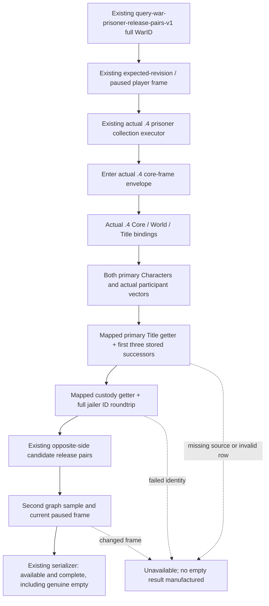

# Existing war-prisoner release-pair query: exact 1.20.0.4 migration

Source-only work on 2026-10-07, based on `c8f19a6a067ef8dd56926b8bc11d14b164045974`. No game, SDK, command submission, build or test is performed by this package. Exact .4 identity is Steam build25734779, SHA `98702F88A547CDE2EAF29A85F93B85F68EE4CF8148336A4F7AFAEB75319DD518`.

The existing token is `game.command.query-war-prisoner-release-pairs-v1-N`; its generic MCP entry is `ck3_execute_step` with step `query-war-prisoner-release-pairs-v1-<positive full WarID>`. It reads the stock generic release-effect input graph. It neither releases a prisoner nor supplies a complete peace preview.

## Prior provider and minimum source plan

The .3 descriptor inherits this original guarded .2 capability. `ReviewedCrozierAbiVersion` and `ReviewedCrozierAbiSha256` explicitly select the reviewed .2 ABI for the exact .3 descriptor. `HandlePlayerPrisonerPrivate12002` uses `war_retention` mode on the existing prisoner collection executor, calls the real `ReadWarPrisonerReleasePairsV1` reader and its shared serializer, and requires all three existing completeness flags. The .3 ABI reuse ledger includes `ck3_12002_prisoner_war_retention_abi.json`. The old provider is thus a real adopted reader, rather than the later 11906 fallback. The retained .2 production-reader/wire fixture qualification is documented in [the original topic](ck3-1.20.0.2-prisoner-war-retention.md); it is reused, not rerun, and is not .4 live credit.

The actual .4 collection mailbox currently has no war mode. The minimum port reuses its already installed owning-thread collection executor and exact .4 core-frame envelope. A dedicated .4 factory composes the qualified .4 Core, World and Province bindings with the two already mapped callbacks. The shared physical reader, candidate ordering and wire DTO remain the existing implementation.

| Required input | Existing actual .4 proof |
| --- | --- |
| Core and complete-generation Character identity | `ck3_12004_abi_profile.cpp`; qualified actual .4 Core profile |
| Active War, CB, both actual participant vectors | `ck3_12004_world.cpp`, `army-family-12004/world-mapping/WORLD-PROFILE-SOURCE-CLOSED.json` |
| Full-generation Title lookup | `ck3_12004_province.cpp` and qualified title storage `5D1DAF8` |
| `GetPrimaryTitle` | `289DA30 → 289DA10`, retained complete prisoner primary-title mapping |
| `GetImprisonedBy` | `289E830 → 289E810`, retained complete prisoner `jailer_getter` mapping |
| Title successor data/count/capacity | Three complete consumed instruction witnesses: `12435F3 → 12435D3`8B, `1243604 → 12435E4`9B, `2308BF9 → 2308BD9`6B; all complete and normalized equal, preserving `+15C/+150/+158` |

The first two callbacks and custody layout `Character+1B0 → extension+288 → relation+0` are closed in `ck3_12004_prisoner_domain_abi.json`. The [successor comparison](Z:/ck3_mod_rewrite_process_assets/g2-background-20261007/upstream-build-migration/title-map-war-retention-review/war-retention/successor-map01/FAMILY-MAP.json) declares only23 source bytes and their .4 counterparts. Old23 bytes were imported from the reviewed ABI manifest; actual .4 count/data17 bytes reuse a shared range. Only the capacity witness6 bytes required one new frozen read. It uses shared range claims and does not expand any complete callee. These are actual instruction/member operands, rather than a inferred global address shift.

The .4 factory is implemented in `ck3_12004_prisoner_war_retention.cpp`. The .4 mailbox now selects this independent war branch before collection/ransom work, reuses its existing registered collection executor, and preserves a separate war sequence. It leaves the collection quote state intact. The shared physical reader's Core fields match the qualified actual .4 Core profile (`222E8` player manager, Character identity/death and clock fields); the World module already reuses the same physical War readers. No old image binder or old image admission is used.

## Root integration recipe

The leaf may be reached only under the original `XAR_CK3_ENABLE_G2_PRISONER_COLLECTION_PRIVATE_QUERY_V1` flag. Root adds the existing capability to the actual .4 descriptor, admits the existing prefix in `IsNonwarPrivateStep12004`, and routes it to `HandlePlayerPrisonerCollection12004` before the generic old path. The collection executor is already registered; no new mailbox slot, flag, MCP tool or command is required. Root adds the dedicated factory TU to the existing runtime build. This package does not edit Adapter, Bridge, NonwarRouter or CMake.

`PrisonerPrivateWorkerState12004` gains only its independent war query sequence, matching the old .3 worker behavior and retaining collection/ransom quote state. Consumers of its modified header are `ck3_12004_prisoner_mailbox.cpp`, `ck3_12004_prisoner_ransom_action_test.cpp`, and transitively through `ck3_12002_nonwar_router.hpp`: `bridge.cpp`, `ck3_12002_nonwar_router.cpp`, `ck3_12002_nonwar_router_test.cpp`. The new factory header is consumed only by its new factory TU and the changed .4 mailbox TU. Root must compile the shared owning TUs against the changed worker header; old objects embedding the worker state cannot be mixed.

Readiness is **research / source implementation**, pending central compile, first actual serializer qualification and paused actual query. Tests0/build0/game0 for this work package. A legal complete empty pair list remains distinct from unavailable inputs. No whole war termination, peace action or complete migration credit is claimed.
