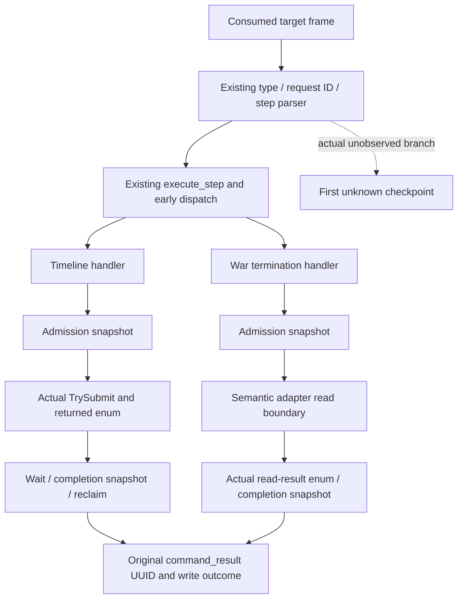
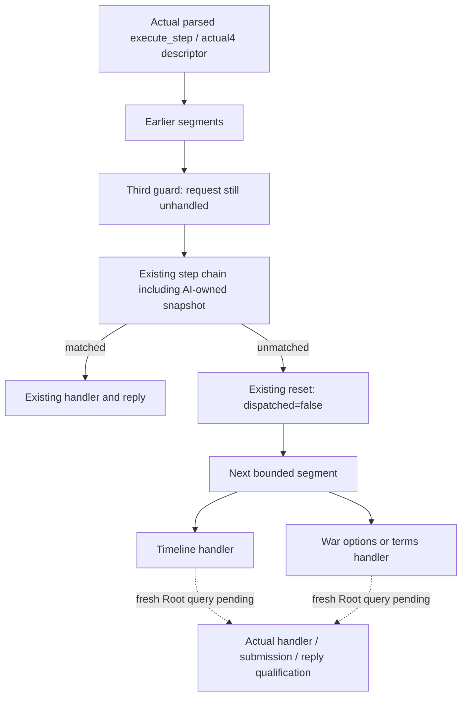

# Actual 1.20.0.4 command-entry checkpoints

This source-only package responds to three retained R0054 failures: the current
Timeline blocker query timed out at 23:01:07–23:01:26 UTC, and
`query-war-termination-options-100663329` timed out at 23:12:18–23:12:40 UTC,
and `query-war-termination-terms-v1-100663329` timed out at
23:17:37–23:18:00 UTC.
The loaded source was `fb3771930abd69223efe24a9c413152a20f374be`, with DLL SHA
`3245d53500470eef3f51ed7295e3e076f532ebef552071aa87bb5a6544ace854`.
FullSnapshot002 was available for paused Robert 29829 at raw date 53288256.

The prior actual4 Timeline factories and permitted executor slots 44/45 are
present in the frozen compiled source. Its handler's sole preprocessing parent
is the already enabled death/succession private flag. These conclusions reuse
the retained source review; they do not establish that the failed request
entered that handler. The post-Timeline diagnostic has a ready installed pump
but zero published/completed/started/executed mailbox requests. Its heartbeat
is one sample, without a captured pre-send monotonic counterpart. This does
not prove a provider hang or locate a pipe-worker wait.

## Exact source seam

The existing compact protocol parser, execute-step entry, early typed route,
long dispatcher and each target handler retain their original conditions.
Only these failed step strings select a diagnostic record. The Timeline
handler directly reports its actual `TrySubmitMainThreadQueryV1` enum. The
termination handlers report the boundary before
`ReadWarTerminationOptions` / `ReadWarTerminationTerms`: the semantic adapter owns its internal submission
and wait, so the bridge leaves `submit_result = -1` for that path. Its
`call_result` is the actual returned options/terms read-result enum.

Each checkpoint publishes the existing accepted heartbeat immediately, before
the named potentially blocking call, rather than waiting for the next periodic
heartbeat. The existing diagnostic query returns:

`diagnostics.last_heartbeat.command_entry_trace_v1.timeline`

`diagnostics.last_heartbeat.command_entry_trace_v1.war_termination_options`

`diagnostics.last_heartbeat.command_entry_trace_v1.war_termination_terms`

Each record preserves the original request UUID, frame type, parse booleans,
parse kind, dispatch route, handler-entry boolean, stage and monotonic time,
actual submit/read/wait enum where directly available, and reply UUID/type/write
outcome. `-1` means the operation has not returned or its internal enum is not
observed here. `not_received` means no target frame was consumed by this worker.
`dispatch_returned_without_reply` distinguishes dispatcher fallthrough from a
call whose pre-call checkpoint remains last. Existing heartbeat diagnostics,
capabilities and command-result semantics are retained. There is no new query,
flag, advertised support, action gate or provider.

## Independent actual4 Activity startup fix

The guest-cost transport's actual `exact_build_unavailable` result occurs before
planner lookup when `passive_cost->installed` is false. The actual4 suspended
startup branch previously returned after tactical/journal setup, skipping the
existing passive cost and guest rule-provenance installers. The shared bridge
now binds actual4 CoreBindings, selects the explicitly qualified actual4 core
snapshot frame reader, and installs those existing observers before that return
under their unchanged enabled flags. The exact4 refresh/return/caller proofs and
already qualified fixtures are reused. The separate hosted query's empty list
remains a legitimate observed result; the guest failure cannot be relabeled as
planner absence.

The source-owner recipe and retained proof paths are in
`Z:/ck3_mod_rewrite_process_assets/g2-background-20261007/upstream-build-migration/actual-live-review/ACTIVITY-PASSIVE-CORE4-SHARED-HOOK.md`.

## Qualification

Source fix and diagnostic implementation are **not run**. This child performs
zero native builds, tests, production imports, EXE reads, hashes, SDK calls or
game operations. Root owns the next single bridge-TU compile, DLL replacement,
fresh target queries and existing diagnostic receipt. The checkpoints locate
the next actual failure; they are not a completed timeout fix. No new Religion
hook is inferred from the unrelated Activity installation defect.

Receipts: `Z:/ck3_mod_rewrite_process_assets/g2-background-20261007/upstream-build-migration/actual4-entry-checkpoints/ROOT-DELIVERY.json`.

## Actual faction follow-up

The R0054 faction alert call was rejected by the service because the actual4
descriptor omitted `game.command.query-player-faction-alerts-v1`. The original
`XAR_CK3_ENABLE_G2_PLAYER_FACTION_ALERTS_PRIVATE_QUERY_V1` is already enabled in
the retained compile arguments. Actual2 advertises this token under that same
guard, and the shared `GameAdapter::supports_step` already parses the alert
query. Actual4 now includes the identical guarded token. This is a missing
hook for an existing enabled query; no flag or provider behavior changes.

The separate actual gift query returned `unsupported native gameplay step`.
The source owner's finite review found the exact
`private-query-faction-gift-member-v1` literal, original enabled exclusion from
the unsupported gate, actual4 handler and installed executor. Root independently
confirmed the loaded DLL's file path. The contradiction is unresolved; a
speculative gift provider change is not justified.

The same existing checkpoint mechanism now retains a fourth independent record:

`diagnostics.last_heartbeat.command_entry_trace_v1.faction_gift_query`

It reports the original type and parsed step, selected semantic descriptor
`adapter_id`, exact private `parse_kind`, and actual `TypedQueryKind12002` enum
or `-1` when no typed kind exists. This private gift literal is not a typed query.
The outer unsupported gate and terminal dispatcher fallback have distinct
`dispatch_route`/stage values. The existing gift handler records entry and its
actual4 call boundary, while the unchanged response wrapper retains the original
UUID and write outcome. No additional query strings are traced. These additions
are source-only and await Root's single fresh failed query/diagnostic; they do
not establish a repaired or live-ready gift query.

Follow-up receipt: `Z:/ck3_mod_rewrite_process_assets/g2-background-20261007/upstream-build-migration/actual4-entry-checkpoints/faction-followup/ROOT-DELIVERY.json`.

## R0055 binding04: actual dispatcher fallthrough

Root's failed-only retry uses immutable source
`9cb425ee432417551e8563824269daaa7c53fd9b` and G110-r4. The paused full snapshot
is available for Robert 29829 at raw date 53288256, native revision 2 and public
revision 3. The three new diagnostics retain their exact parsed step and
request UUID, `adapter_id=ck3-1.20.0.4-msvc-x64`,
`dispatch_route=long_dispatch`, `stage=dispatch_returned_without_reply`,
`handler_entered=false`, and empty reply UUID/type. Mailbox published, completed,
started and executed counts remain zero. These actual checkpoints place the
failure before each target handler and submission.

| Actual parsed step | Retained request UUID |
| --- | --- |
| `query-current-timeline-blocker-context-v1` | `timeline-blocker-00f57c4a167446deabaf21ce738a0741` |
| `query-war-termination-options-100663329` | `step-2-4ba7999795cb` |
| `query-war-termination-terms-v1-100663329` | `step-3-3dd8170a28ab` |

The active source's third guarded segment starts at old line 20143. Its
`if (!native_step_dispatched)` is incorrectly closed by old line 22728,
immediately before the AI-owned snapshot `else if`. That `else if` therefore
belongs to the segment guard rather than the step chain. A request not handled
by the segment enters the guard, leaves `native_step_dispatched=true`, and
skips the following Timeline and war segments without replying. The previous
two segments have intact unmatched resets; the original enabled compile flags
and target handlers are retained.

The minimal correction relocates one closing brace: the AI-owned snapshot
branch joins the same step chain, its existing final unmatched branch resets
`native_step_dispatched=false`, and the guard closes before the following
segment. Matched handlers retain the original handled state and response. No
provider, parser, callback, flag, capability, or submission condition changes.

The new Gift retry separately returns `status=selected`,
`reason=one_budgeted_native_legal_faction_member`, with actual paused actor
29829, faction 50331692, recipient 33435, legal preview cost 15000000 and opinion
delta 37. `gift_submission_enabled=false` remains query-only; there is no gift
action credit and no additional Gift provider change.

This brace correction is **source-fixed, not run**. Child builds, tests,
production imports, EXE reads, hashes, SDK and game operations are all zero.
Root owns the one bridge-TU compile and fresh actual failed-query qualification.
The actual RED retries and first parsed evidence are retained at
`Z:/ck3_mod_rewrite_process_assets/g2-background-20261007/upstream-build-migration/actual4-entry-checkpoints/binding04-first-review/`.
