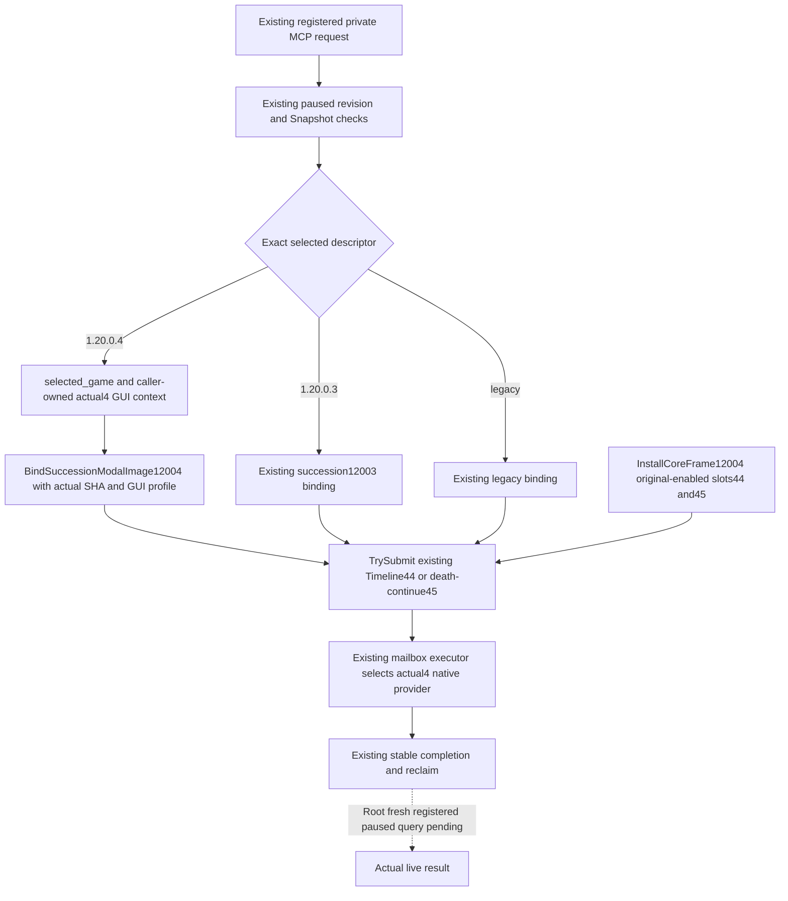

# Actual 1.20.0.4 production timeline dispatch and finite query routes

2026-10-07 source correction, based on **15c876e0763342c7246b891dac5145729b6c5636**. The correction is **9c96a4fa18b3aae646f85bae1bc1cefa79af9927**. This package changes only the central **bridge.cpp** production wiring; it reuses the exact .4 provider and ABI already sealed in [death-succession-modal-migration-12004.md](death-succession-modal-migration-12004.md). No EXE capture, provider redesign, feature flag change, fixture, build or game operation was performed here.

Root's actual R0053 full Snapshot03 succeeded in the retained Robert episode at paused date **53288256**, checkpoint **H9613**, with the restored 208-tool registry. The first timeline MCP request then timed out after approximately 19 seconds. Root separately observed heartbeat connected=true, lastError=null and no SDK stderr. These facts do not prove that the two source defects explain the entire external timeout; the fresh registered query after Root's DLL replacement is the remaining runtime check.

## Two concrete missing connections

The production Timeline request factory recognized only IsCk3_12003Descriptor. Actual .4 consequently received the legacy BindCurrentProcess(true) and legacy scoreboard environment, with selected_game=null and succession12004 unset. The already migrated mailbox executor selects its .4 reader only when selected_game carries the exact .4 descriptor.

The new .4 arm retains selected_game=&game, constructs the actual .4 GUI observation context in the existing caller-owned gui12004 member, and passes its profile to BindSuccessionModalImage12004(image_base, actual_sha, profile). The provider requires that third argument. The same original-enabled death-continue factory receives the corresponding .4 arm. The GUI profile borrows the caller-owned context until the existing completion/reclaim boundary; it is not a temporary profile context or a legacy build alias.

InstallCoreFrame12004 also omitted the already existing Timeline executor44 and death-continue executor45. TrySubmitMainThreadQueryV1 rejects an unregistered callback before the provider can run. Both registrations now use the same original **XAR_CK3_ENABLE_G2_DEATH_SUCCESSION_MODAL_PRIVATE_V1** guard as the older installers. No original OFF flag is opened, and the 117-option recipe remains 66ON/51OFF.

## Finite remaining query scope

The scoped input is the existing **live-query-coverage-plan/run_base_readonly_queries.py CALL_IDS**: 14 calls, plus the 16 **live-domain-coverage-completion/ROOT-SUPPLEMENTAL-LIVE-PLAN.json registered_calls** and its private Construction helper. This is not a review of all 208 tools. Source routing for those names is present after the Timeline correction:

| Planned calls | Existing .4 entry and registration |
| --- | --- |
| Capabilities and loaded-feature manifest | Existing capability transport; loaded manifest actual4 typed branch and installer slot8. Root's actual full Snapshot/loaded-feature qualification is reused. |
| Timeline blocker | Corrected selected descriptor/binder and original-enabled slot44. The paired original-enabled continuation uses45. |
| Government and family obligations | bridge actual4 nonwar arm, IsNonwarPrivateStep12004, PopulateNonwarRouterExecutors12004, existing government/family-obligations named slots. |
| Current first heir relationship | Existing actual4 BindFamilyImage/CreateCk3_12004AdapterFromBindings factory and relationship slot68. |
| Council composition and final gates | Existing actual4 RunCouncilPrivate12004/ConfigureCouncilPrivate12004; installer41 and actual4 candidates/gates binders. |
| Battle control, reinforcement and entry power | IsBattleWarTypedQuery12004 admits the existing kinds; actual4 typed provider and installer6/9/5. |
| Occupation | Existing exact4 admission in RunWarOccupationTargetsQueryV1 and adapter occupation bindings. |
| Termination options and claim terms | Existing selected adapter methods read bindings_.diplomacy/terms; actual4 adapter constructs those through BindDiplomacyImage/BindClaimTermsImage. No effect-preview output is invented. |
| Campaign root | Existing actual4 typed Campaign environment and installer11. |
| Hosted activity and guest candidates | Existing actual4 nonwar activity recognizer, populated feast callbacks, original-enabled slots64/65. |
| Religion context, doctrines, tenets, rite governance and draft groups | Existing actual4 nonwar recognizers, populated callbacks and corresponding named slots under their original flags. |
| Holy-order context and mercenary context | Existing holy-order nonwar callback/named slot and selected actual4 mercenary admission/registered callback. |
| Faction alerts and gift candidate | Existing dedicated actual4 alerts/gift routes; installer faction/faction-gift callbacks. |
| Sway target, treatment presence and recovery | Existing actual4 nonwar recognizers and populated callbacks. Treatment's exact literal matches before the later legacy arm, and its handler uses BindEpidemicTreatmentImage for .4. Recovery binds BindEpidemicRecoveryImage. |
| Clergy appointment | Existing actual4 nonwar recognizer, clergy callback and named slot. |
| Private Construction | Existing actual4 ConstructionMailboxContext12004, BindConstructionImage12004 and envelope.game=&game; installer42 uses ExecuteConstructionMailbox12004. |

The later legacy arms do not imply missing .4 wiring when the earlier actual4 arm owns the same literal. No additional central routing defect was proven in this finite source pass. These are source reachability conclusions, not successful live domain query results.

Private Timeline remains unadvertised. Its original private transport and launch permissions are retained; a default false public support field is not changed into a new advertised capability.

## Qualification and next action

**Source correction ready for Root build**, with existing exact .4 provider fixtures reused. Child tests=0, builds=0, imports of production modules=0, EXE reads=0, game/SDK/pipe operations=0. One proportionate diff whitespace check passed for the source correction. Root owns one DLL bridge.cpp compilation, normal replacement and the fresh paused registered Timeline query. The actual first failed request and the separate SDK/persistence diagnosis remain preserved. Full domain live coverage, migration completion and autonomous OODA completion are not claimed here.

External delivery and Oct7/W41 fields: **Z:/ck3_mod_rewrite_process_assets/g2-background-round34-20261007/actual4-production-mcp-dispatch/**. Root owns shared daily/weekly/handoff entries and publication.
