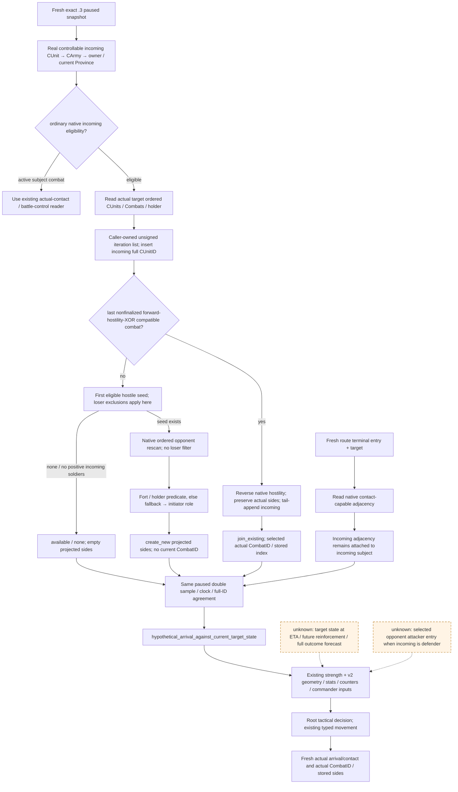
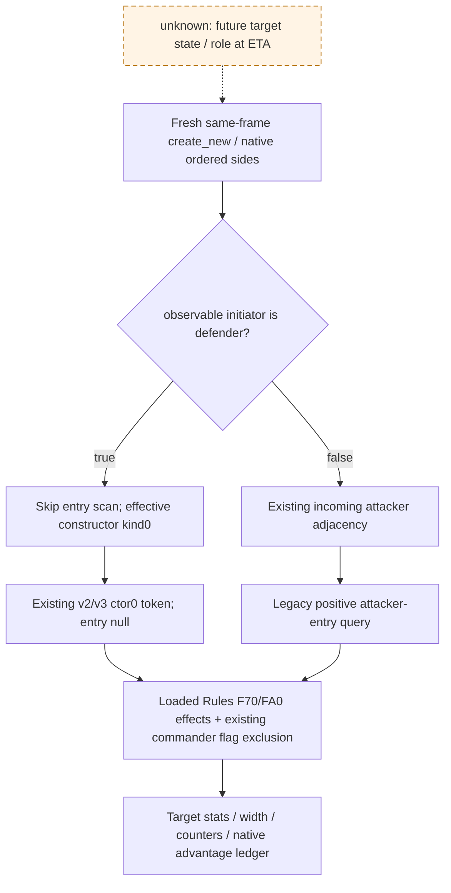

# CK3 1.20.0.3: projected contact role and participant order

The new read-only query supplies the missing remote contact input: the current combat or ordered opponent set that the native resolver would select if a real controllable incoming army arrived at the specified target **now**, and its projected attacker/defender role. Existing army-strengths and combat-v2 queries already supply the comparative strength, terrain, counters and commander inputs. This projection makes their participant partition native-derived; it does not forecast future enemy movement or a battle outcome.

Current readiness: **production-live primitive**, established by v43 actual remote projections for two targets. The original implementation contract, pre-implementation native tree and GREEN ten-case production/registered MCP fixture remain historical construction evidence. Actual source, frame, participant order and fixed-entry v2 boundaries are recorded below and in [projected-contact-scope-v1-12003-evidence.json](projected-contact-scope-v1-12003-evidence.json).

## 2026-10-03 v43: actual remote projection and fixed-entry v2 inputs

The deployed projected query is now **production-live primitive**. Root's SDK74963 closed normally GREEN; actual packets004 and006 are available at paused raw53240136 / native5 / public2 / connection generation3. Robert29829's public CUnit83886367 is actually still at2604. Both target projections are `create_new` with Robert on the defender side, initiator-role observable=true / defender=true, complete projection inputs and no observed target CombatIDs. For2640, native attacker order is `[473,251658381]`; for2635 it is `[16777683]`; both projected defender arrays are `[83886367]`. Incoming entry2634 belongs to Robert's route-preview edge and the query remains `hypothetical_arrival_against_current_target_state`; no actual arrival, contact or combat membership is established by these bodies.

The two existing fixed-entry v2 tools were then actually sampled by Root SDK86145, also normally closed GREEN. These are useful target-bound input primitives with `input_observation_ready=true` and `monte_carlo_ready=false`. For the explicit caller-owned attacker-entry2634 scenario,2640 is mountains with width multiplier0.5 and native precontact width2391→1195;2635 is farmlands with multiplier1 and width2306→2306. Both scenarios report crossing=none and holding_defender=true. The native participant arrays, regiment stats, final counter retention, stored commanders and roll bounds remain in the already-consumed [v2 diagnostics](Z:/ck3_mod_rewrite_process_assets/g2-resume-20261003/war-counter-campaign/ranking/fixed-entry-v2/DIAGNOSTICS.md) and pinned full leaves. Robert's incoming defender edge does not establish an enemy's historical attacker entry; entry2634 is expressly caller-owned, and actual_route_dependency=false. These returned scenario fields do not establish eventual contact geometry, selected battle commander, resolved advantage, win odds or casualties.

Both actual packages use frozen v43 `Z:/g45` source `8e2cfbee4981af7f80398ec09129c1cf0f3dbe54`, R21 / PID14124, on the exact .3 executable above. Root reports strict64 build545 TU /542 unique /1051 inputs GREEN in79.43849s, CI37125578704 GREEN, successful cold runtime, minimized=true / foreground=false. The earlier SDK30708 first default Raise012 missing-startup-registration RED remains separate; it is not rewritten as a wholly GREEN combined attempt. Root's later registration-source commit a6f3221 is not this actual DLL/runtime source. These read-only batches add0 days:3992 total / recovery839 / October3+744, natural succession0. The frozen v2 normal pair is h5387 / raw53240136 /91503841B / SHA `b7a691d12981339398842743175bc448b8389d6335cc8677a15699221332cdf2`, ordinary Robert episode `native-29829-2bc2d599f7f9`, xar_off / pact absent. Later current saves and the already committed2640 movement belong to the campaign lane; this topic does not reopen target selection or award movement/arrival/contact credit.

Reuse the [actual projected fields](Z:/ck3_mod_rewrite_process_assets/g2-resume-20261003/battle-terrain-actual/future-engagement/v43-dual-target/REPORT-FIELDS.json), packet004 SHA `621d82a828300a81f918d2f078f6b736042319cd82714350773bd5befb6b105b` and packet006 SHA `711f680025b63297a96cedf1681f9035eba24464cd8a404bc6ff1eeaf3008a7e`, plus the [once-consumed v2 receipt](Z:/ck3_mod_rewrite_process_assets/g2-resume-20261003/war-counter-campaign/ranking/fixed-entry-v2/ROOT-DELIVERY.json), SHA `f5dc9d0adf7da799cbfd1b8b49c1e0149d954eb37e3b6d0c8bb996e0c4669644`. Remaining simulation inputs are damage-to-casualty allocation, pursuit transition, battle-end/retreat transition and phase-event RNG/effects. They are construction entries; finite native width/stats/retention are useful now and do not turn this into complete battle OODA. Historical implementation source/fixtures and their harness REDs below are preserved. This documentation package performs no SDK/query/window/game/Git/shared-source action, original-packet re-consumption or test run.

## Exact build and reused evidence

This increment targets CK3 **1.20.0.3 / Steam 25652598**, EXE SHA-256 `94B55397ABB687A3DCD436805A5D885E6BE90FA6C693FEB44A9E3BBEEADE02A6`. Implementation source baseline is owner-supplied read-only `Z:/g38`, head `02e`; this lane did not verify the head with Git. Source paths retaining `ck3_12002` are reusable implementation names. `ck3_12003_adapter.cpp:46` binds the reviewed layout only after matching the exact `.3` executable; this query's capability is published only on that adapter.

`NATIVE-INPUT-FREEZE.json` remains the pre-implementation research/input ledger. Root's `INPUT-AMENDMENT.json` records an owner change during lane work: the actual Python overlay used `native_driver.py` preimage SHA `75ce828c8b914f8dc5bd4efb9cd7c9f1dcf698a87d9fb84a335ad21e8f88444b`, rather than historical freeze `8dfedf834941c064b30b120c71f5dc33efed554d84b77de2c9757ccb85f7e8fa`. The lane manifest/fixture describe the current overlay and preserve the owner delta. This amendment does not rewrite the native tree/freeze or assert that every current implementation pin still equals that earlier ledger.

Read before implementation: [native contact resolver and actual observation](actual-contact-scope.md), [army contact tree](army-contact-resolution.md), [combat input observations](combat-simulation-inputs.md), [actual Robert composition](battle-composition-actual-v34-12003.md) and the pre-implementation `.3` strength/contact packages recorded in the evidence file. The first two topics contain historical `1.19.0.6` addresses and offsets. They explain the closed branch semantics; current source bindings below own this increment's `.3` addresses. Historical `.19` or `.1` layouts must not be substituted.

| Current frozen source | Relevant contract |
|---|---|
| `ck3_12002_routes.cpp:1387` | Actual reader resolves real CUnit, CArmy, owner and target; `:1404` requires subject current Province equal target. |
| `:1432` | Ordinary native contact eligibility includes target/mode raw gates, raw state, retreat and empty-army predicate; an existing active subject uses the actual combat reader. |
| `:1447` | Actual target unit/combat arrays are read in their native unsigned full-ID order; `:1455` requires actual incoming membership. |
| `:1461` | Forward owner-to-primary hostility XOR selects the last compatible nonfinalized current combat in stored scan order. Loser exclusions accumulate only before a compatible combat has been saved. |
| `:1508` | Reverse primary-to-owner relations derive join side independently; exactly one must be true. Stored side order is preserved, then incoming is appended to its selected side if absent. |
| `:1549` / `:1608` | First eligible hostile seed uses loser exclusions. The complete opponent rescan uses seed-owner equality or reverse hostility and deliberately does not reuse that exclusion filter. Empty, retreating and active-combat opponents are excluded. |
| `:1652` | Fort/holder predicate and fallback predicate derive `initiator_is_defender`; true places incoming on defender side. Opponent first-seen native order is preserved. |
| `:1346` / `:1673` | Actual adjacency belongs to the initiating unit's native current/prior Province state. |
| `:1806` / `:1851` / `:1856` | Actual wrapper repeats subject-at-target; the paused double sample and clock/identity checks bind publication to one observed state. |

Current reviewed RVA bindings, all relative to this pinned EXE: game state `0x5C68C50`, public CUnit storage `0x5D1E380`, internal CArmy storage `0x5D1DE48`, Character storage `0x5C67568`, Combat storage `0x5D1DE70`, BattleResult storage `0x5D1FFE0`; read-only hostility `0x2C09640`, empty predicate `0x24E83C0`, active-combat predicate `0x24E8360`, holder getter `0x247D030`, holder defender predicate `0x2C09810`, fallback defender predicate `0x2C164E0`. Province units are `+0x740/count +0x74C`, combats `+0x758/count +0x764`, fort level `+0x850`. Formal business names for the two defender predicates and raw contact gates remain unresolved; their existing operand direction and side effect are the reused contract.

The frozen `.3` native strength tree corroborates current/base power at `0x2C3E850` and the `ArmyRegiment+0x38/+0x40` soldier/power operands already published by `ck3_query_army_strengths`. Native AI estimated-power-share predictor `0x1AC7540` and final-entry consumer `0x1AC92B2` are separate research. This query does not invoke that predictor or manufacture native AI stack/coordinator context.

## Native tree and projection boundary



Actual target arrays and incoming current position are observed fields. Inserting the incoming public ID into a caller-owned iteration vector, selecting a possible join/new contact and assigning projected sides are hypothetical fields. The reader does not write unit positions, Province arrays, Army backlinks or combat membership. Actual mode keeps its wrapper, sample, membership and real adjacency checks. Both modes reuse the same local relation/order decision.

## Public query and response meaning

Public tool: `ck3_query_projected_contact_scope_v1(subject_army_id, target_province_id, incoming_entry_province_id, expected_revision)`. Province IDs are positive integers. Subject and side arrays use public full CUnitIDs, including valid ID `0` and generation-zero IDs; internal CArmyIDs are diagnostic backlinks. Use the fresh public revision. Owning-thread literal is `query-projected-contact-scope-v1-<subject>-to-<target>-from-<entry>`; capability is `game.command.query-projected-contact-scope-v1-N`.

The reply object is `projected_contact_scope`. `scope_kind` is always `hypothetical_arrival_against_current_target_state`. It includes snapshot/date, real incoming identity/owner/current Province, explicit target/entry, `observed_target_public_cunit_ids`, `observed_target_combat_ids`, the selected current combat/index when applicable, projected subject side and both ordered projected side arrays, initiator-role observability/result, raw incoming adjacency and `contact_projection_inputs_complete`. Existing response binding retains source/native/public revisions.

| Transition | Selected current combat/index | Subject side / initiator role | Projected sides |
|---|---|---|---|
| `none` | `null` / `null` | `none`; initiator observability/result inapplicable | `[]` / `[]` |
| `join_existing` | Actual selected CombatID / its observed stored array index | Native reverse relation side; initiator observability/result inapplicable | Actual stored side order, incoming appended to the selected side if absent |
| `create_new` | `null` / `null` | Native derived attacker or defender; initiator observable and its derived bool | Incoming singleton vs native first-seen ordered opponents, oriented by the derived role |

Observed production serializer and registered MCP fixture shape: `projected_initiator_is_defender_observable` is a non-null bool. It is false for `join_existing`/`none`, with `projected_initiator_is_defender=null`; it is true for `create_new`, with the derived bool preserving a legitimate false. Selected current CombatID/index are null when inapplicable. A complete `none` is `status=available` and `contact_projection_inputs_complete=true`: current-target contact projection was read successfully and yields no contact. It does not claim that travel is contact-free. Failure statuses cover actual missing/unreadable/inapplicable inputs, unpaused state, native relation failure or state change; they add no warfare action gate. The query does not publish `actual_contact_scope_ready=true`, a win-odds field, or full-simulation readiness.

Use route and query receipts from the current paused context. This call example binds arguments dynamically; it is not a saved campaign result:

```python
# Read these integers from the fresh route-preview/composer receipt.
target = observed_preview_target_province_id
entry = observed_route_final_entry_province_id
reply = ck3_query_projected_contact_scope_v1(
    subject_army_id=83886367,
    target_province_id=target,
    incoming_entry_province_id=entry,
    expected_revision=fresh_snapshot["revision"],
)
```

Root's file-only composer derives entry from the terminal route edge: remove an optional leading origin; use the penultimate remaining Province, or the preview origin when only the target remains. It emits concrete typed calls after receiving the fresh preview. No dated numeric entry is a future constant.

For a `create_new` attacker result, pass the returned ordered attackers/defenders and fresh target to combat-v2; the incoming edge can supply `attacker_entry_province_id` because the incoming is the attacker. For a defender result, pass the returned arrays but **do not** use the incoming edge as the opponent attacker's entry. For a join, incoming adjacency likewise does not establish the existing attacker's original edge. Existing actual battle width/net advantage and target/current strength inputs remain useful independently. The concrete next observation for that unresolved entry is the selected attacker's native current/prior Province adjacency through the reviewed contact-adjacency layout.

These are contract examples, not actual outcomes:

| Native result | Correct side/entry interpretation |
|---|---|
| New contact, incoming attacker | Attackers `[incoming]`; defenders `ordered_opponents`; incoming route entry belongs to attacker. |
| New contact, incoming defender | Attackers `ordered_opponents`; defenders `[incoming]`; incoming route entry belongs to defender. |
| Join defender | Keep existing attackers; append incoming after the existing defender array; initiator role is inapplicable. |
| Hostile to both primary sides of every current combat, no eligible separate opponent | Forward XOR is false; active-combat units cannot seed/create opponents; complete `none` is valid. |

## Current campaign and readiness ledger

Historical pre-deployment campaign context: Root supplied the normal Robert `29829` campaign, public CUnit `83886367@2604` sieging, and foreign Combat `1577058305@2640` with rebel `70766` against `30097`/`35357`; Robert is outside those stored sides. This lane acquired no live frame or current revision/date. Re-read target state after the siege batch. Earlier `2640` mountains, entry `2634` and foreign `-12` base advantage remain dated facts for their own scenario/combat and are not future player fields. The query may return `none` after foreign combat changes or ends, or while it is incompatible with incoming relations.

The central focused fixture completed **production reader → native serializer → Python normalizer → NativeHeadlessGameplayDriver → GameplayBridgeService → registered MCP** for ten new cases. Native `focused-attempt-02/RESULT.json` and `REGISTERED-MCP-RESULT.json` are both GREEN; native exit code is 0 and each registered case preserves production native inner JSON. Native revision41/public revision2 are synthetic fixture bindings, not a Robert campaign frame. The transport uses the existing FakeEndpoint; no game, full DLL build or window was contacted. Old matrices were not rerun. The native fixture also checks unchanged actual-query subject-not-at-target and unchanged fixture-owned real arrays/positions.

Observed fixture examples below all use synthetic subject `16777217@2`, target3, incoming entry2 and raw adjacency2. They are contract evidence, not live campaign outcomes:

| Case | Observed production/MCP result |
|---|---|
| `remote-create-new` | Incoming attacker, observable=true/initiator=false; attackers `[16777217]`, defenders `[16777218,16777219]`; selected current combat/index null. |
| `remote-holder-defender` | Incoming defender, observable=true/initiator=true; attackers `[16777218,16777219]`, defenders `[16777217]`; entry2 remains the incoming defender's edge. |
| `compatible-join-stored-order` | Selects Combat16777218 at stored index1; incoming attacker appended after `[16777221,16777220]`; defenders remain `[16777219,16777218]`; observable=false/initiator=null. |
| `both-hostile-xor-none` | Available complete none, both projected arrays empty; selected current combat/index null, observable=false/initiator=null. |
| `public-cunit-zero` | Subject0 remains public0 and is returned in attackers `[0]`; its internal CArmy diagnostic is16777217. |
| Invalid full generation / entry / bindings | Native statuses `subject_army_not_found`, `invalid_entry_target_adjacency`, `unavailable`; the normalizer and registered MCP preserve failure rather than accepting them as none. |

Two harness REDs are retained: `focused-attempt-01/RESULT.json` records C4715 under `/WX` after renaming the legacy main without an explicit return; reader and serializer had already compiled successfully. Attempt02 extracted only the reusable memory-layout prefix, excluded old main, reused those unchanged production objects and compiled the changed harness. `focused-attempt-02/REGISTERED-MCP-ATTEMPT-01-RED.json` records `ModuleNotFoundError: No module named 'build_release'`; the tools import path was corrected and final registered receipt is GREEN without another native run. These are harness failures, not demonstrated capability failures. This lane consumed the receipts and ran no test.

| Evidence level | Current result / promotion condition |
|---|---|
| `research` | Frozen native tree, `.3` bindings and query semantics documented before implementation; retained as the implementation input. |
| `static-ready` | Central production reader/serializer and registered MCP each GREEN, ten new cases; external integrated implementation artifact available. |
| `fixture-live` | Not claimed; a native synthetic reader fixture is not a running CK3 fixture. |
| `production-live primitive` | GREEN v43 actual paused projected-query artifacts004/006 for2640/2635; both complete create_new projections with incoming Robert defender. Fixed-entry v2 results are separate target-input primitives. |
| `production-live loop` | Pending an observed tactical decision, typed action and independent actual contact/outcome postcondition. |
| `complete` | Not claimed for encounter simulation, battle OODA or warfare. |

Central fixture: **GREEN**, native and registered receipts under `Z:/ck3_mod_rewrite_process_assets/g2-resume-20261003/battle-terrain-actual/future-engagement/implementation-02e/fixture/focused-attempt-02/`; all receipt and wire pins are in the evidence file. Root paused query: **GREEN v43**, two actual target artifacts and same-frame source fields recorded above; the full tactical/contact/battle loop remains incomplete. No new tests, game days, SDK calls, desktop/window operations, Git commands or policy changes occurred in this documentation lane. Root owns central report/index merge, shared integration, build, deployment, real acceptance, commit and push. Further results must update the evidence and report fields from their actual receipts without crediting an ACK, schema or synthetic case as a player battle.

## 2026-10-04：defender create-new 的原生 constructor kind0 闭合

本段纠正上文及 v47 post-hire 历史记录中“defender arrival 还需敌军历史 attacker entry”的当前施工结论。Exact CK3 **1.20.0.3 / Steam25652598**、EXE SHA `94B55397ABB687A3DCD436805A5D885E6BE90FA6C693FEB44A9E3BBEEADE02A6` 的 contact builder 在 holder/fallback 判定 incoming initiator 为 defender 时，直接跳到 `0x247A886..0x247A889`，设置 defender=true 和 constructor adjacency **raw0**；整个 incoming current/prior adjacency 扫描被跳过，未读取任何敌方 entry/history。旧 missing-history 文案保留其当时接口限制；这条 native create-new 分支现已闭合，下一项是既有 v2/v3 的最小 constructor0 查询增量。

原生链为 defender true branch `0x247A7AF/0x247A7C6` → `0x247A886/889` → raw arg6 `0x247A8A1` → wrapper call `0x247A8B6` / `0x2AD81F0` → ctor `0x25863A0`。Ctor 在 Combat `+0x6F8` 保存 raw，incoming 加入 side1，ordered opponents 加入 side0。只有 attacker initiator 才走 `0x247A7CE..0x247A884` 的本方 current/prior adjacency 路径；`join_existing` 不采用这条 new-contact 公式。Native tree/输入账本在实现之前完成，交付 receipt SHA `3092003e9f682ee922f081197d5a880ff111f7048479c212f5794d5b774c4508`，文件位于 `v47-defender-attacker-entry/native-tree/`。



复用已消费的 saved normalized post-hire receipt：raw53241096/native10/public2/generation5、Robert83886367实际仍@8754 moving，target2640，incoming2634→2640；native create_new/defender，A=`[473,251658381]`、D=`[83886367]`、target CombatIDs=[]。本分支有效 constructor raw0 即使 incoming geometric raw 为非零仍成立；当前 saved incoming raw0与constructor raw0相等不是证明来源。2634继续是 incoming defender 的几何入口，角色和顺序来自已发布 native projection，不是 player movement 推断。未重读006–009或faith raw，也未证 actual arrival/contact、未来首都陷落或之后的 role。

Root 已授权 against read-only `Z:/g52`、owner-supplied HEAD `892378b5` 的最小真实增量。现有 v2/v3 step 的第二 token 新增 `ctor0`；现有 MCP 可显式给 `attacker_entry_province_id=None` 与 `constructor_adjacency_kind_raw=0`，native DTO 的 entry=-1仅为“不适用”的内部表示。Registered MCP fixture实际 scenario 发布 entry=null、`contact_geometry_mode="native_defender_constructor_zero"`、constructor kind0，攻守position policy均为`fixed_at_target_hypothetical`；ordinary positive-entry请求/JSON不新增fields，保留原语义。Target、ordered side IDs、pause/revision和既有actual字段读数照常绑定；无新MCP、enemy getter、permit、flag或战争门禁。

以下v2参数形状已通过唯一registered MCP fixture，属于准备好的源码接口，尚未部署实读；`fresh_revision` 必须来自将要执行的暂停帧：

```python
ck3_query_combat_simulation_inputs(
    target_province_id=2640,
    attacker_entry_province_id=None,
    attacker_army_ids=[473, 251658381],
    defender_army_ids=[83886367],
    constructor_adjacency_kind_raw=0,
    expected_revision=fresh_revision,
)
```

raw0仍索引实际 loaded Rules `+0xF70/+0xFA0` effect、保留 commander flag `0x1A4` 排除和原生 append/符号/钳位。它是可观察的 enum0，不能变成 null、硬编码 advantage0 或“两个 adjacency effect必为零”。Pure composer source plan的既有文件check GREEN保留；新mode的唯一 production reader/advantage/full serializer→Python normalizer/driver/service→实际注册MCP chain现为 **static-ready**：native1、registeredMCP1、exit0，production `ReadCombatSimulationInputs`调用1、entry对象不存在且不resolve、existing MCP execute1；无旧matrix/full DLL/game调用。

Fixture用真实loaded F70[0]/FA0[0]选择路径：attacker effect points=7、defender effect points=11，scale100000的signed contributions分别为 **+700000 / −1100000**；existing advantage planner调用1、flag420(`0x1A4`)false判定消费1。这些是synthetic fixture值，不是当前游戏advantage。保存的旧production fixture incoming raw2在纯文件消费中仍保留2、derive constructor raw0；保存post-hire roles/order也原样保留，无旧query/matrix重跑或006–009重读。纯计划字段`query_producer_geometry_mode`标明新producer mode；其`source_plan_complete=true`与`native_v2_query_ready=false`不能作为已部署native query信用。

首 `focused-attempt-01/RESULT.json` harness RED因generated full serializer include漏`<charconv>`、`std::to_chars`不可见；production reader/advantage对象已GREEN。Attempt02只修harness并重编它，复用未变生产对象；这是独立harness失败，未证明capability RED。Final receipts在 `implementation-g52/fixture/focused-attempt-02/RESULT.json` / `REGISTERED-MCP-RESULT.json`，生产wire `native-command-result.json` SHA `c24f8c0fe04215a487bd3d5a13d2fd660ec637ac00001105290d7f29e7519593`。新mode **没有live信用**；Root后续结合构建/实际paused v2/v3查询另验。Existing projected-contact只读primitive与完整battle OODA分别记账。

来源为既有 `native-tree/ROOT-DELIVERY.json`、`NATIVE-TREE.md`、`abi-proposal/FINAL-PROPOSAL.md` 和 `pure-model/ROOT-DELIVERY.json`。本文档lane仅输出外置append与Oct4/W40字段，0 raw读取/研究重跑/测试/SDK/nativebuild/shared/Git/window/游戏日；Root拥有源码合并与实机。
